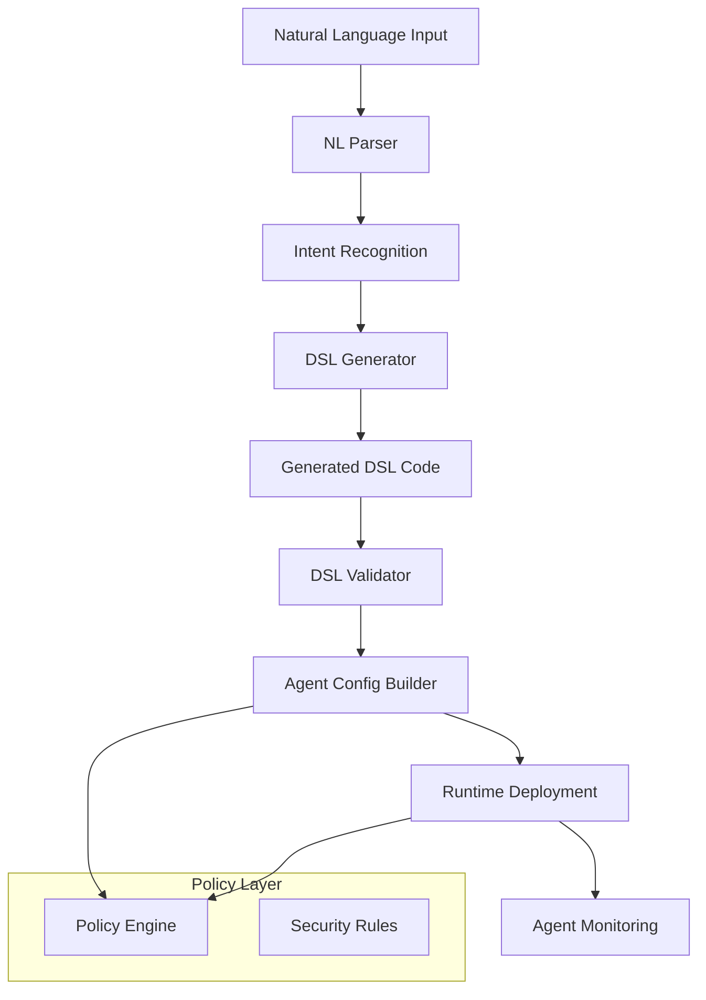

# Symbiont Agent System Analysis: Key Integration Points for Natural Language Interface

## Executive Summary

The Symbiont agent system provides a sophisticated, security-first platform for autonomous agent deployment with three primary integration layers: DSL parsing/generation, runtime orchestration, and policy enforcement. A natural language interface tool like codex would integrate at all three levels to provide seamless agent creation and management.

## 1. DSL Analysis: Agent Definition Language

### Grammar Structure
- **Tree-sitter based**: Uses grammar.js defining structured agent definitions
- **Core constructs**: `metadata`, `agent`, `policy`, `function`, `type` definitions
- **Agent structure**: Contains `capabilities`, `policy` blocks, and `function` definitions
- **Policy syntax**: Supports `allow`, `deny`, `require`, `audit` rules

### Key Integration Points:
- **AST generation**: `parse_dsl()` function provides programmatic parsing
- **Metadata extraction**: `extract_metadata()` extracts version, author, description
- **Code generation**: DSL can be programmatically constructed and validated
- **Error handling**: Built-in syntax validation and error reporting

### Natural Language Mapping:
- Agent descriptions → DSL metadata blocks
- Capability requirements → capabilities arrays
- Security policies → policy rule blocks
- Business logic → function definitions

## 2. Runtime System: Agent Orchestration

### Core Architecture
- **Component-based**: Scheduler, Lifecycle, Resource Manager, Communication, Error Handler
- **Agent lifecycle**: Created → Initializing → Ready → Running → Terminated
- **Multi-tier security**: Tier1 (Docker), Tier2 (gVisor), Tier3 (Firecracker)
- **Resource management**: Memory, CPU, disk I/O, network bandwidth allocation

### Key Integration Points:
- **AgentConfig creation**: Programmatic agent configuration with `AgentConfig` struct
- **Lifecycle management**: `DefaultLifecycleController` provides complete agent lifecycle API
- **Resource allocation**: `ResourceManager` handles resource limits and monitoring
- **State monitoring**: Real-time agent state tracking and auto-recovery
- **Configuration loading**: TOML-based configuration with environment variable support

### Deployment Entry Points:
```rust
// Primary deployment workflow
initialize_agent(config: AgentConfig) -> AgentId
start_agent(agent_id: AgentId) -> Result<(), Error>
get_agent_state(agent_id: AgentId) -> AgentState
terminate_agent(agent_id: AgentId) -> Result<(), Error>
```

## 3. Policy Engine: Security and Access Control

### Policy Structure
- **YAML-based policies**: Human-readable resource access rules
- **Resource types**: File, Network, Command, Database, Environment, Agent
- **Access types**: Read, Write, Execute, Delete, Create, Modify, List, Connect
- **Rule effects**: Allow, Deny, Limit, Audit, Escalate

### Key Integration Points:
- **PolicyEnforcementPoint**: Main interface for policy evaluation
- **Resource access validation**: `check_resource_access()` for runtime security
- **Policy loading**: Dynamic policy loading from YAML configurations
- **Decision caching**: Performance-optimized policy evaluation with caching

### Security Policy Schema:
```yaml
policies:
  - id: "policy_id"
    name: "Human readable name"
    priority: 100
    rules:
      - effect: { type: "Allow|Deny|Limit|Audit|Escalate" }
        conditions: [...]
```

## 4. Key Integration Architecture for Natural Language Interface

### Integration Flow Diagram


### Primary Integration Points:

#### 1. DSL Generation Layer
- **Input**: Natural language agent descriptions
- **Processing**: Parse intent → Generate DSL → Validate syntax
- **Output**: Valid DSL source code ready for runtime deployment
- **API**: `parse_dsl()`, `extract_metadata()`, `find_errors()`

#### 2. Runtime Configuration Layer
- **Input**: DSL source + deployment parameters
- **Processing**: Create `AgentConfig` → Initialize agent → Start execution
- **Output**: Running agent with allocated resources
- **API**: `AgentRuntime`, `LifecycleController`, `ResourceManager`

#### 3. Policy Management Layer
- **Input**: Security requirements from natural language
- **Processing**: Generate YAML policies → Load into enforcement engine
- **Output**: Active security policies governing agent behavior
- **API**: `PolicyEnforcementPoint`, `ResourceAccessConfig`

### Natural Language Processing Pipeline:
1. **Intent extraction**: Parse user requirements into structured intent
2. **Capability mapping**: Map requested functions to DSL capabilities
3. **Security requirement analysis**: Generate appropriate policy rules
4. **DSL code generation**: Create syntactically valid DSL source
5. **Configuration building**: Construct `AgentConfig` with proper settings
6. **Deployment orchestration**: Use runtime APIs for agent lifecycle
7. **Monitoring integration**: Track agent status and performance

### Configuration Templates:
The system supports parameterized configuration through:
- **Environment variables**: Runtime behavior configuration
- **TOML configuration files**: Persistent system settings
- **YAML policy files**: Security rule definitions
- **Metadata extraction**: Agent-specific configuration parameters

## 5. Implementation Recommendations

### For Natural Language Interface Integration:
1. **DSL Template Engine**: Create reusable DSL templates for common agent patterns
2. **Intent Recognition**: Build NL processing to map descriptions to DSL constructs
3. **Policy Auto-generation**: Generate appropriate security policies from requirements
4. **Configuration Validation**: Validate generated configurations against runtime constraints
5. **Deployment Automation**: Integrate with runtime APIs for seamless deployment
6. **Monitoring Dashboard**: Provide real-time visibility into deployed agents

### Key Success Factors:
- **Security-first approach**: Always generate appropriate policy constraints
- **Resource awareness**: Respect runtime resource limits and allocation
- **Error handling**: Provide clear feedback on configuration or deployment issues
- **State management**: Track agent lifecycle and provide status visibility
- **Template reusability**: Enable common patterns for efficient agent generation

This analysis provides the foundation for implementing a natural language interface that can effectively generate, configure, and deploy Symbiont agents while maintaining the platform's security and performance characteristics.