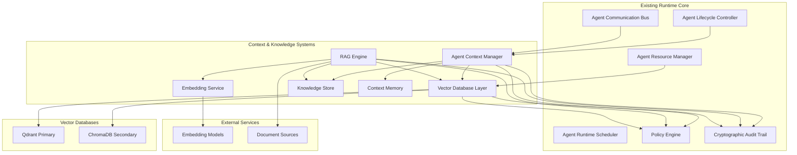
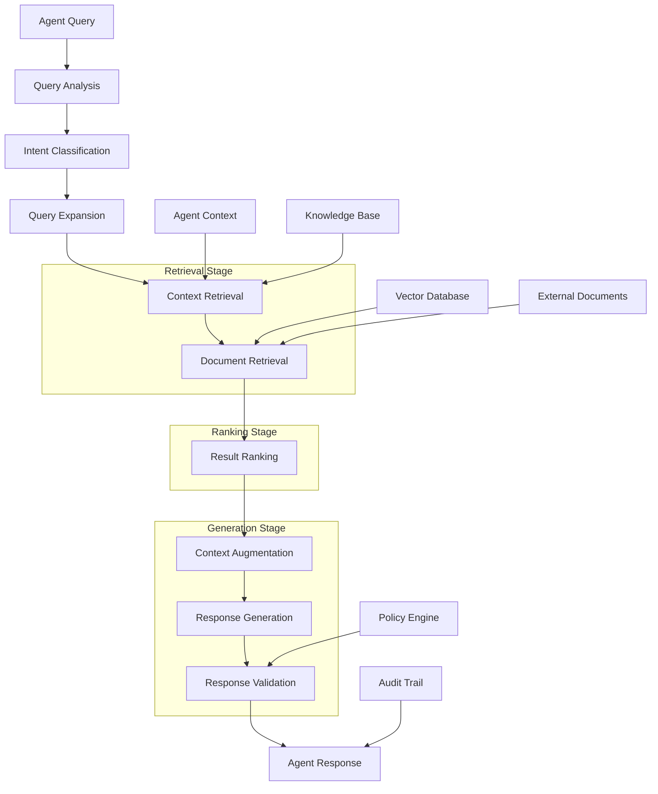
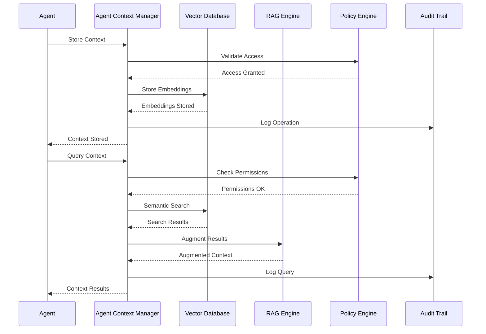
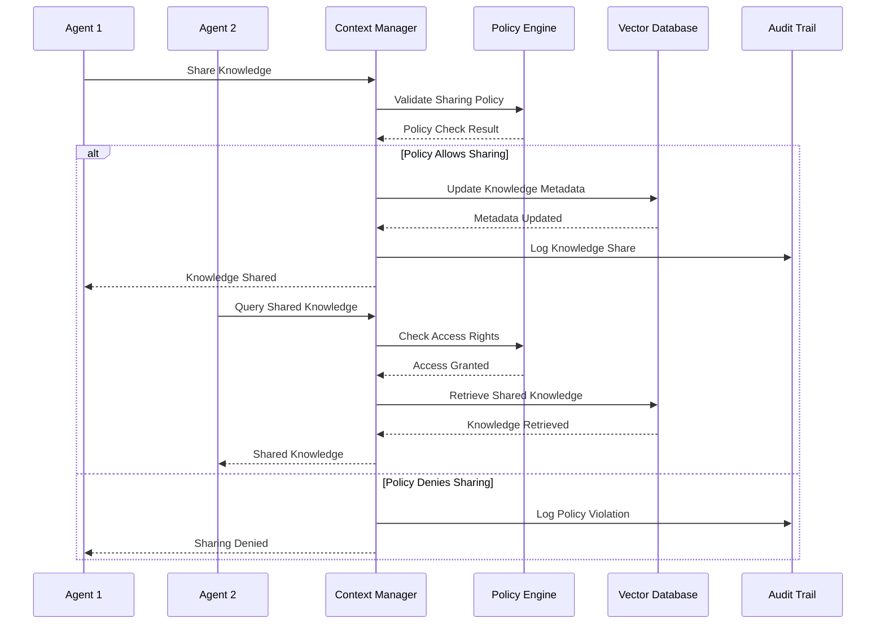
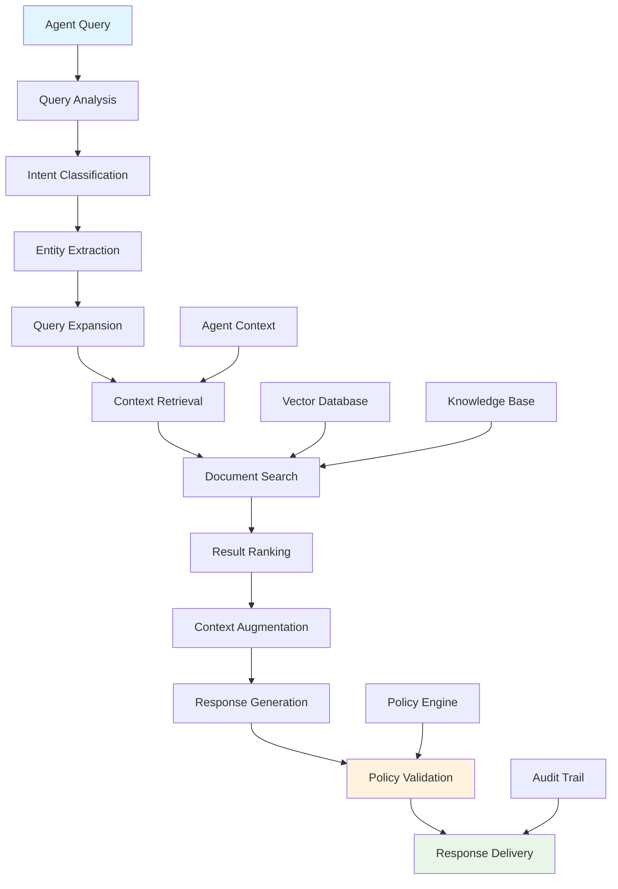
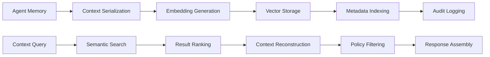
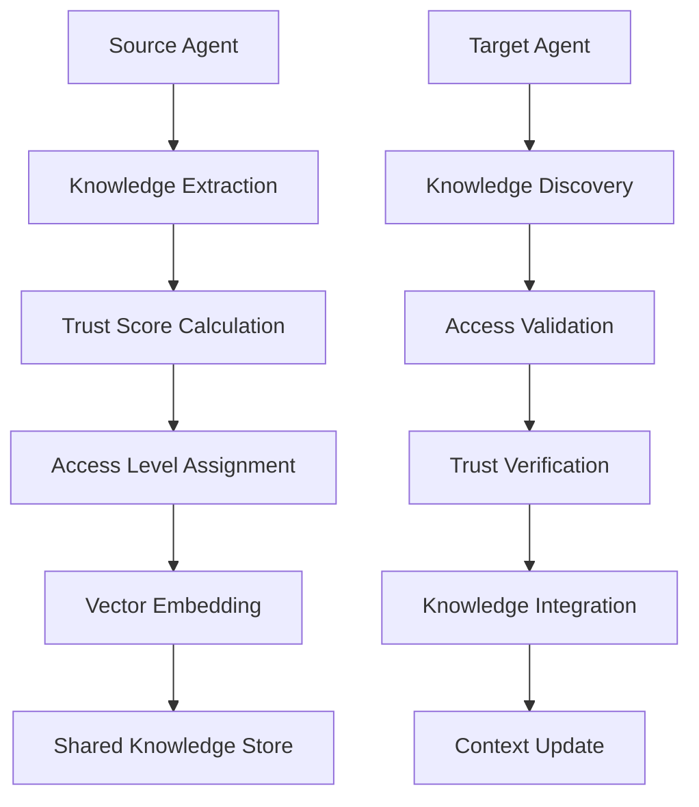
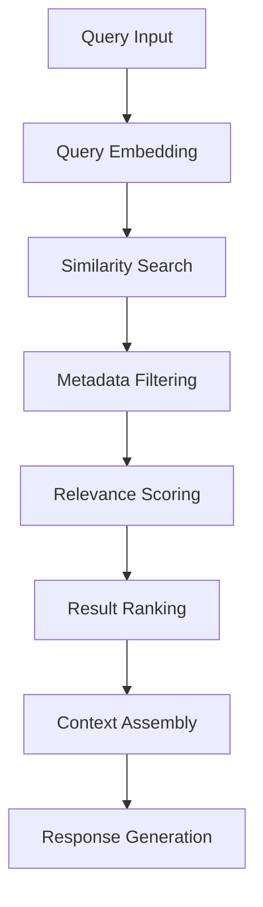
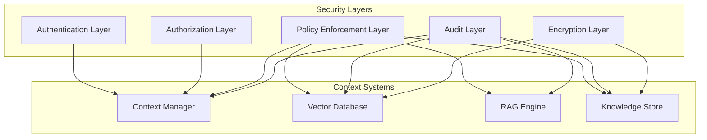
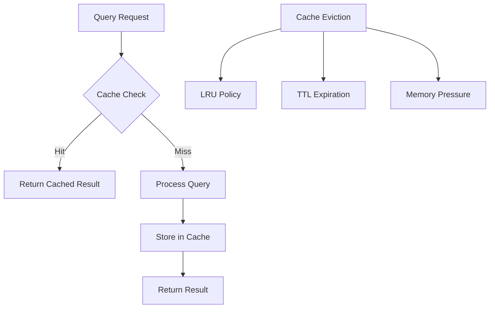

# Context & Knowledge Systems Design
**Version:** 1.0  
**Date:** July 2025  
**Component:** Context & Knowledge Systems (Phase 4)  
**Status:** Architectural Design

---

## Table of Contents

1. [Executive Summary](#executive-summary)
2. [System Architecture](#system-architecture)
3. [Agent Context Manager](#agent-context-manager)
4. [Vector Database Integration](#vector-database-integration)
5. [RAG Engine](#rag-engine)
6. [Component Interactions](#component-interactions)
7. [Data Flow Patterns](#data-flow-patterns)
8. [Security & Policy Integration](#security--policy-integration)
9. [Performance Specifications](#performance-specifications)
10. [Implementation Guidelines](#implementation-guidelines)

---

## Executive Summary

The Context & Knowledge Systems represent Phase 4 of the Symbiont Agent Runtime, introducing sophisticated memory and knowledge capabilities that enable agents to maintain persistent context, share knowledge securely, and leverage retrieval-augmented generation for enhanced decision-making.

### Key Architectural Decisions

- **Primary Vector Database**: Qdrant (Rust-native, high-performance)
- **Secondary Vector Database**: ChromaDB (development/fallback)
- **Memory Architecture**: Hierarchical (short-term, long-term, working, episodic)
- **Knowledge Sharing**: Policy-driven with cross-tier capabilities
- **Context Persistence**: Configurable retention with cryptographic integrity
- **RAG Pipeline**: Multi-stage with semantic ranking and context augmentation

### Design Principles

1. **Performance-First**: Sub-100ms context retrieval, 10K+ concurrent operations
2. **Security-Aware**: All operations subject to policy enforcement and audit
3. **Scalable**: Support for 1M+ embeddings and 10K+ concurrent agents
4. **Modular**: Clean interfaces enabling future enhancements
5. **Rust-Native**: Leveraging Rust's performance and safety guarantees

---

## System Architecture



### Component Overview

| Component | Responsibility | Integration Points |
|-----------|---------------|-------------------|
| **Agent Context Manager** | Context persistence, session continuity, knowledge management | Lifecycle Controller, Policy Engine, Audit Trail |
| **Vector Database Layer** | Embedding storage, semantic search, metadata management | Resource Manager, Policy Engine |
| **RAG Engine** | Document retrieval, context augmentation, response generation | Vector Database, Knowledge Store, Policy Engine |
| **Embedding Service** | Text-to-vector conversion, model management | External embedding models |
| **Knowledge Store** | Structured knowledge, facts, procedures | Context Manager, RAG Engine |
| **Context Memory** | Memory hierarchies, working memory, episodic storage | Context Manager |

---

## Agent Context Manager

### Core Data Structures

```rust
use std::collections::HashMap;
use std::time::SystemTime;
use serde::{Deserialize, Serialize};
use uuid::Uuid;

/// Unique identifier for context sessions
#[derive(Debug, Clone, Copy, PartialEq, Eq, Hash, Serialize, Deserialize)]
pub struct SessionId(pub Uuid);

impl SessionId {
    pub fn new() -> Self {
        Self(Uuid::new_v4())
    }
}

/// Unique identifier for context items
#[derive(Debug, Clone, Copy, PartialEq, Eq, Hash, Serialize, Deserialize)]
pub struct ContextId(pub Uuid);

impl ContextId {
    pub fn new() -> Self {
        Self(Uuid::new_v4())
    }
}

/// Unique identifier for knowledge items
#[derive(Debug, Clone, Copy, PartialEq, Eq, Hash, Serialize, Deserialize)]
pub struct KnowledgeId(pub Uuid);

impl KnowledgeId {
    pub fn new() -> Self {
        Self(Uuid::new_v4())
    }
}

/// Main agent context structure
#[derive(Debug, Clone, Serialize, Deserialize)]
pub struct AgentContext {
    pub agent_id: AgentId,
    pub session_id: SessionId,
    pub memory: AgentMemory,
    pub knowledge_base: KnowledgeBase,
    pub conversation_history: Vec<ConversationItem>,
    pub metadata: HashMap<String, String>,
    pub created_at: SystemTime,
    pub updated_at: SystemTime,
    pub retention_policy: RetentionPolicy,
}

/// Hierarchical memory structure
#[derive(Debug, Clone, Serialize, Deserialize)]
pub struct AgentMemory {
    pub short_term: Vec<MemoryItem>,
    pub long_term: Vec<MemoryItem>,
    pub working_memory: HashMap<String, Value>,
    pub episodic_memory: Vec<Episode>,
    pub semantic_memory: Vec<SemanticMemoryItem>,
}

/// Individual memory item
#[derive(Debug, Clone, Serialize, Deserialize)]
pub struct MemoryItem {
    pub id: ContextId,
    pub content: String,
    pub memory_type: MemoryType,
    pub importance: f32,
    pub access_count: u32,
    pub last_accessed: SystemTime,
    pub created_at: SystemTime,
    pub embedding: Option<Vec<f32>>,
    pub metadata: HashMap<String, String>,
}

/// Types of memory
#[derive(Debug, Clone, PartialEq, Eq, Serialize, Deserialize)]
pub enum MemoryType {
    Factual,
    Procedural,
    Episodic,
    Semantic,
    Working,
}

/// Episodic memory for experiences
#[derive(Debug, Clone, Serialize, Deserialize)]
pub struct Episode {
    pub id: ContextId,
    pub title: String,
    pub description: String,
    pub events: Vec<EpisodeEvent>,
    pub outcome: Option<String>,
    pub lessons_learned: Vec<String>,
    pub timestamp: SystemTime,
    pub importance: f32,
}

/// Individual event within an episode
#[derive(Debug, Clone, Serialize, Deserialize)]
pub struct EpisodeEvent {
    pub action: String,
    pub result: String,
    pub timestamp: SystemTime,
    pub context: HashMap<String, String>,
}

/// Agent knowledge base
#[derive(Debug, Clone, Serialize, Deserialize)]
pub struct KnowledgeBase {
    pub facts: Vec<KnowledgeFact>,
    pub procedures: Vec<Procedure>,
    pub learned_patterns: Vec<Pattern>,
    pub shared_knowledge: Vec<SharedKnowledgeRef>,
    pub domain_expertise: HashMap<String, ExpertiseLevel>,
}

/// Individual knowledge fact
#[derive(Debug, Clone, Serialize, Deserialize)]
pub struct KnowledgeFact {
    pub id: KnowledgeId,
    pub subject: String,
    pub predicate: String,
    pub object: String,
    pub confidence: f32,
    pub source: KnowledgeSource,
    pub created_at: SystemTime,
    pub verified: bool,
}

/// Procedural knowledge
#[derive(Debug, Clone, Serialize, Deserialize)]
pub struct Procedure {
    pub id: KnowledgeId,
    pub name: String,
    pub description: String,
    pub steps: Vec<ProcedureStep>,
    pub preconditions: Vec<String>,
    pub postconditions: Vec<String>,
    pub success_rate: f32,
}

/// Individual procedure step
#[derive(Debug, Clone, Serialize, Deserialize)]
pub struct ProcedureStep {
    pub order: u32,
    pub action: String,
    pub expected_result: String,
    pub error_handling: Option<String>,
}

/// Learned patterns
#[derive(Debug, Clone, Serialize, Deserialize)]
pub struct Pattern {
    pub id: KnowledgeId,
    pub name: String,
    pub description: String,
    pub conditions: Vec<String>,
    pub outcomes: Vec<String>,
    pub confidence: f32,
    pub occurrences: u32,
}

/// Reference to shared knowledge
#[derive(Debug, Clone, Serialize, Deserialize)]
pub struct SharedKnowledgeRef {
    pub knowledge_id: KnowledgeId,
    pub source_agent: AgentId,
    pub shared_at: SystemTime,
    pub access_level: AccessLevel,
    pub trust_score: f32,
}

/// Knowledge source tracking
#[derive(Debug, Clone, Serialize, Deserialize)]
pub enum KnowledgeSource {
    Experience,
    Learning,
    SharedFromAgent(AgentId),
    ExternalDocument(String),
    UserProvided,
}

/// Expertise levels
#[derive(Debug, Clone, Serialize, Deserialize)]
pub enum ExpertiseLevel {
    Novice,
    Intermediate,
    Advanced,
    Expert,
}

/// Access levels for knowledge sharing
#[derive(Debug, Clone, Serialize, Deserialize)]
pub enum AccessLevel {
    Public,
    Restricted,
    Confidential,
    Secret,
}

/// Conversation history item
#[derive(Debug, Clone, Serialize, Deserialize)]
pub struct ConversationItem {
    pub id: ContextId,
    pub role: ConversationRole,
    pub content: String,
    pub timestamp: SystemTime,
    pub context_used: Vec<ContextId>,
    pub knowledge_used: Vec<KnowledgeId>,
}

/// Conversation roles
#[derive(Debug, Clone, Serialize, Deserialize)]
pub enum ConversationRole {
    User,
    Agent,
    System,
    Tool,
}

/// Context retention policies
#[derive(Debug, Clone, Serialize, Deserialize)]
pub struct RetentionPolicy {
    pub session_retention: Duration,
    pub memory_retention: Duration,
    pub knowledge_retention: Duration,
    pub auto_archive: bool,
    pub encryption_required: bool,
}
```

### Context Manager Interface

```rust
use async_trait::async_trait;
use std::time::Duration;

#[async_trait]
pub trait ContextManager {
    /// Store agent context
    async fn store_context(&self, agent_id: AgentId, context: AgentContext) -> Result<ContextId, ContextError>;
    
    /// Retrieve agent context
    async fn retrieve_context(&self, agent_id: AgentId, session_id: Option<SessionId>) -> Result<Option<AgentContext>, ContextError>;
    
    /// Query context with semantic search
    async fn query_context(&self, agent_id: AgentId, query: ContextQuery) -> Result<Vec<ContextItem>, ContextError>;
    
    /// Update specific memory items
    async fn update_memory(&self, agent_id: AgentId, memory_updates: Vec<MemoryUpdate>) -> Result<(), ContextError>;
    
    /// Add knowledge to agent's knowledge base
    async fn add_knowledge(&self, agent_id: AgentId, knowledge: Knowledge) -> Result<KnowledgeId, ContextError>;
    
    /// Search knowledge base
    async fn search_knowledge(&self, agent_id: AgentId, query: &str, limit: usize) -> Result<Vec<KnowledgeItem>, ContextError>;
    
    /// Share knowledge between agents
    async fn share_knowledge(&self, from_agent: AgentId, to_agent: AgentId, knowledge_id: KnowledgeId, access_level: AccessLevel) -> Result<(), ContextError>;
    
    /// Get shared knowledge available to agent
    async fn get_shared_knowledge(&self, agent_id: AgentId) -> Result<Vec<SharedKnowledgeRef>, ContextError>;
    
    /// Archive old context based on retention policy
    async fn archive_context(&self, agent_id: AgentId, before: SystemTime) -> Result<u32, ContextError>;
    
    /// Get context statistics
    async fn get_context_stats(&self, agent_id: AgentId) -> Result<ContextStats, ContextError>;
}

/// Context query parameters
#[derive(Debug, Clone, Serialize, Deserialize)]
pub struct ContextQuery {
    pub query_type: QueryType,
    pub search_terms: Vec<String>,
    pub time_range: Option<TimeRange>,
    pub memory_types: Vec<MemoryType>,
    pub relevance_threshold: f32,
    pub max_results: usize,
    pub include_embeddings: bool,
}

/// Query types for context search
#[derive(Debug, Clone, Serialize, Deserialize)]
pub enum QueryType {
    Semantic,
    Keyword,
    Temporal,
    Similarity,
    Hybrid,
}

/// Time range for queries
#[derive(Debug, Clone, Serialize, Deserialize)]
pub struct TimeRange {
    pub start: SystemTime,
    pub end: SystemTime,
}

/// Context query result item
#[derive(Debug, Clone, Serialize, Deserialize)]
pub struct ContextItem {
    pub id: ContextId,
    pub content: String,
    pub item_type: ContextItemType,
    pub relevance_score: f32,
    pub timestamp: SystemTime,
    pub metadata: HashMap<String, String>,
}

/// Types of context items
#[derive(Debug, Clone, Serialize, Deserialize)]
pub enum ContextItemType {
    Memory(MemoryType),
    Knowledge(KnowledgeType),
    Conversation,
    Episode,
}

/// Knowledge types
#[derive(Debug, Clone, Serialize, Deserialize)]
pub enum KnowledgeType {
    Fact,
    Procedure,
    Pattern,
    Shared,
}

/// Memory update operations
#[derive(Debug, Clone, Serialize, Deserialize)]
pub struct MemoryUpdate {
    pub operation: UpdateOperation,
    pub target: MemoryTarget,
    pub data: Value,
}

/// Update operations
#[derive(Debug, Clone, Serialize, Deserialize)]
pub enum UpdateOperation {
    Add,
    Update,
    Delete,
    Increment,
}

/// Memory update targets
#[derive(Debug, Clone, Serialize, Deserialize)]
pub enum MemoryTarget {
    ShortTerm(ContextId),
    LongTerm(ContextId),
    Working(String),
    Episodic(ContextId),
    Semantic(ContextId),
}

/// Knowledge item for search results
#[derive(Debug, Clone, Serialize, Deserialize)]
pub struct KnowledgeItem {
    pub id: KnowledgeId,
    pub content: String,
    pub knowledge_type: KnowledgeType,
    pub confidence: f32,
    pub relevance_score: f32,
    pub source: KnowledgeSource,
    pub created_at: SystemTime,
}

/// Knowledge for adding to knowledge base
#[derive(Debug, Clone, Serialize, Deserialize)]
pub enum Knowledge {
    Fact(KnowledgeFact),
    Procedure(Procedure),
    Pattern(Pattern),
}

/// Context statistics
#[derive(Debug, Clone, Serialize, Deserialize)]
pub struct ContextStats {
    pub total_memory_items: usize,
    pub total_knowledge_items: usize,
    pub total_conversations: usize,
    pub total_episodes: usize,
    pub memory_size_bytes: usize,
    pub last_activity: SystemTime,
    pub retention_status: RetentionStatus,
}

/// Retention status information
#[derive(Debug, Clone, Serialize, Deserialize)]
pub struct RetentionStatus {
    pub items_to_archive: usize,
    pub items_to_delete: usize,
    pub next_cleanup: SystemTime,
}
```

---

## Vector Database Integration

### Database Selection Rationale

#### Primary: Qdrant
- **Rust-Native**: Perfect integration with Symbiont's Rust ecosystem
- **Performance**: >10,000 QPS with sub-millisecond latency
- **Scalability**: Distributed clustering with horizontal scaling
- **Features**: Advanced filtering, ACID transactions, gRPC API
- **Memory Efficiency**: Optimized for large-scale deployments
- **Security**: Built-in authentication and encryption

#### Secondary: ChromaDB
- **Development**: Excellent for prototyping and testing
- **Simplicity**: Easy setup and configuration
- **Python Ecosystem**: Good integration with ML tools
- **Limitations**: Performance constraints at scale, limited clustering

### Vector Database Layer Interface

```rust
use async_trait::async_trait;
use serde_json::Value;

#[async_trait]
pub trait VectorDatabase {
    /// Initialize the database connection
    async fn initialize(&self, config: VectorDatabaseConfig) -> Result<(), VectorError>;
    
    /// Store embedding with metadata
    async fn store_embedding(&self, embedding: VectorEmbedding) -> Result<VectorId, VectorError>;
    
    /// Store multiple embeddings in batch
    async fn batch_store(&self, embeddings: Vec<VectorEmbedding>) -> Result<Vec<VectorId>, VectorError>;
    
    /// Semantic search by text query
    async fn semantic_search(&self, query: &str, params: SearchParams) -> Result<Vec<SearchResult>, VectorError>;
    
    /// Similarity search by vector
    async fn similarity_search(&self, vector: Vec<f32>, params: SearchParams) -> Result<Vec<SearchResult>, VectorError>;
    
    /// Hybrid search combining semantic and metadata filters
    async fn hybrid_search(&self, query: HybridQuery) -> Result<Vec<SearchResult>, VectorError>;
    
    /// Update embedding metadata
    async fn update_metadata(&self, vector_id: VectorId, metadata: HashMap<String, Value>) -> Result<(), VectorError>;
    
    /// Delete embedding
    async fn delete_embedding(&self, vector_id: VectorId) -> Result<(), VectorError>;
    
    /// Get embedding by ID
    async fn get_embedding(&self, vector_id: VectorId) -> Result<Option<VectorEmbedding>, VectorError>;
    
    /// Create collection/index
    async fn create_collection(&self, name: &str, config: CollectionConfig) -> Result<(), VectorError>;
    
    /// Delete collection/index
    async fn delete_collection(&self, name: &str) -> Result<(), VectorError>;
    
    /// Get database statistics
    async fn get_stats(&self) -> Result<DatabaseStats, VectorError>;
}

/// Vector database configuration
#[derive(Debug, Clone, Serialize, Deserialize)]
pub struct VectorDatabaseConfig {
    pub database_type: DatabaseType,
    pub connection_string: String,
    pub collection_name: String,
    pub dimension: usize,
    pub distance_metric: DistanceMetric,
    pub index_config: IndexConfig,
    pub security_config: SecurityConfig,
}

/// Supported database types
#[derive(Debug, Clone, Serialize, Deserialize)]
pub enum DatabaseType {
    Qdrant,
    ChromaDB,
}

/// Distance metrics for similarity calculation
#[derive(Debug, Clone, Serialize, Deserialize)]
pub enum DistanceMetric {
    Cosine,
    Euclidean,
    DotProduct,
    Manhattan,
}

/// Index configuration
#[derive(Debug, Clone, Serialize, Deserialize)]
pub struct IndexConfig {
    pub index_type: IndexType,
    pub m: usize,              // HNSW parameter
    pub ef_construct: usize,   // HNSW parameter
    pub ef_search: usize,      // HNSW parameter
}

/// Index types
#[derive(Debug, Clone, Serialize, Deserialize)]
pub enum IndexType {
    HNSW,
    IVF,
    Flat,
}

/// Vector embedding with metadata
#[derive(Debug, Clone, Serialize, Deserialize)]
pub struct VectorEmbedding {
    pub id: Option<VectorId>,
    pub vector: Vec<f32>,
    pub content: String,
    pub metadata: HashMap<String, Value>,
    pub collection: String,
}

/// Unique identifier for vectors
#[derive(Debug, Clone, Copy, PartialEq, Eq, Hash, Serialize, Deserialize)]
pub struct VectorId(pub Uuid);

impl VectorId {
    pub fn new() -> Self {
        Self(Uuid::new_v4())
    }
}

/// Search parameters
#[derive(Debug, Clone, Serialize, Deserialize)]
pub struct SearchParams {
    pub limit: usize,
    pub threshold: f32,
    pub filters: Vec<MetadataFilter>,
    pub include_vectors: bool,
    pub include_metadata: bool,
}

/// Metadata filters for search
#[derive(Debug, Clone, Serialize, Deserialize)]
pub struct MetadataFilter {
    pub field: String,
    pub operator: FilterOperator,
    pub value: Value,
}

/// Filter operators
#[derive(Debug, Clone, Serialize, Deserialize)]
pub enum FilterOperator {
    Equal,
    NotEqual,
    GreaterThan,
    LessThan,
    GreaterThanOrEqual,
    LessThanOrEqual,
    In,
    NotIn,
    Contains,
    StartsWith,
    EndsWith,
}

/// Hybrid search query
#[derive(Debug, Clone, Serialize, Deserialize)]
pub struct HybridQuery {
    pub text_query: Option<String>,
    pub vector_query: Option<Vec<f32>>,
    pub filters: Vec<MetadataFilter>,
    pub weights: SearchWeights,
    pub params: SearchParams,
}

/// Search result weights
#[derive(Debug, Clone, Serialize, Deserialize)]
pub struct SearchWeights {
    pub semantic_weight: f32,
    pub vector_weight: f32,
    pub metadata_weight: f32,
}

/// Search result
#[derive(Debug, Clone, Serialize, Deserialize)]
pub struct SearchResult {
    pub id: VectorId,
    pub content: String,
    pub score: f32,
    pub metadata: HashMap<String, Value>,
    pub vector: Option<Vec<f32>>,
}

/// Collection configuration
#[derive(Debug, Clone, Serialize, Deserialize)]
pub struct CollectionConfig {
    pub dimension: usize,
    pub distance_metric: DistanceMetric,
    pub index_config: IndexConfig,
    pub replication_factor: usize,
    pub shard_count: usize,
}

/// Database statistics
#[derive(Debug, Clone, Serialize, Deserialize)]
pub struct DatabaseStats {
    pub total_vectors: usize,
    pub total_collections: usize,
    pub memory_usage: usize,
    pub disk_usage: usize,
    pub query_performance: QueryPerformanceStats,
}

/// Query performance statistics
#[derive(Debug, Clone, Serialize, Deserialize)]
pub struct QueryPerformanceStats {
    pub avg_query_time_ms: f32,
    pub queries_per_second: f32,
    pub cache_hit_rate: f32,
}
```

### Vector Database Schema

```rust
/// Schema for agent context embeddings
#[derive(Debug, Clone, Serialize, Deserialize)]
pub struct ContextEmbeddingMetadata {
    pub agent_id: String,
    pub session_id: String,
    pub context_id: String,
    pub context_type: String,      // "memory", "knowledge", "conversation"
    pub memory_type: Option<String>, // "short_term", "long_term", "working", "episodic"
    pub knowledge_type: Option<String>, // "fact", "procedure", "pattern"
    pub importance: f32,
    pub access_count: u32,
    pub created_at: i64,           // Unix timestamp
    pub last_accessed: i64,        // Unix timestamp
    pub security_tier: String,
    pub access_level: String,      // "public", "restricted", "confidential", "secret"
    pub source_agent: Option<String>, // For shared knowledge
    pub trust_score: Option<f32>,  // For shared knowledge
    pub tags: Vec<String>,
}

/// Schema for document embeddings
#[derive(Debug, Clone, Serialize, Deserialize)]
pub struct DocumentEmbeddingMetadata {
    pub document_id: String,
    pub document_type: String,     // "code", "text", "structured"
    pub title: String,
    pub author: Option<String>,
    pub language: Option<String>,  // Programming language or natural language
    pub file_path: Option<String>,
    pub chunk_index: usize,        // For document chunking
    pub total_chunks: usize,
    pub created_at: i64,
    pub updated_at: i64,
    pub access_level: String,
    pub tags: Vec<String>,
    pub domain: String,            // "medical", "financial", "general", etc.
}
```

---

## RAG Engine

### RAG Pipeline Architecture



### RAG Engine Interface

```rust
use async_trait::async_trait;

#[async_trait]
pub trait RAGEngine {
    /// Initialize the RAG engine
    async fn initialize(&self, config: RAGConfig) -> Result<(), RAGError>;
    
    /// Process a query through the complete RAG pipeline
    async fn process_query(&self, request: RAGRequest) -> Result<RAGResponse, RAGError>;
    
    /// Analyze and expand query
    async fn analyze_query(&self, query: &str, context: Option<AgentContext>) -> Result<AnalyzedQuery, RAGError>;
    
    /// Retrieve relevant documents
    async fn retrieve_documents(&self, query: &AnalyzedQuery) -> Result<Vec<Document>, RAGError>;
    
    /// Rank documents by relevance
    async fn rank_documents(&self, documents: Vec<Document>, query: &AnalyzedQuery) -> Result<Vec<RankedDocument>, RAGError>;
    
    /// Augment context with retrieved information
    async fn augment_context(&self, query: &AnalyzedQuery, documents: Vec<RankedDocument>) -> Result<AugmentedContext, RAGError>;
    
    /// Generate response using augmented context
    async fn generate_response(&self, context: AugmentedContext) -> Result<GeneratedResponse, RAGError>;
    
    /// Validate response for policy compliance
    async fn validate_response(&self, response: &GeneratedResponse, agent_id: AgentId) -> Result<ValidationResult, RAGError>;
    
    /// Add documents to the knowledge base
    async fn ingest_documents(&self, documents: Vec<DocumentInput>) -> Result<Vec<DocumentId>, RAGError>;
    
    /// Update document in knowledge base
    async fn update_document(&self, document_id: DocumentId, document: DocumentInput) -> Result<(), RAGError>;
    
    /// Delete document from knowledge base
    async fn delete_document(&self, document_id: DocumentId) -> Result<(), RAGError>;
    
    /// Get RAG engine statistics
    async fn get_stats(&self) -> Result<RAGStats, RAGError>;
}

/// RAG engine configuration
#[derive(Debug, Clone, Serialize, Deserialize)]
pub struct RAGConfig {
    pub embedding_model: EmbeddingModelConfig,
    pub retrieval_config: RetrievalConfig,
    pub ranking_config: RankingConfig,
    pub generation_config: GenerationConfig,
    pub validation_config: ValidationConfig,
}

/// Embedding model configuration
#[derive(Debug, Clone, Serialize, Deserialize)]
pub struct EmbeddingModelConfig {
    pub model_name: String,
    pub model_type: EmbeddingModelType,
    pub dimension: usize,
    pub max_tokens: usize,
    pub batch_size: usize,
}

/// Embedding model types
#[derive(Debug, Clone, Serialize, Deserialize)]
pub enum EmbeddingModelType {
    OpenAI,
    HuggingFace,
    Local,
    Custom,
}

/// Retrieval configuration
#[derive(Debug, Clone, Serialize, Deserialize)]
pub struct RetrievalConfig {
    pub max_documents: usize,
    pub similarity_threshold: f32,
    pub context_window: usize,
    pub enable_hybrid_search: bool,
    pub reranking_enabled: bool,
}

/// Ranking configuration
#[derive(Debug, Clone, Serialize, Deserialize)]
pub struct RankingConfig {
    pub ranking_algorithm: RankingAlgorithm,
    pub relevance_weight: f32,
    pub recency_weight: f32,
    pub authority_weight: f32,
    pub diversity_weight: f32,
}

/// Ranking algorithms
#[derive(Debug, Clone, Serialize, Deserialize)]
pub enum RankingAlgorithm {
    CosineSimilarity,
    BM25,
    Hybrid,
    LearningToRank,
}

/// Generation configuration
#[derive(Debug, Clone, Serialize, Deserialize)]
pub struct GenerationConfig {
    pub max_response_length: usize,
    pub temperature: f32,
    pub top_p: f32,
    pub enable_citations: bool,
    pub response_format: ResponseFormat,
}

/// Response formats
#[derive(Debug, Clone, Serialize, Deserialize)]
pub enum ResponseFormat {
    Text,
    Markdown,
    Structured,
    Code,
}

/// Validation configuration
#[derive(Debug, Clone, Serialize, Deserialize)]
pub struct ValidationConfig {
    pub enable_policy_check: bool,
    pub enable_content_filter: bool,
    pub enable_fact_check: bool,
    pub confidence_threshold: f32,
}

/// RAG request
#[derive(Debug, Clone, Serialize, Deserialize)]
pub struct RAGRequest {
    pub agent_id: AgentId,
    pub query: String,
    pub context: Option<AgentContext>,
    pub preferences: QueryPreferences,
    pub constraints: QueryConstraints,
}

/// Query preferences
#[derive(Debug, Clone, Serialize, Deserialize)]
pub struct QueryPreferences {
    pub response_length: ResponseLength,
    pub include_citations: bool,
    pub preferred_sources: Vec<String>,
    pub response_format: ResponseFormat,
    pub language: String,
}

/// Response length preferences
#[derive(Debug, Clone, Serialize, Deserialize)]
pub enum ResponseLength {
    Brief,
    Standard,
    Detailed,
    Comprehensive,
}

/// Query constraints
#[derive(Debug, Clone, Serialize, Deserialize)]
pub struct QueryConstraints {
    pub max_documents: usize,
    pub time_limit: Duration,
    pub security_level: AccessLevel,
    pub allowed_sources: Vec<String>,
    pub excluded_sources: Vec<String>,
}

/// Analyzed query result
#[derive(Debug, Clone, Serialize, Deserialize)]
pub struct AnalyzedQuery {
    pub original_query: String,
    pub expanded_terms: Vec<String>,
    pub intent: QueryIntent,
    pub entities: Vec<Entity>,
    pub keywords: Vec<String>,
    pub embeddings: Vec<f32>,
    pub context_keywords: Vec<String>,
}

/// Query intent classification
#[derive(Debug, Clone, Serialize, Deserialize)]
pub enum QueryIntent {
    Factual,
    Procedural,
    Analytical,
    Creative,
    Comparative,
    Troubleshooting,
}

/// Named entities in query
#[derive(Debug, Clone, Serialize, Deserialize)]
pub struct Entity {
    pub text: String,
    pub entity_type: EntityType,
    pub confidence: f32,
}

/// Entity types
#[derive(Debug, Clone, Serialize, Deserialize)]
pub enum EntityType {
    Person,
    Organization,
    Location,
    Technology,
    Concept,
    Date,
    Number,
}

/// Document for retrieval
#[derive(Debug, Clone, Serialize, Deserialize)]
pub struct Document {
    pub id: DocumentId,
    pub title: String,
    pub content: String,
    pub metadata: DocumentMetadata,
    pub embeddings: Vec<f32>,
    pub chunks: Vec<DocumentChunk>,
}

/// Unique identifier for documents
#[derive(Debug, Clone, Copy, PartialEq, Eq, Hash, Serialize, Deserialize)]
pub struct DocumentId(pub Uuid);

impl DocumentId {
    pub fn new() -> Self {
        Self(Uuid::new_v4())
    }
}

/// Document metadata
#[derive(Debug, Clone, Serialize, Deserialize)]
pub struct DocumentMetadata {
    pub document_type: DocumentType,
    pub author: Option<String>,
    pub created_at: SystemTime,
    pub updated_at: SystemTime,
    pub language: String,
    pub domain: String,
    pub access_level: AccessLevel,
    pub tags: Vec<String>,
    pub source_url: Option<String>,
    pub file_path: Option<String>,
}

/// Document types
#[derive(Debug, Clone, Serialize, Deserialize)]
pub enum DocumentType {
    Text,
    Code,
    Structured,
    Manual,
    API,
    Research,
}

/// Document chunk for processing
#[derive(Debug, Clone, Serialize, Deserialize)]
pub struct DocumentChunk {
    pub chunk_id: String,
    pub content: String,
    pub start_index: usize,
    pub end_index: usize,
    pub embeddings: Vec<f32>,
}

/// Ranked document result
#[derive(Debug, Clone, Serialize, Deserialize)]
pub struct RankedDocument {
    pub document: Document,
    pub relevance_score: f32,
    pub ranking_factors: RankingFactors,
    pub selected_chunks: Vec<DocumentChunk>,
}

/// Ranking factors breakdown
#[derive(Debug, Clone, Serialize, Deserialize)]
pub struct RankingFactors {
    pub semantic_similarity: f32,
    pub keyword_match: f32,
    pub recency_score: f32,
    pub authority_score: f32,
    pub diversity_score: f32,
}

/// Augmented context for generation
#[derive(Debug, Clone, Serialize, Deserialize)]
pub struct AugmentedContext {
    pub original_query: String,
    pub analyzed_query: AnalyzedQuery,
    pub retrieved_documents: Vec<RankedDocument>,
    pub agent_context: Option<AgentContext>,
    pub context_summary: String,
    pub citations: Vec<Citation>,
}

/// Citation information
#[derive(Debug, Clone, Serialize, Deserialize)]
pub struct Citation {
    pub document_id: DocumentId,
    pub title: String,
    pub author: Option<String>,
    pub url: Option<String>,
    pub relevance_score: f32,
}

/// Generated response
#[derive(Debug, Clone, Serialize, Deserialize)]
pub struct GeneratedResponse {
    pub content: String,
    pub confidence: f32,
    pub citations: Vec<Citation>,
    pub metadata: ResponseMetadata,
    pub validation_status: ValidationStatus,
}

/// Response metadata
#[derive(Debug, Clone, Serialize, Deserialize)]
pub struct ResponseMetadata {
    pub generation_time: Duration,
    pub tokens_used: usize,
    pub sources_consulted: usize,
    pub model_version: String,
}

/// Validation status
#[derive(Debug, Clone, Serialize, Deserialize)]
pub enum ValidationStatus {
    Pending,
    Approved,
    Rejected(String),
    RequiresReview,
}

/// Validation result
#[derive(Debug, Clone, Serialize, Deserialize)]
pub struct ValidationResult {
    pub is_valid: bool,
    pub policy_violations: Vec<PolicyViolation>,
    pub content_issues: Vec<ContentIssue>,
    pub confidence_score: f32,
    pub recommendations: Vec<String>,
}

/// Policy violation details
#[derive(Debug, Clone, Serialize, Deserialize)]
pub struct PolicyViolation {
    pub policy_id: PolicyId,
    pub violation_type: ViolationType,
    pub description: String,
    pub severity: Severity,
}

/// Violation types
#[derive(Debug, Clone, Serialize, Deserialize)]
pub enum ViolationType {
    AccessControl,
    DataClassification,
    ContentFilter,
    SecurityLevel,
}

/// Severity levels
#[derive(Debug, Clone, Serialize, Deserialize)]
pub enum Severity {
    Low,
    Medium,
    High,
    Critical,
}

/// Content issues
#[derive(Debug, Clone, Serialize, Deserialize)]
pub struct ContentIssue {
    pub issue_type: ContentIssueType,
    pub description: String,
    pub confidence: f32,
}

/// Content issue types
#[derive(Debug, Clone, Serialize, Deserialize)]
pub enum ContentIssueType {
    Factual,
    Bias,
    Toxicity,
    Misinformation,
    Inconsistency,
}

/// Document input for ingestion
#[derive(Debug, Clone, Serialize, Deserialize)]
pub struct DocumentInput {
    pub title: String,
    pub content: String,
    pub metadata: DocumentMetadata,
    pub chunking_strategy: ChunkingStrategy,
}

/// Chunking strategies
#[derive(Debug, Clone, Serialize, Deserialize)]
pub enum ChunkingStrategy {
    FixedSize { size: usize, overlap: usize },
    Semantic { min_size: usize, max_size: usize },
    Paragraph,
    Sentence,
    Custom(String),
}

/// RAG engine statistics
#[derive(Debug, Clone, Serialize, Deserialize)]
pub struct RAGStats {
    pub total_documents: usize,
    pub total_queries: usize,
    pub avg_response_time: Duration,
    pub cache_hit_rate: f32,
    pub validation_pass_rate: f32,
    pub top_query_types: Vec<(QueryIntent, usize)>,
}

/// RAG response
#[derive(Debug, Clone, Serialize, Deserialize)]
pub struct RAGResponse {
    pub response: GeneratedResponse,
    pub processing_time: Duration,
    pub sources_used: Vec<Citation>,
    pub confidence_score: f32,
    pub follow_up_suggestions: Vec<String>,
}
```

---

## Component Interactions

### Context Manager Integration Flow



### Knowledge Sharing Flow



### RAG Pipeline Flow



---

## Data Flow Patterns

### Context Persistence Pattern



### Knowledge Sharing Pattern



### RAG Retrieval Pattern



---

## Security & Policy Integration

### Security Architecture



### Policy Enforcement Points

```rust
/// Policy enforcement for context operations
#[async_trait]
pub trait ContextPolicyEnforcement {
    /// Validate context storage operation
    async fn validate_context_storage(&self, agent_id: AgentId, context: &AgentContext) -> Result<bool, PolicyError>;
    
    /// Validate context retrieval operation
    async fn validate_context_retrieval(&self, agent_id: AgentId, query: &ContextQuery) -> Result<bool, PolicyError>;
    
    /// Validate knowledge sharing operation
    async fn validate_knowledge_sharing(&self, from_agent: AgentId, to_agent: AgentId, knowledge_id: KnowledgeId) -> Result<bool, PolicyError>;
    
    /// Validate RAG query operation
    async fn validate_rag_query(&self, agent_id: AgentId, query: &str) -> Result<bool, PolicyError>;
    
    /// Filter search results based on access policies
    async fn filter_search_results(&self, agent_id: AgentId, results: Vec<SearchResult>) -> Result<Vec<SearchResult>, PolicyError>;
}

/// Security configuration for context systems
#[derive(Debug, Clone, Serialize, Deserialize)]
pub struct ContextSecurityConfig {
    pub encryption_enabled: bool,
    pub encryption_algorithm: EncryptionAlgorithm,
    pub access_control_enabled: bool,
    pub audit_all_operations: bool,
    pub data_classification_required: bool,
    pub cross_agent_sharing_policy: SharingPolicy,
}

/// Encryption algorithms
#[derive(Debug, Clone, Serialize, Deserialize)]
pub enum EncryptionAlgorithm {
    AES256GCM,
    ChaCha20Poly1305,
    Homomorphic,
}

/// Knowledge sharing policies
#[derive(Debug, Clone, Serialize, Deserialize)]
pub enum SharingPolicy {
    Disabled,
    SameTierOnly,
    PolicyBased,
    Unrestricted,
}

/// Data classification levels
#[derive(Debug, Clone, Serialize, Deserialize)]
pub enum DataClassification {
    Public,
    Internal,
    Confidential,
    Restricted,
    TopSecret,
}
```

### Access Control Matrix

| Operation | Public | Internal | Confidential | Restricted | Top Secret |
|-----------|--------|----------|--------------|------------|------------|
| Store Context | ✅ | ✅ | ✅ | ✅ | ✅ |
| Retrieve Own Context | ✅ | ✅ | ✅ | ✅ | ✅ |
| Share Knowledge | ✅ | ✅ | 🔒 Policy | 🔒 Policy | ❌ |
| Access Shared Knowledge | ✅ | ✅ | 🔒 Policy | 🔒 Policy | ❌ |
| RAG Query External | ✅ | ✅ | 🔒 Policy | ❌ | ❌ |
| Cross-Tier Access | ✅ | 🔒 Policy | ❌ | ❌ | ❌ |

---

## Performance Specifications

### Target Performance Metrics

| Metric | Target | Measurement |
|--------|--------|-------------|
| Context Retrieval Latency | <100ms | P95 response time |
| Vector Search Latency | <50ms | P95 query time |
| RAG Pipeline Latency | <500ms | End-to-end processing |
| Concurrent Context Operations | 10,000+ | Operations per second |
| Vector Database Throughput | 50,000+ | Queries per second |
| Knowledge Base Size | 1M+ | Embeddings per agent |
| Memory Usage per Agent | <256MB | Peak memory consumption |
| Storage Efficiency | 80%+ | Compression ratio |

### Scalability Requirements

```rust
/// Performance configuration
#[derive(Debug, Clone, Serialize, Deserialize)]
pub struct PerformanceConfig {
    pub max_concurrent_operations: usize,
    pub cache_size_mb: usize,
    pub batch_size: usize,
    pub connection_pool_size: usize,
    pub query_timeout: Duration,
    pub embedding_batch_size: usize,
    pub index_refresh_interval: Duration,
}

/// Performance monitoring
#[derive(Debug, Clone, Serialize, Deserialize)]
pub struct PerformanceMetrics {
    pub avg_context_retrieval_time: Duration,
    pub avg_vector_search_time: Duration,
    pub avg_rag_pipeline_time: Duration,
    pub operations_per_second: f64,
    pub cache_hit_rate: f32,
    pub memory_usage_mb: usize,
    pub storage_usage_gb: f64,
    pub error_rate: f32,
}

/// Optimization strategies
#[derive(Debug, Clone, Serialize, Deserialize)]
pub struct OptimizationConfig {
    pub enable_caching: bool,
    pub enable_compression: bool,
    pub enable_batch_processing: bool,
    pub enable_connection_pooling: bool,
    pub enable_query_optimization: bool,
    pub enable_index_optimization: bool,
}
```

### Caching Strategy



---

## Implementation Guidelines

### Phase 4 Implementation Plan

#### Week 1-2: Foundation
- [ ] Implement core data structures for AgentContext and AgentMemory
- [ ] Create Vector Database abstraction layer
- [ ] Set up Qdrant integration with basic operations
- [ ] Implement embedding service interface

#### Week 3-4: Context Manager
- [ ] Implement AgentContextManager with persistence
- [ ] Add memory hierarchy management (short-term, long-term, working)
- [ ] Implement context querying and retrieval
- [ ] Add basic policy integration

#### Week 5-6: Vector Database Integration
- [ ] Complete Qdrant integration with advanced features
- [ ] Implement ChromaDB fallback support
- [ ] Add metadata filtering and hybrid search
- [ ] Optimize vector storage and retrieval performance

#### Week 7-8: RAG Engine
- [ ] Implement RAG pipeline with query analysis
- [ ] Add document ingestion and chunking
- [ ] Implement ranking and context augmentation
- [ ] Add response generation and validation

#### Week 9-10: Knowledge Sharing
- [ ] Implement cross-agent knowledge sharing
- [ ] Add trust scoring and access control
- [ ] Implement knowledge discovery mechanisms
- [ ] Add audit logging for all knowledge operations

#### Week 11-12: Integration & Testing
- [ ] Integrate with existing runtime components
- [ ] Implement comprehensive error handling
- [ ] Add performance monitoring and optimization
- [ ] Conduct load testing and security validation

### Integration Checklist

- [ ] **Lifecycle Controller Integration**: Context initialization/cleanup on agent lifecycle events
- [ ] **Communication Bus Integration**: Knowledge sharing through secure messaging
- [ ] **Policy Engine Integration**: All operations subject to policy validation
- [ ] **Audit Trail Integration**: Comprehensive logging of context and knowledge operations
- [ ] **Resource Manager Integration**: Vector database resource allocation and monitoring
- [ ] **Security Integration**: Encryption, access control, and data classification

### Testing Strategy

```rust
/// Test categories for context systems
pub enum TestCategory {
    Unit,           // Individual component testing
    Integration,    // Component interaction testing
    Performance,    // Load and stress testing
    Security,       // Security and policy testing
    EndToEnd,       // Complete workflow testing
}

/// Test scenarios
pub struct TestScenario {
    pub name: String,
    pub category: TestCategory,
    pub description: String,
    pub expected_outcome: String,
    pub performance_criteria: Option<PerformanceMetrics>,
}
```

### Deployment Considerations

1. **Database Setup**: Qdrant cluster configuration with replication
2. **Embedding Models**: Local deployment vs. API-based models
3. **Caching Layer**: Redis/Memcached for performance optimization
4. **Monitoring**: Prometheus metrics and Grafana dashboards
5. **Backup Strategy**: Vector database backup and recovery procedures

---

## Conclusion

The Context & Knowledge Systems design provides a comprehensive architecture for Phase 4 of the Symbiont Agent Runtime. The design emphasizes:

- **High Performance**: Sub-100ms context retrieval with support for 10,000+ concurrent operations
- **Scalability**: Support for 1M+ embeddings and sophisticated knowledge management
- **Security**: Policy-driven access control with comprehensive audit trails
- **Modularity**: Clean interfaces enabling future enhancements and extensions
- **Integration**: Seamless integration with existing runtime components

### Key Architectural Benefits

1. **Rust-Native Performance**: Leveraging Qdrant's Rust implementation for optimal performance
2. **Hierarchical Memory**: Sophisticated memory management supporting different memory types
3. **Policy-Aware Design**: All operations subject to security and access policies
4. **Flexible Knowledge Sharing**: Secure, trust-based knowledge sharing between agents
5. **Advanced RAG Capabilities**: Multi-stage pipeline with semantic ranking and validation

### Future Enhancements

- **Multi-Modal Support**: Extension to support images, audio, and structured data
- **Federated Learning**: Collaborative learning across agent populations
- **Real-Time Updates**: Streaming updates to knowledge bases
- **Advanced Analytics**: Knowledge graph analysis and relationship discovery

This design document serves as the blueprint for implementing sophisticated context and knowledge capabilities that will transform the Symbiont runtime from a basic execution environment into an intelligent, knowledge-aware platform capable of supporting advanced AI agent interactions and decision-making.
    