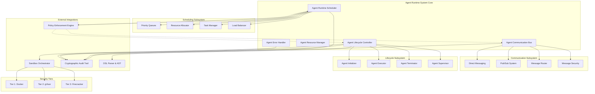
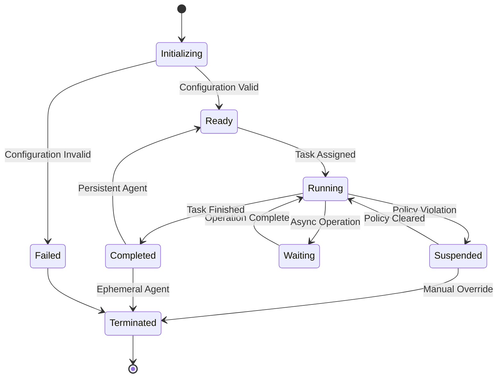
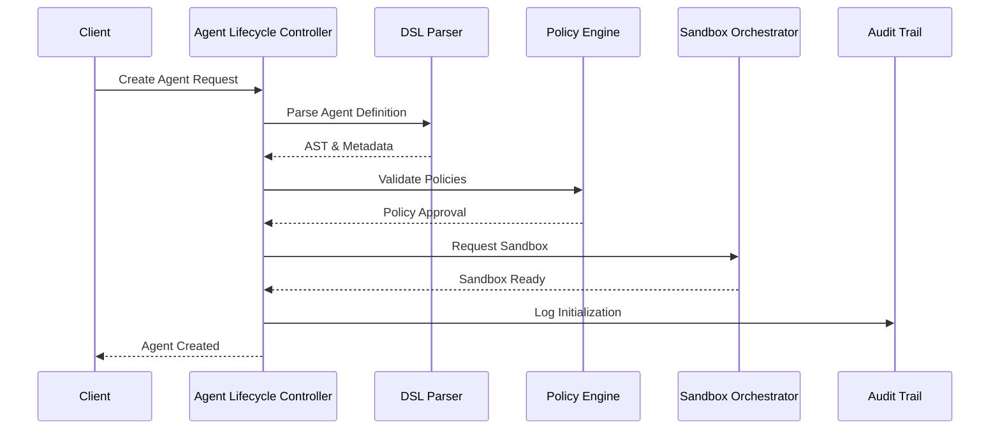
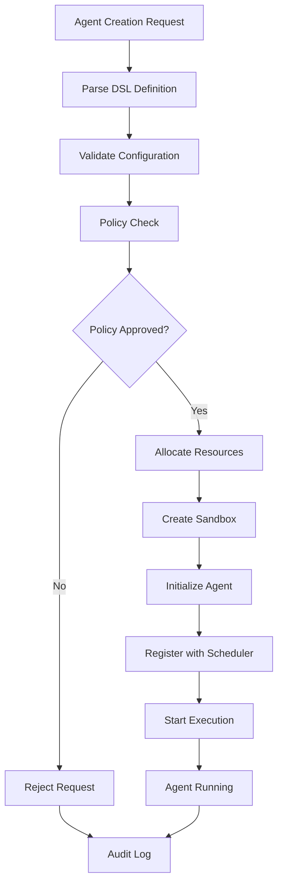
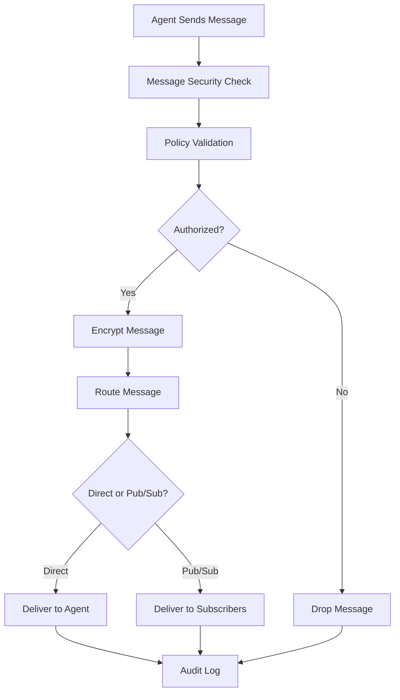

# Agent Runtime System Design
**Version:** 1.0  
**Date:** July 2025  
**Component:** Agent Runtime System  
**Status:** Design Phase

---

## Table of Contents

1. [Executive Summary](#executive-summary)
2. [System Architecture](#system-architecture)
3. [Core Components](#core-components)
4. [Agent Lifecycle Management](#agent-lifecycle-management)
5. [Resource Management](#resource-management)
6. [Communication System](#communication-system)
7. [Security Integration](#security-integration)
8. [Data Flow](#data-flow)
9. [Configuration & Metadata](#configuration--metadata)
10. [Error Handling & Recovery](#error-handling--recovery)
11. [Performance Considerations](#performance-considerations)
12. [Integration Points](#integration-points)
13. [Implementation Roadmap](#implementation-roadmap)

---

## Executive Summary

The Agent Runtime System is the core orchestration layer of the Symbiont platform, responsible for managing the complete lifecycle of autonomous agents. It provides a secure, scalable, and policy-aware execution environment that supports both long-lived and ephemeral agents while enforcing strict security policies and maintaining comprehensive audit trails.

### Key Features

- **Hybrid Execution Model**: Support for both persistent and ephemeral agent execution patterns
- **Centralized Scheduling**: Global resource awareness with priority-based task scheduling
- **Multi-Tier Security**: Integration with Docker, gVisor, and Firecracker sandboxing
- **Hybrid Communication**: Direct messaging and publish-subscribe patterns with encryption
- **Policy Enforcement**: Runtime integration with the Policy Enforcement Engine
- **Cryptographic Audit**: Complete operation logging with Ed25519 signatures

---

## System Architecture



### Architecture Principles

1. **Separation of Concerns**: Each component has a single, well-defined responsibility
2. **Policy-First Design**: All operations subject to policy enforcement
3. **Security by Default**: Secure configurations and encrypted communications
4. **Observability**: Comprehensive logging and monitoring capabilities
5. **Scalability**: Designed for high-throughput, concurrent agent execution

---

## Core Components

### 3.1 Agent Runtime Scheduler

The central orchestrator responsible for managing agent execution across the system.

#### Responsibilities
- **Task Scheduling**: Priority-based scheduling with resource awareness
- **Load Balancing**: Distribution of agents across available resources
- **Resource Allocation**: Assignment of computational resources to agents
- **Policy Coordination**: Integration with policy enforcement decisions

#### Key Interfaces
```rust
pub trait AgentScheduler {
    async fn schedule_agent(&self, config: AgentConfig) -> Result<AgentId, SchedulerError>;
    async fn reschedule_agent(&self, agent_id: AgentId, priority: Priority) -> Result<(), SchedulerError>;
    async fn terminate_agent(&self, agent_id: AgentId) -> Result<(), SchedulerError>;
    async fn get_system_status(&self) -> SystemStatus;
}

pub struct SchedulerConfig {
    pub max_concurrent_agents: usize,
    pub priority_levels: u8,
    pub resource_limits: ResourceLimits,
    pub scheduling_algorithm: SchedulingAlgorithm,
}
```

### 3.2 Agent Lifecycle Controller

Manages the complete lifecycle of agents from initialization to termination.

#### Responsibilities
- **Agent Initialization**: Parsing DSL, validating configuration, setting up execution environment
- **Execution Management**: Starting, monitoring, and controlling agent execution
- **State Management**: Tracking agent state transitions and persistence
- **Termination Handling**: Graceful shutdown and resource cleanup

#### State Machine


### 3.3 Agent Resource Manager

Enforces resource limits and monitors resource usage across all agents.

#### Responsibilities
- **Resource Allocation**: Memory, CPU, and I/O resource assignment
- **Usage Monitoring**: Real-time tracking of resource consumption
- **Limit Enforcement**: Prevention of resource limit violations
- **Resource Optimization**: Dynamic resource reallocation based on demand

#### Resource Types
```rust
pub struct ResourceLimits {
    pub memory_mb: usize,
    pub cpu_cores: f32,
    pub disk_io_mbps: usize,
    pub network_io_mbps: usize,
    pub execution_timeout: Duration,
    pub idle_timeout: Duration,
}

pub struct ResourceUsage {
    pub memory_used: usize,
    pub cpu_utilization: f32,
    pub disk_io_rate: usize,
    pub network_io_rate: usize,
    pub uptime: Duration,
}
```

### 3.4 Agent Communication Bus

Provides secure, reliable communication between agents and external systems.

#### Communication Patterns
- **Direct Messaging**: Point-to-point communication with delivery guarantees
- **Publish-Subscribe**: Topic-based event distribution
- **Request-Response**: Synchronous communication with timeout handling
- **Broadcast**: System-wide announcements and notifications

#### Security Features
```rust
pub struct SecureMessage {
    pub id: MessageId,
    pub sender: AgentId,
    pub recipient: Option<AgentId>, // None for broadcast
    pub topic: Option<String>,      // For pub/sub
    pub payload: EncryptedPayload,
    pub signature: Ed25519Signature,
    pub timestamp: SystemTime,
    pub ttl: Duration,
}

pub enum MessageType {
    Direct(AgentId),
    Publish(String),
    Subscribe(String),
    Broadcast,
    Request(RequestId),
    Response(RequestId),
}
```

---

## Agent Lifecycle Management

### 4.1 Initialization Phase

The initialization phase transforms DSL agent definitions into executable runtime instances.

#### Process Flow


#### Configuration Validation
```rust
pub struct AgentConfig {
    pub id: AgentId,
    pub name: String,
    pub dsl_source: String,
    pub execution_mode: ExecutionMode,
    pub security_tier: SecurityTier,
    pub resource_limits: ResourceLimits,
    pub capabilities: Vec<Capability>,
    pub policies: Vec<PolicyId>,
    pub metadata: HashMap<String, String>,
}

pub enum ExecutionMode {
    Persistent,     // Long-lived agent
    Ephemeral,      // Task-based execution
    Scheduled,      // Cron-like scheduling
    EventDriven,    // Reactive to events
}
```

### 4.2 Execution Management

#### Agent Supervision
- **Health Monitoring**: Periodic health checks and liveness probes
- **Resource Monitoring**: Continuous tracking of resource usage
- **Policy Compliance**: Runtime policy violation detection
- **Error Detection**: Exception handling and error recovery

#### Execution Context
```rust
pub struct ExecutionContext {
    pub agent_id: AgentId,
    pub sandbox_handle: SandboxHandle,
    pub resource_allocation: ResourceAllocation,
    pub communication_channels: CommunicationChannels,
    pub policy_context: PolicyContext,
    pub audit_logger: AuditLogger,
}
```

### 4.3 Termination Handling

#### Graceful Shutdown Process
1. **Signal Termination**: Send termination signal to agent
2. **Resource Cleanup**: Release allocated resources
3. **State Persistence**: Save agent state if required
4. **Audit Logging**: Record termination event
5. **Sandbox Cleanup**: Destroy execution environment

---

## Resource Management

### 5.1 Resource Allocation Strategy

#### Allocation Algorithm
```rust
pub enum AllocationStrategy {
    FirstFit,       // First available resource slot
    BestFit,        // Optimal resource utilization
    WorstFit,       // Load balancing across resources
    Priority,       // Priority-based allocation
}

pub struct ResourcePool {
    pub total_memory: usize,
    pub total_cpu_cores: usize,
    pub available_memory: usize,
    pub available_cpu_cores: usize,
    pub allocated_agents: HashMap<AgentId, ResourceAllocation>,
}
```

### 5.2 Resource Monitoring

#### Metrics Collection
- **System Metrics**: CPU, memory, disk, network utilization
- **Agent Metrics**: Per-agent resource consumption
- **Performance Metrics**: Throughput, latency, error rates
- **Security Metrics**: Policy violations, audit events

#### Monitoring Implementation
```rust
pub struct ResourceMonitor {
    pub collection_interval: Duration,
    pub metrics_store: MetricsStore,
    pub alert_thresholds: AlertThresholds,
}

pub struct AlertThresholds {
    pub memory_warning: f32,    // 80%
    pub memory_critical: f32,   // 95%
    pub cpu_warning: f32,       // 80%
    pub cpu_critical: f32,      // 95%
}
```

---

## Communication System

### 6.1 Message Routing

#### Routing Table
```rust
pub struct MessageRouter {
    pub direct_routes: HashMap<AgentId, ChannelHandle>,
    pub topic_subscriptions: HashMap<String, Vec<AgentId>>,
    pub broadcast_channels: Vec<ChannelHandle>,
    pub dead_letter_queue: DeadLetterQueue,
}
```

### 6.2 Security Implementation

#### Message Encryption
- **Algorithm**: AES-256-GCM for payload encryption
- **Key Management**: Per-agent encryption keys with rotation
- **Authentication**: Ed25519 signatures for message integrity
- **Authorization**: Policy-based message routing controls

#### Security Configuration
```rust
pub struct MessageSecurity {
    pub encryption_enabled: bool,
    pub signature_required: bool,
    pub key_rotation_interval: Duration,
    pub max_message_size: usize,
    pub rate_limiting: RateLimitConfig,
}
```

### 6.3 Delivery Guarantees

#### Reliability Levels
- **At-Most-Once**: Best effort delivery
- **At-Least-Once**: Guaranteed delivery with possible duplicates
- **Exactly-Once**: Guaranteed single delivery (for critical messages)

---

## Security Integration

### 7.1 Policy Enforcement Integration

#### Policy Hook Points
```rust
pub trait PolicyEnforcementHooks {
    async fn pre_agent_creation(&self, config: &AgentConfig) -> PolicyResult;
    async fn pre_message_send(&self, message: &SecureMessage) -> PolicyResult;
    async fn pre_resource_allocation(&self, request: &ResourceRequest) -> PolicyResult;
    async fn post_agent_termination(&self, agent_id: AgentId, reason: TerminationReason) -> PolicyResult;
}
```

### 7.2 Sandbox Orchestrator Interface

#### Sandbox Management
```rust
pub trait SandboxOrchestrator {
    async fn create_sandbox(&self, tier: SecurityTier, config: SandboxConfig) -> Result<SandboxHandle, SandboxError>;
    async fn execute_agent(&self, handle: SandboxHandle, agent: CompiledAgent) -> Result<ExecutionHandle, SandboxError>;
    async fn monitor_sandbox(&self, handle: SandboxHandle) -> SandboxStatus;
    async fn destroy_sandbox(&self, handle: SandboxHandle) -> Result<(), SandboxError>;
}

pub enum SecurityTier {
    Tier1 { docker_config: DockerConfig },
    Tier2 { gvisor_config: GVisorConfig },
    Tier3 { firecracker_config: FirecrackerConfig },
}
```

### 7.3 Cryptographic Audit Trail

#### Audit Event Types
```rust
pub enum AuditEvent {
    AgentCreated { agent_id: AgentId, config: AgentConfig },
    AgentStarted { agent_id: AgentId, timestamp: SystemTime },
    AgentTerminated { agent_id: AgentId, reason: TerminationReason },
    MessageSent { from: AgentId, to: Option<AgentId>, message_id: MessageId },
    PolicyViolation { agent_id: AgentId, violation: PolicyViolation },
    ResourceAllocation { agent_id: AgentId, resources: ResourceAllocation },
    SecurityEvent { event_type: SecurityEventType, details: String },
}
```

---

## Data Flow

### 8.1 Agent Creation Flow



### 8.2 Message Flow



---

## Configuration & Metadata

### 9.1 Runtime Configuration

```rust
pub struct RuntimeConfig {
    pub scheduler: SchedulerConfig,
    pub resource_manager: ResourceManagerConfig,
    pub communication: CommunicationConfig,
    pub security: SecurityConfig,
    pub audit: AuditConfig,
    pub monitoring: MonitoringConfig,
}

pub struct SecurityConfig {
    pub default_security_tier: SecurityTier,
    pub encryption_enabled: bool,
    pub signature_required: bool,
    pub policy_enforcement_strict: bool,
    pub sandbox_isolation_level: IsolationLevel,
}
```

### 9.2 Agent Metadata

#### Metadata Structure
```rust
pub struct AgentMetadata {
    pub version: String,
    pub author: String,
    pub description: String,
    pub capabilities: Vec<Capability>,
    pub dependencies: Vec<Dependency>,
    pub resource_requirements: ResourceRequirements,
    pub security_requirements: SecurityRequirements,
    pub custom_fields: HashMap<String, String>,
}
```

---

## Error Handling & Recovery

### 10.1 Error Classification

```rust
pub enum RuntimeError {
    ConfigurationError(ConfigError),
    ResourceError(ResourceError),
    SecurityError(SecurityError),
    CommunicationError(CommError),
    PolicyError(PolicyError),
    SandboxError(SandboxError),
    InternalError(String),
}

pub enum RecoveryStrategy {
    Retry { max_attempts: u32, backoff: Duration },
    Restart { preserve_state: bool },
    Failover { backup_agent: Option<AgentId> },
    Terminate { cleanup: bool },
}
```

### 10.2 Recovery Mechanisms

#### Automatic Recovery
- **Transient Failures**: Automatic retry with exponential backoff
- **Resource Exhaustion**: Resource reallocation or agent migration
- **Policy Violations**: Automatic policy remediation where possible
- **Communication Failures**: Message queuing and retry mechanisms

#### Manual Recovery
- **Critical Failures**: Human intervention required
- **Security Incidents**: Manual security review and approval
- **System Failures**: Administrative override capabilities

---

## Performance Considerations

### 11.1 Scalability Targets

- **Concurrent Agents**: 10,000+ simultaneous agents
- **Message Throughput**: 100,000+ messages per second
- **Latency**: <10ms for agent communication
- **Resource Efficiency**: <512MB memory per standard agent

### 11.2 Optimization Strategies

#### Performance Optimizations
- **Connection Pooling**: Reuse of communication channels
- **Message Batching**: Bulk message processing
- **Resource Pooling**: Pre-allocated resource pools
- **Lazy Loading**: On-demand component initialization

#### Monitoring and Profiling
```rust
pub struct PerformanceMetrics {
    pub agent_startup_time: Duration,
    pub message_latency: Duration,
    pub resource_allocation_time: Duration,
    pub throughput_messages_per_second: u64,
    pub memory_usage_per_agent: usize,
    pub cpu_utilization: f32,
}
```

---

## Integration Points

### 12.1 Policy Enforcement Engine

#### Interface Definition
```rust
pub trait PolicyEnforcementEngine {
    async fn evaluate_policy(&self, context: PolicyContext, action: Action) -> PolicyDecision;
    async fn register_policy(&self, policy: Policy) -> Result<PolicyId, PolicyError>;
    async fn update_policy(&self, policy_id: PolicyId, policy: Policy) -> Result<(), PolicyError>;
    async fn get_applicable_policies(&self, context: PolicyContext) -> Vec<PolicyId>;
}
```

### 12.2 Multi-Tier Sandboxing

#### Sandbox Selection Logic
```rust
pub fn select_security_tier(agent_config: &AgentConfig, risk_assessment: RiskLevel) -> SecurityTier {
    match risk_assessment {
        RiskLevel::Low => SecurityTier::Tier1,
        RiskLevel::Medium => SecurityTier::Tier2,
        RiskLevel::High => SecurityTier::Tier3,
    }
}
```

### 12.3 Cryptographic Audit Trail

#### Audit Integration
```rust
pub trait AuditTrail {
    async fn log_event(&self, event: AuditEvent) -> Result<AuditId, AuditError>;
    async fn verify_integrity(&self, from: AuditId, to: AuditId) -> Result<bool, AuditError>;
    async fn query_events(&self, query: AuditQuery) -> Result<Vec<AuditEvent>, AuditError>;
}
```

---

## Implementation Roadmap

### 13.1 Phase 1: Core Infrastructure (Months 1-2)

#### Deliverables
- [ ] Agent Runtime Scheduler implementation
- [ ] Basic Agent Lifecycle Controller
- [ ] Resource Manager with Docker integration
- [ ] Simple direct messaging system
- [ ] Basic policy enforcement hooks

#### Success Criteria
- Support for 100 concurrent agents
- Basic agent lifecycle management
- Docker-based sandboxing
- Simple inter-agent communication

### 13.2 Phase 2: Advanced Features (Months 3-4)

#### Deliverables
- [ ] Hybrid communication system (direct + pub/sub)
- [ ] gVisor and Firecracker integration
- [ ] Advanced resource management
- [ ] Comprehensive error handling
- [ ] Performance optimization

#### Success Criteria
- Support for 1,000+ concurrent agents
- Multi-tier security implementation
- Advanced communication patterns
- Robust error recovery

### 13.3 Phase 3: Production Readiness (Months 5-6)

#### Deliverables
- [ ] Complete audit trail integration
- [ ] Advanced monitoring and metrics
- [ ] Performance optimization
- [ ] Security hardening
- [ ] Comprehensive testing

#### Success Criteria
- Support for 10,000+ concurrent agents
- Production-grade security
- Complete audit capabilities
- Performance targets met

---

## Conclusion

The Agent Runtime System provides a robust, secure, and scalable foundation for executing autonomous agents within the Symbiont platform. Its hybrid execution model, centralized scheduling, and comprehensive security integration make it suitable for enterprise-grade deployments while maintaining the flexibility needed for diverse agent workloads.

The design emphasizes security-first principles, policy enforcement, and comprehensive auditability, ensuring that all agent operations are traceable, compliant, and secure. The modular architecture allows for incremental implementation and future extensibility as the platform evolves.

This design document serves as the blueprint for implementing the first major component of the Symbiont platform, establishing the foundation for the policy enforcement engine, multi-tier sandboxing, and cryptographic audit trail components that will follow.