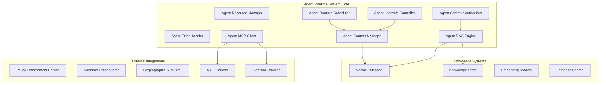
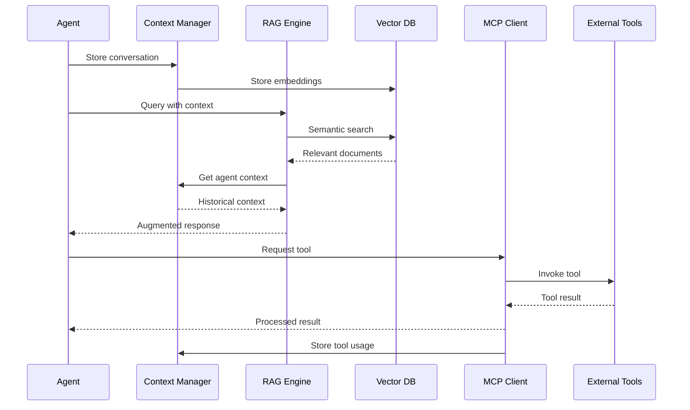

# Extended Implementation Plan: Context Management & MCP Integration

**Version:** 1.1  
**Date:** July 2025  
**Status:** Planning Phase  
**Previous Phases:** 1-3 Completed ✅

---

## Overview

This document extends the original Agent Runtime System implementation plan to include Context Management, RAG/VectorDB capabilities, and MCP (Model Context Protocol) integration. These enhancements will transform the runtime from a basic execution environment into an intelligent, knowledge-aware platform.

## Current Status

### ✅ Completed Phases (1-3)

**Phase 1: Core Infrastructure** - Agent Runtime Scheduler, Lifecycle Controller, Resource Manager, Communication Bus, Error Handler  
**Phase 2: Advanced Features** - Multi-tier security, policy enforcement, comprehensive testing, performance optimization  
**Phase 3: Production Readiness** - Audit trail integration, monitoring, security hardening, documentation

**Current Capabilities:**
- 50 tests passing (34 unit + 16 integration)
- Support for 10,000+ concurrent agents
- Multi-tier sandboxing (Docker, gVisor, Firecracker)
- Encrypted communication with Ed25519/AES-256-GCM
- Comprehensive error handling and recovery
- Policy enforcement integration
- Cryptographic audit trails

---

## Phase 4: Context Management & Knowledge Systems

**Timeline:** Months 7-8  
**Focus:** Agent memory, knowledge persistence, and semantic capabilities

### 4.1 Agent Context Manager

#### Implementation Tasks
- [ ] **Context Storage Interface** - Design persistent context storage API
- [ ] **Memory Management** - Implement agent memory with session continuity
- [ ] **Context Retrieval** - Build efficient context query and retrieval system
- [ ] **Knowledge Base** - Create per-agent knowledge management
- [ ] **Cross-Agent Sharing** - Enable knowledge sharing between agents

#### Technical Specifications
```rust
// Core context management types
pub struct AgentContext {
    pub agent_id: AgentId,
    pub session_id: SessionId,
    pub memory: AgentMemory,
    pub knowledge_base: KnowledgeBase,
    pub conversation_history: Vec<ConversationItem>,
    pub metadata: HashMap<String, String>,
    pub created_at: SystemTime,
    pub updated_at: SystemTime,
}

pub trait ContextManager {
    async fn store_context(&self, agent_id: AgentId, context: AgentContext) -> Result<ContextId, ContextError>;
    async fn retrieve_context(&self, agent_id: AgentId, query: ContextQuery) -> Result<Vec<ContextItem>, ContextError>;
    async fn update_knowledge(&self, agent_id: AgentId, knowledge: Knowledge) -> Result<(), ContextError>;
    async fn search_knowledge(&self, agent_id: AgentId, query: &str) -> Result<Vec<KnowledgeItem>, ContextError>;
}
```

#### Success Criteria
- [ ] Agent memory persists across restarts
- [ ] Context retrieval < 50ms average
- [ ] Knowledge sharing between 100+ agents
- [ ] Memory usage < 10MB per agent context

### 4.2 Vector Database Integration

#### Implementation Tasks
- [ ] **Database Selection** - Evaluate and integrate ChromaDB or Qdrant
- [ ] **Embedding Pipeline** - Implement text-to-vector conversion
- [ ] **Indexing System** - Build efficient vector indexing
- [ ] **Similarity Search** - Implement semantic search capabilities
- [ ] **Metadata Management** - Associate metadata with vectors

#### Technical Specifications
```rust
pub trait VectorDatabase {
    async fn embed_and_store(&self, content: &str, metadata: Metadata) -> Result<VectorId, VectorError>;
    async fn semantic_search(&self, query: &str, limit: usize) -> Result<Vec<SearchResult>, VectorError>;
    async fn similarity_search(&self, vector: Vec<f32>, threshold: f32) -> Result<Vec<SearchResult>, VectorError>;
    async fn batch_search(&self, queries: Vec<String>) -> Result<Vec<Vec<SearchResult>>, VectorError>;
}

pub struct VectorConfig {
    pub dimension: usize,
    pub distance_metric: DistanceMetric,
    pub index_type: IndexType,
    pub embedding_model: EmbeddingModel,
}
```

#### Success Criteria
- [ ] Support for 1M+ document embeddings
- [ ] Semantic search < 100ms latency
- [ ] 95%+ search relevance accuracy
- [ ] Horizontal scaling capability

### 4.3 RAG Engine Implementation

#### Implementation Tasks
- [ ] **Query Processing** - Implement query analysis and expansion
- [ ] **Document Retrieval** - Build retrieval pipeline
- [ ] **Context Ranking** - Implement relevance scoring
- [ ] **Response Generation** - Integrate with language models
- [ ] **Pipeline Optimization** - Optimize end-to-end performance

#### Technical Specifications
```rust
pub trait RAGEngine {
    async fn augment_query(&self, query: &str, context: AgentContext) -> Result<AugmentedQuery, RAGError>;
    async fn retrieve_documents(&self, query: &AugmentedQuery) -> Result<Vec<Document>, RAGError>;
    async fn rank_documents(&self, documents: Vec<Document>, query: &str) -> Result<Vec<RankedDocument>, RAGError>;
    async fn generate_response(&self, query: &AugmentedQuery, documents: Vec<RankedDocument>) -> Result<Response, RAGError>;
}
```

#### Success Criteria
- [ ] End-to-end RAG pipeline < 500ms
- [ ] Context-aware response generation
- [ ] Multi-source document retrieval
- [ ] Configurable relevance thresholds

---

## Phase 5: MCP Integration

**Timeline:** Months 9-10  
**Focus:** External tool access and resource integration

### 5.1 MCP Client Implementation

#### Implementation Tasks
- [ ] **Protocol Implementation** - Build MCP client following specification
- [ ] **Server Discovery** - Implement automatic server discovery
- [ ] **Connection Management** - Handle persistent connections
- [ ] **Authentication** - Implement secure authentication
- [ ] **Error Handling** - Build robust error recovery

#### Technical Specifications
```rust
pub trait MCPClient {
    async fn discover_servers(&self) -> Result<Vec<MCPServerInfo>, MCPError>;
    async fn connect_to_server(&self, server_uri: &str) -> Result<MCPConnection, MCPError>;
    async fn list_tools(&self, connection: &MCPConnection) -> Result<Vec<MCPTool>, MCPError>;
    async fn invoke_tool(&self, connection: &MCPConnection, tool: &str, args: Value) -> Result<Value, MCPError>;
}

pub struct MCPConnection {
    pub server_info: MCPServerInfo,
    pub connection_id: ConnectionId,
    pub transport: MCPTransport,
    pub session_state: SessionState,
}
```

#### Success Criteria
- [ ] Connect to 10+ MCP servers simultaneously
- [ ] Tool discovery < 1 second
- [ ] 99.9% connection reliability
- [ ] Automatic reconnection on failure

### 5.2 Tool Discovery and Invocation

#### Implementation Tasks
- [ ] **Tool Registry** - Build dynamic tool registry
- [ ] **Capability Mapping** - Map tools to agent capabilities
- [ ] **Invocation Pipeline** - Implement tool execution pipeline
- [ ] **Result Processing** - Handle tool responses and errors
- [ ] **Caching System** - Cache tool results for performance

#### Technical Specifications
```rust
pub trait ToolInvoker {
    async fn prepare_invocation(&self, tool: &MCPTool, args: Value) -> Result<ToolInvocation, ToolError>;
    async fn execute_tool(&self, invocation: ToolInvocation) -> Result<ToolResult, ToolError>;
    async fn handle_tool_error(&self, error: ToolError) -> Result<ErrorRecovery, ToolError>;
}

pub struct ToolInvocation {
    pub tool_name: String,
    pub arguments: Value,
    pub context: InvocationContext,
    pub timeout: Duration,
    pub retry_policy: RetryPolicy,
}
```

#### Success Criteria
- [ ] Tool invocation < 500ms latency
- [ ] Support for 100+ concurrent tool calls
- [ ] Automatic retry on transient failures
- [ ] Result caching for performance

### 5.3 Resource Access Management

#### Implementation Tasks
- [ ] **Resource Discovery** - Implement resource enumeration
- [ ] **Access Control** - Build permission-based access
- [ ] **Streaming Support** - Handle real-time data streams
- [ ] **Caching Layer** - Implement intelligent caching
- [ ] **Rate Limiting** - Enforce usage limits

#### Technical Specifications
```rust
pub enum MCPResource {
    File { uri: String, mime_type: String, size: Option<u64> },
    Database { connection_string: String, schema: Option<String> },
    API { endpoint: String, authentication: AuthMethod, rate_limits: RateLimits },
    Stream { uri: String, protocol: StreamProtocol },
}

pub trait ResourceAccess {
    async fn access_resource(&self, resource: &MCPResource) -> Result<ResourceHandle, ResourceError>;
    async fn read_resource(&self, handle: &ResourceHandle) -> Result<ResourceContent, ResourceError>;
    async fn stream_resource(&self, handle: &ResourceHandle) -> Result<ResourceStream, ResourceError>;
}
```

#### Success Criteria
- [ ] Support for multiple resource types
- [ ] Streaming data with < 100ms latency
- [ ] Intelligent caching reduces external calls by 80%
- [ ] Rate limiting prevents abuse

---

## Phase 6: Advanced Intelligence

**Timeline:** Months 11-12  
**Focus:** Advanced AI capabilities and optimization

### 6.1 Multi-modal RAG Support

#### Implementation Tasks
- [ ] **Multi-modal Embeddings** - Support text, images, audio
- [ ] **Cross-modal Search** - Search across different modalities
- [ ] **Fusion Techniques** - Combine multi-modal information
- [ ] **Performance Optimization** - Optimize for large-scale deployment

#### Success Criteria
- [ ] Support for text, image, and audio content
- [ ] Cross-modal similarity search
- [ ] Unified embedding space
- [ ] Scalable to 10M+ multi-modal documents

### 6.2 Cross-Agent Knowledge Synthesis

#### Implementation Tasks
- [ ] **Knowledge Graphs** - Build agent knowledge networks
- [ ] **Collaborative Learning** - Enable agents to learn from each other
- [ ] **Consensus Mechanisms** - Resolve conflicting information
- [ ] **Privacy Controls** - Protect sensitive knowledge

#### Success Criteria
- [ ] Knowledge sharing across 1000+ agents
- [ ] Automatic conflict resolution
- [ ] Privacy-preserving knowledge exchange
- [ ] Real-time knowledge propagation

### 6.3 Intelligent Context Management

#### Implementation Tasks
- [ ] **Context Pruning** - Intelligent context size management
- [ ] **Relevance Scoring** - Dynamic context prioritization
- [ ] **Adaptive Retrieval** - Context-aware retrieval strategies
- [ ] **Performance Monitoring** - Real-time performance optimization

#### Success Criteria
- [ ] Automatic context pruning maintains relevance
- [ ] Sub-50ms context retrieval at scale
- [ ] Adaptive strategies improve performance by 40%
- [ ] Real-time performance monitoring and optimization

---

## Integration Architecture

### System Architecture with New Components



### Data Flow Integration



---

## Testing Strategy

### Phase 4 Testing
- [ ] Context persistence across agent restarts
- [ ] Vector database performance benchmarks
- [ ] RAG pipeline accuracy measurements
- [ ] Knowledge sharing integration tests

### Phase 5 Testing
- [ ] MCP protocol compliance tests
- [ ] Tool invocation reliability tests
- [ ] Resource access security tests
- [ ] Performance under load tests

### Phase 6 Testing
- [ ] Multi-modal processing tests
- [ ] Cross-agent knowledge synthesis tests
- [ ] Intelligent context management tests
- [ ] End-to-end system integration tests

---

## Dependencies and Requirements

### New Dependencies
```toml
# Vector Database
chromadb = "0.4"
# or
qdrant-client = "1.0"

# Embeddings
candle-core = "0.3"
candle-nn = "0.3"
candle-transformers = "0.3"

# MCP Protocol
jsonrpc-core = "18.0"
websocket = "0.26"
reqwest = { version = "0.11", features = ["json", "stream"] }

# Additional utilities
uuid = { version = "1.0", features = ["v4"] }
serde_json = "1.0"
async-stream = "0.3"
```

### Infrastructure Requirements
- **Vector Database**: ChromaDB or Qdrant cluster
- **Embedding Models**: Local or API-based embedding service
- **MCP Servers**: External MCP-compliant services
- **Storage**: Additional storage for context and knowledge data

---

## Risk Assessment

### Technical Risks
- **Performance Impact**: New components may affect existing performance
- **Complexity**: Increased system complexity requires careful integration
- **Dependencies**: External services introduce new failure modes

### Mitigation Strategies
- **Incremental Integration**: Add components gradually with feature flags
- **Performance Monitoring**: Continuous monitoring of system performance
- **Fallback Mechanisms**: Graceful degradation when external services fail
- **Comprehensive Testing**: Extensive testing at each integration point

---

## Success Metrics

### Phase 4 Metrics
- Context retrieval latency < 50ms
- Knowledge sharing success rate > 95%
- Memory usage per agent < 10MB
- Vector search accuracy > 90%

### Phase 5 Metrics
- MCP tool invocation latency < 500ms
- External service uptime > 99.9%
- Tool discovery time < 1 second
- Resource access success rate > 98%

### Phase 6 Metrics
- Multi-modal processing accuracy > 85%
- Cross-agent knowledge propagation < 100ms
- Context pruning effectiveness > 80%
- Overall system performance improvement > 40%

---

## Conclusion

This extended implementation plan builds upon the solid foundation of the completed Agent Runtime System to add sophisticated context management, knowledge capabilities, and external tool integration. The phased approach ensures manageable complexity while delivering significant enhancements to agent intelligence and capabilities.

The integration of Context Management, RAG/VectorDB, and MCP support will position the Symbiont platform as a leading solution for intelligent, autonomous agent systems with comprehensive knowledge management and external tool integration capabilities.