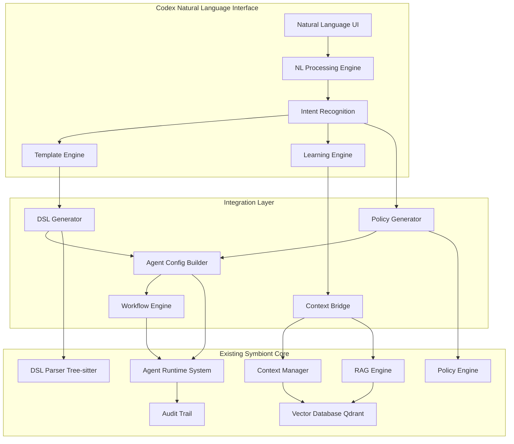
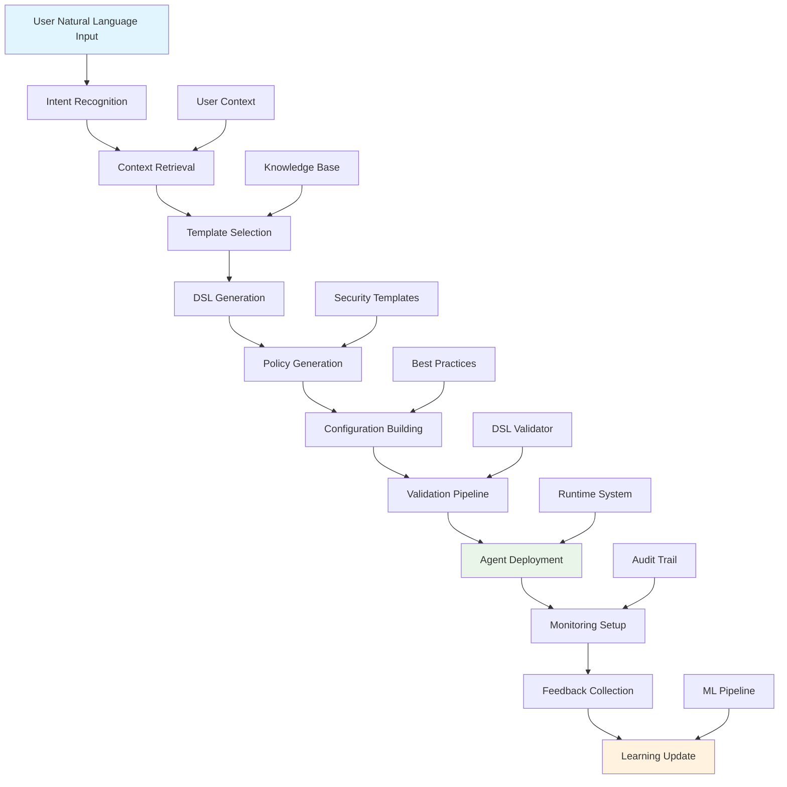
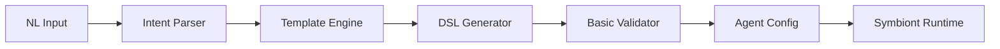
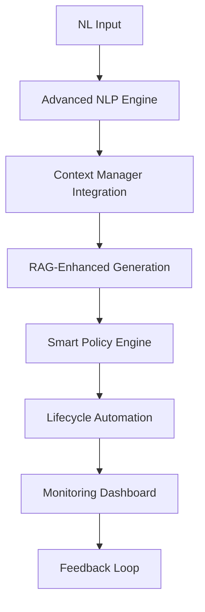
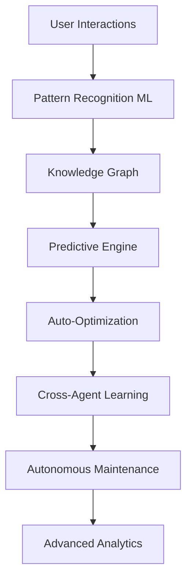
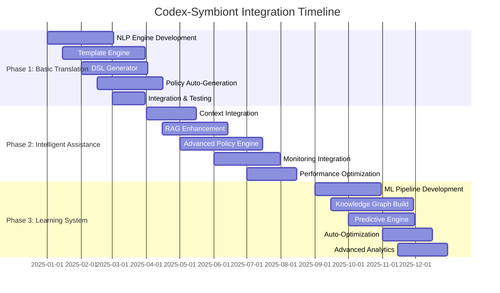

# Codex-Symbiont Integration Strategy
**Version:** 1.0  
**Date:** July 2025  
**Authors:** Symbiont Architecture Team  
**Status:** Architectural Design

---

## Table of Contents

1. [Executive Summary](#executive-summary)
2. [Detailed Architecture](#detailed-architecture)
3. [Integration Workflow](#integration-workflow)
4. [Phased Implementation Plan](#phased-implementation-plan)
5. [Key Components to be Developed](#key-components-to-be-developed)
6. [Technical Requirements](#technical-requirements)
7. [Implementation Timeline](#implementation-timeline)
8. [Success Metrics](#success-metrics)

---

## Executive Summary

This strategy outlines the integration of `codex` as a sophisticated natural language client for the Symbiont agent platform. The integration leverages Symbiont's existing infrastructure—DSL engine, runtime system, policy framework, and knowledge systems—to create a seamless natural language interface for agent creation, deployment, and management.

### Strategic Goals

- **Natural Language Agent Development**: Enable developers to create, modify, and deploy Symbiont agents using conversational language
- **Intelligent Code Assistance**: Provide context-aware suggestions, refactoring capabilities, and automated optimization
- **Adaptive Learning System**: Continuously learn from user patterns to improve suggestions and automate common tasks
- **Security-First Design**: Maintain Symbiont's security guarantees while providing accessible natural language interfaces

### Integration Approach

The integration follows a three-phase approach building upon Symbiont's existing architecture:

1. **Phase 1: Basic Translation** - Direct natural language to DSL conversion with template-based generation
2. **Phase 2: Intelligent Assistance** - Context-aware suggestions and automated agent lifecycle management
3. **Phase 3: Learning System** - Adaptive learning from user patterns with cross-agent knowledge sharing

---

## Detailed Architecture

### Overall Integration Architecture

### Layer-by-Layer Integration Details

#### 1. DSL Layer Integration

**Existing Capabilities:**
- Tree-sitter grammar supporting EBNF v2
- Agent definitions with metadata, capabilities, policies
- Function definitions and cryptographic operations
- Policy syntax with `allow`, `deny`, `require`, `audit` rules

**Codex Integration Points:**
- **DSL Template Engine**: Pre-built templates for common agent patterns
- **Natural Language Parser**: Convert descriptions to DSL constructs
- **Code Generation**: Programmatic DSL creation with validation
- **Error Translation**: Convert DSL errors to natural language explanations

#### 2. Runtime Layer Integration

**Existing Capabilities:**
- Complete agent lifecycle management (Created → Running → Terminated)
- Multi-tier security (Docker, gVisor, Firecracker)
- Resource management with policy enforcement
- Encrypted communication bus with Ed25519 signatures
- Comprehensive error handling and recovery

**Codex Integration Points:**
- **Deployment Automation**: Seamless agent deployment from natural language
- **Lifecycle Management**: Natural language control of agent states
- **Resource Optimization**: Intelligent resource allocation based on descriptions
- **Monitoring Integration**: Natural language queries for agent status

#### 3. Policy Layer Integration

**Existing Capabilities:**
- YAML-based policy definitions
- Resource access control (File, Network, Command, Database)
- Real-time policy evaluation with caching
- Hierarchical policy inheritance and conflict resolution

**Codex Integration Points:**
- **Policy Auto-Generation**: Create security policies from natural language requirements
- **Policy Explanation**: Convert YAML policies to natural language descriptions
- **Compliance Checking**: Validate agent behavior against described security requirements
- **Dynamic Policy Updates**: Modify policies through natural language commands

### Context and Knowledge Integration

**Existing Capabilities:**
- Agent Context Manager with persistent storage
- Vector Database (Qdrant) with semantic search
- RAG Engine with document retrieval and ranking
- Knowledge sharing between agents with trust scoring

**Codex Integration Points:**
- **Conversational Context**: Maintain conversation history for each development session
- **Code Knowledge Base**: Store and retrieve code patterns, best practices, and solutions
- **Learning from Interactions**: Improve suggestions based on user feedback and patterns
- **Cross-Project Knowledge**: Share insights across different agent development projects

---

## Integration Workflow

### Complete Natural Language to Agent Deployment Flow

### Step-by-Step Process Description

#### 1. Natural Language Processing (100-200ms)
- **Input Parsing**: Tokenize and analyze user input for intent and entities
- **Context Integration**: Incorporate previous conversation history and project context
- **Intent Classification**: Determine action type (create, modify, deploy, debug, refactor)
- **Entity Extraction**: Identify specific components, capabilities, and requirements

#### 2. Knowledge Retrieval (50-100ms)
- **Semantic Search**: Query vector database for relevant patterns and examples
- **Template Matching**: Find appropriate DSL templates based on intent
- **Best Practice Lookup**: Retrieve security and performance recommendations
- **Historical Analysis**: Consider similar past implementations

#### 3. Code Generation (200-500ms)
- **DSL Synthesis**: Generate agent definition using selected templates
- **Policy Creation**: Auto-generate security policies based on requirements
- **Configuration Building**: Create complete `AgentConfig` with resource limits
- **Validation**: Ensure generated code meets syntax and semantic requirements

#### 4. Deployment Orchestration (1-5 seconds)
- **Security Review**: Validate against security policies and best practices
- **Resource Allocation**: Determine appropriate tier and resource limits
- **Agent Initialization**: Create agent instance in runtime system
- **Monitoring Setup**: Configure logging, metrics, and audit trails

#### 5. Feedback and Learning (Background)
- **Performance Monitoring**: Track agent execution and resource usage
- **User Feedback**: Collect satisfaction ratings and improvement suggestions
- **Pattern Recognition**: Identify common usage patterns and optimization opportunities
- **Model Updates**: Improve NL processing and code generation based on learnings

---

## Phased Implementation Plan

### Phase 1: Basic Translation (Months 1-3)

**Goal**: Direct natural language to DSL conversion with template-based generation

**Core Features**:
- Natural language intent recognition for basic agent creation
- Template-based DSL generation for common patterns
- Policy auto-generation for standard security requirements
- Basic validation and error reporting

**Key Components**:

**Capabilities Delivered**:
- "Create a file processing agent with read-only access to /tmp directory"
- "Build a web scraper agent that can access external APIs"
- "Make an agent that processes CSV files and generates reports"
- Basic error messages in natural language
- Template-based security policy generation

**Technical Deliverables**:
- Intent classification system (accuracy >85%)
- 20+ DSL templates for common use cases
- Basic policy template generator
- Integration with existing DSL parser
- Simple validation and error reporting

### Phase 2: Intelligent Assistance (Months 4-8)

**Goal**: Context-aware suggestions and automated agent lifecycle management

**Core Features**:
- Context-aware code suggestions and auto-completion
- Intelligent agent lifecycle management
- Advanced policy generation with context understanding
- Real-time agent monitoring and natural language status queries
- Code refactoring and optimization suggestions

**Key Components**:

**Capabilities Delivered**:
- "Optimize my data processing agent for better performance"
- "Add error recovery to the web scraper we built yesterday"
- "Show me how my agents are performing and suggest improvements"
- Context-aware suggestions based on project history
- Intelligent resource allocation and scaling recommendations
- Natural language debugging and troubleshooting assistance

**Technical Deliverables**:
- Context-aware suggestion engine
- Integration with Symbiont's RAG system
- Advanced policy generation with context understanding
- Natural language monitoring and debugging interface
- Performance optimization recommendations
- Auto-scaling and resource management

### Phase 3: Learning System (Months 9-12)

**Goal**: Adaptive learning from user patterns with cross-agent knowledge sharing

**Core Features**:
- Continuous learning from user interactions and feedback
- Cross-project knowledge sharing and pattern recognition
- Predictive suggestions based on development patterns
- Autonomous agent optimization and maintenance
- Advanced troubleshooting with root cause analysis

**Key Components**:

**Capabilities Delivered**:
- "Learn from my coding patterns and suggest better approaches"
- "Share successful patterns across my team's projects"
- "Automatically optimize agents based on production performance"
- Predictive suggestions before user asks
- Autonomous agent health monitoring and self-healing
- Advanced analytics and insights dashboard

**Technical Deliverables**:
- Machine learning pipeline for pattern recognition
- Cross-agent knowledge sharing system
- Predictive suggestion engine
- Autonomous optimization system
- Advanced analytics and reporting
- Self-healing agent capabilities

---

## Key Components to be Developed

### 1. Natural Language Processing Engine

**Purpose**: Core NLP capabilities for intent recognition and entity extraction

**Key Features**:
- Intent classification with >90% accuracy
- Entity extraction for technical concepts
- Context-aware language understanding
- Multi-turn conversation handling
- Code-specific vocabulary and patterns

**Integration Points**:
- Symbiont Context Manager for conversation history
- Vector database for semantic search
- Knowledge base for domain-specific terminology

### 2. DSL Template Engine

**Purpose**: Generate Symbiont DSL code from natural language descriptions

**Key Features**:
- 50+ pre-built templates for common patterns
- Parameterized template system
- Template composition for complex agents
- Custom template creation and management
- Version control and template sharing

**Integration Points**:
- Symbiont DSL parser for validation
- Policy engine for security template integration
- Context manager for template recommendation

### 3. Policy Auto-Generation System

**Purpose**: Create appropriate security policies from natural language requirements

**Key Features**:
- Security requirement extraction from descriptions
- Policy template library with best practices
- Risk assessment and security tier recommendation
- Compliance checking against organizational policies
- Policy explanation in natural language

**Integration Points**:
- Symbiont Policy Engine for enforcement
- Audit trail for policy decision tracking
- Context manager for policy learning and improvement

### 4. Intelligent Configuration Builder

**Purpose**: Build complete agent configurations with optimal settings

**Key Features**:
- Resource requirement estimation
- Performance optimization recommendations
- Security tier selection based on requirements
- Dependency analysis and resolution
- Configuration validation and testing

**Integration Points**:
- Symbiont Runtime for deployment
- Resource manager for allocation
- Performance monitoring for optimization

### 5. Context-Aware Suggestion Engine

**Purpose**: Provide intelligent suggestions based on user context and project history

**Key Features**:
- Real-time code completion and suggestions
- Context-aware recommendations
- Best practice enforcement
- Anti-pattern detection and warnings
- Learning from user feedback

**Integration Points**:
- Symbiont RAG engine for knowledge retrieval
- Vector database for semantic similarity
- Context manager for conversation and project history

### 6. Workflow Automation Engine

**Purpose**: Automate common development workflows and agent lifecycle management

**Key Features**:
- Automated testing and validation
- Deployment pipeline automation
- Agent monitoring and health checks
- Performance optimization automation
- Error detection and recovery

**Integration Points**:
- Symbiont Runtime for lifecycle management
- Audit trail for workflow tracking
- Policy engine for automated compliance

---

## Technical Requirements

### Core Technology Stack

**Frontend**:
- Web-based natural language interface
- Real-time code preview and editing
- Integrated debugging and monitoring
- Collaborative development features

**Backend**:
- Rust-based integration layer for performance
- Python-based ML pipeline for learning capabilities
- REST/GraphQL APIs for frontend integration
- WebSocket connections for real-time updates

**Machine Learning**:
- Large Language Model integration (OpenAI/local models)
- Custom fine-tuned models for Symbiont DSL
- Vector embeddings for semantic search
- Reinforcement learning for user preference adaptation

**Data Storage**:
- Extend existing Qdrant vector database
- Conversation and project history storage
- Template and pattern libraries
- User preference and learning data

### Performance Requirements

| Metric | Target | Phase 1 | Phase 2 | Phase 3 |
|--------|--------|---------|---------|---------|
| Intent Recognition Latency | <200ms | 500ms | 300ms | 200ms |
| DSL Generation Time | <1s | 3s | 2s | 1s |
| End-to-End Agent Creation | <30s | 60s | 45s | 30s |
| Suggestion Accuracy | >90% | 75% | 85% | 90% |
| System Availability | 99.9% | 99% | 99.5% | 99.9% |

### Security Requirements

**Data Protection**:
- End-to-end encryption for all conversations
- Zero-trust architecture for API access
- PII detection and anonymization
- Secure model training data handling

**Access Control**:
- Integration with existing Symbiont RBAC
- Project-based access controls
- Audit logging for all NL interactions
- Policy-based content filtering

**Model Security**:
- Prompt injection protection
- Output sanitization and validation
- Model versioning and rollback capabilities
- Adversarial attack detection

---

## Implementation Timeline

### Year 1 Roadmap

### Milestone Dependencies

**Phase 1 Prerequisites**:
- Symbiont DSL parser integration
- Basic policy engine integration
- Template library development
- NLP model training data collection

**Phase 2 Prerequisites**:
- Phase 1 completion and validation
- Symbiont Context Manager integration
- RAG engine enhancement
- Performance benchmarking infrastructure

**Phase 3 Prerequisites**:
- Phase 2 completion and user validation
- ML pipeline infrastructure
- Knowledge graph framework
- Advanced analytics platform

### Resource Requirements

**Development Team**:
- 2 Senior Rust Engineers (Integration layer)
- 2 ML Engineers (NLP and learning systems)
- 1 Frontend Engineer (UI development)
- 1 DevOps Engineer (Infrastructure)
- 1 Product Manager (Requirements and UX)

**Infrastructure**:
- GPU cluster for ML model training and inference
- Enhanced vector database capacity
- Load balancing and caching infrastructure
- Monitoring and observability stack

---

## Success Metrics

### Phase 1 Success Criteria
- **Intent Recognition Accuracy**: >75% for common agent creation tasks
- **DSL Generation Success Rate**: >80% for template-based patterns
- **User Satisfaction**: >4.0/5.0 rating for basic functionality
- **Error Rate**: <20% for generated agent configurations
- **Performance**: <3s average DSL generation time

### Phase 2 Success Criteria
- **Context-Aware Accuracy**: >85% for suggestions with project context
- **Agent Deployment Success**: >90% first-time deployment success rate
- **User Productivity**: 50% reduction in agent creation time
- **System Reliability**: >99.5% uptime for all components
- **Performance**: <2s average suggestion response time

### Phase 3 Success Criteria
- **Predictive Accuracy**: >90% for user intent prediction
- **Learning Effectiveness**: 25% improvement in suggestions over time
- **Autonomous Operations**: 80% of routine maintenance automated
- **Cross-Project Benefits**: 40% faster development on subsequent projects
- **User Adoption**: >90% of Symbiont users actively using codex interface

### Long-term Impact Metrics
- **Developer Onboarding**: 75% reduction in time to first working agent
- **Code Quality**: 50% reduction in security policy violations
- **Operational Efficiency**: 60% reduction in manual agent management tasks
- **Innovation Acceleration**: 3x increase in experimental agent prototypes
- **Knowledge Retention**: 90% of best practices automatically captured and shared

---

## Conclusion

The Codex-Symbiont integration strategy provides a comprehensive roadmap for creating a sophisticated natural language interface that leverages Symbiont's existing infrastructure while adding intelligent assistance and learning capabilities. The three-phase approach ensures incremental value delivery while building toward a fully autonomous development experience.

This integration will transform Symbiont from a powerful but technical platform into an accessible, intelligent development environment that democratizes agent creation while maintaining enterprise-grade security and performance characteristics.

The strategy balances ambitious long-term goals with practical near-term deliverables, ensuring that each phase provides meaningful value to users while building the foundation for advanced capabilities in subsequent phases.