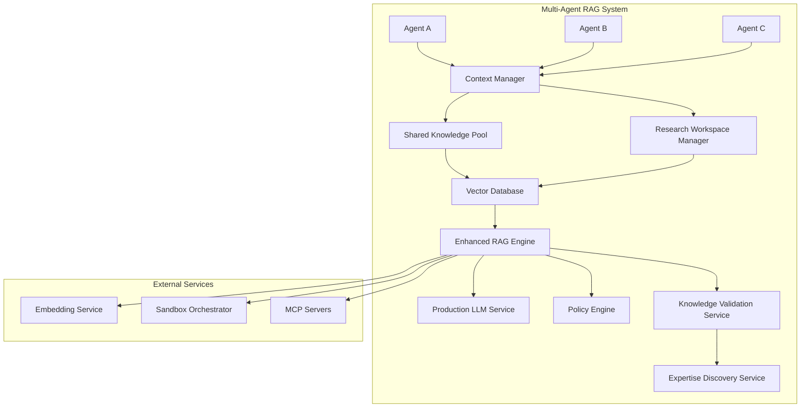

# Multi-Agent RAG System Architecture Assessment

## Executive Summary

This document provides a comprehensive assessment of the current Symbiont Agent Runtime's readiness for implementing a robust multi-agent RAG (Retrieval-Augmented Generation) system. The assessment focuses on research collaboration use cases with future expansion to autonomous learning capabilities.

**Key Finding:** The system has a solid architectural foundation with well-designed interfaces and basic multi-agent communication capabilities. However, several critical components require production implementations and enhancements to support robust multi-agent RAG functionality.

**Readiness Level:** **70% Ready** - Good foundation requiring focused development to reach production readiness.

## Current State Analysis

### 1. RAG Engine Implementation

**Strengths:**
- Complete RAG pipeline interface (analyze → retrieve → rank → augment → generate → validate)
- Semantic similarity calculations and ranking factors implemented
- Integration with context manager and vector database
- Policy validation framework in place

**Current Limitations:**
- Mock response generation (no real LLM integration)
- Agent-agnostic retrieval (doesn't consider agent contexts)
- No cross-agent knowledge discovery mechanisms
- Limited knowledge provenance tracking

### 2. Context Management System

**Strengths:**
- Hierarchical memory structure (short-term, long-term, episodic, semantic, working)
- Knowledge base with facts, procedures, and patterns
- File-based persistence with compression and backup
- Vector database integration for semantic search
- Basic cross-agent knowledge sharing framework

**Current Limitations:**
- Knowledge isolation between agents
- No collaborative memory for joint research tasks
- Limited knowledge synthesis capabilities
- Basic sharing model (simple item sharing only)

### 3. Communication Infrastructure

**Current State:**
- Agent registration/unregistration system functional
- Message queuing and pub/sub patterns implemented
- Direct messaging and subscription management operational
- Basic inter-agent communication protocols established

**Assessment:** **Good foundation** - Adequate infrastructure for basic multi-agent coordination.

## Mock Implementation Inventory

### High Priority Replacements Required

1. **MockEmbeddingService** → Production embedding service
   - **Current:** Simple hash-based mock embeddings
   - **Needed:** OpenAI, Cohere, or local model integration
   - **Impact:** Critical for semantic search accuracy

2. **MockPolicyEngine** → Production policy enforcement
   - **Current:** Always returns "valid" 
   - **Needed:** Real security rules and content filtering
   - **Impact:** Essential for production security

3. **RAG Response Generation** → Real LLM integration
   - **Current:** Template-based mock responses
   - **Needed:** Integration with production LLM APIs
   - **Impact:** Core functionality for RAG system

4. **MockSandboxOrchestrator** → Container orchestration
   - **Current:** In-memory mock with simulated operations
   - **Needed:** Docker/Kubernetes integration
   - **Impact:** Required for secure agent execution

### Medium Priority Replacements

- **MockMcpClient** → Full MCP protocol implementation
- **MockSchemaPinCli** → Real security verification system

## Context Strategy for Multi-Agent Knowledge Sharing

### Long-term Memory (RAG) Storage Criteria
- Research findings & conclusions with confidence > 0.8
- Validated procedures that worked successfully
- Factual knowledge with reliable sources
- Domain expertise learned over multiple interactions
- Cross-agent successful patterns (for future autonomous learning)

### Short-term Context Storage
- Active research hypotheses being explored
- Temporary working data for current tasks
- Agent-specific preferences and working methods
- Session-specific conversation history
- Preliminary findings requiring validation

### Multi-Agent Sharing Strategy
1. **Public knowledge pool** - Verified facts and procedures accessible to all agents
2. **Research workspace sharing** - Temporary shared context for collaborative projects
3. **Expertise routing** - Agents can discover which other agents have relevant knowledge
4. **Knowledge validation chain** - Multiple agents can verify/refute findings before RAG storage

## Proposed Architectural Enhancements

### Core Enhancement Areas

#### 1. Enhanced RAG Engine with Multi-Agent Support
- Agent-aware document retrieval with cross-agent knowledge discovery
- Collaborative ranking algorithms considering inter-agent usage patterns
- Knowledge provenance tracking across agents
- Conflict resolution mechanisms for contradictory information

#### 2. Shared Knowledge Infrastructure
- Global knowledge pool with access control and trust scoring
- Research workspace management for collaborative projects
- Knowledge validation chains requiring multiple agent verification
- Expertise discovery service to route queries to specialist agents

#### 3. Real Implementation Replacements
- Production embedding service integration (OpenAI/Cohere/local models)
- Real LLM integration for response generation
- Production-grade policy engine with comprehensive security rules
- Container orchestration for true sandbox isolation

### Enhanced Multi-Agent RAG Architecture

## Implementation Roadmap

### Phase 1: Foundation Strengthening (4-6 weeks)
**Priority 1: Core Service Replacements**
- Replace MockEmbeddingService with production embedding service
- Integrate real LLM service for RAG response generation
- Implement production policy engine replacing MockPolicyEngine
- **Dependencies:** These are foundational and can be done in parallel

### Phase 2: Enhanced RAG Capabilities (6-8 weeks)
**Priority 1: Agent-Aware Features**
- Implement agent-aware document retrieval
- Add knowledge provenance tracking
- Develop collaborative ranking algorithms
- **Dependencies:** Requires Phase 1 completion

**Priority 2: Knowledge Sharing Infrastructure**
- Build shared knowledge pool with access controls
- Implement research workspace management
- Create expertise discovery service
- **Dependencies:** Parallel with Priority 1, requires communication infrastructure

### Phase 3: Multi-Agent Collaboration (8-10 weeks)
**Priority 1: Advanced Collaboration**
- Knowledge validation chains
- Conflict resolution mechanisms
- Cross-agent research session management
- **Dependencies:** Requires Phase 1 & 2 completion

**Priority 2: Production Hardening**
- Replace remaining mock services (sandbox orchestrator, MCP client)
- Implement comprehensive security policies
- Performance optimization and scaling
- **Dependencies:** Can be done in parallel with Priority 1

### Phase 4: Autonomous Learning Foundation (Future)
**Scope:** Extensions for autonomous agent learning and pattern sharing
- **Note:** Documented for future consideration as requested

## Key Architectural Principles

1. **Knowledge isolation with controlled sharing** - Agents maintain private contexts while participating in shared knowledge pools
2. **Trust-based validation** - Knowledge credibility based on source agent reputation and cross-validation
3. **Expertise routing** - Intelligent routing of research queries to agents with relevant domain knowledge
4. **Incremental knowledge building** - Support for building complex research findings through collaborative agent work

## Risk Assessment

### High Risk Items
- **LLM Integration Complexity** - Production LLM integration may require significant error handling and fallback mechanisms
- **Vector Database Scaling** - Current implementation may need optimization for large-scale multi-agent usage
- **Knowledge Conflict Resolution** - Resolving contradictory information from multiple agents requires sophisticated logic

### Medium Risk Items
- **Performance at Scale** - System performance with many concurrent agents needs validation
- **Security Policy Complexity** - Production policy engine requires comprehensive rule definition

## Recommendations

### Immediate Actions (Next 4 weeks)
1. **Begin LLM integration** - Start with OpenAI API integration for RAG response generation
2. **Implement production embedding service** - Replace MockEmbeddingService with real embeddings
3. **Design knowledge sharing protocols** - Define interfaces for cross-agent knowledge access

### Short-term Goals (Next 3 months)
1. **Complete Phase 1 & 2** of the implementation roadmap
2. **Conduct multi-agent performance testing** - Validate system behavior with multiple concurrent agents
3. **Implement basic research collaboration features** - Enable agents to work together on research tasks

### Long-term Vision (6+ months)
1. **Autonomous learning capabilities** - Extend system to support agent learning from interactions
2. **Advanced collaboration patterns** - Implement sophisticated multi-agent research methodologies
3. **Scaling optimization** - Optimize for enterprise-scale deployments

## Conclusion

The Symbiont Agent Runtime provides a solid foundation for multi-agent RAG implementation. The key to success lies in systematically replacing mock implementations with production services while carefully implementing the multi-agent specific enhancements. The proposed phased approach minimizes risk while delivering incremental value.

**Next Steps:**
1. Prioritize LLM and embedding service integration
2. Design and implement shared knowledge infrastructure
3. Begin development following the proposed roadmap

---

*Assessment completed: 2025-07-14*  
*Focus: Research collaboration with future autonomous learning expansion*