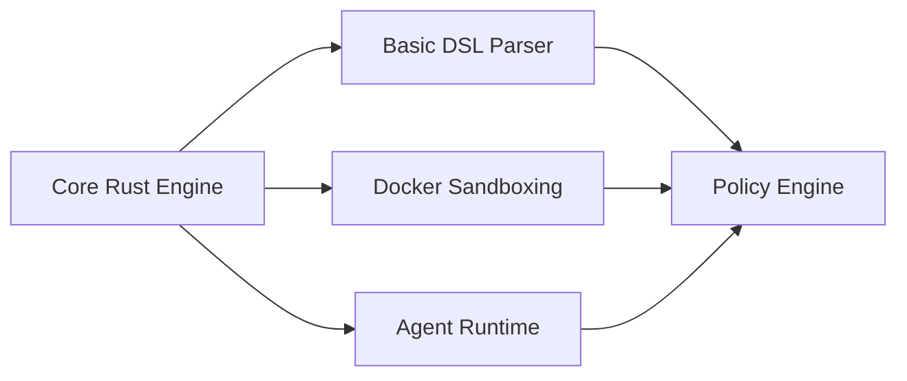
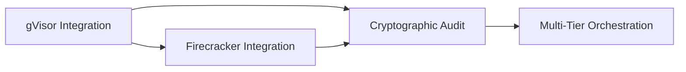
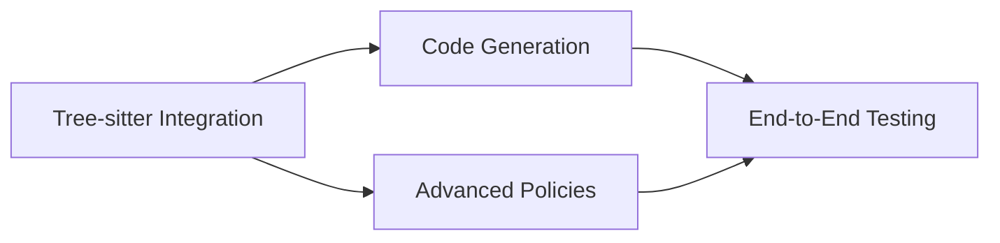

# Symbiont MVP Definition
**Version:** 1.0  
**Date:** July 2025  
**Target:** Internal use for regulated/compliance-driven development projects

---

## 1. MVP Goals

The Symbiont MVP aims to deliver a **security-first, enterprise-grade foundation** for building semi-autonomous AI agents that can safely operate within regulated development environments. The MVP prioritizes:

### Primary Objectives
- **Regulatory Compliance**: Enable development of agents that meet strict compliance requirements for regulated industries
- **Security Assurance**: Provide multi-tiered sandboxing and cryptographic auditability for all agent operations
- **Internal Validation**: Create a robust platform for ThirdKey's internal use before external deployment
- **Risk Mitigation**: Establish proven security patterns for autonomous agent development

### Success Criteria
- Deploy secure agents for internal R&D projects within regulated client environments
- Demonstrate complete audit trails for all agent operations
- Validate multi-tier security model under real-world conditions
- Establish foundation for future enterprise product offerings

---

## 2. Core Features

### 2.1 Multi-Tier Sandboxing Architecture
**Priority: Critical**

- **Tier 1 (Docker)**: Low-risk operations with container isolation
  - Memory limits, network isolation, read-only filesystems
  - Resource constraints and capability dropping
  
- **Tier 2 (gVisor)**: Standard development tasks with user-space kernel
  - System call interception and memory protection
  - I/O virtualization and enhanced isolation
  
- **Tier 3 (Firecracker)**: High-risk operations with microVM isolation
  - Hardware virtualization and minimal attack surface
  - Secure boot chain and complete isolation

### 2.2 Policy-Aware Agent Framework
**Priority: Critical**

- **Policy Definition Language**: Declarative security policies with runtime enforcement
- **Access Control**: Fine-grained permissions for data access and operations
- **Compliance Enforcement**: Automatic policy violation detection and prevention
- **Hierarchical Policies**: Policy inheritance and conflict resolution

### 2.3 Cryptographic Audit System
**Priority: Critical**

- **Digital Signatures**: Ed25519 signatures for all agent operations
- **Immutable Audit Trail**: Cryptographically secured operation logs
- **Verification System**: Batch verification for performance optimization
- **Integrity Guarantees**: Tamper-evident audit records

### 2.4 Basic DSL Implementation
**Priority: High**

- **Core Grammar**: Support for agent definitions with metadata blocks
- **Tree-sitter Integration**: AST-based code manipulation for Rust, Python, JavaScript, TypeScript
- **Policy Integration**: DSL constructs for security and compliance requirements
- **Code Generation**: Template-based agent code synthesis

### 2.5 Agent Runtime System
**Priority: High**

- **Lifecycle Management**: Agent initialization, execution, and termination
- **Resource Management**: Memory, CPU, and I/O resource allocation and limits
- **Communication Bus**: Secure inter-agent messaging with encryption
- **Error Handling**: Graceful failure recovery and error reporting

---

## 3. Technical Scope

### 3.1 Core Rust Engine
**Components to Implement:**

```rust
// Core runtime components
pub struct AgentRuntime {
    pub scheduler: AgentScheduler,
    pub policy_engine: PolicyEngine,
    pub audit_system: AuditSystem,
    pub sandbox_orchestrator: SandboxOrchestrator,
}

// Security tiers
pub enum SecurityTier {
    Tier1,  // Docker isolation
    Tier2,  // gVisor isolation  
    Tier3,  // Firecracker isolation
}

// Agent configuration
pub struct AgentConfig {
    pub id: AgentId,
    pub security_tier: SecurityTier,
    pub memory_limit: usize,
    pub execution_timeout: Duration,
    pub policy_constraints: PolicySet,
}
```

### 3.2 Sandboxing Infrastructure
**Implementation Requirements:**

- **Docker Integration**: Container runtime with security hardening
- **gVisor Integration**: User-space kernel with system call filtering
- **Firecracker Integration**: MicroVM hypervisor with minimal TCB
- **Risk Assessment Engine**: Automatic tier classification based on operation risk

### 3.3 Policy Engine
**Core Capabilities:**

```symbiont
// Policy definition syntax
policy secure_development {
    allow: ["read", "analyze", "generate_code"]
    deny: ["network_access", "file_system_write"]
    require: [
        user_clearance >= "developer",
        audit_trail = true,
        code_review = "mandatory"
    ]
    conditions: {
        data_classification: "confidential",
        geographic_restriction: "US",
        retention_period: 90.days
    }
}
```

### 3.4 Audit and Compliance System
**Technical Implementation:**

- **Signature Algorithm**: Ed25519 with hardware security module integration
- **Log Format**: Structured JSON with cryptographic integrity
- **Storage**: Immutable append-only logs with distributed backup
- **Verification**: Real-time and batch verification capabilities

### 3.5 DSL Parser and Code Generation
**Scope:**

- **Grammar Support**: Enhanced EBNF v1 with security extensions
- **Language Support**: Rust, Python, JavaScript, TypeScript (complete parsing)
- **Code Manipulation**: Safe AST transformations and refactoring
- **Template System**: Policy-aware code generation templates

---

## 4. Exclusions

### 4.1 Experimental Cryptographic Features
**Explicitly Excluded from MVP:**

- **Homomorphic Encryption**: CKKS scheme and encrypted computation
- **Zero-Knowledge Proofs**: zk-SNARKs and proof generation systems
- **Advanced Privacy**: Differential privacy and privacy-preserving analytics
- **Post-Quantum Cryptography**: Experimental quantum-resistant algorithms

### 4.2 Advanced Agent Capabilities
**Deferred to Future Releases:**

- **Machine Learning Integration**: On-device model training and inference
- **Advanced Code Analysis**: Semantic analysis beyond basic AST operations
- **Multi-Language Support**: Languages beyond the core four (Go, Java, etc.)
- **Performance Optimization**: Advanced caching and optimization features

### 4.3 External Integrations
**Not Included in MVP:**

- **Cloud Provider APIs**: AWS, Azure, GCP specific integrations
- **Third-Party Tools**: External CI/CD, monitoring, and analytics platforms
- **Enterprise SSO**: Advanced authentication and authorization systems
- **Distributed Deployment**: Multi-node clustering and orchestration

### 4.4 User Interface Components
**Excluded from MVP:**

- **Web Dashboard**: Graphical user interface for agent management
- **Visual Policy Editor**: GUI-based policy creation and editing
- **Real-time Monitoring**: Live dashboards and alerting systems
- **Reporting Tools**: Automated compliance and audit reporting

---

## 5. Implementation Priority Matrix

### Phase 1: Foundation (Months 1-2)


### Phase 2: Security (Months 3-4)


### Phase 3: Integration (Months 5-6)


---

## 6. Success Metrics

### 6.1 Security Metrics
- **Isolation Effectiveness**: 100% containment of malicious code in appropriate tiers
- **Audit Completeness**: 100% of operations logged with cryptographic integrity
- **Policy Compliance**: 0% policy violations in production environments
- **Vulnerability Assessment**: Regular penetration testing with no critical findings

### 6.2 Performance Metrics
- **Agent Throughput**: Support for 1,000+ concurrent agents
- **Latency Requirements**: <10ms agent communication overhead
- **Resource Efficiency**: <512MB memory per standard agent
- **Startup Time**: <5 seconds for agent initialization

### 6.3 Compliance Metrics
- **Audit Trail Integrity**: 100% verifiable audit records
- **Data Protection**: Full compliance with data handling policies
- **Access Control**: 100% enforcement of access control policies
- **Regulatory Alignment**: Meet requirements for target regulated industries

---

## 7. Risk Assessment

### 7.1 Technical Risks
- **Sandboxing Complexity**: Multi-tier implementation complexity
  - *Mitigation*: Phased implementation with extensive testing
- **Performance Impact**: Security overhead affecting agent performance
  - *Mitigation*: Early benchmarking and optimization
- **Integration Challenges**: Complex dependencies on external sandboxing tools
  - *Mitigation*: Comprehensive integration testing and fallback strategies

### 7.2 Security Risks
- **Sandbox Escape**: Potential vulnerabilities in isolation mechanisms
  - *Mitigation*: Regular security audits and penetration testing
- **Cryptographic Implementation**: Errors in signature and verification systems
  - *Mitigation*: Use of proven cryptographic libraries and formal verification
- **Policy Bypass**: Potential circumvention of security policies
  - *Mitigation*: Defense-in-depth approach with multiple enforcement layers

### 7.3 Compliance Risks
- **Audit Gaps**: Incomplete logging of critical operations
  - *Mitigation*: Comprehensive audit coverage with automated verification
- **Data Leakage**: Unintended exposure of sensitive information
  - *Mitigation*: Strict data classification and access controls
- **Regulatory Changes**: Evolving compliance requirements
  - *Mitigation*: Flexible policy framework adaptable to new requirements

---

## Conclusion

This MVP definition establishes Symbiont as a **security-first platform** for building compliant, auditable semi-autonomous agents. By focusing on proven security technologies and excluding experimental features, the MVP provides a solid foundation for regulated development environments while maintaining the flexibility to evolve toward the full Symbiont vision.

The emphasis on multi-tier sandboxing, cryptographic auditability, and policy enforcement directly addresses the critical requirements for operating in regulated industries, making this MVP immediately valuable for ThirdKey's internal use and future enterprise offerings.