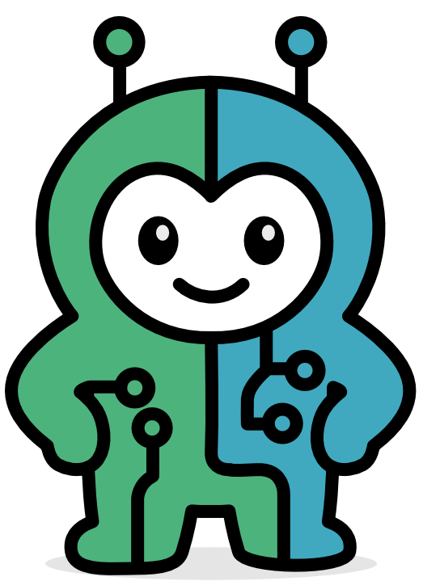

[English](README.md) | [中文简体](README.zh-cn.md) | [Español](README.es.md) | [Português](README.pt.md) | [日本語](README.ja.md) | **Deutsch**

[](https://github.com/thirdkeyai/symbiont/actions)
[](https://crates.io/crates/symbi)
[](LICENSE)
[](https://docs.symbiont.dev)

---

## 🚀 Was ist Symbiont?

**Symbi** ist ein **Rust-natives, Zero-Trust-Agenten-Framework** für den Aufbau autonomer, richtlinienbewusster KI-Agenten.
Es behebt die größten Schwächen bestehender Frameworks wie LangChain und AutoGPT durch den Fokus auf:

* **Security-First**: kryptografische Audit-Trails, durchgesetzte Richtlinien und Sandboxing.
* **Zero Trust**: alle Eingaben werden standardmäßig als nicht vertrauenswürdig behandelt.
* **Enterprise-Grade Compliance**: entwickelt für regulierte Branchen (HIPAA, SOC2, Finanzwesen).

Symbiont-Agenten arbeiten sicher mit Menschen, Tools und LLMs zusammen — ohne Sicherheit oder Performance zu opfern.

---

## ⚡ Warum Symbiont?

| Feature       | Symbiont                            | LangChain      | AutoGPT   |
| ------------- | ----------------------------------- | -------------- | --------- |
| Sprache       | Rust (Sicherheit, Performance)     | Python         | Python    |
| Sicherheit    | Zero-Trust, kryptografische Audits | Minimal        | Keine     |
| Policy Engine | Eingebaute DSL                     | Begrenzt       | Keine     |
| Deployment    | REPL, Docker, HTTP API             | Python-Scripts | CLI-Hacks |
| Audit Trails  | Kryptografische Logs               | Nein           | Nein      |

---

## 🏁 Schnellstart

### Voraussetzungen

* Docker (empfohlen) oder Rust 1.88+
* Qdrant Vektordatenbank (für semantische Suche)

### Ausführung mit vorgefertigten Containern

```bash
# Agent-DSL-Datei parsen
docker run --rm -v $(pwd):/workspace ghcr.io/thirdkeyai/symbi:latest dsl parse /workspace/agent.dsl

# MCP Server ausführen
docker run --rm -p 8080:8080 ghcr.io/thirdkeyai/symbi:latest mcp

# Interaktive Entwicklungsshell
docker run --rm -it -v $(pwd):/workspace ghcr.io/thirdkeyai/symbi:latest bash
```

### Aus Quellcode erstellen

```bash
# Dev-Umgebung erstellen
docker build -t symbi:latest .
docker run --rm -it -v $(pwd):/workspace symbi:latest bash

# Unified Binary erstellen
cargo build --release

# REPL ausführen
cargo run -- repl

# DSL parsen & MCP ausführen
cargo run -- dsl parse my_agent.dsl
cargo run -- mcp --port 8080
```

---

## 🔧 Hauptfeatures

* ✅ **DSL-Grammatik** – Agenten deklarativ mit eingebauten Sicherheitsrichtlinien definieren.
* ✅ **Agent Runtime** – Task-Scheduling, Ressourcenverwaltung und Lifecycle-Kontrolle.
* 🔒 **Sandboxing** – Tier-1 Docker-Isolation für Agenten-Ausführung.
* 🔒 **SchemaPin Security** – Kryptografische Verifikation von Tools und Schemas.
* 🔒 **Secrets Management** – HashiCorp Vault / OpenBao Integration, AES-256-GCM verschlüsselter Speicher.
* 📊 **RAG Engine** – Vektorsuche (Qdrant) mit hybrider semantischer + Keyword-Suche.
* 🧩 **MCP Integration** – Native Unterstützung für Model Context Protocol Tools.
* 📡 **Optionale HTTP API** – Feature-gesteuerte REST-Schnittstelle für externe Integration.

---

## 📐 Symbiont DSL Beispiel

```symbiont
metadata {
    version = "1.0.0"
    author = "Your Name"
    description = "Data analysis agent"
}

agent analyze_data(input: DataSet) -> Result {
    capabilities = ["data_analysis", "visualization"]
    
    policy data_privacy {
        allow: read(input) if input.anonymized == true
        deny: store(input) if input.contains_pii == true
        audit: all_operations
    }
    
    with memory = "persistent", requires = "approval" {
        if (llm_check_safety(input)) {
            result = analyze(input);
            return result;
        } else {
            return reject("Safety check failed");
        }
    }
}
```

---

## 🔒 Sicherheitsmodell

* **Zero Trust** – alle Agent-Eingaben sind standardmäßig nicht vertrauenswürdig.
* **Sandboxed Execution** – Docker-basierte Containment für Prozesse.
* **Audit Logging** – Kryptografisch manipulationssichere Logs.
* **Secrets Control** – Vault/OpenBao-Backends, verschlüsselter lokaler Speicher, Agent-Namespaces.

---

## 📚 Dokumentation

* [Erste Schritte](https://docs.symbiont.dev/getting-started)
* [DSL-Leitfaden](https://docs.symbiont.dev/dsl-guide)
* [Runtime-Architektur](https://docs.symbiont.dev/runtime-architecture)
* [Sicherheitsmodell](https://docs.symbiont.dev/security-model)
* [API-Referenz](https://docs.symbiont.dev/api-reference)

---

## 🎯 Anwendungsfälle

* **Entwicklung & Automatisierung**

  * Sichere Code-Generierung & Refactoring.
  * KI-Agent-Deployment mit durchgesetzten Richtlinien.
  * Wissensmanagement mit semantischer Suche.

* **Enterprise & Regulierte Branchen**

  * Gesundheitswesen (HIPAA-konforme Verarbeitung).
  * Finanzwesen (audit-bereite Workflows).
  * Regierung (klassifizierte Kontext-Behandlung).
  * Recht (vertrauliche Dokumentenanalyse).

---

## 📄 Lizenz

* **Community Edition**: MIT-Lizenz
* **Enterprise Edition**: Kommerzielle Lizenz erforderlich

Kontaktieren Sie [ThirdKey](https://thirdkey.ai) für Enterprise-Lizenzierung.

---

*Symbiont ermöglicht sichere Zusammenarbeit zwischen KI-Agenten und Menschen durch intelligente Richtliniendurchsetzung, kryptografische Verifikation und umfassende Audit-Trails.*


<div align="right">
  
</div>