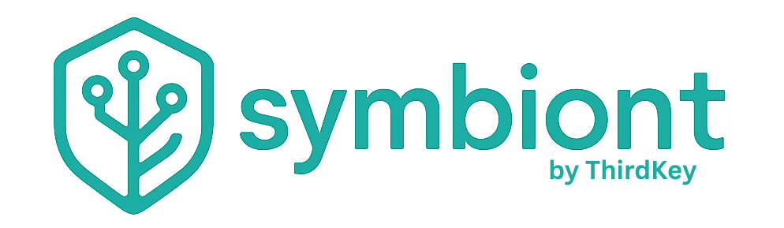
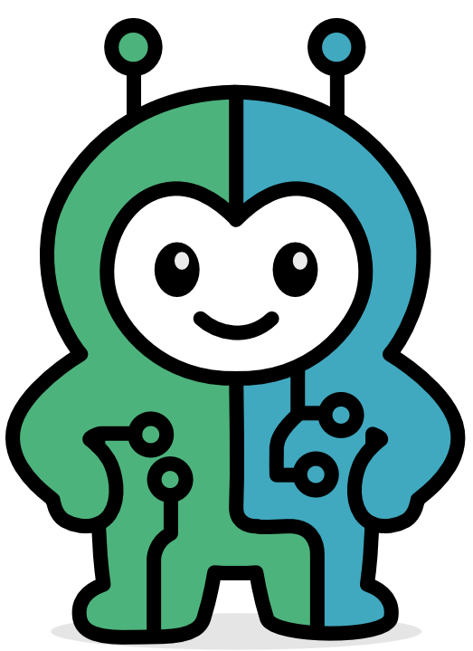

[English](README.md) | [中文简体](README.zh-cn.md) | **Español** | [Português](README.pt.md) | [日本語](README.ja.md) | [Deutsch](README.de.md)

[](https://github.com/thirdkeyai/symbiont/actions)
[](https://crates.io/crates/symbi)
[](LICENSE)
[](https://docs.symbiont.dev)

---

## 🚀 ¿Qué es Symbiont?

**Symbi** es un **framework de agentes nativo de Rust con confianza cero** para construir agentes de IA autónomos y conscientes de políticas.
Soluciona las mayores fallas de los frameworks existentes como LangChain y AutoGPT al enfocarse en:

* **Seguridad primero**: rastros de auditoría criptográficos, políticas aplicadas y sandboxing.
* **Confianza cero**: todas las entradas se tratan como no confiables por defecto.
* **Cumplimiento de nivel empresarial**: diseñado para industrias reguladas (HIPAA, SOC2, finanzas).

Los agentes Symbiont colaboran de forma segura con humanos, herramientas y LLMs — sin sacrificar seguridad o rendimiento.

---

## ⚡ ¿Por qué Symbiont?

| Característica | Symbiont                            | LangChain      | AutoGPT   |
| -------------- | ----------------------------------- | -------------- | --------- |
| Lenguaje       | Rust (seguridad, rendimiento)      | Python         | Python    |
| Seguridad      | Confianza cero, auditoría cripto    | Mínima         | Ninguna   |
| Motor Políticas| DSL integrado                       | Limitado       | Ninguno   |
| Despliegue     | REPL, Docker, HTTP API             | Scripts Python | Hacks CLI |
| Rastros Auditoría | Logs criptográficos              | No             | No        |

---

## 🏁 Inicio Rápido

### Prerrequisitos

* Docker (recomendado) o Rust 1.88+
* Base de datos vectorial Qdrant (para búsqueda semántica)

### Ejecutar con Contenedores Pre-construidos

```bash
# Parsear archivo DSL de agente
docker run --rm -v $(pwd):/workspace ghcr.io/thirdkeyai/symbi:latest dsl parse /workspace/agent.dsl

# Ejecutar MCP Server
docker run --rm -p 8080:8080 ghcr.io/thirdkeyai/symbi:latest mcp

# Shell de desarrollo interactivo
docker run --rm -it -v $(pwd):/workspace ghcr.io/thirdkeyai/symbi:latest bash
```

### Construir desde Código Fuente

```bash
# Construir entorno de desarrollo
docker build -t symbi:latest .
docker run --rm -it -v $(pwd):/workspace symbi:latest bash

# Construir binario unificado
cargo build --release

# Ejecutar REPL
cargo run -- repl

# Parsear DSL y ejecutar MCP
cargo run -- dsl parse my_agent.dsl
cargo run -- mcp --port 8080
```

---

## 🔧 Características Clave

* ✅ **Gramática DSL** – Define agentes declarativamente con políticas de seguridad integradas.
* ✅ **Runtime de Agentes** – Programación de tareas, gestión de recursos y control del ciclo de vida.
* 🔒 **Sandboxing** – Aislamiento Docker Tier-1 para ejecución de agentes.
* 🔒 **Seguridad SchemaPin** – Verificación criptográfica de herramientas y esquemas.
* 🔒 **Gestión de Secretos** – Integración HashiCorp Vault / OpenBao, almacenamiento cifrado AES-256-GCM.
* 📊 **Motor RAG** – Búsqueda vectorial (Qdrant) con recuperación híbrida semántica + palabra clave.
* 🧩 **Integración MCP** – Soporte nativo para herramientas del Protocolo de Contexto de Modelo.
* 📡 **API HTTP Opcional** – Interfaz REST controlada por características para integración externa.

---

## 📐 Ejemplo de DSL Symbiont

```symbiont
metadata {
    version = "1.0.0"
    author = "Your Name"
    description = "Data analysis agent"
}

agent analyze_data(input: DataSet) -> Result {
    capabilities = ["data_analysis", "visualization"]
    
    policy data_privacy {
        allow: read(input) if input.anonymized == true
        deny: store(input) if input.contains_pii == true
        audit: all_operations
    }
    
    with memory = "persistent", requires = "approval" {
        if (llm_check_safety(input)) {
            result = analyze(input);
            return result;
        } else {
            return reject("Safety check failed");
        }
    }
}
```

---

## 🔒 Modelo de Seguridad

* **Confianza Cero** – todas las entradas de agentes son no confiables por defecto.
* **Ejecución Sandboxed** – contención basada en Docker para procesos.
* **Registro de Auditoría** – logs criptográficamente a prueba de manipulación.
* **Control de Secretos** – backends Vault/OpenBao, almacenamiento local cifrado, namespaces de agentes.

---

## 📚 Documentación

* [Primeros Pasos](https://docs.symbiont.dev/getting-started)
* [Guía del DSL](https://docs.symbiont.dev/dsl-guide)
* [Arquitectura del Runtime](https://docs.symbiont.dev/runtime-architecture)
* [Modelo de Seguridad](https://docs.symbiont.dev/security-model)
* [Referencia de la API](https://docs.symbiont.dev/api-reference)

---

## 🎯 Casos de Uso

* **Desarrollo y Automatización**

  * Generación y refactorización segura de código.
  * Despliegue de agentes IA con políticas aplicadas.
  * Gestión de conocimiento con búsqueda semántica.

* **Empresas e Industrias Reguladas**

  * Salud (procesamiento conforme con HIPAA).
  * Finanzas (flujos de trabajo listos para auditoría).
  * Gobierno (manejo de contexto clasificado).
  * Legal (análisis confidencial de documentos).

---

## 📄 Licencia

* **Edición Community**: Licencia MIT
* **Edición Enterprise**: Licencia comercial requerida

Contacta a [ThirdKey](https://thirdkey.ai) para licenciamiento empresarial.

---

*Symbiont permite colaboración segura entre agentes IA y humanos a través de aplicación inteligente de políticas, verificación criptográfica y rastros de auditoría integrales.*


<div align="right">
  
</div>