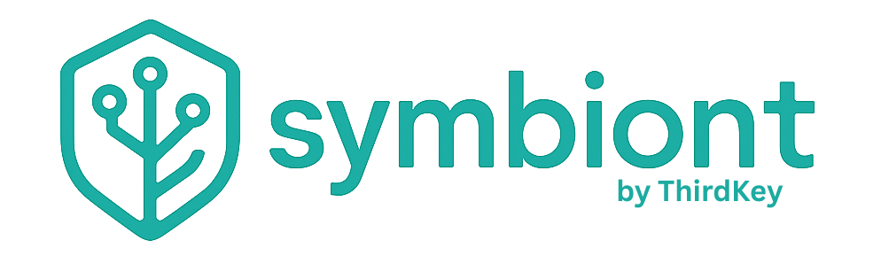

[English](README.md) | [中文简体](README.zh-cn.md) | [Español](README.es.md) | [Português](README.pt.md) | **日本語** | [Deutsch](README.de.md)

[](https://github.com/thirdkeyai/symbiont/actions)
[](https://crates.io/crates/symbi)
[](LICENSE)
[](https://docs.symbiont.dev)

---

**本番環境向けポリシー制御エージェントランタイム。**
*同じエージェント。安全なランタイム。*

Symbiont は、明示的なポリシー、アイデンティティ、監査制御の下で AI エージェントとツールを実行するための Rust ネイティブランタイムです。

多くのエージェントフレームワークはオーケストレーションに注力しています。Symbiont は、エージェントが実際のリスクを伴う実環境で動作する場面に注力しています：信頼されていないツール、機密データ、承認境界、監査要件、再現可能な適用。

---

## なぜ Symbiont か

AI エージェントはデモは簡単ですが、信頼を得るのは難しいものです。

エージェントがツールの呼び出し、ファイルへのアクセス、メッセージの送信、外部サービスの呼び出しを行えるようになると、プロンプトとグルーコードだけでは不十分です。必要なのは：

* **ポリシー適用** — エージェントに許可される操作の制御 — 組み込み DSL と [Cedar](https://www.cedarpolicy.com/) 認可
* **ツール検証** — 盲目的な信頼に頼らない実行 — [SchemaPin](https://github.com/ThirdKeyAI/SchemaPin) による MCP ツールの暗号化検証
* **ツール契約** — ツールの実行方法を規定 — [ToolClad](https://github.com/ThirdKeyAI/ToolClad) による宣言的な引数検証、スコープ強制、インジェクション防止
* **エージェントアイデンティティ** — 誰が操作しているかの把握 — [AgentPin](https://github.com/ThirdKeyAI/AgentPin) ドメイン固定 ES256 アイデンティティ
* **サンドボックス化** — リスクの高いワークロードの隔離 — リソース制限付き Docker 隔離
* **監査証跡** — 何が起こり、なぜ起こったかの記録 — 暗号化的に改ざん防止されたログ
* **承認ゲート** — 機密アクションへの対応 — ポリシーが要求する場合の実行前の人間によるレビュー

Symbiont はそのレイヤーのために構築されています。

---

## クイックスタート

### 前提条件

* Docker（推奨）または Rust 1.82+

### Docker で実行

```bash
# ランタイムを起動（API: :8080、HTTP 入力: :8081）
docker run --rm -p 8080:8080 -p 8081:8081 ghcr.io/thirdkeyai/symbi:latest up

# MCP サーバーのみ実行
docker run --rm -p 8080:8080 ghcr.io/thirdkeyai/symbi:latest mcp

# エージェント DSL ファイルを解析
docker run --rm -v $(pwd):/workspace ghcr.io/thirdkeyai/symbi:latest dsl parse /workspace/agent.dsl
```

### ソースからビルド

```bash
cargo build --release
./target/release/symbi --help

# ランタイムを実行
cargo run -- up

# インタラクティブ REPL
cargo run -- repl
```

> 本番デプロイメントの場合は、信頼されていないツール実行を有効にする前に `SECURITY.md` と[デプロイメントガイド](https://docs.symbiont.dev/getting-started)を確認してください。

---

## 仕組み

Symbiont はエージェントの意図と実行権限を分離します：

1. **エージェントが提案** — 推論ループ（Observe-Reason-Gate-Act）を通じてアクションを提案
2. **ランタイムが評価** — 各アクションをポリシー、アイデンティティ、信頼チェックに照らして評価
3. **ポリシーが決定** — 許可されたアクションは実行され、拒否されたアクションはブロックまたは承認にルーティング
4. **すべてが記録** — すべての決定に対する改ざん防止監査証跡

モデル出力が実行権限として扱われることはありません。ランタイムが実際に何が起こるかを制御します。

### 例：信頼されていないツールがポリシーによりブロックされる

エージェントが未検証の MCP ツールを呼び出そうとします。ランタイムは：

1. SchemaPin 検証ステータスを確認 — ツール署名が存在しないか無効
2. Cedar ポリシーを評価 — `forbid(action == Action::"tool_call") when { !resource.verified }`
3. 実行をブロックし、完全なコンテキストとともに拒否をログに記録
4. オプションで、手動承認のためにオペレーターにルーティング

コード変更は不要です。ポリシーが実行を制御します。

---

## DSL 例

```symbiont
agent secure_analyst(input: DataSet) -> Result {
    policy access_control {
        allow: read(input) if input.verified == true
        deny: send_email without approval
        audit: all_operations
    }

    with memory = "persistent", requires = "approval" {
        result = analyze(input);
        return result;
    }
}
```

完全な文法（`metadata`、`schedule`、`webhook`、`channel` ブロックを含む）については [DSL ガイド](https://docs.symbiont.dev/dsl-guide)を参照してください。

---

## コア機能

| 機能 | 説明 |
|-----------|-------------|
| **ポリシーエンジン** | エージェントアクション、ツール呼び出し、リソースアクセスに対するきめ細かな [Cedar](https://www.cedarpolicy.com/) 認可 |
| **ツール検証** | 実行前の MCP ツールスキーマの [SchemaPin](https://github.com/ThirdKeyAI/SchemaPin) 暗号化検証 |
| **ツール契約** | [ToolClad](https://github.com/ThirdKeyAI/ToolClad) 宣言的契約による引数検証、スコープ強制、Cedar ポリシー生成 |
| **エージェントアイデンティティ** | エージェントおよびスケジュールタスク向けの [AgentPin](https://github.com/ThirdKeyAI/AgentPin) ドメイン固定 ES256 アイデンティティ |
| **推論ループ** | ポリシーゲートとサーキットブレーカーを備えた型状態強制の Observe-Reason-Gate-Act サイクル |
| **サンドボックス化** | 信頼されていないワークロード向けのリソース制限付き Docker ベース隔離 |
| **監査ログ** | すべてのポリシー決定に対する構造化レコード付き改ざん防止ログ |
| **シークレット管理** | Vault/OpenBao 統合、AES-256-GCM 暗号化ストレージ、エージェントごとのスコープ |
| **MCP 統合** | ガバナンス付きツールアクセスを備えたネイティブ Model Context Protocol サポート |

追加機能：ツール/スキルコンテンツの脅威スキャン（40 ルール、10 攻撃カテゴリ）、Cron スケジューリング、永続エージェントメモリ、ハイブリッド RAG 検索（LanceDB/Qdrant）、Webhook 検証、配信ルーティング、OTLP テレメトリ、HTTP セキュリティ強化、[Claude Code](https://github.com/thirdkeyai/symbi-claude-code) および [Gemini CLI](https://github.com/thirdkeyai/symbi-gemini-cli) 向けガバナンスプラグイン。詳細は[完全なドキュメント](https://docs.symbiont.dev)を参照してください。

代表的なベンチマークは[ベンチマークハーネス](crates/runtime/benches/performance_claims.rs)と[閾値テスト](crates/runtime/tests/performance_claims.rs)で確認できます。

---

## セキュリティモデル

Symbiont はシンプルな原則に基づいて設計されています：**モデル出力は実行権限として信頼されるべきではない。**

アクションはランタイム制御を通過します：

* **ゼロトラスト** — すべてのエージェント入力はデフォルトで信頼されない
* **ポリシーチェック** — すべてのツール呼び出しとリソースアクセスの前に Cedar 認可
* **ツール検証** — SchemaPin によるツールスキーマの暗号化検証
* **サンドボックス境界** — 信頼されていない実行のための Docker 隔離
* **オペレーター承認** — 機密アクションに対する人間によるレビューゲート
* **シークレット制御** — Vault/OpenBao バックエンド、暗号化ローカルストレージ、エージェント名前空間
* **監査ログ** — すべての決定の暗号化的改ざん防止レコード

信頼されていないコードやリスクの高いツールを実行する場合、脆弱なローカル実行モデルだけを境界として頼るべきではありません。[`SECURITY.md`](SECURITY.md) と[セキュリティモデルドキュメント](https://docs.symbiont.dev/security-model)を参照してください。

---

## ワークスペース

| クレート | 説明 |
|-------|-------------|
| `symbi` | 統合 CLI バイナリ |
| `symbi-runtime` | コアエージェントランタイムおよび実行エンジン |
| `symbi-dsl` | DSL パーサーおよびエバリュエーター |
| `symbi-channel-adapter` | Slack/Teams/Mattermost アダプター |
| `repl-core` / `repl-proto` / `repl-cli` | インタラクティブ REPL および JSON-RPC サーバー |
| `repl-lsp` | Language Server Protocol サポート |
| `symbi-shell` | オーサリング、オーケストレーション、リモートアタッチのためのインタラクティブ TUI（Beta） |
| `symbi-a2ui` | 管理ダッシュボード（Lit/TypeScript、アルファ版） |

ガバナンスプラグイン: [`symbi-claude-code`](https://github.com/thirdkeyai/symbi-claude-code) | [`symbi-gemini-cli`](https://github.com/thirdkeyai/symbi-gemini-cli)

---

## ドキュメント

* [はじめに](https://docs.symbiont.dev/getting-started)
* [セキュリティモデル](https://docs.symbiont.dev/security-model)
* [ランタイムアーキテクチャ](https://docs.symbiont.dev/runtime-architecture)
* [推論ループガイド](https://docs.symbiont.dev/reasoning-loop)
* [DSL ガイド](https://docs.symbiont.dev/dsl-guide)
* [API リファレンス](https://docs.symbiont.dev/api-reference)

本番環境での Symbiont の導入を検討している場合は、セキュリティモデルとはじめにドキュメントから始めてください。

---

## SDK

アプリケーションから Symbiont ランタイムと連携するための公式クライアント SDK：

| 言語 | パッケージ | リポジトリ |
|------|-----------|-----------|
| **JavaScript/TypeScript** | [symbiont-sdk-js](https://www.npmjs.com/package/symbiont-sdk-js) | [GitHub](https://github.com/ThirdKeyAI/symbiont-sdk-js) |
| **Python** | [symbiont-sdk](https://pypi.org/project/symbiont-sdk/) | [GitHub](https://github.com/ThirdKeyAI/symbiont-sdk-python) |

---

## ライセンス

* **Community エディション**（Apache 2.0）：コアランタイム、DSL、ポリシーエンジン、ツール検証、サンドボックス化、エージェントメモリ、スケジューリング、MCP 統合、RAG、監査ログ、すべての CLI/REPL ツール。
* **Enterprise エディション**（商用ライセンス）：高度なサンドボックスバックエンド、コンプライアンス監査エクスポート、AI 駆動ツールレビュー、暗号化マルチエージェント協調、監視ダッシュボード、専用サポート。

エンタープライズライセンスについては [ThirdKey](https://thirdkey.ai) にお問い合わせください。

---

<div align="right">
  
</div>
