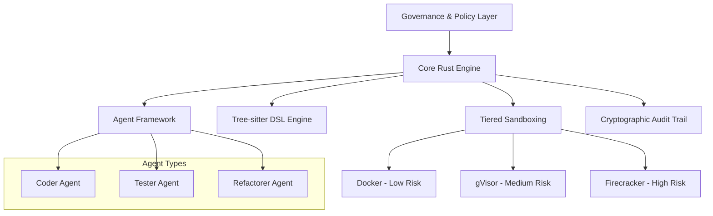

# Symbiont
*by ThirdKey*

Symbiont is a next-generation programming language and agent framework designed for AI-native, privacy-first software development. It empowers developers to build autonomous, policy-aware agents that can safely collaborate with humans, other agents, and large language models while enforcing zero-trust security, data privacy, and provable behavior through homomorphic encryption and zero-knowledge proofs.

With Symbiont, you're not just writing code — you're deploying intelligent, verifiable systems that explain, justify, and protect every decision they make.

## 🚀 Quick Start

### Prerequisites
- Docker (for containerized development)
- Rust 1.88+ (if building locally)

### Running the DSL Parser

```bash
# Build the Docker container
docker build -t symbiont-dsl:latest .

# Run the development environment
docker run --rm -it -v $(pwd):/workspace symbiont-dsl:latest bash

# Inside the container, test the DSL parser
cd dsl
cargo run

# Run the test suite
cargo test
```

## 📁 Project Structure

```
symbiont/
├── README.md                    # This file
├── SPECIFICATION.md             # Detailed technical specification
├── MVP.md                      # Minimum Viable Product definition
├── Dockerfile                  # Containerized development environment
├── dsl/                        # DSL implementation
│   ├── src/                    # Rust source code
│   │   ├── main.rs            # Main DSL parser application
│   │   └── lib.rs             # Library interface
│   ├── tests/                  # Test suite
│   │   ├── parser_tests.rs    # Comprehensive parser tests
│   │   └── samples/           # Test DSL files
│   ├── tree-sitter-symbiont/  # Tree-sitter grammar
│   │   └── grammar.js         # DSL grammar definition
│   ├── Cargo.toml            # Rust project configuration
│   └── README.md              # DSL-specific documentation
└── docs/                      # Additional documentation
```

## 🔧 Current Implementation Status

### ✅ Completed
- **DSL Grammar**: Complete Tree-sitter grammar implementing EBNF v2 specification
- **Rust Parser**: Full parser implementation with AST generation
- **Docker Environment**: Secure, reproducible development environment
- **Testing Framework**: Comprehensive test suite with 22+ tests
- **Documentation**: Technical specification and MVP definition

### 🚧 In Development
- Agent runtime system
- Policy enforcement engine
- Multi-tier sandboxing (Docker/gVisor/Firecracker)
- Cryptographic audit trail

### 📋 Roadmap
- **Phase 1** (Months 1-6): Core Rust engine and agent framework
- **Phase 2** (Months 7-12): Security and sandboxing implementation
- **Phase 3** (Months 13-18): Governance and audit integration
- **Phase 4** (Months 19+): Ecosystem development and optimization

## 📐 Symbiont DSL: Enhanced Grammar (v2)

The DSL now supports advanced features including metadata blocks, policy definitions, and cryptographic operations:

```symbiont
metadata {
    version = "1.0.0"
    author = "ThirdKey"
    description = "Health data analysis agent"
}

agent analyze_health(input: HealthData) -> Result {
    capabilities = ["data_analysis", "health_metrics"]
    
    policy medical_privacy {
        allow: read(input) if input.anonymized == true
        deny: store(input) if input.contains_pii == true
        require: approval("medical_team") for sensitive_analysis
        audit: all_operations with signature
    }
    
    with memory = "ephemeral", privacy = "medical", requires = "moderator_approval" {
        if (llm_check_safety(input)) {
            result = analyze(input);
            audit_log("analysis_completed", result.metadata);
            return result;
        } else {
            audit_log("analysis_rejected", input.risk_score);
            return reject("Safety check failed");
        }
    }
}
```

## 🏗️ Architecture Overview

Symbiont is built on a foundation of security-first principles:



### Key Components

- **Core Rust Engine**: High-performance, memory-safe foundation
- **Tree-sitter DSL**: Structured code manipulation through ASTs
- **Multi-tier Sandboxing**: Policy-driven isolation with three security levels
- **Cryptographic Audit**: Immutable trails with Ed25519 signatures
- **Agent Framework**: Autonomous, policy-aware agent orchestration

## 🔒 Security Model

Symbiont implements a zero-trust security model with multiple layers:

1. **Tier 1 (Docker)**: Low-risk operations, basic isolation
2. **Tier 2 (gVisor)**: Default development tasks, enhanced security
3. **Tier 3 (Firecracker)**: High-risk operations, maximum isolation

All operations are cryptographically signed and audited for complete transparency.

## 🧪 Testing

The project includes comprehensive testing:

```bash
# Run all tests
cd dsl && cargo test

# Run specific test categories
cargo test parser_tests
cargo test metadata_extraction
cargo test error_handling
```

Test coverage includes:
- Valid DSL syntax parsing
- Invalid syntax error handling
- Metadata extraction
- AST structure validation
- Edge cases and performance

## 📚 Documentation

- [`SPECIFICATION.md`](SPECIFICATION.md) - Complete technical specification
- [`MVP.md`](MVP.md) - Minimum Viable Product definition
- [`dsl/README.md`](dsl/README.md) - DSL-specific documentation
- [Architecting Autonomy PDF](Architecting%20Autonomy_%20A%20Strategic%20Blueprint%20for%20an%20AI-Powered%20Research%20and%20Development%20Engine.pdf) - Strategic blueprint

## 🤝 Contributing

Symbiont is currently in active development. The project follows these principles:

- **Security First**: All features must pass security review
- **Zero Trust**: Assume all inputs are potentially malicious
- **Auditability**: Every operation must be traceable
- **Performance**: Rust-native performance for production workloads

## 🎯 Use Cases

### Enterprise Development
- Secure code generation for regulated industries
- Automated testing and refactoring with audit trails
- Policy-compliant AI agent deployment

### Research & Development
- Autonomous software development experiments
- Multi-agent collaboration studies
- Cryptographic verification research

### Privacy-Critical Applications
- Healthcare data processing
- Financial services automation
- Government and defense systems

## 📄 License

This project is proprietary software developed by ThirdKey. All rights reserved.

## 🔗 Links

- [ThirdKey Website](https://thirdkey.ai)
- [Technical Specification](SPECIFICATION.md)
- [MVP Definition](MVP.md)

---

*Symbiont represents the next evolution in software development — where AI agents and human developers collaborate securely, transparently, and effectively.*
