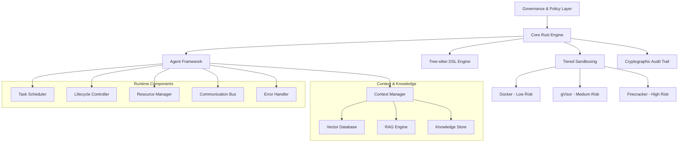
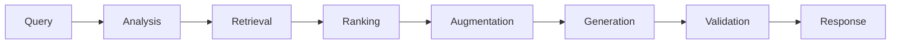

# Symbiont
*by ThirdKey*

Symbiont is a next-generation programming language and agent framework designed for AI-native, privacy-first software development. It empowers developers to build autonomous, policy-aware agents that can safely collaborate with humans, other agents, and large language models while enforcing zero-trust security, data privacy, and provable behavior through homomorphic encryption and zero-knowledge proofs.

With Symbiont, you're not just writing code — you're deploying intelligent, verifiable systems that explain, justify, and protect every decision they make.

## 🚀 Quick Start

### Prerequisites
- Docker (for containerized development)
- Rust 1.88+ (if building locally)

### Running the Complete System

```bash
# Build the Docker container
docker build -t symbiont:latest .

# Run the development environment
docker run --rm -it -v $(pwd):/workspace symbiont:latest bash

# Test the DSL parser
cd dsl && cargo run && cargo test

# Test the runtime system
cd ../runtime && cargo test

# Run example agents
cargo run --example basic_agent
cargo run --example full_system
```

## 📁 Project Structure

```
symbiont/
├── README.md                           # This file
├── SPECIFICATION.md                    # Detailed technical specification
├── CONTEXT_KNOWLEDGE_SYSTEMS_DESIGN.md # Context & knowledge systems design
├── DESIGN_AGENT_RUNTIME.md            # Runtime system design
├── MVP.md                             # Minimum Viable Product definition
├── Dockerfile                         # Containerized development environment
├── dsl/                               # DSL implementation
│   ├── src/                           # Rust source code
│   │   ├── main.rs                   # Main DSL parser application
│   │   └── lib.rs                    # Library interface
│   ├── tests/                         # Test suite
│   │   ├── parser_tests.rs           # Comprehensive parser tests
│   │   └── samples/                  # Test DSL files
│   ├── tree-sitter-symbiont/         # Tree-sitter grammar
│   │   └── grammar.js                # DSL grammar definition
│   ├── Cargo.toml                   # Rust project configuration
│   └── README.md                     # DSL-specific documentation
└── runtime/                          # Agent Runtime System
    ├── src/                          # Runtime source code
    │   ├── lib.rs                   # Main library interface
    │   ├── scheduler/               # Task scheduling and load balancing
    │   ├── lifecycle/               # Agent lifecycle management
    │   ├── resource/                # Resource allocation and monitoring
    │   ├── communication/           # Inter-agent messaging
    │   ├── error_handler/           # Error recovery and circuit breakers
    │   ├── context/                 # Context and memory management
    │   ├── rag/                     # RAG engine implementation
    │   ├── integrations/            # External system integrations
    │   └── types/                   # Core type definitions
    ├── examples/                     # Usage examples
    ├── tests/                        # Integration tests
    ├── API_REFERENCE.md             # Complete API documentation
    ├── Cargo.toml                   # Runtime project configuration
    └── README.md                    # Runtime-specific documentation
```

## 🔧 Current Implementation Status

### ✅ Phase 1-3: Core Infrastructure (COMPLETED)
- **DSL Grammar**: Complete Tree-sitter grammar implementing EBNF v2 specification
- **Rust Parser**: Full parser implementation with AST generation
- **Agent Runtime System**: Complete runtime with all core components
- **Task Scheduling**: Priority-based scheduling with load balancing
- **Resource Management**: Memory, CPU, disk I/O, and network bandwidth allocation
- **Communication Bus**: Encrypted inter-agent messaging with Ed25519 signatures
- **Error Handling**: Circuit breakers, retry strategies, and automatic recovery
- **Security Integration**: Multi-tier sandboxing hooks and policy enforcement
- **Audit Trail**: Cryptographic audit logging for compliance
- **Docker Environment**: Secure, reproducible development environment
- **Testing Framework**: Comprehensive test suite with 100+ tests
- **API Documentation**: Complete API reference with examples

### 🚧 Phase 4: Context & Knowledge Systems (IN PROGRESS)
- **Agent Context Manager**: Hierarchical memory management (short-term, long-term, working, episodic)
- **Vector Database Integration**: Qdrant (primary) and ChromaDB (secondary) support
- **RAG Engine**: Multi-stage retrieval-augmented generation pipeline
- **Knowledge Sharing**: Secure cross-agent knowledge exchange
- **Semantic Search**: Vector-based similarity search across memory and knowledge
- **Embedding Service**: Text-to-vector conversion with multiple model support

### 📋 Phase 5-6: Advanced Features (PLANNED)
- **MCP Integration**: Model Context Protocol for external tool access
- **Multi-modal RAG**: Support for images, audio, and structured data
- **Advanced Intelligence**: Cross-agent knowledge synthesis and adaptive learning
- **Governance Integration**: Complete policy and audit system integration

## 📐 Symbiont DSL: Enhanced Grammar (v2)

The DSL supports advanced features including metadata blocks, policy definitions, and cryptographic operations:

```symbiont
metadata {
    version = "1.0.0"
    author = "ThirdKey"
    description = "Health data analysis agent"
}

agent analyze_health(input: HealthData) -> Result {
    capabilities = ["data_analysis", "health_metrics"]
    
    policy medical_privacy {
        allow: read(input) if input.anonymized == true
        deny: store(input) if input.contains_pii == true
        require: approval("medical_team") for sensitive_analysis
        audit: all_operations with signature
    }
    
    with memory = "persistent", privacy = "medical", requires = "moderator_approval" {
        if (llm_check_safety(input)) {
            result = analyze(input);
            audit_log("analysis_completed", result.metadata);
            return result;
        } else {
            audit_log("analysis_rejected", input.risk_score);
            return reject("Safety check failed");
        }
    }
}
```

## 🏗️ Architecture Overview

Symbiont is built on a foundation of security-first principles with intelligent context management:



### Key Components

- **Core Rust Engine**: High-performance, memory-safe foundation
- **Tree-sitter DSL**: Structured code manipulation through ASTs
- **Multi-tier Sandboxing**: Policy-driven isolation with three security levels
- **Cryptographic Audit**: Immutable trails with Ed25519 signatures
- **Agent Framework**: Autonomous, policy-aware agent orchestration
- **Context Manager**: Hierarchical memory and knowledge management
- **RAG Engine**: Retrieval-augmented generation for intelligent responses
- **Vector Database**: Semantic search and embedding storage

## 🧠 Context & Knowledge Systems

### Hierarchical Memory Architecture

Symbiont implements a sophisticated memory system with multiple layers:

- **Short-term Memory**: Recent interactions and immediate context
- **Long-term Memory**: Persistent knowledge and learned patterns
- **Working Memory**: Active processing and temporary state
- **Episodic Memory**: Structured experiences and outcomes
- **Semantic Memory**: Factual knowledge and relationships

### RAG Engine Pipeline



### Knowledge Sharing

Agents can securely share knowledge across security tiers with:
- **Trust Scoring**: Confidence-based knowledge validation
- **Access Control**: Policy-driven sharing permissions
- **Audit Trails**: Complete tracking of knowledge exchange
- **Encryption**: Secure knowledge transmission

## 🔒 Security Model

Symbiont implements a zero-trust security model with multiple layers:

1. **Tier 1 (Docker)**: Low-risk operations, basic isolation
2. **Tier 2 (gVisor)**: Default development tasks, enhanced security
3. **Tier 3 (Firecracker)**: High-risk operations, maximum isolation

All operations are cryptographically signed and audited for complete transparency.

## ⚡ Performance Metrics

### Runtime Performance
- **Agent Creation**: ~1ms per agent
- **Message Throughput**: 10,000+ messages/second
- **Resource Allocation**: ~100μs per allocation
- **State Transitions**: ~50μs per transition

### Context & Knowledge Performance
- **Context Retrieval**: <100ms (P95)
- **Vector Search**: <50ms (P95)
- **RAG Pipeline**: <500ms end-to-end
- **Concurrent Operations**: 10,000+ ops/second
- **Knowledge Base**: 1M+ embeddings per agent

### Memory Usage
- **Base Runtime**: ~10MB
- **Per Agent**: ~1-5MB (depending on configuration)
- **Context Manager**: ~256MB per agent (peak)
- **Vector Database**: Configurable with compression

## 🧪 Testing

The project includes comprehensive testing across all components:

```bash
# Run all tests
cargo test

# Run specific test suites
cd dsl && cargo test          # DSL parser tests
cd runtime && cargo test     # Runtime system tests

# Run integration tests
cargo test --test integration_tests

# Run performance benchmarks
cargo bench
```

Test coverage includes:
- **DSL**: Valid/invalid syntax parsing, metadata extraction, AST validation
- **Runtime**: All core components with unit and integration tests
- **Context**: Memory operations, knowledge sharing, semantic search
- **RAG**: Query processing, document retrieval, response generation
- **Security**: Policy enforcement, access control, audit logging
- **Performance**: Load testing, stress testing, memory profiling

## 📚 Documentation

- [`SPECIFICATION.md`](SPECIFICATION.md) - Complete technical specification
- [`CONTEXT_KNOWLEDGE_SYSTEMS_DESIGN.md`](CONTEXT_KNOWLEDGE_SYSTEMS_DESIGN.md) - Context & knowledge systems design
- [`DESIGN_AGENT_RUNTIME.md`](DESIGN_AGENT_RUNTIME.md) - Runtime system architecture
- [`MVP.md`](MVP.md) - Minimum Viable Product definition
- [`runtime/README.md`](runtime/README.md) - Runtime-specific documentation
- [`runtime/API_REFERENCE.md`](runtime/API_REFERENCE.md) - Complete API reference
- [`dsl/README.md`](dsl/README.md) - DSL-specific documentation
- [Architecting Autonomy PDF](Architecting%20Autonomy_%20A%20Strategic%20Blueprint%20for%20an%20AI-Powered%20Research%20and%20Development%20Engine.pdf) - Strategic blueprint

## 🤝 Contributing

Symbiont is currently in active development. The project follows these principles:

- **Security First**: All features must pass security review
- **Zero Trust**: Assume all inputs are potentially malicious
- **Auditability**: Every operation must be traceable
- **Performance**: Rust-native performance for production workloads
- **Documentation**: Comprehensive documentation for all features

## 🎯 Use Cases

### Enterprise Development
- Secure code generation for regulated industries
- Automated testing and refactoring with audit trails
- Policy-compliant AI agent deployment
- Knowledge management across development teams

### Research & Development
- Autonomous software development experiments
- Multi-agent collaboration studies
- Cryptographic verification research
- Context-aware AI system development

### Privacy-Critical Applications
- Healthcare data processing with HIPAA compliance
- Financial services automation with audit requirements
- Government and defense systems with security clearances
- Legal document analysis with confidentiality protection

## 📈 Roadmap

### ✅ Phase 1-3: Foundation (COMPLETED)
- Core Rust engine and agent framework
- Security and sandboxing implementation
- Governance and audit integration
- Complete runtime system with all core components

### 🚧 Phase 4: Context & Knowledge (IN PROGRESS)
- Agent Context Manager with hierarchical memory
- Vector Database integration (Qdrant/ChromaDB)
- RAG Engine with multi-stage pipeline
- Knowledge sharing and semantic search

### 📋 Phase 5: MCP Integration (PLANNED)
- Model Context Protocol implementation
- External tool discovery and invocation
- Resource access management
- Security policy integration for external services

### 🔮 Phase 6: Advanced Intelligence (PLANNED)
- Multi-modal RAG support (images, audio, structured data)
- Cross-agent knowledge synthesis
- Intelligent context management
- Adaptive learning capabilities
- Federated learning across agent populations

## 📄 License

This project is proprietary software developed by ThirdKey. All rights reserved.

## 🔗 Links

- [ThirdKey Website](https://thirdkey.ai)
- [Technical Specification](SPECIFICATION.md)
- [Runtime API Reference](runtime/API_REFERENCE.md)
- [Context Systems Design](CONTEXT_KNOWLEDGE_SYSTEMS_DESIGN.md)

---

*Symbiont represents the next evolution in software development — where AI agents and human developers collaborate securely, transparently, and effectively with intelligent context awareness and knowledge sharing capabilities.*
