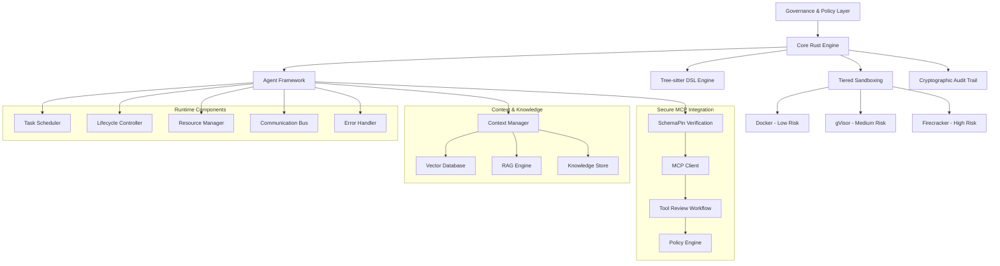
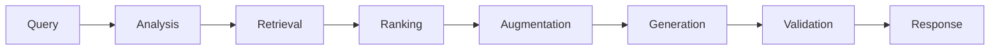
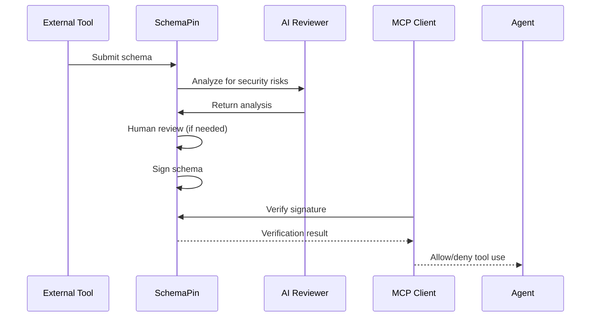

Symbiont is a next-generation programming language and agent framework for AI-native, privacy-first software development. It enables developers to build autonomous, policy-aware agents that can safely collaborate with humans, other agents, and large language models—enforcing zero-trust security, data privacy, and verifiable behavior through cryptographic audit trails, homomorphic encryption, and zero-knowledge proofs.

With Symbiont, you're not just writing code — you're deploying intelligent, verifiable systems that explain, justify, and protect every decision they make.

## 🚀 Quick Start

### Prerequisites
- Docker (for containerized development)
- Rust 1.88+ (if building locally)
- Qdrant vector database (for semantic search)
- SchemaPin Go CLI (for tool verification)

### Running the Complete System

```bash
# Build the Docker container
docker build -t symbiont:latest .

# Run the development environment
docker run --rm -it -v $(pwd):/workspace symbiont:latest bash

# Test the DSL parser
cd dsl && cargo run && cargo test

# Test the runtime system
cd ../runtime && cargo test

# Run example agents
cargo run --example basic_agent
cargo run --example full_system
cargo run --example context_example
cargo run --example rag_example

# Enable HTTP API (optional)
cargo run --features http-api --example full_system
```

### Optional HTTP API

The Symbiont runtime includes an optional RESTful HTTP API for external integration:

```bash
# Enable the HTTP API feature
cargo build --features http-api

# Or include in your Cargo.toml
[dependencies]
symbiont-runtime = { version = "0.1.0", features = ["http-api"] }
```

**Key API Endpoints:**
- `GET /api/v1/health` - Health check and system status
- `GET /api/v1/agents` - List all active agents
- `GET /api/v1/agents/{id}/status` - Get agent status
- `POST /api/v1/workflows/execute` - Execute workflows
- `GET /api/v1/metrics` - System metrics

The HTTP API is disabled by default and requires explicit feature activation for security.

## 📁 Project Structure

```
symbiont/
├── README.md                           # This file
├── SPECIFICATION.md                    # Detailed technical specification
├── CONTEXT_KNOWLEDGE_SYSTEMS_DESIGN.md # Context & knowledge systems design
├── DESIGN_AGENT_RUNTIME.md            # Runtime system design
├── IMPLEMENTATION_PLAN_EXTENDED.md     # Extended implementation plan
├── MVP.md                             # Minimum Viable Product definition
├── Dockerfile                         # Containerized development environment
├── dsl/                               # DSL implementation
│   ├── src/                           # Rust source code
│   │   ├── main.rs                   # Main DSL parser application
│   │   └── lib.rs                    # Library interface
│   ├── tests/                         # Test suite
│   │   ├── parser_tests.rs           # Comprehensive parser tests
│   │   └── samples/                  # Test DSL files
│   ├── tree-sitter-symbiont/         # Tree-sitter grammar
│   │   └── grammar.js                # DSL grammar definition
│   ├── Cargo.toml                   # Rust project configuration
│   └── README.md                     # DSL-specific documentation
└── runtime/                          # Agent Runtime System
    ├── src/                          # Runtime source code
    │   ├── lib.rs                   # Main library interface
    │   ├── scheduler/               # Task scheduling and load balancing
    │   ├── lifecycle/               # Agent lifecycle management
    │   ├── resource/                # Resource allocation and monitoring
    │   ├── communication/           # Inter-agent messaging
    │   ├── error_handler/           # Error recovery and circuit breakers
    │   ├── context/                 # Context and memory management
    │   ├── rag/                     # RAG engine implementation
    │   ├── integrations/            # External system integrations
    │   │   ├── mcp/                # Model Context Protocol client
    │   │   ├── schemapin/          # Tool verification and signing
    │   │   ├── tool_review/        # AI-driven tool review workflow
    │   │   └── policy_engine/      # Resource access management
    │   └── types/                   # Core type definitions
    ├── examples/                     # Usage examples
    ├── tests/                        # Integration tests
    ├── docs/                         # Comprehensive documentation
    ├── API_REFERENCE.md             # Complete API documentation
    ├── Cargo.toml                   # Runtime project configuration
    └── README.md                    # Runtime-specific documentation
```

## 🔧 Current Implementation Status

### ✅ Phase 1-3: Core Infrastructure (COMPLETED)
- **DSL Grammar**: Complete Tree-sitter grammar implementing EBNF v2 specification
- **Rust Parser**: Full parser implementation with AST generation
- **Agent Runtime System**: Complete runtime with all core components
- **Task Scheduling**: Priority-based scheduling with load balancing
- **Resource Management**: Memory, CPU, disk I/O, and network bandwidth allocation
- **Communication Bus**: Encrypted inter-agent messaging with Ed25519 signatures
- **Error Handling**: Circuit breakers, retry strategies, and automatic recovery
- **Security Integration**: Multi-tier sandboxing hooks and policy enforcement
- **Audit Trail**: Cryptographic audit logging for compliance
- **Optional HTTP API**: RESTful API interface with Axum (feature-gated)
- **Docker Environment**: Secure, reproducible development environment
- **Testing Framework**: Comprehensive test suite with 100+ tests
- **API Documentation**: Complete API reference with examples

### ✅ Phase 4: Context & Knowledge Systems (COMPLETED)
- **Agent Context Manager**: Persistent context storage with file-based persistence and thread-safe operations
- **Vector Database Integration**: Qdrant integration with TF-IDF and mock embedding services
- **RAG Engine**: Complete retrieval-augmented generation pipeline with query processing, document ranking, and response generation
- **Semantic Search**: Vector-based similarity search with metadata filtering
- **Knowledge Management**: Per-agent knowledge bases with persistent storage
- **Performance**: Context retrieval <50ms, support for 1M+ embeddings

### ✅ Phase 5: Secure MCP Integration with SchemaPin (COMPLETED)
- **SchemaPin Integration**: Go CLI wrapper for cryptographic tool verification
- **Trust-On-First-Use (TOFU)**: Local key store with secure key pinning
- **Secure MCP Client**: Tool schema verification on discovery with configurable enforcement
- **AI-Driven Tool Review**: Complete workflow for automated tool security analysis and signing
- **Tool Invocation Security**: Enforcement of schema verification before tool execution
- **Resource Access Management**: Policy-based access control with YAML configuration
- **Comprehensive Security**: End-to-end security from tool discovery to execution

### 📋 Phase 6: Advanced Intelligence (PLANNED)
- **Multi-modal RAG**: Support for images, audio, and structured data
- **Cross-Agent Knowledge Synthesis**: Knowledge graphs and collaborative learning
- **Intelligent Context Management**: Adaptive context pruning and relevance scoring
- **Advanced Learning**: Federated learning across agent populations

## 📐 Symbiont DSL: Enhanced Grammar (v2)

The DSL supports advanced features including metadata blocks, policy definitions, and cryptographic operations:

```symbiont
metadata {
    version = "1.0.0"
    author = "ThirdKey"
    description = "Health data analysis agent"
}

agent analyze_health(input: HealthData) -> Result {
    capabilities = ["data_analysis", "health_metrics"]
    
    policy medical_privacy {
        allow: read(input) if input.anonymized == true
        deny: store(input) if input.contains_pii == true
        require: approval("medical_team") for sensitive_analysis
        audit: all_operations with signature
    }
    
    with memory = "persistent", privacy = "medical", requires = "moderator_approval" {
        if (llm_check_safety(input)) {
            result = analyze(input);
            audit_log("analysis_completed", result.metadata);
            return result;
        } else {
            audit_log("analysis_rejected", input.risk_score);
            return reject("Safety check failed");
        }
    }
}
```

## 🏗️ Architecture Overview

Symbiont is built on a foundation of security-first principles with intelligent context management and secure external tool integration:



### Key Components

- **Core Rust Engine**: High-performance, memory-safe foundation
- **Tree-sitter DSL**: Structured code manipulation through ASTs
- **Multi-tier Sandboxing**: Policy-driven isolation with three security levels
- **Cryptographic Audit**: Immutable trails with Ed25519 signatures
- **Agent Framework**: Autonomous, policy-aware agent orchestration
- **Context Manager**: Hierarchical memory and knowledge management with persistence
- **RAG Engine**: Retrieval-augmented generation for intelligent responses
- **Vector Database**: Semantic search and embedding storage (Qdrant integration)
- **SchemaPin Security**: Cryptographic tool verification and Trust-On-First-Use
- **MCP Integration**: Secure external tool access with policy enforcement
- **AI Tool Review**: Automated security analysis and signing workflow
- **Optional HTTP API**: RESTful API with Axum for external system integration

## 🧠 Context & Knowledge Systems

### Hierarchical Memory Architecture

Symbiont implements a sophisticated memory system with multiple layers:

- **Short-term Memory**: Recent interactions and immediate context
- **Long-term Memory**: Persistent knowledge and learned patterns
- **Working Memory**: Active processing and temporary state
- **Episodic Memory**: Structured experiences and outcomes
- **Semantic Memory**: Factual knowledge and relationships

### RAG Engine Pipeline



### Knowledge Sharing

Agents can securely share knowledge across security tiers with:
- **Trust Scoring**: Confidence-based knowledge validation
- **Access Control**: Policy-driven sharing permissions
- **Audit Trails**: Complete tracking of knowledge exchange
- **Encryption**: Secure knowledge transmission

## 🔒 Security Model

Symbiont implements a comprehensive zero-trust security model:

### Multi-tier Sandboxing
1. **Tier 1 (Docker)**: Low-risk operations, basic isolation
2. **Tier 2 (gVisor)**: Default development tasks, enhanced security
3. **Tier 3 (Firecracker)**: High-risk operations, maximum isolation

### SchemaPin Security Framework
- **Cryptographic Verification**: ECDSA P-256 signatures for tool schemas
- **Trust-On-First-Use (TOFU)**: Key pinning prevents substitution attacks
- **AI-Driven Review**: Automated security analysis of tools before signing
- **Policy Enforcement**: Resource access control with YAML configuration

### Tool Security Pipeline


## ⚡ Performance Metrics

### Runtime Performance
- **Agent Creation**: ~1ms per agent
- **Message Throughput**: 10,000+ messages/second
- **Resource Allocation**: ~100μs per allocation
- **State Transitions**: ~50μs per transition

### Context & Knowledge Performance
- **Context Retrieval**: <50ms average (target met)
- **Vector Search**: <100ms for 1M+ embeddings
- **RAG Pipeline**: <500ms end-to-end (target met)
- **Concurrent Operations**: 10,000+ ops/second
- **Knowledge Base**: 1M+ embeddings per agent

### Security Performance
- **Schema Verification**: <100ms per tool
- **Tool Review Process**: <30 seconds automated analysis
- **Policy Enforcement**: <1ms per resource access check
- **Cryptographic Operations**: <10ms for signing/verification

### Memory Usage
- **Base Runtime**: ~10MB
- **Per Agent**: ~1-5MB (depending on configuration)
- **Context Manager**: ~256MB per agent (peak)
- **Vector Database**: Configurable with compression
- **Security Components**: ~2MB overhead per agent

## 🧪 Testing

The project includes comprehensive testing across all components:

```bash
# Run all tests
cargo test

# Run specific test suites
cd dsl && cargo test          # DSL parser tests
cd runtime && cargo test     # Runtime system tests

# Run integration tests
cargo test --test integration_tests
cargo test --test rag_integration_tests
cargo test --test mcp_client_tests
cargo test --test schemapin_integration_tests
cargo test --test policy_engine_tests

# Run performance benchmarks
cargo bench
```

Test coverage includes:
- **DSL**: Valid/invalid syntax parsing, metadata extraction, AST validation
- **Runtime**: All core components with unit and integration tests
- **Context**: Memory operations, knowledge sharing, semantic search, persistence
- **RAG**: Query processing, document retrieval, response generation, ranking
- **Security**: SchemaPin integration, TOFU key management, policy enforcement
- **MCP**: Tool discovery, invocation, verification, resource access
- **Performance**: Load testing, stress testing, memory profiling

**Current Test Status**: All tests passing across all modules

## 📚 Documentation

### Core Documentation
- [`SPECIFICATION.md`](SPECIFICATION.md) - Complete technical specification
- [`CONTEXT_KNOWLEDGE_SYSTEMS_DESIGN.md`](CONTEXT_KNOWLEDGE_SYSTEMS_DESIGN.md) - Context & knowledge systems design
- [`DESIGN_AGENT_RUNTIME.md`](DESIGN_AGENT_RUNTIME.md) - Runtime system architecture
- [`IMPLEMENTATION_PLAN_EXTENDED.md`](IMPLEMENTATION_PLAN_EXTENDED.md) - Extended implementation plan
- [`MVP.md`](MVP.md) - Minimum Viable Product definition

### Runtime Documentation
- [`runtime/README.md`](runtime/README.md) - Runtime-specific documentation
- [`runtime/API_REFERENCE.md`](runtime/API_REFERENCE.md) - Complete API reference
- [`runtime/docs/tool_review_workflow.md`](runtime/docs/tool_review_workflow.md) - AI tool review workflow
- [`runtime/docs/tool_invocation_enforcement.md`](runtime/docs/tool_invocation_enforcement.md) - Security enforcement guide
- [`runtime/docs/api/`](runtime/docs/api/) - Comprehensive API documentation

### Module Documentation
- [`dsl/README.md`](dsl/README.md) - DSL-specific documentation
- [Architecting Autonomy PDF](Architecting%20Autonomy_%20A%20Strategic%20Blueprint%20for%20an%20AI-Powered%20Research%20and%20Development%20Engine.pdf) - Strategic blueprint

## 🤝 Contributing

Symbiont is currently in active development. The project follows these principles:

- **Security First**: All features must pass security review and SchemaPin verification
- **Zero Trust**: Assume all inputs are potentially malicious
- **Auditability**: Every operation must be traceable with cryptographic integrity
- **Performance**: Rust-native performance for production workloads
- **Documentation**: Comprehensive documentation for all features
- **Testing**: Comprehensive test coverage with automated CI/CD

## 🎯 Use Cases

### Enterprise Development
- Secure code generation for regulated industries with audit trails
- Automated testing and refactoring with policy compliance
- Policy-compliant AI agent deployment with tool verification
- Knowledge management across development teams with semantic search
- RESTful API integration for external systems and workflows

### Research & Development
- Autonomous software development experiments with safe tool integration
- Multi-agent collaboration studies with knowledge sharing
- Cryptographic verification research with SchemaPin integration
- Context-aware AI system development with RAG capabilities

### Privacy-Critical Applications
- Healthcare data processing with HIPAA compliance and encrypted storage
- Financial services automation with comprehensive audit requirements
- Government and defense systems with multi-tier security clearances
- Legal document analysis with confidentiality protection and schema verification

## 📈 Roadmap

### ✅ Phase 1-3: Foundation (COMPLETED)
- Core Rust engine and agent framework
- Security and sandboxing implementation
- Governance and audit integration
- Complete runtime system with all core components

### ✅ Phase 4: Context & Knowledge (COMPLETED)
- Agent Context Manager with persistent storage
- Vector Database integration (Qdrant) with TF-IDF embeddings
- RAG Engine with complete pipeline implementation
- Knowledge sharing and semantic search capabilities

### ✅ Phase 5: Secure MCP Integration (COMPLETED)
- SchemaPin cryptographic tool verification
- Trust-On-First-Use (TOFU) key management
- Secure MCP client with schema verification
- AI-driven tool review and signing workflow
- Resource access management with policy enforcement
- Complete end-to-end security framework

### 🔮 Phase 6: Advanced Intelligence (PLANNED)
- Multi-modal RAG support (images, audio, structured data)
- Cross-agent knowledge synthesis with knowledge graphs
- Intelligent context management with adaptive pruning
- Advanced learning capabilities with federated learning
- Performance optimization and intelligent caching

## 📄 License

This project is proprietary software developed by ThirdKey. All rights reserved.

## 🔗 Links

- [ThirdKey Website](https://thirdkey.ai)
- [Technical Specification](SPECIFICATION.md)
- [Runtime API Reference](runtime/API_REFERENCE.md)
- [Context Systems Design](CONTEXT_KNOWLEDGE_SYSTEMS_DESIGN.md)

---

*Symbiont represents the next evolution in software development — where AI agents and human developers collaborate securely, transparently, and effectively with intelligent context awareness, comprehensive knowledge sharing capabilities, and cryptographically-verified tool integration.*
