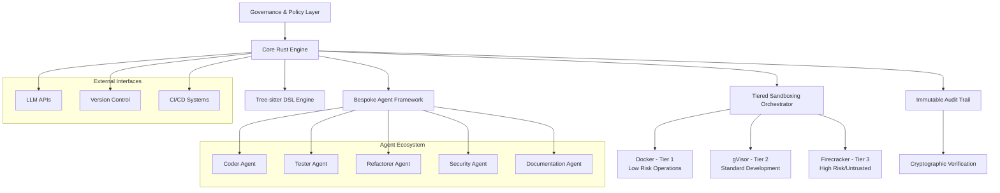
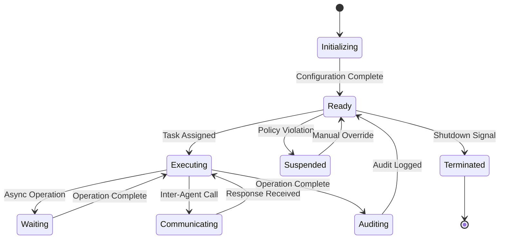
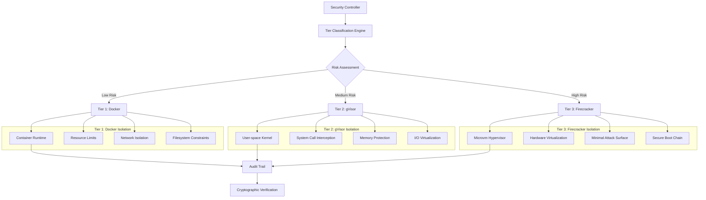
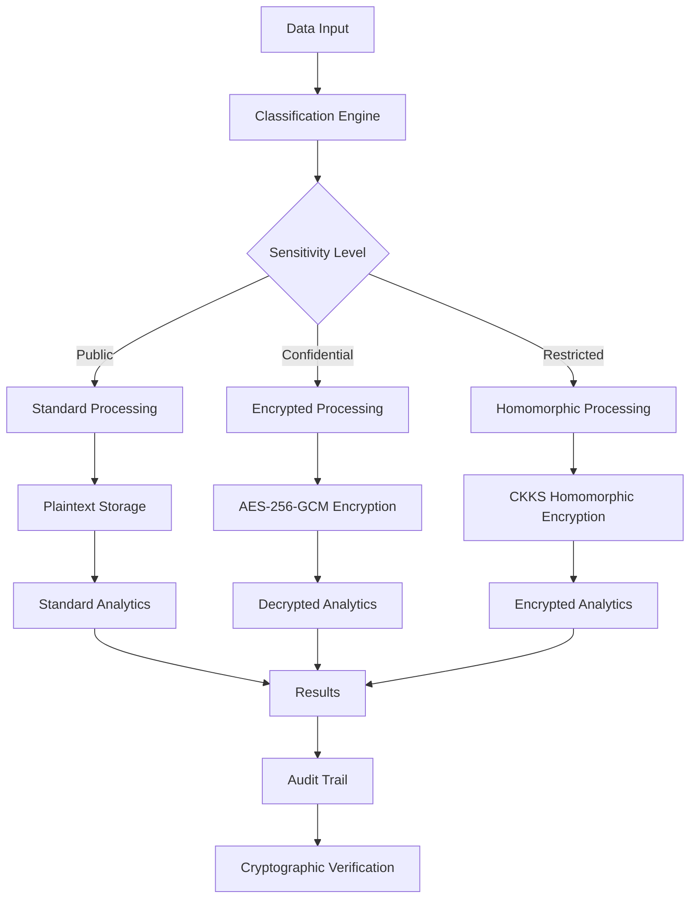
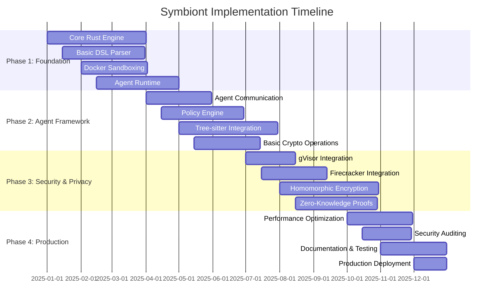

# Symbiont Technical Specification
**Version:** 1.0  
**Date:** July 2025  
**Authors:** Jascha Wanger (jascha@thirdkey.ai)

---

## Table of Contents

1. [Introduction](#introduction)
2. [Core Architecture](#core-architecture)
3. [Agent Framework](#agent-framework)
4. [Security Model](#security-model)
5. [Data Management](#data-management)
6. [DSL (Domain-Specific Language)](#dsl-domain-specific-language)
7. [Implementation Roadmap](#implementation-roadmap)

---

## 1. Introduction

### 1.1 Project Vision

Symbiont represents the next evolution in software development: an AI-native, privacy-first programming language and agent framework designed for autonomous, policy-aware software creation. The project's core mission is to enable autonomous agents that can safely collaborate with humans, other agents, and large language models while enforcing zero-trust security, data privacy, and provable behavior through advanced cryptographic techniques.

### 1.2 Strategic Goals

- **Autonomous Code Generation**: Enable agents to write, test, and refactor code independently with minimal human oversight
- **Multi-Agent Collaboration**: Facilitate swarms of specialized agents working together on complex R&D tasks
- **Security-First Design**: Implement multi-tiered sandboxing and cryptographic auditability for all operations
- **Privacy Preservation**: Ensure data privacy through homomorphic encryption and zero-knowledge proofs
- **Structured Code Manipulation**: Replace text-based code changes with precise AST operations via Tree-sitter

### 1.3 Competitive Advantages

Symbiont's architectural superiority creates a defensible moat through:

- **Performance**: Rust's native compilation vs. Python's interpreted execution
- **Security**: Multi-layered isolation with formal verification capabilities
- **Precision**: Structured code manipulation vs. error-prone text-based approaches
- **Auditability**: Transparent, cryptographically-secured operation logs
- **Sovereignty**: Custom framework avoiding "abstraction tax" of third-party solutions

---

## 2. Core Architecture

### 2.1 System Overview



### 2.2 Core Rust Engine

The foundational layer implemented in Rust provides:

#### 2.2.1 Performance Characteristics
- **Memory Safety**: Zero-cost abstractions with compile-time guarantees
- **Concurrency**: Actor-model based agent execution with Tokio async runtime
- **Throughput**: Target 10,000+ concurrent agent operations per second
- **Latency**: Sub-millisecond agent communication overhead

#### 2.2.2 Core Components
- **Agent Runtime**: Manages agent lifecycle, scheduling, and resource allocation
- **Policy Engine**: Enforces security policies and access controls
- **Communication Bus**: High-performance message passing between agents
- **Resource Manager**: Tracks and limits computational resources per agent

### 2.3 Tree-sitter DSL Engine

#### 2.3.1 AST-Based Code Manipulation
- **Parser Integration**: Tree-sitter grammars for 40+ programming languages
- **Semantic Analysis**: Type checking and dependency resolution
- **Code Generation**: Template-based code synthesis with validation
- **Refactoring Engine**: Safe, semantically-aware code transformations

#### 2.3.2 Language Support Matrix
| Language | Parser Status | Semantic Analysis | Code Generation |
|----------|---------------|-------------------|-----------------|
| Rust     | ✅ Complete   | ✅ Complete       | ✅ Complete     |
| Python   | ✅ Complete   | ✅ Complete       | ✅ Complete     |
| JavaScript| ✅ Complete  | ✅ Complete       | ✅ Complete     |
| TypeScript| ✅ Complete  | ✅ Complete       | ✅ Complete     |
| Go       | ✅ Complete   | 🔄 In Progress    | 🔄 In Progress  |
| Java     | ✅ Complete   | 🔄 In Progress    | 📋 Planned      |

---

## 3. Agent Framework

### 3.1 Agent Architecture



### 3.2 Agent Lifecycle Management

#### 3.2.1 Initialization Phase
```rust
pub struct AgentConfig {
    pub id: AgentId,
    pub capabilities: Vec<Capability>,
    pub security_tier: SecurityTier,
    pub memory_limit: usize,
    pub execution_timeout: Duration,
    pub policy_constraints: PolicySet,
}

pub enum SecurityTier {
    Tier1, // Docker isolation
    Tier2, // gVisor isolation  
    Tier3, // Firecracker isolation
}
```

#### 3.2.2 Communication Protocols

**Message Format:**
```rust
pub struct AgentMessage {
    pub id: MessageId,
    pub sender: AgentId,
    pub recipient: AgentId,
    pub message_type: MessageType,
    pub payload: Vec<u8>,
    pub signature: CryptographicSignature,
    pub timestamp: SystemTime,
}

pub enum MessageType {
    TaskRequest,
    TaskResponse,
    DataShare,
    PolicyQuery,
    AuditLog,
}
```

**Communication Patterns:**
- **Request-Response**: Synchronous task delegation
- **Publish-Subscribe**: Event-driven notifications
- **Broadcast**: System-wide announcements
- **Secure Channels**: Encrypted peer-to-peer communication

### 3.3 Policy Enforcement

#### 3.3.1 Policy Definition Language
```symbiont
policy data_access {
    allow: ["read", "analyze"]
    deny: ["export", "persist"]
    conditions: {
        data_classification: "medical",
        user_clearance: >= "level_2",
        audit_required: true
    }
}
```

#### 3.3.2 Runtime Policy Evaluation
- **Static Analysis**: Compile-time policy validation
- **Dynamic Enforcement**: Runtime access control checks
- **Policy Composition**: Hierarchical policy inheritance
- **Conflict Resolution**: Deterministic policy precedence rules

---

## 4. Security Model

### 4.1 Multi-Tiered Sandboxing Architecture



### 4.2 Cryptographic Implementation Details

#### 4.2.1 Digital Signatures
- **Algorithm**: Ed25519 (RFC 8032)
- **Key Management**: Hardware Security Module (HSM) integration
- **Signature Format**: ASN.1 DER encoding
- **Verification**: Batch verification for performance optimization

```rust
pub struct CryptographicSignature {
    pub algorithm: SignatureAlgorithm,
    pub public_key: PublicKey,
    pub signature: Vec<u8>,
    pub timestamp: SystemTime,
}

pub enum SignatureAlgorithm {
    Ed25519,
    ECDSA_P256,
    RSA_PSS_2048,
}
```

#### 4.2.2 Homomorphic Encryption
- **Scheme**: CKKS (Cheon-Kim-Kim-Song) for approximate arithmetic
- **Library**: Microsoft SEAL integration
- **Key Size**: 8192-bit polynomial modulus
- **Security Level**: 128-bit post-quantum security

#### 4.2.3 Zero-Knowledge Proofs
- **Protocol**: zk-SNARKs using Groth16 construction
- **Circuit Compiler**: Circom for constraint generation
- **Trusted Setup**: Powers of Tau ceremony for parameter generation
- **Proof Size**: 288 bytes per proof

### 4.3 Sandbox Configuration Specifications

#### 4.3.1 Tier 1: Docker Configuration
```yaml
docker_config:
  image: "symbiont/agent-runtime:latest"
  memory_limit: "512MB"
  cpu_limit: "0.5"
  network_mode: "none"
  read_only_root: true
  security_opts:
    - "no-new-privileges:true"
    - "seccomp:default"
  capabilities:
    drop: ["ALL"]
    add: ["SETUID", "SETGID"]
```

#### 4.3.2 Tier 2: gVisor Configuration
```yaml
gvisor_config:
  runtime: "runsc"
  platform: "ptrace"
  network: "none"
  file_access: "exclusive"
  overlay: true
  debug: false
  strace: false
  log_level: "warning"
```

#### 4.3.3 Tier 3: Firecracker Configuration
```json
{
  "boot-source": {
    "kernel_image_path": "/opt/symbiont/vmlinux",
    "boot_args": "console=ttyS0 reboot=k panic=1 pci=off"
  },
  "drives": [{
    "drive_id": "rootfs",
    "path_on_host": "/opt/symbiont/rootfs.ext4",
    "is_root_device": true,
    "is_read_only": true
  }],
  "machine-config": {
    "vcpu_count": 1,
    "mem_size_mib": 256,
    "ht_enabled": false
  },
  "network-interfaces": []
}
```

---

## 5. Data Management

### 5.1 Privacy-Preserving Data Architecture



### 5.2 Ephemeral Memory Management

#### 5.2.1 Memory Lifecycle
- **Allocation**: Secure memory allocation with guard pages
- **Usage**: Encrypted memory regions for sensitive data
- **Deallocation**: Cryptographic erasure with multiple overwrite passes
- **Verification**: Memory integrity checks using HMAC-SHA256

#### 5.2.2 Implementation Details
```rust
pub struct EphemeralMemory {
    pub region: MemoryRegion,
    pub encryption_key: [u8; 32],
    pub integrity_hash: [u8; 32],
    pub access_policy: AccessPolicy,
}

impl Drop for EphemeralMemory {
    fn drop(&mut self) {
        // Cryptographic erasure
        for _ in 0..3 {
            self.region.overwrite_random();
        }
        self.region.overwrite_zeros();
        self.region.deallocate();
    }
}
```

### 5.3 Homomorphic Encryption Integration

#### 5.3.1 Supported Operations
- **Arithmetic**: Addition, subtraction, multiplication
- **Comparison**: Equality, less-than, greater-than (via circuits)
- **Aggregation**: Sum, average, count
- **Machine Learning**: Linear regression, logistic regression

#### 5.3.2 Performance Characteristics
| Operation | Plaintext Time | Encrypted Time | Overhead |
|-----------|----------------|----------------|----------|
| Addition  | 1 ns          | 10 μs          | 10,000x  |
| Multiplication | 1 ns     | 50 μs          | 50,000x  |
| Comparison | 1 ns         | 1 ms           | 1,000,000x |

---

## 6. DSL (Domain-Specific Language)

### 6.1 Enhanced EBNF Grammar v2

```ebnf
Program         ::= { ImportStatement | AgentDefinition | PolicyDefinition | TypeDefinition }

ImportStatement ::= "import" ModulePath [ "as" Identifier ] ";"

AgentDefinition ::= AgentAnnotations? "agent" Identifier AgentSignature? 
                   MetadataBlock CodeBlock

AgentAnnotations ::= "@" Identifier [ "(" AnnotationArgs ")" ] { AgentAnnotations }

AgentSignature  ::= "(" [ ParameterList ] ")" [ "->" Type ]

ParameterList   ::= Parameter { "," Parameter }
Parameter       ::= Identifier ":" Type [ "=" DefaultValue ]

MetadataBlock   ::= "with" MetadataEntry { "," MetadataEntry }

MetadataEntry   ::= Identifier "=" Literal
                 | PolicyReference
                 | CryptoDirective

PolicyReference ::= "policy" "(" PolicyExpression ")"

CryptoDirective ::= "encrypt" "(" EncryptionSpec ")"
                 | "sign" "(" SignatureSpec ")"
                 | "prove" "(" ProofSpec ")"

CodeBlock       ::= "{" StatementList "}"

StatementList   ::= { Statement }

Statement       ::= "return" Expression ";"
                 | Assignment
                 | FunctionCall ";"
                 | IfStatement
                 | WhileStatement
                 | ForStatement
                 | TryStatement
                 | AgentCall
                 | CryptoOperation
                 | Block

Assignment      ::= Identifier "=" Expression ";"
                 | DestructuringAssignment

DestructuringAssignment ::= "(" IdentifierList ")" "=" Expression ";"

FunctionCall    ::= Identifier "(" [ ArgumentList ] ")"

AgentCall       ::= "agent" Identifier "." MethodName "(" [ ArgumentList ] ")"
                 | "broadcast" "(" Message ")"
                 | "subscribe" "(" EventPattern ")"

CryptoOperation ::= "encrypt" "(" Expression "," EncryptionKey ")"
                 | "decrypt" "(" Expression "," DecryptionKey ")"
                 | "sign" "(" Expression ")"
                 | "verify" "(" Expression "," Signature ")"
                 | "prove" "(" Statement ")"
                 | "verify_proof" "(" Proof ")"

ArgumentList    ::= Expression { "," Expression }

IfStatement     ::= "if" "(" Expression ")" CodeBlock [ "else" CodeBlock ]

WhileStatement  ::= "while" "(" Expression ")" CodeBlock

ForStatement    ::= "for" Identifier "in" Expression CodeBlock

TryStatement    ::= "try" CodeBlock "catch" "(" Identifier ")" CodeBlock

Block           ::= "{" StatementList "}"

Expression      ::= LogicalExpression

LogicalExpression ::= ComparisonExpression { LogicalOperator ComparisonExpression }

ComparisonExpression ::= ArithmeticExpression { ComparisonOperator ArithmeticExpression }

ArithmeticExpression ::= Term { ArithmeticOperator Term }

Term            ::= Factor { MultiplicativeOperator Factor }

Factor          ::= Identifier
                 | Literal
                 | FunctionCall
                 | AgentCall
                 | CryptoOperation
                 | "(" Expression ")"
                 | UnaryOperator Factor

Type            ::= PrimitiveType
                 | GenericType
                 | FunctionType
                 | AgentType

PrimitiveType   ::= "int" | "float" | "string" | "bool" | "bytes"

GenericType     ::= Identifier "<" TypeList ">"

FunctionType    ::= "(" [ TypeList ] ")" "->" Type

AgentType       ::= "agent" "<" Capability ">"

TypeList        ::= Type { "," Type }

PolicyDefinition ::= "policy" Identifier "{" PolicyRules "}"

PolicyRules     ::= PolicyRule { PolicyRule }

PolicyRule      ::= "allow" ":" ActionList ";"
                 | "deny" ":" ActionList ";"
                 | "require" ":" ConditionList ";"

TypeDefinition  ::= "type" Identifier "=" Type ";"
                 | "struct" Identifier "{" FieldList "}"
                 | "enum" Identifier "{" EnumVariants "}"

FieldList       ::= Field { "," Field }
Field           ::= Identifier ":" Type

EnumVariants    ::= Identifier { "," Identifier }

Literal         ::= String | Number | Boolean | Array | Object

Array           ::= "[" [ ExpressionList ] "]"

Object          ::= "{" [ ObjectFields ] "}"

ObjectFields    ::= ObjectField { "," ObjectField }

ObjectField     ::= Identifier ":" Expression

LogicalOperator ::= "&&" | "||"
ComparisonOperator ::= "==" | "!=" | "<" | ">" | "<=" | ">="
ArithmeticOperator ::= "+" | "-"
MultiplicativeOperator ::= "*" | "/" | "%"
UnaryOperator   ::= "!" | "-" | "+"

Identifier      ::= /[a-zA-Z_][a-zA-Z0-9_]*/
String          ::= "\"" { StringChar } "\""
Number          ::= /[0-9]+(\.[0-9]+)?/
Boolean         ::= "true" | "false"
```

### 6.2 Advanced Language Features

#### 6.2.1 Policy-Aware Programming
```symbiont
@secure
@audit_required
agent process_medical_data(patient_data: EncryptedHealthRecord) -> AnalysisResult {
  with policy(medical_data_policy), 
       memory = "ephemeral",
       encryption = "homomorphic",
       requires = "doctor_approval" {
    
    // Homomorphic computation on encrypted data
    let risk_score = encrypt(calculate_risk(patient_data), he_key);
    
    // Zero-knowledge proof of computation correctness
    let proof = prove(risk_score == calculate_risk(patient_data));
    
    if (verify_proof(proof)) {
        return AnalysisResult {
            score: risk_score,
            proof: proof,
            timestamp: now()
        };
    } else {
        return error("Computation verification failed");
    }
  }
}
```

#### 6.2.2 Inter-Agent Communication
```symbiont
agent code_reviewer(code: SourceCode) -> ReviewResult {
  with memory = "persistent", requires = "senior_dev_approval" {
    
    // Delegate security analysis to specialized agent
    let security_result = agent security_analyzer.analyze(code);
    
    // Broadcast code review request to team
    broadcast(CodeReviewRequest {
        code: code,
        reviewer: self.id,
        deadline: now() + 24.hours()
    });
    
    // Subscribe to review responses
    let responses = subscribe(CodeReviewResponse);
    
    return ReviewResult {
        security: security_result,
        peer_reviews: responses,
        recommendation: synthesize_reviews(responses)
    };
  }
}
```

#### 6.2.3 Cryptographic Operations
```symbiont
agent secure_aggregator(data_sources: Array<DataSource>) -> AggregateResult {
  with encryption = "homomorphic", privacy = "differential" {
    
    let encrypted_values = [];
    for source in data_sources {
        let encrypted_data = encrypt(source.get_data(), he_public_key);
        encrypted_values.push(encrypted_data);
    }
    
    // Perform homomorphic addition
    let encrypted_sum = encrypted_values.reduce((a, b) => a + b);
    
    // Add differential privacy noise
    let noisy_result = add_dp_noise(encrypted_sum, epsilon=1.0);
    
    // Generate zero-knowledge proof of correct computation
    let correctness_proof = prove(
        noisy_result == add_dp_noise(sum(data_sources), epsilon=1.0)
    );
    
    return AggregateResult {
        value: noisy_result,
        proof: correctness_proof,
        privacy_budget: epsilon
    };
  }
}
```

### 6.3 Type System Enhancements

#### 6.3.1 Security-Aware Types
```symbiont
type SecureString = string with encryption("AES-256-GCM");
type PrivateData<T> = T with privacy("differential", epsilon=1.0);
type VerifiableResult<T> = {
    value: T,
    proof: ZKProof,
    signature: DigitalSignature
};

type AgentCapability = enum {
    CodeGeneration,
    SecurityAnalysis,
    DataProcessing,
    CryptographicOperations
};
```

#### 6.3.2 Policy Types
```symbiont
policy medical_data_policy {
    allow: ["read", "analyze", "aggregate"]
    deny: ["export", "persist", "share"]
    require: [
        user_clearance >= "medical_professional",
        audit_trail = true,
        encryption = "homomorphic"
    ]
    conditions: {
        data_classification: "medical",
        retention_period: 30.days,
        geographic_restriction: "EU"
    }
}
```

---

## 7. Implementation Roadmap

### 7.1 Development Phases



### 7.2 Technical Milestones

#### 7.2.1 Phase 1: Foundational Infrastructure (Months 1-3)
**Deliverables:**
- Core Rust engine with agent runtime
- Basic DSL parser supporting v1 grammar
- Docker-based sandboxing for Tier 1 operations
- Simple agent communication protocol

**Success Criteria:**
- 1,000+ concurrent agents with <10ms latency
- DSL parsing of complex agent definitions
- Secure execution of untrusted code in Docker containers
- Basic inter-agent message passing

#### 7.2.2 Phase 2: Agent Ecosystem (Months 4-6)
**Deliverables:**
- Advanced agent communication patterns
- Policy engine with runtime enforcement
- Tree-sitter integration for code manipulation
- Basic cryptographic operations (signing, verification)

**Success Criteria:**
- Complex multi-agent workflows
- Policy violation detection and prevention
- AST-based code generation and refactoring
- Cryptographically signed agent operations

#### 7.2.3 Phase 3: Advanced Security (Months 7-9)
**Deliverables:**
- gVisor and Firecracker sandbox integration
- Homomorphic encryption for privacy-preserving computation
- Zero-knowledge proof system
- Comprehensive audit trail with cryptographic verification

**Success Criteria:**
- Multi-tiered security with automatic risk assessment
- Encrypted computation on sensitive data
- Verifiable computation proofs
- Immutable audit logs with cryptographic integrity

#### 7.2.4 Phase 4: Production Readiness (Months 10-12)
**Deliverables:**
- Performance optimization and benchmarking
- Security audit and penetration testing
- Comprehensive documentation and testing suite
- Production deployment infrastructure

**Success Criteria:**
- 10,000+ concurrent agents with <1ms latency
- Security certification for enterprise deployment
- 99.9% uptime with automated failover
- Complete developer documentation and tutorials

### 7.3 Technical Dependencies

#### 7.3.1 External Dependencies
- **Rust Ecosystem**: Tokio, Serde, Tree-sitter, Ring cryptography
- **Sandboxing**: Docker Engine, gVisor runtime, Firecracker hypervisor
- **Cryptography**: Microsoft SEAL, libsnark, OpenSSL
- **Infrastructure**: Kubernetes, Prometheus, Grafana

#### 7.3.2 Risk Mitigation
- **Performance Risks**: Early benchmarking and optimization
- **Security Risks**: Regular security audits and penetration testing
- **Integration Risks**: Comprehensive testing with external dependencies
- **Scalability Risks**: Load testing with realistic workloads

---

## Conclusion

This technical specification provides a comprehensive blueprint for implementing Symbiont as a next-generation AI-native programming platform. The architecture emphasizes security, privacy, and performance while enabling autonomous agent collaboration through a sophisticated policy-aware framework.

The multi-tiered security model, combined with advanced cryptographic techniques and structured code manipulation, positions Symbiont as a revolutionary platform for secure, verifiable, and privacy-preserving software development.

Implementation will proceed through four carefully planned phases, with each milestone building upon previous achievements to deliver a production-ready system capable of supporting enterprise-scale autonomous software development workflows.