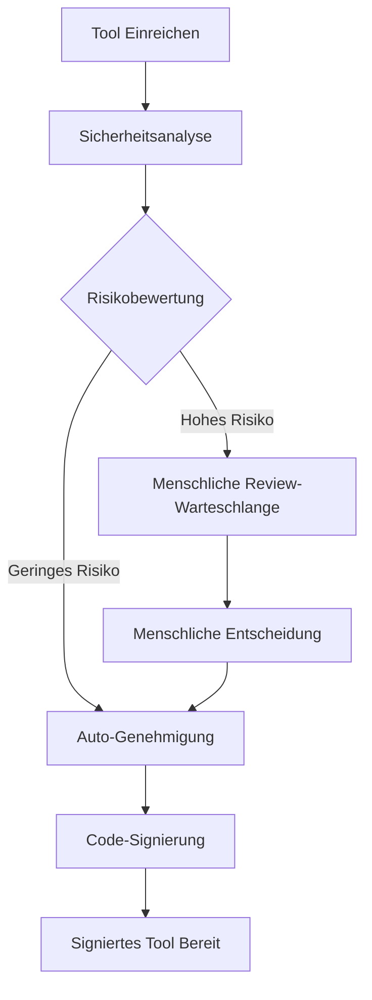

# API-Referenz

## 🌐 Andere Sprachen
{: .no_toc}

[English](api-reference.md) | [中文简体](api-reference.zh-cn.md) | [Español](api-reference.es.md) | [Português](api-reference.pt.md) | [日本語](api-reference.ja.md) | **Deutsch**

---

Dieses Dokument bietet umfassende Dokumentation für die Symbiont Runtime APIs. Das Symbiont-Projekt stellt zwei unterschiedliche API-Systeme bereit, die für verschiedene Anwendungsfälle und Entwicklungsstadien konzipiert sind.

## Überblick

Symbiont bietet zwei API-Schnittstellen:

1. **Tool Review API (Produktion)** - Eine umfassende, produktionsbereite API für KI-gesteuerte Tool-Review- und Signaturworkflows
2. **Runtime HTTP API (Entwicklungsvorschau)** - Eine sich entwickelnde API für direkte Runtime-Interaktion (derzeit unvollständig)

---

## Tool Review API (Produktion)

Die Tool Review API bietet einen vollständigen Workflow zur sicheren Überprüfung, Analyse und Signierung von MCP (Model Context Protocol) Tools unter Verwendung KI-gesteuerter Sicherheitsanalyse mit menschlichen Überwachungsfähigkeiten.

### Basis-URL
```
https://your-symbiont-instance.com/api/v1
```

### Authentifizierung
Alle Endpunkte erfordern Bearer JWT-Authentifizierung:
```
Authorization: Bearer <your-jwt-token>
```

### Kern-Workflow

Die Tool Review API folgt diesem Request/Response-Flow:



### Endpunkte

#### Review-Sitzungen

##### Tool zur Überprüfung einreichen
```http
POST /sessions
```

Reicht ein MCP-Tool zur Sicherheitsüberprüfung und -analyse ein.

**Request Body:**
```json
{
  "tool_name": "string",
  "tool_version": "string",
  "source_code": "string",
  "metadata": {
    "description": "string",
    "author": "string",
    "permissions": ["array", "of", "permissions"]
  }
}
```

**Response:**
```json
{
  "review_id": "uuid",
  "status": "submitted",
  "created_at": "2024-01-15T10:30:00Z"
}
```

##### Review-Sitzungen auflisten
```http
GET /sessions
```

Ruft eine paginierte Liste von Review-Sitzungen mit optionaler Filterung ab.

**Query-Parameter:**
- `page` (integer): Seitennummer für Paginierung
- `limit` (integer): Anzahl der Elemente pro Seite
- `status` (string): Nach Review-Status filtern
- `author` (string): Nach Tool-Autor filtern

**Response:**
```json
{
  "sessions": [
    {
      "review_id": "uuid",
      "tool_name": "string",
      "status": "string",
      "created_at": "2024-01-15T10:30:00Z",
      "updated_at": "2024-01-15T11:00:00Z"
    }
  ],
  "pagination": {
    "page": 1,
    "limit": 20,
    "total": 100,
    "has_next": true
  }
}
```

##### Review-Sitzungsdetails abrufen
```http
GET /sessions/{reviewId}
```

Ruft detaillierte Informationen über eine bestimmte Review-Sitzung ab.

**Response:**
```json
{
  "review_id": "uuid",
  "tool_name": "string",
  "tool_version": "string",
  "status": "string",
  "analysis_results": {
    "risk_score": 85,
    "findings": ["array", "of", "security", "findings"],
    "recommendations": ["array", "of", "recommendations"]
  },
  "created_at": "2024-01-15T10:30:00Z",
  "updated_at": "2024-01-15T11:00:00Z"
}
```

#### Sicherheitsanalyse

##### Analyseergebnisse abrufen
```http
GET /analysis/{analysisId}
```

Ruft detaillierte Sicherheitsanalyseergebnisse für eine bestimmte Analyse ab.

**Response:**
```json
{
  "analysis_id": "uuid",
  "review_id": "uuid",
  "risk_score": 85,
  "analysis_type": "automated",
  "findings": [
    {
      "severity": "high",
      "category": "code_injection",
      "description": "Potential code injection vulnerability detected",
      "location": "line 42",
      "recommendation": "Sanitize user input before execution"
    }
  ],
  "rag_insights": [
    {
      "knowledge_source": "security_kb",
      "relevance_score": 0.95,
      "insight": "Similar patterns found in known vulnerabilities"
    }
  ],
  "completed_at": "2024-01-15T10:45:00Z"
}
```

#### Menschlicher Review-Workflow

##### Review-Warteschlange abrufen
```http
GET /review/queue
```

Ruft Elemente ab, die auf menschliche Überprüfung warten, typischerweise hochriskante Tools, die manuelle Inspektion erfordern.

**Response:**
```json
{
  "pending_reviews": [
    {
      "review_id": "uuid",
      "tool_name": "string",
      "risk_score": 92,
      "priority": "high",
      "assigned_to": "reviewer@example.com",
      "escalated_at": "2024-01-15T11:00:00Z"
    }
  ],
  "queue_stats": {
    "total_pending": 5,
    "high_priority": 2,
    "average_wait_time": "2h 30m"
  }
}
```

##### Review-Entscheidung einreichen
```http
POST /review/{reviewId}/decision
```

Reicht die Entscheidung eines menschlichen Reviewers zu einem Tool-Review ein.

**Request Body:**
```json
{
  "decision": "approve|reject|request_changes",
  "comments": "Detailed review comments",
  "conditions": ["array", "of", "approval", "conditions"],
  "reviewer_id": "reviewer@example.com"
}
```

**Response:**
```json
{
  "review_id": "uuid",
  "decision": "approve",
  "processed_at": "2024-01-15T12:00:00Z",
  "next_status": "approved_for_signing"
}
```

#### Tool-Signierung

##### Signierungsstatus abrufen
```http
GET /signing/{reviewId}
```

Ruft den Signierungsstatus und Signaturinformationen für ein überprüftes Tool ab.

**Response:**
```json
{
  "review_id": "uuid",
  "signing_status": "completed",
  "signature_info": {
    "algorithm": "RSA-SHA256",
    "key_id": "signing-key-001",
    "signature": "base64-encoded-signature",
    "signed_at": "2024-01-15T12:30:00Z"
  },
  "certificate_chain": ["array", "of", "certificates"]
}
```

##### Signiertes Tool herunterladen
```http
GET /signing/{reviewId}/download
```

Lädt das signierte Tool-Paket mit eingebetteter Signatur und Verifizierungsmetadaten herunter.

**Response:**
Binärer Download des signierten Tool-Pakets.

#### Statistiken & Überwachung

##### Workflow-Statistiken abrufen
```http
GET /stats
```

Ruft umfassende Statistiken und Metriken zum Review-Workflow ab.

**Response:**
```json
{
  "workflow_stats": {
    "total_reviews": 1250,
    "approved": 1100,
    "rejected": 125,
    "pending": 25
  },
  "performance_metrics": {
    "average_review_time": "45m",
    "auto_approval_rate": 0.78,
    "human_review_rate": 0.22
  },
  "security_insights": {
    "common_vulnerabilities": ["sql_injection", "xss", "code_injection"],
    "risk_score_distribution": {
      "low": 45,
      "medium": 35,
      "high": 20
    }
  }
}
```

### Rate Limiting

Die Tool Review API implementiert Rate Limiting pro Endpunkt-Typ:

- **Einreichungs-Endpunkte**: 10 Anfragen pro Minute
- **Abfrage-Endpunkte**: 100 Anfragen pro Minute
- **Download-Endpunkte**: 20 Anfragen pro Minute

Rate Limit-Header sind in allen Responses enthalten:
```
X-RateLimit-Limit: 100
X-RateLimit-Remaining: 95
X-RateLimit-Reset: 1642248000
```

### Fehlerbehandlung

Die API verwendet Standard-HTTP-Statuscodes und gibt detaillierte Fehlerinformationen zurück:

```json
{
  "error": {
    "code": "INVALID_REQUEST",
    "message": "Tool source code is required",
    "details": {
      "field": "source_code",
      "reason": "missing_required_field"
    }
  }
}
```

---

## Runtime HTTP API

Die Runtime HTTP API bietet direkten Zugang zur Symbiont Runtime für Workflow-Ausführung, Agent-Management und Systemüberwachung. Alle dokumentierten Endpunkte sind vollständig implementiert und verfügbar, wenn das `http-api` Feature aktiviert ist.

### Basis-URL
```
http://127.0.0.1:8080/api/v1
```

### Verfügbare Endpunkte

#### Gesundheitsprüfung
```http
GET /api/v1/health
```

Gibt den aktuellen Systemgesundheitsstatus und grundlegende Runtime-Informationen zurück.

**Response (200 OK):**
```json
{
  "status": "healthy",
  "uptime_seconds": 3600,
  "timestamp": "2024-01-15T10:30:00Z",
  "version": "0.1.0"
}
```

**Response (500 Interner Serverfehler):**
```json
{
  "status": "unhealthy",
  "error": "Database connection failed",
  "timestamp": "2024-01-15T10:30:00Z"
}
```

### Verfügbare Endpunkte

#### Workflow-Ausführung
```http
POST /api/v1/workflows/execute
```

Führt einen Workflow mit angegebenen Parametern aus.

**Request Body:**
```json
{
  "workflow_id": "string",
  "parameters": {},
  "agent_id": "optional-agent-id"
}
```

**Response (200 OK):**
```json
{
  "result": "workflow execution result"
}
```

#### Agent-Management

##### Agenten auflisten
```http
GET /api/v1/agents
```

Ruft eine Liste aller aktiven Agenten in der Runtime ab.

**Response (200 OK):**
```json
[
  "agent-id-1",
  "agent-id-2",
  "agent-id-3"
]
```

##### Agent-Status abrufen
```http
GET /api/v1/agents/{id}/status
```

Ruft detaillierte Statusinformationen für einen bestimmten Agenten ab.

**Response (200 OK):**
```json
{
  "agent_id": "uuid",
  "state": "active|idle|busy|error",
  "last_activity": "2024-01-15T10:30:00Z",
  "resource_usage": {
    "memory_bytes": 268435456,
    "cpu_percent": 15.5,
    "active_tasks": 3
  }
}
```

#### System-Metriken
```http
GET /api/v1/metrics
```

Ruft umfassende Systemleistungsmetriken ab.

**Response (200 OK):**
```json
{
  "system": {
    "uptime_seconds": 3600,
    "memory_usage": "75%",
    "cpu_usage": "45%"
  },
  "agents": {
    "total": 5,
    "active": 3,
    "idle": 2
  }
}
```

### Server-Konfiguration

Der Runtime HTTP API-Server kann mit den folgenden Optionen konfiguriert werden:

- **Standard-Bind-Adresse**: `127.0.0.1:8080`
- **CORS-Unterstützung**: Konfigurierbar für Entwicklung
- **Request-Tracing**: Aktiviert über Tower-Middleware
- **Feature Gate**: Verfügbar hinter dem `http-api` Cargo-Feature

### Datenstrukturen

#### Kern-Typen
```rust
// Workflow-Ausführungsanfrage
WorkflowExecutionRequest {
    workflow_id: String,
    parameters: serde_json::Value,
    agent_id: Option<AgentId>
}

// Agent-Status-Response
AgentStatusResponse {
    agent_id: AgentId,
    state: AgentState,
    last_activity: DateTime<Utc>,
    resource_usage: ResourceUsage
}

// Gesundheitsprüfungs-Response
HealthResponse {
    status: String,
    uptime_seconds: u64,
    timestamp: DateTime<Utc>,
    version: String
}
```

### Runtime Provider Interface

Die API implementiert ein `RuntimeApiProvider` Trait mit den folgenden Methoden:

- `execute_workflow()` - Führt einen Workflow mit gegebenen Parametern aus
- `get_agent_status()` - Ruft Statusinformationen für einen bestimmten Agenten ab
- `get_system_health()` - Ruft den allgemeinen Systemgesundheitsstatus ab
- `list_agents()` - Listet alle aktiven Agenten in der Runtime auf
- `shutdown_agent()` - Fährt einen bestimmten Agenten ordnungsgemäß herunter
- `get_metrics()` - Ruft Systemleistungsmetriken ab

---

## Erste Schritte

### Tool Review API

1. API-Anmeldedaten von Ihrem Symbiont-Administrator erhalten
2. Tool zur Überprüfung über den `/sessions` Endpunkt einreichen
3. Review-Fortschritt über `/sessions/{reviewId}` überwachen
4. Signierte Tools von `/signing/{reviewId}/download` herunterladen

### Runtime HTTP API

1. Sicherstellen, dass die Runtime mit dem `http-api` Feature gebaut ist:
   ```bash
   cargo build --features http-api
   ```
2. Runtime-Server starten:
   ```bash
   ./target/debug/symbiont-runtime --http-api
   ```
3. Überprüfen, ob der Server läuft:
   ```bash
   curl http://127.0.0.1:8080/api/v1/health
   ```

## Support

Für API-Support und Fragen:
- Überprüfen Sie die [Runtime-Architektur-Dokumentation](runtime-architecture.md)
- Konsultieren Sie die [Sicherheitsmodell-Dokumentation](security-model.md)
- Melden Sie Probleme im GitHub-Repository des Projekts