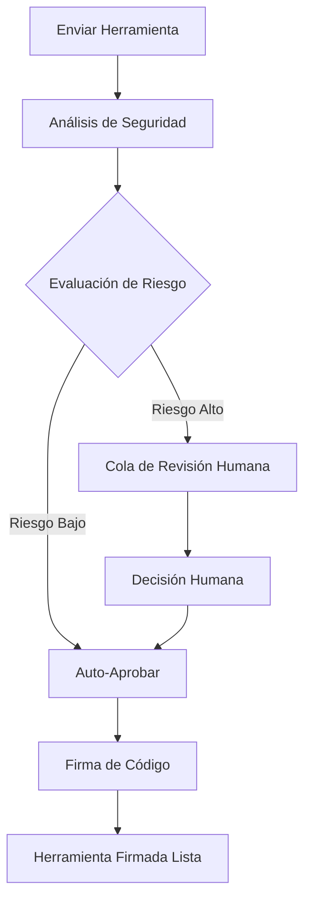

# Referencia de API

## 🌐 Otros idiomas
{: .no_toc}

[English](api-reference.md) | [中文简体](api-reference.zh-cn.md) | **Español** | [Português](api-reference.pt.md) | [日本語](api-reference.ja.md) | [Deutsch](api-reference.de.md)

---

Este documento proporciona documentación completa para las API del runtime de Symbiont. El proyecto Symbiont expone dos sistemas de API distintos diseñados para diferentes casos de uso y etapas de desarrollo.

## Descripción General

Symbiont ofrece dos interfaces de API:

1. **API de Revisión de Herramientas (Producción)** - Una API completa y lista para producción para flujos de trabajo de revisión y firma de herramientas impulsadas por IA
2. **API HTTP del Runtime (Vista Previa de Desarrollo)** - Una API en evolución para interacción directa con el runtime (actualmente incompleta)

---

## API de Revisión de Herramientas (Producción)

La API de Revisión de Herramientas proporciona un flujo de trabajo completo para revisar, analizar y firmar herramientas MCP (Protocolo de Contexto de Modelo) de forma segura utilizando análisis de seguridad impulsado por IA con capacidades de supervisión humana.

### URL Base
```
https://your-symbiont-instance.com/api/v1
```

### Autenticación
Todos los endpoints requieren autenticación JWT Bearer:
```
Authorization: Bearer <your-jwt-token>
```

### Flujo de Trabajo Principal

La API de Revisión de Herramientas sigue este flujo de solicitud/respuesta:



### Endpoints

#### Sesiones de Revisión

##### Enviar Herramienta para Revisión
```http
POST /sessions
```

Envía una herramienta MCP para revisión y análisis de seguridad.

**Cuerpo de Solicitud:**
```json
{
  "tool_name": "string",
  "tool_version": "string",
  "source_code": "string",
  "metadata": {
    "description": "string",
    "author": "string",
    "permissions": ["array", "of", "permissions"]
  }
}
```

**Respuesta:**
```json
{
  "review_id": "uuid",
  "status": "submitted",
  "created_at": "2024-01-15T10:30:00Z"
}
```

##### Listar Sesiones de Revisión
```http
GET /sessions
```

Recupera una lista paginada de sesiones de revisión con filtrado opcional.

**Parámetros de Consulta:**
- `page` (integer): Número de página para paginación
- `limit` (integer): Número de elementos por página
- `status` (string): Filtrar por estado de revisión
- `author` (string): Filtrar por autor de herramienta

**Respuesta:**
```json
{
  "sessions": [
    {
      "review_id": "uuid",
      "tool_name": "string",
      "status": "string",
      "created_at": "2024-01-15T10:30:00Z",
      "updated_at": "2024-01-15T11:00:00Z"
    }
  ],
  "pagination": {
    "page": 1,
    "limit": 20,
    "total": 100,
    "has_next": true
  }
}
```

##### Obtener Detalles de Sesión de Revisión
```http
GET /sessions/{reviewId}
```

Recupera información detallada sobre una sesión de revisión específica.

**Respuesta:**
```json
{
  "review_id": "uuid",
  "tool_name": "string",
  "tool_version": "string",
  "status": "string",
  "analysis_results": {
    "risk_score": 85,
    "findings": ["array", "of", "security", "findings"],
    "recommendations": ["array", "of", "recommendations"]
  },
  "created_at": "2024-01-15T10:30:00Z",
  "updated_at": "2024-01-15T11:00:00Z"
}
```

#### Análisis de Seguridad

##### Obtener Resultados de Análisis
```http
GET /analysis/{analysisId}
```

Recupera resultados detallados de análisis de seguridad para un análisis específico.

**Respuesta:**
```json
{
  "analysis_id": "uuid",
  "review_id": "uuid",
  "risk_score": 85,
  "analysis_type": "automated",
  "findings": [
    {
      "severity": "high",
      "category": "code_injection",
      "description": "Potential code injection vulnerability detected",
      "location": "line 42",
      "recommendation": "Sanitize user input before execution"
    }
  ],
  "rag_insights": [
    {
      "knowledge_source": "security_kb",
      "relevance_score": 0.95,
      "insight": "Similar patterns found in known vulnerabilities"
    }
  ],
  "completed_at": "2024-01-15T10:45:00Z"
}
```

#### Flujo de Trabajo de Revisión Humana

##### Obtener Cola de Revisión
```http
GET /review/queue
```

Recupera elementos pendientes de revisión humana, típicamente herramientas de alto riesgo que requieren inspección manual.

**Respuesta:**
```json
{
  "pending_reviews": [
    {
      "review_id": "uuid",
      "tool_name": "string",
      "risk_score": 92,
      "priority": "high",
      "assigned_to": "reviewer@example.com",
      "escalated_at": "2024-01-15T11:00:00Z"
    }
  ],
  "queue_stats": {
    "total_pending": 5,
    "high_priority": 2,
    "average_wait_time": "2h 30m"
  }
}
```

##### Enviar Decisión de Revisión
```http
POST /review/{reviewId}/decision
```

Envía la decisión de un revisor humano sobre una revisión de herramienta.

**Cuerpo de Solicitud:**
```json
{
  "decision": "approve|reject|request_changes",
  "comments": "Detailed review comments",
  "conditions": ["array", "of", "approval", "conditions"],
  "reviewer_id": "reviewer@example.com"
}
```

**Respuesta:**
```json
{
  "review_id": "uuid",
  "decision": "approve",
  "processed_at": "2024-01-15T12:00:00Z",
  "next_status": "approved_for_signing"
}
```

#### Firma de Herramientas

##### Obtener Estado de Firma
```http
GET /signing/{reviewId}
```

Recupera el estado de firma e información de firma para una herramienta revisada.

**Respuesta:**
```json
{
  "review_id": "uuid",
  "signing_status": "completed",
  "signature_info": {
    "algorithm": "RSA-SHA256",
    "key_id": "signing-key-001",
    "signature": "base64-encoded-signature",
    "signed_at": "2024-01-15T12:30:00Z"
  },
  "certificate_chain": ["array", "of", "certificates"]
}
```

##### Descargar Herramienta Firmada
```http
GET /signing/{reviewId}/download
```

Descarga el paquete de herramienta firmada con firma incrustada y metadatos de verificación.

**Respuesta:**
Descarga binaria del paquete de herramienta firmada.

#### Estadísticas y Monitoreo

##### Obtener Estadísticas de Flujo de Trabajo
```http
GET /stats
```

Recupera estadísticas y métricas completas sobre el flujo de trabajo de revisión.

**Respuesta:**
```json
{
  "workflow_stats": {
    "total_reviews": 1250,
    "approved": 1100,
    "rejected": 125,
    "pending": 25
  },
  "performance_metrics": {
    "average_review_time": "45m",
    "auto_approval_rate": 0.78,
    "human_review_rate": 0.22
  },
  "security_insights": {
    "common_vulnerabilities": ["sql_injection", "xss", "code_injection"],
    "risk_score_distribution": {
      "low": 45,
      "medium": 35,
      "high": 20
    }
  }
}
```

### Limitación de Velocidad

La API de Revisión de Herramientas implementa limitación de velocidad por tipo de endpoint:

- **Endpoints de envío**: 10 solicitudes por minuto
- **Endpoints de consulta**: 100 solicitudes por minuto
- **Endpoints de descarga**: 20 solicitudes por minuto

Los encabezados de límite de velocidad se incluyen en todas las respuestas:
```
X-RateLimit-Limit: 100
X-RateLimit-Remaining: 95
X-RateLimit-Reset: 1642248000
```

### Manejo de Errores

La API utiliza códigos de estado HTTP estándar y devuelve información detallada del error:

```json
{
  "error": {
    "code": "INVALID_REQUEST",
    "message": "Tool source code is required",
    "details": {
      "field": "source_code",
      "reason": "missing_required_field"
    }
  }
}
```

---

## API HTTP del Runtime

La API HTTP del Runtime proporciona acceso directo al runtime de Symbiont para ejecución de flujos de trabajo, gestión de agentes y monitoreo del sistema. Todos los endpoints documentados están completamente implementados y disponibles cuando la característica `http-api` está habilitada.

### URL Base
```
http://127.0.0.1:8080/api/v1
```

### Endpoints Disponibles

#### Verificación de Salud
```http
GET /api/v1/health
```

Devuelve el estado actual de salud del sistema e información básica del runtime.

**Respuesta (200 OK):**
```json
{
  "status": "healthy",
  "uptime_seconds": 3600,
  "timestamp": "2024-01-15T10:30:00Z",
  "version": "0.1.0"
}
```

**Respuesta (500 Error Interno del Servidor):**
```json
{
  "status": "unhealthy",
  "error": "Database connection failed",
  "timestamp": "2024-01-15T10:30:00Z"
}
```

### Endpoints Disponibles

#### Ejecución de Flujo de Trabajo
```http
POST /api/v1/workflows/execute
```

Ejecuta un flujo de trabajo con parámetros especificados.

**Cuerpo de Solicitud:**
```json
{
  "workflow_id": "string",
  "parameters": {},
  "agent_id": "optional-agent-id"
}
```

**Respuesta (200 OK):**
```json
{
  "result": "workflow execution result"
}
```

#### Gestión de Agentes

##### Listar Agentes
```http
GET /api/v1/agents
```

Recupera una lista de todos los agentes activos en el runtime.

**Respuesta (200 OK):**
```json
[
  "agent-id-1",
  "agent-id-2",
  "agent-id-3"
]
```

##### Obtener Estado del Agente
```http
GET /api/v1/agents/{id}/status
```

Obtiene información detallada del estado para un agente específico.

**Respuesta (200 OK):**
```json
{
  "agent_id": "uuid",
  "state": "active|idle|busy|error",
  "last_activity": "2024-01-15T10:30:00Z",
  "resource_usage": {
    "memory_bytes": 268435456,
    "cpu_percent": 15.5,
    "active_tasks": 3
  }
}
```

#### Métricas del Sistema
```http
GET /api/v1/metrics
```

Recupera métricas completas de rendimiento del sistema.

**Respuesta (200 OK):**
```json
{
  "system": {
    "uptime_seconds": 3600,
    "memory_usage": "75%",
    "cpu_usage": "45%"
  },
  "agents": {
    "total": 5,
    "active": 3,
    "idle": 2
  }
}
```

### Configuración del Servidor

El servidor de la API HTTP del Runtime puede configurarse con las siguientes opciones:

- **Dirección de enlace predeterminada**: `127.0.0.1:8080`
- **Soporte CORS**: Configurable para desarrollo
- **Rastreo de solicitudes**: Habilitado vía middleware Tower
- **Feature gate**: Disponible tras la característica `http-api` de Cargo

### Estructuras de Datos

#### Tipos Centrales
```rust
// Solicitud de ejecución de flujo de trabajo
WorkflowExecutionRequest {
    workflow_id: String,
    parameters: serde_json::Value,
    agent_id: Option<AgentId>
}

// Respuesta de estado del agente
AgentStatusResponse {
    agent_id: AgentId,
    state: AgentState,
    last_activity: DateTime<Utc>,
    resource_usage: ResourceUsage
}

// Respuesta de verificación de salud
HealthResponse {
    status: String,
    uptime_seconds: u64,
    timestamp: DateTime<Utc>,
    version: String
}
```

### Interfaz del Proveedor de Runtime

La API implementa un trait `RuntimeApiProvider` con los siguientes métodos:

- `execute_workflow()` - Ejecuta un flujo de trabajo con parámetros dados
- `get_agent_status()` - Recupera información de estado para un agente específico
- `get_system_health()` - Obtiene el estado general de salud del sistema
- `list_agents()` - Lista todos los agentes activos en el runtime
- `shutdown_agent()` - Apaga graciosamente un agente específico
- `get_metrics()` - Recupera métricas de rendimiento del sistema

---

## Primeros Pasos

### API de Revisión de Herramientas

1. Obtén credenciales de API de tu administrador de Symbiont
2. Envía una herramienta para revisión usando el endpoint `/sessions`
3. Monitorea el progreso de revisión vía `/sessions/{reviewId}`
4. Descarga herramientas firmadas desde `/signing/{reviewId}/download`

### API HTTP del Runtime

1. Asegúrate de que el runtime esté construido con la característica `http-api`:
   ```bash
   cargo build --features http-api
   ```
2. Inicia el servidor del runtime:
   ```bash
   ./target/debug/symbiont-runtime --http-api
   ```
3. Verifica que el servidor esté ejecutándose:
   ```bash
   curl http://127.0.0.1:8080/api/v1/health
   ```

## Soporte

Para soporte de API y preguntas:
- Revisa la [documentación de Arquitectura del Runtime](runtime-architecture.md)
- Consulta la [documentación del Modelo de Seguridad](security-model.md)
- Presenta problemas en el repositorio GitHub del proyecto