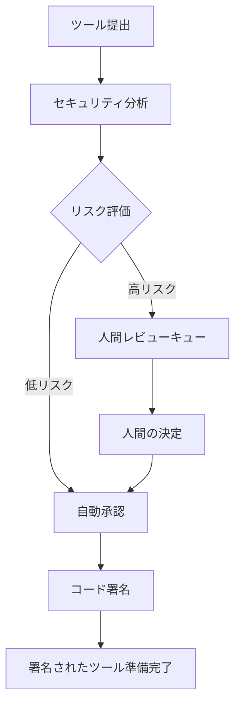

# API リファレンス

## 🌐 他の言語
{: .no_toc}

[English](api-reference.md) | [中文简体](api-reference.zh-cn.md) | [Español](api-reference.es.md) | [Português](api-reference.pt.md) | **日本語** | [Deutsch](api-reference.de.md)

---

このドキュメントは、Symbiont ランタイム API の包括的なドキュメントを提供します。Symbiont プロジェクトは、異なるユースケースと開発段階向けに設計された2つの独立した API システムを提供します。

## 概要

Symbiont は2つの API インターフェースを提供します：

1. **ツールレビューAPI（本番環境）** - AI 駆動のツールレビューと署名ワークフロー用の包括的で本番対応 API
2. **ランタイム HTTP API（開発プレビュー）** - 直接的なランタイム相互作用用の進化中 API（現在不完全）

---

## ツールレビューAPI（本番環境）

ツールレビューAPI は、AI 駆動のセキュリティ分析と人間の監視機能を使用して、MCP（モデルコンテキストプロトコル）ツールを安全にレビュー、分析、署名するための完全なワークフローを提供します。

### ベース URL
```
https://your-symbiont-instance.com/api/v1
```

### 認証
すべてのエンドポイントは Bearer JWT 認証が必要です：
```
Authorization: Bearer <your-jwt-token>
```

### コアワークフロー

ツールレビューAPI は次のリクエスト/レスポンスフローに従います：



### エンドポイント

#### レビューセッション

##### ツールをレビューに提出
```http
POST /sessions
```

MCP ツールをセキュリティレビューと分析に提出します。

**リクエストボディ：**
```json
{
  "tool_name": "string",
  "tool_version": "string",
  "source_code": "string",
  "metadata": {
    "description": "string",
    "author": "string",
    "permissions": ["array", "of", "permissions"]
  }
}
```

**レスポンス：**
```json
{
  "review_id": "uuid",
  "status": "submitted",
  "created_at": "2024-01-15T10:30:00Z"
}
```

##### レビューセッション一覧
```http
GET /sessions
```

オプションのフィルタリングでページ分割されたレビューセッションのリストを取得します。

**クエリパラメータ：**
- `page` (integer): ページ分割のページ番号
- `limit` (integer): ページあたりのアイテム数
- `status` (string): レビューステータスでフィルタ
- `author` (string): ツール作成者でフィルタ

**レスポンス：**
```json
{
  "sessions": [
    {
      "review_id": "uuid",
      "tool_name": "string",
      "status": "string",
      "created_at": "2024-01-15T10:30:00Z",
      "updated_at": "2024-01-15T11:00:00Z"
    }
  ],
  "pagination": {
    "page": 1,
    "limit": 20,
    "total": 100,
    "has_next": true
  }
}
```

##### レビューセッション詳細取得
```http
GET /sessions/{reviewId}
```

特定のレビューセッションの詳細情報を取得します。

**レスポンス：**
```json
{
  "review_id": "uuid",
  "tool_name": "string",
  "tool_version": "string",
  "status": "string",
  "analysis_results": {
    "risk_score": 85,
    "findings": ["array", "of", "security", "findings"],
    "recommendations": ["array", "of", "recommendations"]
  },
  "created_at": "2024-01-15T10:30:00Z",
  "updated_at": "2024-01-15T11:00:00Z"
}
```

#### セキュリティ分析

##### 分析結果取得
```http
GET /analysis/{analysisId}
```

特定の分析に対する詳細なセキュリティ分析結果を取得します。

**レスポンス：**
```json
{
  "analysis_id": "uuid",
  "review_id": "uuid",
  "risk_score": 85,
  "analysis_type": "automated",
  "findings": [
    {
      "severity": "high",
      "category": "code_injection",
      "description": "Potential code injection vulnerability detected",
      "location": "line 42",
      "recommendation": "Sanitize user input before execution"
    }
  ],
  "rag_insights": [
    {
      "knowledge_source": "security_kb",
      "relevance_score": 0.95,
      "insight": "Similar patterns found in known vulnerabilities"
    }
  ],
  "completed_at": "2024-01-15T10:45:00Z"
}
```

#### 人間レビューワークフロー

##### レビューキュー取得
```http
GET /review/queue
```

人間レビューが保留中のアイテムを取得します。通常、手動検査が必要な高リスクツールです。

**レスポンス：**
```json
{
  "pending_reviews": [
    {
      "review_id": "uuid",
      "tool_name": "string",
      "risk_score": 92,
      "priority": "high",
      "assigned_to": "reviewer@example.com",
      "escalated_at": "2024-01-15T11:00:00Z"
    }
  ],
  "queue_stats": {
    "total_pending": 5,
    "high_priority": 2,
    "average_wait_time": "2h 30m"
  }
}
```

##### レビュー決定提出
```http
POST /review/{reviewId}/decision
```

ツールレビューに対する人間レビュアーの決定を提出します。

**リクエストボディ：**
```json
{
  "decision": "approve|reject|request_changes",
  "comments": "Detailed review comments",
  "conditions": ["array", "of", "approval", "conditions"],
  "reviewer_id": "reviewer@example.com"
}
```

**レスポンス：**
```json
{
  "review_id": "uuid",
  "decision": "approve",
  "processed_at": "2024-01-15T12:00:00Z",
  "next_status": "approved_for_signing"
}
```

#### ツール署名

##### 署名ステータス取得
```http
GET /signing/{reviewId}
```

レビューされたツールの署名ステータスと署名情報を取得します。

**レスポンス：**
```json
{
  "review_id": "uuid",
  "signing_status": "completed",
  "signature_info": {
    "algorithm": "RSA-SHA256",
    "key_id": "signing-key-001",
    "signature": "base64-encoded-signature",
    "signed_at": "2024-01-15T12:30:00Z"
  },
  "certificate_chain": ["array", "of", "certificates"]
}
```

##### 署名されたツールダウンロード
```http
GET /signing/{reviewId}/download
```

埋め込み署名と検証メタデータを含む署名されたツールパッケージをダウンロードします。

**レスポンス：**
署名されたツールパッケージのバイナリダウンロード。

#### 統計・監視

##### ワークフロー統計取得
```http
GET /stats
```

レビューワークフローに関する包括的な統計と指標を取得します。

**レスポンス：**
```json
{
  "workflow_stats": {
    "total_reviews": 1250,
    "approved": 1100,
    "rejected": 125,
    "pending": 25
  },
  "performance_metrics": {
    "average_review_time": "45m",
    "auto_approval_rate": 0.78,
    "human_review_rate": 0.22
  },
  "security_insights": {
    "common_vulnerabilities": ["sql_injection", "xss", "code_injection"],
    "risk_score_distribution": {
      "low": 45,
      "medium": 35,
      "high": 20
    }
  }
}
```

### レート制限

ツールレビューAPI はエンドポイントタイプごとにレート制限を実装しています：

- **提出エンドポイント**: 1分間に10リクエスト
- **クエリエンドポイント**: 1分間に100リクエスト
- **ダウンロードエンドポイント**: 1分間に20リクエスト

レート制限ヘッダーはすべてのレスポンスに含まれます：
```
X-RateLimit-Limit: 100
X-RateLimit-Remaining: 95
X-RateLimit-Reset: 1642248000
```

### エラーハンドリング

API は標準的な HTTP ステータスコードを使用し、詳細なエラー情報を返します：

```json
{
  "error": {
    "code": "INVALID_REQUEST",
    "message": "Tool source code is required",
    "details": {
      "field": "source_code",
      "reason": "missing_required_field"
    }
  }
}
```

---

## ランタイム HTTP API

ランタイム HTTP API は、ワークフロー実行、エージェント管理、システム監視のための Symbiont ランタイムへの直接アクセスを提供します。すべての文書化されたエンドポイントは完全に実装されており、`http-api` 機能が有効になっている時に利用可能です。

### ベース URL
```
http://127.0.0.1:8080/api/v1
```

### 認証

エージェント管理エンドポイントは Bearer トークンによる認証が必要です。環境変数 `API_AUTH_TOKEN` を設定し、Authorization ヘッダーにトークンを含めてください：

```
Authorization: Bearer <your-token>
```

**保護されたエンドポイント:**
- `/api/v1/agents/*` のすべてのエンドポイントは認証が必要
- `/api/v1/health`, `/api/v1/workflows/execute`, `/api/v1/metrics` は認証不要

### 利用可能なエンドポイント

#### ヘルスチェック
```http
GET /api/v1/health
```

現在のシステムヘルスステータスと基本的なランタイム情報を返します。

**レスポンス（200 OK）：**
```json
{
  "status": "healthy",
  "uptime_seconds": 3600,
  "timestamp": "2024-01-15T10:30:00Z",
  "version": "1.0.0"
}
```

**レスポンス（500 内部サーバーエラー）：**
```json
{
  "status": "unhealthy",
  "error": "Database connection failed",
  "timestamp": "2024-01-15T10:30:00Z"
}
```

### 利用可能なエンドポイント

#### ワークフロー実行
```http
POST /api/v1/workflows/execute
```

指定されたパラメータでワークフローを実行します。

**リクエストボディ：**
```json
{
  "workflow_id": "string",
  "parameters": {},
  "agent_id": "optional-agent-id"
}
```

**レスポンス（200 OK）：**
```json
{
  "result": "workflow execution result"
}
```

#### エージェント管理

##### エージェント一覧
```http
GET /api/v1/agents
```

ランタイム内のすべてのアクティブエージェントのリストを取得します。

**レスポンス（200 OK）：**
```json
[
  "agent-id-1",
  "agent-id-2",
  "agent-id-3"
]
```

##### エージェントステータス取得
```http
GET /api/v1/agents/{id}/status
Authorization: Bearer <your-token>
```

特定のエージェントの詳細なステータス情報を取得します。

**レスポンス（200 OK）：**
```json
{
  "agent_id": "uuid",
  "state": "active|idle|busy|error",
  "last_activity": "2024-01-15T10:30:00Z",
  "resource_usage": {
    "memory_bytes": 268435456,
    "cpu_percent": 15.5,
    "active_tasks": 3
  }
}
```

##### エージェント作成
```http
POST /api/v1/agents
Authorization: Bearer <your-token>
```

指定した設定で新しいエージェントを作成します。

**リクエストボディ：**
```json
{
  "name": "my-agent",
  "dsl": "DSL 形式のエージェント定義"
}
```

**レスポンス（200 OK）：**
```json
{
  "id": "uuid",
  "status": "created"
}
```

##### エージェント更新
```http
PUT /api/v1/agents/{id}
Authorization: Bearer <your-token>
```

既存のエージェント設定を更新します。少なくとも1つのフィールドが必要です。

**リクエストボディ：**
```json
{
  "name": "新しいエージェント名",
  "dsl": "更新された DSL 形式のエージェント定義"
}
```

**レスポンス（200 OK）：**
```json
{
  "id": "uuid",
  "status": "updated"
}
```

##### エージェント削除
```http
DELETE /api/v1/agents/{id}
Authorization: Bearer <your-token>
```

既存のエージェントをランタイムから削除します。

**レスポンス（200 OK）：**
```json
{
  "id": "uuid",
  "status": "deleted"
}
```

##### エージェント実行
```http
POST /api/v1/agents/{id}/execute
Authorization: Bearer <your-token>
```

特定のエージェントの実行を開始します。

**リクエストボディ：**
```json
{}
```

**レスポンス（200 OK）：**
```json
{
  "execution_id": "uuid",
  "status": "execution_started"
}
```

##### エージェント実行履歴取得
```http
GET /api/v1/agents/{id}/history
Authorization: Bearer <your-token>
```

特定のエージェントの実行履歴を取得します。

**レスポンス（200 OK）：**
```json
{
  "history": [
    {
      "execution_id": "uuid",
      "status": "completed",
      "timestamp": "2024-01-15T10:30:00Z"
    }
  ]
}
```

#### システムメトリクス
```http
GET /api/v1/metrics
```

包括的なシステムパフォーマンスメトリクスを取得します。

**レスポンス（200 OK）：**
```json
{
  "system": {
    "uptime_seconds": 3600,
    "memory_usage": "75%",
    "cpu_usage": "45%"
  },
  "agents": {
    "total": 5,
    "active": 3,
    "idle": 2
  }
}
```

### サーバー設定

ランタイム HTTP API サーバーは以下のオプションで設定できます：

- **デフォルトバインドアドレス**: `127.0.0.1:8080`
- **CORS サポート**: 開発用に設定可能
- **リクエストトレーシング**: Tower ミドルウェア経由で有効
- **機能ゲート**: `http-api` Cargo 機能の後ろで利用可能

### データ構造

#### コアタイプ
```rust
// ワークフロー実行リクエスト
WorkflowExecutionRequest {
    workflow_id: String,
    parameters: serde_json::Value,
    agent_id: Option<AgentId>
}

// エージェントステータスレスポンス
AgentStatusResponse {
    agent_id: AgentId,
    state: AgentState,
    last_activity: DateTime<Utc>,
    resource_usage: ResourceUsage
}

// ヘルスチェックレスポンス
HealthResponse {
    status: String,
    uptime_seconds: u64,
    timestamp: DateTime<Utc>,
    version: String
}

// エージェント作成リクエスト
CreateAgentRequest {
    name: String,
    dsl: String
}

// エージェント作成レスポンス
CreateAgentResponse {
    id: AgentId,
    status: String
}

// エージェント更新リクエスト
UpdateAgentRequest {
    name: Option<String>,
    dsl: Option<String>
}

// エージェント更新レスポンス
UpdateAgentResponse {
    id: AgentId,
    status: String
}

// エージェント削除レスポンス
DeleteAgentResponse {
    id: AgentId,
    status: String
}

// エージェント実行リクエスト
ExecuteAgentRequest {}

// エージェント実行レスポンス
ExecuteAgentResponse {
    execution_id: String,
    status: String
}

// エージェント履歴レスポンス
AgentHistoryResponse {
    history: Vec<AgentExecution>
}

// エージェント実行
AgentExecution {
    execution_id: String,
    status: String,
    timestamp: DateTime<Utc>
}
```

### ランタイムプロバイダーインターフェース

API は以下のメソッドを持つ `RuntimeApiProvider` トレイトを実装しています：

- `execute_workflow()` - 与えられたパラメータでワークフローを実行
- `get_agent_status()` - 特定のエージェントのステータス情報を取得
- `get_system_health()` - 全体的なシステムヘルスステータスを取得
- `list_agents()` - ランタイム内のすべてのアクティブエージェントをリスト
- `shutdown_agent()` - 特定のエージェントを適切にシャットダウン
- `get_metrics()` - システムパフォーマンスメトリクスを取得
- `create_agent()` - 指定した設定で新しいエージェントを作成
- `update_agent()` - 既存のエージェント設定を更新
- `delete_agent()` - 特定のエージェントをランタイムから削除
- `execute_agent()` - 特定のエージェントの実行を開始
- `get_agent_history()` - 特定のエージェントの実行履歴を取得

---

## はじめに

### ツールレビューAPI

1. Symbiont 管理者から API 認証情報を取得
2. `/sessions` エンドポイントを使用してツールをレビューに提出
3. `/sessions/{reviewId}` 経由でレビュー進捗を監視
4. `/signing/{reviewId}/download` から署名されたツールをダウンロード

### ランタイム HTTP API

1. ランタイムが `http-api` 機能でビルドされていることを確認：
   ```bash
   cargo build --features http-api
   ```
2. ランタイムサーバーを開始：
   ```bash
   ./target/debug/symbiont-runtime --http-api
   ```
3. サーバーが実行中であることを確認：
   ```bash
   curl http://127.0.0.1:8080/api/v1/health
   ```

## サポート

API サポートと質問については：
- [ランタイムアーキテクチャドキュメント](runtime-architecture.md) を確認
- [セキュリティモデルドキュメント](security-model.md) をチェック
- プロジェクトの GitHub リポジトリで問題を報告