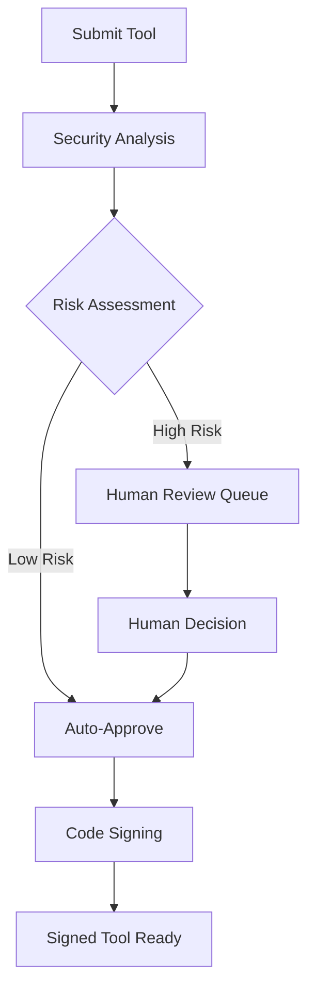

# APIリファレンス

## 🌐 他の言語
{: .no_toc}

[English](api-reference.md) | [中文简体](api-reference.zh-cn.md) | [Español](api-reference.es.md) | [Português](api-reference.pt.md) | **日本語** | [Deutsch](api-reference.de.md)

---

このドキュメントは、SymbiontランタイムAPIの包括的なドキュメントを提供します。Symbiontプロジェクトは、異なるユースケースと開発段階向けに設計された2つの独立したAPIシステムを提供します。

## 概要

Symbiontは2つのAPIインターフェースを提供します：

1. **ランタイムHTTP API** - 直接的なランタイム操作、エージェント管理、ワークフロー実行のための完全なAPI
2. **ツールレビューAPI（本番環境）** - AI駆動のツールレビューと署名ワークフロー用の包括的で本番対応API

---

## ランタイムHTTP API

ランタイムHTTP APIは、ワークフロー実行、エージェント管理、システム監視のためのSymbiontランタイムへの直接アクセスを提供します。すべてのエンドポイントは完全に実装されており、`http-api` featureが有効な場合に本番対応です。

### ベースURL
```
http://127.0.0.1:8080/api/v1
```

### 認証

エージェント管理エンドポイントはBearerトークンによる認証が必要です。環境変数 `API_AUTH_TOKEN` を設定し、Authorizationヘッダーにトークンを含めてください：

```
Authorization: Bearer <your-token>
```

**保護されたエンドポイント：**
- `/api/v1/agents/*` のすべてのエンドポイントは認証が必要
- `/api/v1/health`、`/api/v1/workflows/execute`、`/api/v1/metrics` エンドポイントは認証不要

### 利用可能なエンドポイント

#### ヘルスチェック
```http
GET /api/v1/health
```

現在のシステムヘルスステータスと基本的なランタイム情報を返します。

**レスポンス（200 OK）：**
```json
{
  "status": "healthy",
  "uptime_seconds": 3600,
  "timestamp": "2024-01-15T10:30:00Z",
  "version": "1.0.0"
}
```

**レスポンス（500 内部サーバーエラー）：**
```json
{
  "status": "unhealthy",
  "error": "Database connection failed",
  "timestamp": "2024-01-15T10:30:00Z"
}
```

### 利用可能なエンドポイント

#### ワークフロー実行
```http
POST /api/v1/workflows/execute
```

指定されたパラメータでワークフローを実行します。

**リクエストボディ：**
```json
{
  "workflow_id": "string",
  "parameters": {},
  "agent_id": "optional-agent-id"
}
```

**レスポンス（200 OK）：**
```json
{
  "result": "workflow execution result"
}
```

#### エージェント管理

すべてのエージェント管理エンドポイントは `Authorization: Bearer <token>` ヘッダーによる認証が必要です。

##### エージェント一覧
```http
GET /api/v1/agents
Authorization: Bearer <your-token>
```

ランタイム内のすべてのアクティブエージェントのリストを取得します。

**レスポンス（200 OK）：**
```json
[
  "agent-id-1",
  "agent-id-2",
  "agent-id-3"
]
```

##### エージェントステータス取得
```http
GET /api/v1/agents/{id}/status
Authorization: Bearer <your-token>
```

リアルタイム実行メトリクスを含む特定のエージェントの詳細なステータス情報を取得します。

**レスポンス（200 OK）：**
```json
{
  "agent_id": "uuid",
  "state": "running|ready|waiting|failed|completed|terminated",
  "last_activity": "2024-01-15T10:30:00Z",
  "scheduled_at": "2024-01-15T10:00:00Z",
  "resource_usage": {
    "memory_usage": 268435456,
    "cpu_usage": 15.5,
    "active_tasks": 1
  },
  "execution_context": {
    "execution_mode": "ephemeral|persistent|scheduled|event_driven",
    "process_id": 12345,
    "uptime": "00:15:30",
    "health_status": "healthy|unhealthy"
  }
}
```

**新しいエージェント状態：**
- `running`: エージェントが実行中のプロセスでアクティブに実行中
- `ready`: エージェントが初期化され実行準備完了
- `waiting`: エージェントが実行のためにキューに入っている
- `failed`: エージェント実行が失敗したかヘルスチェックが失敗
- `completed`: エージェントタスクが正常に完了
- `terminated`: エージェントがグレースフルまたは強制的に終了

##### エージェント作成
```http
POST /api/v1/agents
Authorization: Bearer <your-token>
```

指定した設定で新しいエージェントを作成します。

**リクエストボディ：**
```json
{
  "name": "my-agent",
  "dsl": "agent definition in DSL format"
}
```

**レスポンス（200 OK）：**
```json
{
  "id": "uuid",
  "status": "created"
}
```

##### エージェント更新
```http
PUT /api/v1/agents/{id}
Authorization: Bearer <your-token>
```

既存のエージェント設定を更新します。少なくとも1つのフィールドが必要です。

**リクエストボディ：**
```json
{
  "name": "updated-agent-name",
  "dsl": "updated agent definition in DSL format"
}
```

**レスポンス（200 OK）：**
```json
{
  "id": "uuid",
  "status": "updated"
}
```

##### エージェント削除
```http
DELETE /api/v1/agents/{id}
Authorization: Bearer <your-token>
```

既存のエージェントをランタイムから削除します。

**レスポンス（200 OK）：**
```json
{
  "id": "uuid",
  "status": "deleted"
}
```

##### エージェント実行
```http
POST /api/v1/agents/{id}/execute
Authorization: Bearer <your-token>
```

特定のエージェントの実行をトリガーします。

**リクエストボディ：**
```json
{}
```

**レスポンス（200 OK）：**
```json
{
  "execution_id": "uuid",
  "status": "execution_started"
}
```

##### エージェント実行履歴取得
```http
GET /api/v1/agents/{id}/history
Authorization: Bearer <your-token>
```

特定のエージェントの実行履歴を取得します。

**レスポンス（200 OK）：**
```json
{
  "history": [
    {
      "execution_id": "uuid",
      "status": "completed",
      "timestamp": "2024-01-15T10:30:00Z"
    }
  ]
}
```

##### エージェントハートビート
```http
POST /api/v1/agents/{id}/heartbeat
Authorization: Bearer <your-token>
```

実行中のエージェントからハートビートを送信してヘルスステータスを更新します。

##### エージェントへのイベントプッシュ
```http
POST /api/v1/agents/{id}/events
Authorization: Bearer <your-token>
```

イベントドリブン実行のために実行中のエージェントに外部イベントをプッシュします。

#### システムメトリクス
```http
GET /api/v1/metrics
```

スケジューラー、タスクマネージャー、ロードバランサー、システムリソースをカバーする包括的なメトリクススナップショットを取得します。

**レスポンス（200 OK）：**
```json
{
  "timestamp": "2026-02-16T12:00:00Z",
  "scheduler": {
    "total_jobs": 12,
    "active_jobs": 8,
    "paused_jobs": 2,
    "failed_jobs": 1,
    "total_runs": 450,
    "successful_runs": 445,
    "dead_letter_count": 2
  },
  "task_manager": {
    "queued_tasks": 3,
    "running_tasks": 5,
    "completed_tasks": 1200,
    "failed_tasks": 15
  },
  "load_balancer": {
    "total_workers": 4,
    "active_workers": 3,
    "requests_per_second": 12.5
  },
  "system": {
    "cpu_usage_percent": 45.2,
    "memory_usage_bytes": 536870912,
    "memory_total_bytes": 17179869184,
    "uptime_seconds": 3600
  }
}
```

メトリクススナップショットは、ランタイムの `MetricsExporter` システムを使用してファイル（アトミックJSON書き込み）またはOTLPエンドポイントにもエクスポートできます。以下の[メトリクスとテレメトリ](#メトリクスとテレメトリ)セクションを参照してください。

---

### メトリクスとテレメトリ

Symbiontは複数のバックエンドへのランタイムメトリクスのエクスポートをサポートしています：

#### ファイルエクスポーター

メトリクススナップショットをアトミックJSONファイル（tempfile + rename）として書き込みます：

```rust
use symbi_runtime::metrics::{FileMetricsExporter, MetricsExporterConfig};

let exporter = FileMetricsExporter::new("/var/lib/symbi/metrics.json");
exporter.export(&snapshot)?;
```

#### OTLPエクスポーター

OpenTelemetry互換の任意のエンドポイントにメトリクスを送信します（`metrics` featureが必要）：

```rust
use symbi_runtime::metrics::{OtlpExporter, OtlpExporterConfig, OtlpProtocol};

let config = OtlpExporterConfig {
    endpoint: "http://localhost:4317".to_string(),
    protocol: OtlpProtocol::Grpc,
    ..Default::default()
};
```

#### コンポジットエクスポーター

複数のバックエンドに同時にファンアウトします -- 個別のエクスポート失敗はログに記録されますが、他のエクスポーターをブロックしません：

```rust
use symbi_runtime::metrics::CompositeExporter;

let composite = CompositeExporter::new(vec![
    Box::new(file_exporter),
    Box::new(otlp_exporter),
]);
```

#### バックグラウンドコレクション

`MetricsCollector` はバックグラウンドスレッドとして実行され、定期的にスナップショットを収集してエクスポートします：

```rust
use symbi_runtime::metrics::MetricsCollector;

let collector = MetricsCollector::new(exporter, interval);
collector.start();
// ... 後で ...
collector.stop();
```

---

### スキルスキャン（ClawHavoc）

`SkillScanner` はロード前にエージェントスキルコンテンツの悪意のあるパターンを検査します。10の攻撃カテゴリにわたる**40の組み込みClawHavoc防御ルール**を同梱しています：

| カテゴリ | 数 | 重大度 | 例 |
|----------|-----|--------|-----|
| オリジナル防御ルール | 10 | Critical/Warning | `pipe-to-shell`, `eval-with-fetch`, `rm-rf-pattern` |
| リバースシェル | 7 | Critical | bash, nc, ncat, mkfifo, python, perl, ruby |
| 認証情報ハーベスティング | 6 | High | SSHキー、AWS認証情報、クラウド設定、ブラウザCookie、キーチェーン |
| ネットワーク窃取 | 3 | High | DNSトンネル、`/dev/tcp`、netcatアウトバウンド |
| プロセスインジェクション | 4 | Critical | ptrace、LD_PRELOAD、`/proc/mem`、gdbアタッチ |
| 権限昇格 | 5 | High | sudo、setuid、setcap、chown root、nsenter |
| シンボリックリンク / パストラバーサル | 2 | Medium | シンボリックリンクエスケープ、深いパストラバーサル |
| ダウンローダーチェーン | 3 | Medium | curl保存、wget保存、chmod実行 |

完全なルールリストと重大度モデルについては[セキュリティモデル](/security-model#clawhavoc-skill-scanner)を参照してください。

#### 使い方

```rust
use symbi_runtime::skills::SkillScanner;

let scanner = SkillScanner::new(); // すべての40デフォルトルールを含む
let result = scanner.scan_skill("/path/to/skill/");

if !result.passed {
    for finding in &result.findings {
        eprintln!("[{}] {}: {} (line {})",
            finding.severity, finding.rule, finding.message, finding.line);
    }
}
```

デフォルトと並行してカスタム拒否パターンを追加できます：

```rust
let scanner = SkillScanner::with_custom_rules(vec![
    ("custom-pattern".into(), r"my_dangerous_pattern".into(),
     ScanSeverity::Warning, "Custom rule description".into()),
]);
```

### サーバー設定

ランタイムHTTP APIサーバーは以下のオプションで設定できます：

- **デフォルトバインドアドレス**: `127.0.0.1:8080`
- **CORSサポート**: 開発用に設定可能
- **リクエストトレーシング**: Towerミドルウェア経由で有効
- **フィーチャーゲート**: `http-api` Cargo featureの後ろで利用可能

---

### フィーチャー設定リファレンス

#### クラウドLLM推論 (`cloud-llm`)

エージェント推論のためにOpenRouter経由でクラウドLLMプロバイダーに接続：

```bash
cargo build --features cloud-llm
```

**環境変数：**
- `OPENROUTER_API_KEY` -- OpenRouter APIキー（必須）
- `OPENROUTER_MODEL` -- 使用するモデル（デフォルト：`google/gemini-2.0-flash-001`）

クラウドLLMプロバイダーは推論ループの `execute_actions()` パイプラインと統合されます。ストリーミングレスポンス、指数バックオフによる自動リトライ、トークン使用追跡をサポートしています。

#### スタンドアロンエージェントモード (`standalone-agent`)

クラウドネイティブエージェントのためにクラウドLLM推論とComposioツールアクセスを組み合わせます：

```bash
cargo build --features standalone-agent
# 有効化: cloud-llm + composio
```

**環境変数：**
- `OPENROUTER_API_KEY` -- OpenRouter APIキー
- `COMPOSIO_API_KEY` -- Composio APIキー
- `COMPOSIO_MCP_URL` -- Composio MCPサーバーURL

#### Cedarポリシーエンジン (`cedar`)

[Cedarポリシー言語](https://www.cedarpolicy.com/)を使用した正式認可：

```bash
cargo build --features cedar
```

Cedarポリシーは推論ループのGateフェーズと統合され、きめ細かな認可決定を提供します。ポリシーの例については[セキュリティモデル](/security-model#cedar-policy-engine)を参照してください。

#### ベクトルデータベース設定

Symbiontはデフォルトの組み込みベクトルバックエンドとして**LanceDB**を同梱しています -- 外部サービスは不要です。スケールされたデプロイメントでは、Qdrantがオプションのバックエンドとして利用可能です。

**LanceDB（デフォルト）：**
```toml
[vector_db]
enabled = true
backend = "lancedb"
collection_name = "symbi_knowledge"
```

追加設定は不要です。データはランタイムと並んでローカルに保存されます。

**Qdrant（オプション）：**
```bash
cargo build --features vector-qdrant
```

```toml
[vector_db]
enabled = true
backend = "qdrant"
collection_name = "symbi_knowledge"
url = "http://localhost:6333"
```

**環境変数：**
- `SYMBIONT_VECTOR_BACKEND` -- `lancedb`（デフォルト）または `qdrant`
- `QDRANT_URL` -- QdrantサーバーURL（Qdrant使用時のみ）

#### 高度な推論プリミティブ (`orga-adaptive`)

ツールキュレーション、スタックループ検出、コンテキストプリフェッチ、スコープ付きコンベンションを有効化：

```bash
cargo build --features orga-adaptive
```

完全な設定リファレンスについては[orga-adaptiveガイド](/orga-adaptive)を参照してください。

---

### データ構造

#### コアタイプ
```rust
// ワークフロー実行リクエスト
WorkflowExecutionRequest {
    workflow_id: String,
    parameters: serde_json::Value,
    agent_id: Option<AgentId>
}

// エージェントステータスレスポンス
AgentStatusResponse {
    agent_id: AgentId,
    state: AgentState,
    last_activity: DateTime<Utc>,
    resource_usage: ResourceUsage
}

// ヘルスチェックレスポンス
HealthResponse {
    status: String,
    uptime_seconds: u64,
    timestamp: DateTime<Utc>,
    version: String
}

// エージェント作成リクエスト
CreateAgentRequest {
    name: String,
    dsl: String
}

// エージェント作成レスポンス
CreateAgentResponse {
    id: String,
    status: String
}

// エージェント更新リクエスト
UpdateAgentRequest {
    name: Option<String>,
    dsl: Option<String>
}

// エージェント更新レスポンス
UpdateAgentResponse {
    id: String,
    status: String
}

// エージェント削除レスポンス
DeleteAgentResponse {
    id: String,
    status: String
}

// エージェント実行リクエスト
ExecuteAgentRequest {
    // 現在は空の構造体
}

// エージェント実行レスポンス
ExecuteAgentResponse {
    execution_id: String,
    status: String
}

// エージェント実行記録
AgentExecutionRecord {
    execution_id: String,
    status: String,
    timestamp: String
}

// エージェント実行履歴レスポンス
GetAgentHistoryResponse {
    history: Vec<AgentExecutionRecord>
}
```

### ランタイムプロバイダーインターフェース

APIは以下の拡張メソッドを持つ `RuntimeApiProvider` トレイトを実装しています：

- `execute_workflow()` - 与えられたパラメータでワークフローを実行
- `get_agent_status()` - リアルタイム実行メトリクスを含む詳細ステータスを取得
- `get_system_health()` - スケジューラー統計を含む全体的なシステムヘルスを取得
- `list_agents()` - すべてのエージェント（実行中、キュー中、完了）をリスト
- `shutdown_agent()` - リソースクリーンアップとタイムアウト処理でグレースフルシャットダウン
- `get_metrics()` - タスク統計を含む包括的なシステムメトリクスを取得
- `create_agent()` - 実行モード指定でエージェントを作成
- `update_agent()` - 永続化付きでエージェント設定を更新
- `delete_agent()` - 実行中プロセスの適切なクリーンアップでエージェントを削除
- `execute_agent()` - 監視とヘルスチェック付きで実行をトリガー
- `get_agent_history()` - パフォーマンスメトリクスを含む詳細な実行履歴を取得

#### スケジューリングAPI

すべてのスケジューリングエンドポイントは認証が必要です。`cron` featureが必要です。

##### スケジュール一覧
```http
GET /api/v1/schedules
Authorization: Bearer <your-token>
```

**レスポンス（200 OK）：**
```json
[
  {
    "job_id": "uuid",
    "name": "daily-report",
    "cron_expression": "0 0 9 * * *",
    "timezone": "America/New_York",
    "status": "active",
    "enabled": true,
    "next_run": "2026-03-04T09:00:00Z",
    "run_count": 42
  }
]
```

##### スケジュール作成
```http
POST /api/v1/schedules
Authorization: Bearer <your-token>
```

**リクエストボディ：**
```json
{
  "name": "daily-report",
  "cron_expression": "0 0 9 * * *",
  "timezone": "America/New_York",
  "agent_name": "report-agent",
  "policy_ids": ["policy-1"],
  "one_shot": false
}
```

`cron_expression` は6つのフィールドを使用します：`sec min hour day month weekday`（オプションの7番目のフィールドで年）。

**レスポンス（200 OK）：**
```json
{
  "job_id": "uuid",
  "next_run": "2026-03-04T09:00:00Z",
  "status": "created"
}
```

##### スケジュール更新
```http
PUT /api/v1/schedules/{id}
Authorization: Bearer <your-token>
```

**リクエストボディ（すべてのフィールドはオプション）：**
```json
{
  "cron_expression": "0 */10 * * * *",
  "timezone": "UTC",
  "policy_ids": ["policy-2"],
  "one_shot": true
}
```

##### スケジュールの一時停止 / 再開 / トリガー
```http
POST /api/v1/schedules/{id}/pause
POST /api/v1/schedules/{id}/resume
POST /api/v1/schedules/{id}/trigger
Authorization: Bearer <your-token>
```

**レスポンス（200 OK）：**
```json
{
  "job_id": "uuid",
  "action": "paused",
  "status": "ok"
}
```

##### スケジュール削除
```http
DELETE /api/v1/schedules/{id}
Authorization: Bearer <your-token>
```

**レスポンス（200 OK）：**
```json
{
  "job_id": "uuid",
  "deleted": true
}
```

##### スケジュール履歴取得
```http
GET /api/v1/schedules/{id}/history
Authorization: Bearer <your-token>
```

**レスポンス（200 OK）：**
```json
{
  "job_id": "uuid",
  "history": [
    {
      "run_id": "uuid",
      "started_at": "2026-03-03T09:00:00Z",
      "completed_at": "2026-03-03T09:01:23Z",
      "status": "completed",
      "error": null,
      "execution_time_ms": 83000
    }
  ]
}
```

##### 次回実行取得
```http
GET /api/v1/schedules/{id}/next?count=5
Authorization: Bearer <your-token>
```

**レスポンス（200 OK）：**
```json
{
  "job_id": "uuid",
  "next_runs": [
    "2026-03-04T09:00:00Z",
    "2026-03-05T09:00:00Z"
  ]
}
```

##### スケジューラーヘルス
```http
GET /api/v1/health/scheduler
```

スケジューラー固有のヘルスと統計を返します。

---

#### チャネルアダプターAPI

すべてのチャネルエンドポイントは認証が必要です。エージェントをSlack、Microsoft Teams、Mattermostに接続します。

##### チャネル一覧
```http
GET /api/v1/channels
Authorization: Bearer <your-token>
```

**レスポンス（200 OK）：**
```json
[
  {
    "id": "uuid",
    "name": "slack-general",
    "platform": "slack",
    "status": "running"
  }
]
```

##### チャネル登録
```http
POST /api/v1/channels
Authorization: Bearer <your-token>
```

**リクエストボディ：**
```json
{
  "name": "slack-general",
  "platform": "slack",
  "config": {
    "webhook_url": "https://hooks.slack.com/...",
    "channel": "#general"
  }
}
```

サポートされているプラットフォーム：`slack`、`teams`、`mattermost`。

**レスポンス（200 OK）：**
```json
{
  "id": "uuid",
  "name": "slack-general",
  "platform": "slack",
  "status": "registered"
}
```

##### チャネルの取得 / 更新 / 削除
```http
GET    /api/v1/channels/{id}
PUT    /api/v1/channels/{id}
DELETE /api/v1/channels/{id}
Authorization: Bearer <your-token>
```

##### チャネルの開始 / 停止
```http
POST /api/v1/channels/{id}/start
POST /api/v1/channels/{id}/stop
Authorization: Bearer <your-token>
```

**レスポンス（200 OK）：**
```json
{
  "id": "uuid",
  "action": "started",
  "status": "ok"
}
```

##### チャネルヘルス
```http
GET /api/v1/channels/{id}/health
Authorization: Bearer <your-token>
```

**レスポンス（200 OK）：**
```json
{
  "id": "uuid",
  "connected": true,
  "platform": "slack",
  "workspace_name": "my-team",
  "channels_active": 3,
  "last_message_at": "2026-03-03T15:42:00Z",
  "uptime_secs": 86400
}
```

##### アイデンティティマッピング
```http
GET  /api/v1/channels/{id}/mappings
POST /api/v1/channels/{id}/mappings
Authorization: Bearer <your-token>
```

エージェントインタラクションのためにプラットフォームユーザーをSymbiontアイデンティティにマッピングします。

##### チャネル監査ログ
```http
GET /api/v1/channels/{id}/audit
Authorization: Bearer <your-token>
```

---

### スケジューラー機能

**リアルタスク実行：**
- 安全な実行環境でのプロセス生成
- 5秒間隔のリソース監視（メモリ、CPU）
- ヘルスチェックと自動障害検出
- エフェメラル、永続、スケジュール、イベントドリブン実行モードのサポート

**グレースフルシャットダウン：**
- 30秒のグレースフル終了期間
- 応答しないプロセスの強制終了
- リソースクリーンアップとメトリクス永続化
- キュークリーンアップと状態同期

### 拡張コンテキスト管理

**高度な検索機能：**
```json
{
  "query_type": "keyword|temporal|similarity|hybrid",
  "search_terms": ["term1", "term2"],
  "time_range": {
    "start": "2024-01-01T00:00:00Z",
    "end": "2024-01-31T23:59:59Z"
  },
  "memory_types": ["factual", "procedural", "episodic"],
  "relevance_threshold": 0.7,
  "max_results": 10
}
```

**重要度計算：**
- アクセス頻度、最新性、ユーザーフィードバックによる多因子スコアリング
- メモリタイプの重み付けとエイジ減衰係数
- 共有知識の信頼スコア計算

**アクセス制御統合：**
- コンテキスト操作に接続されたポリシーエンジン
- 安全な境界を持つエージェントスコープアクセス
- きめ細かな権限を持つ知識共有

---

## ツールレビューAPI（本番環境）

ツールレビューAPIは、AI駆動のセキュリティ分析と人間の監視機能を使用して、MCP（Model Context Protocol）ツールを安全にレビュー、分析、署名するための完全なワークフローを提供します。

### ベースURL
```
https://your-symbiont-instance.com/api/v1
```

### 認証
すべてのエンドポイントはBearer JWT認証が必要です：
```
Authorization: Bearer <your-jwt-token>
```

### コアワークフロー

ツールレビューAPIは次のリクエスト/レスポンスフローに従います：


```mermaid
graph TD
    A[Submit Tool] --> B[Security Analysis]
    B --> C{Risk Assessment}
    C -->|Low Risk| D[Auto-Approve]
    C -->|High Risk| E[Human Review Queue]
    E --> F[Human Decision]
    F --> D
    D --> G[Code Signing]
    G --> H[Signed Tool Ready]
```

### エンドポイント

#### レビューセッション

##### ツールをレビューに提出
```http
POST /sessions
```

MCPツールをセキュリティレビューと分析に提出します。

**リクエストボディ：**
```json
{
  "tool_name": "string",
  "tool_version": "string",
  "source_code": "string",
  "metadata": {
    "description": "string",
    "author": "string",
    "permissions": ["array", "of", "permissions"]
  }
}
```

**レスポンス：**
```json
{
  "review_id": "uuid",
  "status": "submitted",
  "created_at": "2024-01-15T10:30:00Z"
}
```

##### レビューセッション一覧
```http
GET /sessions
```

オプションのフィルタリングでページ分割されたレビューセッションのリストを取得します。

**クエリパラメータ：**
- `page` (integer): ページ分割のページ番号
- `limit` (integer): ページあたりのアイテム数
- `status` (string): レビューステータスでフィルタ
- `author` (string): ツール作成者でフィルタ

**レスポンス：**
```json
{
  "sessions": [
    {
      "review_id": "uuid",
      "tool_name": "string",
      "status": "string",
      "created_at": "2024-01-15T10:30:00Z",
      "updated_at": "2024-01-15T11:00:00Z"
    }
  ],
  "pagination": {
    "page": 1,
    "limit": 20,
    "total": 100,
    "has_next": true
  }
}
```

##### レビューセッション詳細取得
```http
GET /sessions/{reviewId}
```

特定のレビューセッションの詳細情報を取得します。

**レスポンス：**
```json
{
  "review_id": "uuid",
  "tool_name": "string",
  "tool_version": "string",
  "status": "string",
  "analysis_results": {
    "risk_score": 85,
    "findings": ["array", "of", "security", "findings"],
    "recommendations": ["array", "of", "recommendations"]
  },
  "created_at": "2024-01-15T10:30:00Z",
  "updated_at": "2024-01-15T11:00:00Z"
}
```

#### セキュリティ分析

##### 分析結果取得
```http
GET /analysis/{analysisId}
```

特定の分析に対する詳細なセキュリティ分析結果を取得します。

**レスポンス：**
```json
{
  "analysis_id": "uuid",
  "review_id": "uuid",
  "risk_score": 85,
  "analysis_type": "automated",
  "findings": [
    {
      "severity": "high",
      "category": "code_injection",
      "description": "Potential code injection vulnerability detected",
      "location": "line 42",
      "recommendation": "Sanitize user input before execution"
    }
  ],
  "rag_insights": [
    {
      "knowledge_source": "security_kb",
      "relevance_score": 0.95,
      "insight": "Similar patterns found in known vulnerabilities"
    }
  ],
  "completed_at": "2024-01-15T10:45:00Z"
}
```

#### 人間レビューワークフロー

##### レビューキュー取得
```http
GET /review/queue
```

人間レビューが保留中のアイテムを取得します。通常、手動検査が必要な高リスクツールです。

**レスポンス：**
```json
{
  "pending_reviews": [
    {
      "review_id": "uuid",
      "tool_name": "string",
      "risk_score": 92,
      "priority": "high",
      "assigned_to": "reviewer@example.com",
      "escalated_at": "2024-01-15T11:00:00Z"
    }
  ],
  "queue_stats": {
    "total_pending": 5,
    "high_priority": 2,
    "average_wait_time": "2h 30m"
  }
}
```

##### レビュー決定提出
```http
POST /review/{reviewId}/decision
```

ツールレビューに対する人間レビュアーの決定を提出します。

**リクエストボディ：**
```json
{
  "decision": "approve|reject|request_changes",
  "comments": "Detailed review comments",
  "conditions": ["array", "of", "approval", "conditions"],
  "reviewer_id": "reviewer@example.com"
}
```

**レスポンス：**
```json
{
  "review_id": "uuid",
  "decision": "approve",
  "processed_at": "2024-01-15T12:00:00Z",
  "next_status": "approved_for_signing"
}
```

#### ツール署名

##### 署名ステータス取得
```http
GET /signing/{reviewId}
```

レビューされたツールの署名ステータスと署名情報を取得します。

**レスポンス：**
```json
{
  "review_id": "uuid",
  "signing_status": "completed",
  "signature_info": {
    "algorithm": "RSA-SHA256",
    "key_id": "signing-key-001",
    "signature": "base64-encoded-signature",
    "signed_at": "2024-01-15T12:30:00Z"
  },
  "certificate_chain": ["array", "of", "certificates"]
}
```

##### 署名されたツールダウンロード
```http
GET /signing/{reviewId}/download
```

埋め込み署名と検証メタデータを含む署名されたツールパッケージをダウンロードします。

**レスポンス：**
署名されたツールパッケージのバイナリダウンロード。

#### 統計・監視

##### ワークフロー統計取得
```http
GET /stats
```

レビューワークフローに関する包括的な統計と指標を取得します。

**レスポンス：**
```json
{
  "workflow_stats": {
    "total_reviews": 1250,
    "approved": 1100,
    "rejected": 125,
    "pending": 25
  },
  "performance_metrics": {
    "average_review_time": "45m",
    "auto_approval_rate": 0.78,
    "human_review_rate": 0.22
  },
  "security_insights": {
    "common_vulnerabilities": ["sql_injection", "xss", "code_injection"],
    "risk_score_distribution": {
      "low": 45,
      "medium": 35,
      "high": 20
    }
  }
}
```

### レート制限

ツールレビューAPIはエンドポイントタイプごとにレート制限を実装しています：

- **提出エンドポイント**: 1分間に10リクエスト
- **クエリエンドポイント**: 1分間に100リクエスト
- **ダウンロードエンドポイント**: 1分間に20リクエスト

レート制限ヘッダーはすべてのレスポンスに含まれます：
```
X-RateLimit-Limit: 100
X-RateLimit-Remaining: 95
X-RateLimit-Reset: 1642248000
```

### エラーハンドリング

APIは標準的なHTTPステータスコードを使用し、詳細なエラー情報を返します：

```json
{
  "error": {
    "code": "INVALID_REQUEST",
    "message": "Tool source code is required",
    "details": {
      "field": "source_code",
      "reason": "missing_required_field"
    }
  }
}
```


---

## はじめに

### ランタイムHTTP API

1. ランタイムが `http-api` featureでビルドされていることを確認：
   ```bash
   cargo build --features http-api
   ```

2. エージェントエンドポイント用の認証トークンを設定：
   ```bash
   export API_AUTH_TOKEN="<your-token>"
   ```

3. ランタイムサーバーを起動：
   ```bash
   ./target/debug/symbiont-runtime --http-api
   ```

4. サーバーが実行中であることを確認：
   ```bash
   curl http://127.0.0.1:8080/api/v1/health
   ```

5. 認証済みエージェントエンドポイントをテスト：
   ```bash
   curl -H "Authorization: Bearer $API_AUTH_TOKEN" \
        http://127.0.0.1:8080/api/v1/agents
   ```

### ツールレビューAPI

1. Symbiont管理者からAPI認証情報を取得
2. `/sessions` エンドポイントを使用してツールをレビューに提出
3. `/sessions/{reviewId}` 経由でレビュー進捗を監視
4. `/signing/{reviewId}/download` から署名されたツールをダウンロード

## サポート

APIサポートと質問については：
- [ランタイムアーキテクチャドキュメント](runtime-architecture.md)を確認
- [セキュリティモデルドキュメント](security-model.md)をチェック
- プロジェクトのGitHubリポジトリで問題を報告
