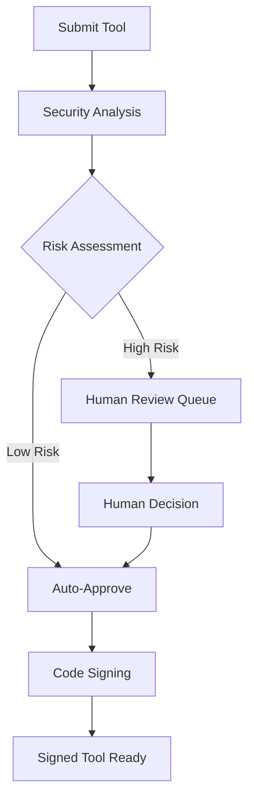

# API Reference

## 🌐 Other Languages
{: .no_toc}

**English** | [中文简体](api-reference.zh-cn.md) | [Español](api-reference.es.md) | [Português](api-reference.pt.md) | [日本語](api-reference.ja.md) | [Deutsch](api-reference.de.md)

---

This document provides comprehensive documentation for the Symbiont runtime APIs. The Symbiont project exposes two distinct API systems designed for different use cases and development stages.

## Overview

Symbiont offers two API interfaces:

1. **Runtime HTTP API** - A complete API for direct runtime interaction, agent management, and workflow execution
2. **Tool Review API (Production)** - A comprehensive, production-ready API for AI-driven tool review and signing workflows

---

## Runtime HTTP API

The Runtime HTTP API provides direct access to the Symbiont runtime for workflow execution, agent management, and system monitoring. All endpoints are fully implemented and production-ready when the `http-api` feature is enabled.

### Base URL
```
http://127.0.0.1:8080/api/v1
```

### Authentication

Agent management endpoints require Bearer token authentication. Set the `API_AUTH_TOKEN` environment variable and include the token in the Authorization header:

```
Authorization: Bearer <your-token>
```

**Protected Endpoints:**
- All `/api/v1/agents/*` endpoints require authentication
- `/api/v1/health`, `/api/v1/workflows/execute`, and `/api/v1/metrics` endpoints do not require authentication

### Available Endpoints

#### Health Check
```http
GET /api/v1/health
```

Returns the current system health status and basic runtime information.

**Response (200 OK):**
```json
{
  "status": "healthy",
  "uptime_seconds": 3600,
  "timestamp": "2024-01-15T10:30:00Z",
  "version": "0.1.0"
}
```

**Response (500 Internal Server Error):**
```json
{
  "status": "unhealthy",
  "error": "Database connection failed",
  "timestamp": "2024-01-15T10:30:00Z"
}
```

### Available Endpoints

#### Workflow Execution
```http
POST /api/v1/workflows/execute
```

Execute a workflow with specified parameters.

**Request Body:**
```json
{
  "workflow_id": "string",
  "parameters": {},
  "agent_id": "optional-agent-id"
}
```

**Response (200 OK):**
```json
{
  "result": "workflow execution result"
}
```

#### Agent Management

All agent management endpoints require authentication via the `Authorization: Bearer <token>` header.

##### List Agents
```http
GET /api/v1/agents
Authorization: Bearer <your-token>
```

Retrieve a list of all active agents in the runtime.

**Response (200 OK):**
```json
[
  "agent-id-1",
  "agent-id-2",
  "agent-id-3"
]
```

##### Get Agent Status
```http
GET /api/v1/agents/{id}/status
Authorization: Bearer <your-token>
```

Get detailed status information for a specific agent.

**Response (200 OK):**
```json
{
  "agent_id": "uuid",
  "state": "active|idle|busy|error",
  "last_activity": "2024-01-15T10:30:00Z",
  "resource_usage": {
    "memory_bytes": 268435456,
    "cpu_percent": 15.5,
    "active_tasks": 3
  }
}
```

##### Create Agent
```http
POST /api/v1/agents
Authorization: Bearer <your-token>
```

Create a new agent with the provided configuration.

**Request Body:**
```json
{
  "name": "my-agent",
  "dsl": "agent definition in DSL format"
}
```

**Response (200 OK):**
```json
{
  "id": "uuid",
  "status": "created"
}
```

##### Update Agent
```http
PUT /api/v1/agents/{id}
Authorization: Bearer <your-token>
```

Update an existing agent's configuration. At least one field must be provided.

**Request Body:**
```json
{
  "name": "updated-agent-name",
  "dsl": "updated agent definition in DSL format"
}
```

**Response (200 OK):**
```json
{
  "id": "uuid",
  "status": "updated"
}
```

##### Delete Agent
```http
DELETE /api/v1/agents/{id}
Authorization: Bearer <your-token>
```

Delete an existing agent from the runtime.

**Response (200 OK):**
```json
{
  "id": "uuid",
  "status": "deleted"
}
```

##### Execute Agent
```http
POST /api/v1/agents/{id}/execute
Authorization: Bearer <your-token>
```

Trigger execution of a specific agent.

**Request Body:**
```json
{}
```

**Response (200 OK):**
```json
{
  "execution_id": "uuid",
  "status": "execution_started"
}
```

##### Get Agent Execution History
```http
GET /api/v1/agents/{id}/history
Authorization: Bearer <your-token>
```

Retrieve the execution history for a specific agent.

**Response (200 OK):**
```json
{
  "history": [
    {
      "execution_id": "uuid",
      "status": "completed",
      "timestamp": "2024-01-15T10:30:00Z"
    }
  ]
}
```

#### System Metrics
```http
GET /api/v1/metrics
```

Retrieve comprehensive system performance metrics.

**Response (200 OK):**
```json
{
  "system": {
    "uptime_seconds": 3600,
    "memory_usage": "75%",
    "cpu_usage": "45%"
  },
  "agents": {
    "total": 5,
    "active": 3,
    "idle": 2
  }
}
```

### Server Configuration

The Runtime HTTP API server can be configured with the following options:

- **Default bind address**: `127.0.0.1:8080`
- **CORS support**: Configurable for development
- **Request tracing**: Enabled via Tower middleware
- **Feature gate**: Available behind `http-api` Cargo feature

### Data Structures

#### Core Types
```rust
// Workflow execution request
WorkflowExecutionRequest {
    workflow_id: String,
    parameters: serde_json::Value,
    agent_id: Option<AgentId>
}

// Agent status response
AgentStatusResponse {
    agent_id: AgentId,
    state: AgentState,
    last_activity: DateTime<Utc>,
    resource_usage: ResourceUsage
}

// Health check response
HealthResponse {
    status: String,
    uptime_seconds: u64,
    timestamp: DateTime<Utc>,
    version: String
}

// Agent creation request
CreateAgentRequest {
    name: String,
    dsl: String
}

// Agent creation response
CreateAgentResponse {
    id: String,
    status: String
}

// Agent update request
UpdateAgentRequest {
    name: Option<String>,
    dsl: Option<String>
}

// Agent update response
UpdateAgentResponse {
    id: String,
    status: String
}

// Agent deletion response
DeleteAgentResponse {
    id: String,
    status: String
}

// Agent execution request
ExecuteAgentRequest {
    // Empty struct for now
}

// Agent execution response
ExecuteAgentResponse {
    execution_id: String,
    status: String
}

// Agent execution record
AgentExecutionRecord {
    execution_id: String,
    status: String,
    timestamp: String
}

// Agent execution history response
GetAgentHistoryResponse {
    history: Vec<AgentExecutionRecord>
}
```

### Runtime Provider Interface

The API implements a `RuntimeApiProvider` trait with the following methods:

- `execute_workflow()` - Execute a workflow with given parameters
- `get_agent_status()` - Retrieve status information for a specific agent
- `get_system_health()` - Get overall system health status
- `list_agents()` - List all active agents in the runtime
- `shutdown_agent()` - Gracefully shutdown a specific agent
- `get_metrics()` - Retrieve system performance metrics
- `create_agent()` - Create a new agent with provided configuration
- `update_agent()` - Update an existing agent's configuration
- `delete_agent()` - Delete an existing agent from the runtime
- `execute_agent()` - Trigger execution of a specific agent
- `get_agent_history()` - Retrieve execution history for a specific agent

---

## Tool Review API (Production)

The Tool Review API provides a complete workflow for securely reviewing, analyzing, and signing MCP (Model Context Protocol) tools using AI-driven security analysis with human oversight capabilities.

### Base URL
```
https://your-symbiont-instance.com/api/v1
```

### Authentication
All endpoints require Bearer JWT authentication:
```
Authorization: Bearer <your-jwt-token>
```

### Core Workflow

The Tool Review API follows this request/response flow:



### Endpoints

#### Review Sessions

##### Submit Tool for Review
```http
POST /sessions
```

Submits an MCP tool for security review and analysis.

**Request Body:**
```json
{
  "tool_name": "string",
  "tool_version": "string",
  "source_code": "string",
  "metadata": {
    "description": "string",
    "author": "string",
    "permissions": ["array", "of", "permissions"]
  }
}
```

**Response:**
```json
{
  "review_id": "uuid",
  "status": "submitted",
  "created_at": "2024-01-15T10:30:00Z"
}
```

##### List Review Sessions
```http
GET /sessions
```

Retrieves a paginated list of review sessions with optional filtering.

**Query Parameters:**
- `page` (integer): Page number for pagination
- `limit` (integer): Number of items per page
- `status` (string): Filter by review status
- `author` (string): Filter by tool author

**Response:**
```json
{
  "sessions": [
    {
      "review_id": "uuid",
      "tool_name": "string",
      "status": "string",
      "created_at": "2024-01-15T10:30:00Z",
      "updated_at": "2024-01-15T11:00:00Z"
    }
  ],
  "pagination": {
    "page": 1,
    "limit": 20,
    "total": 100,
    "has_next": true
  }
}
```

##### Get Review Session Details
```http
GET /sessions/{reviewId}
```

Retrieves detailed information about a specific review session.

**Response:**
```json
{
  "review_id": "uuid",
  "tool_name": "string",
  "tool_version": "string",
  "status": "string",
  "analysis_results": {
    "risk_score": 85,
    "findings": ["array", "of", "security", "findings"],
    "recommendations": ["array", "of", "recommendations"]
  },
  "created_at": "2024-01-15T10:30:00Z",
  "updated_at": "2024-01-15T11:00:00Z"
}
```

#### Security Analysis

##### Get Analysis Results
```http
GET /analysis/{analysisId}
```

Retrieves detailed security analysis results for a specific analysis.

**Response:**
```json
{
  "analysis_id": "uuid",
  "review_id": "uuid",
  "risk_score": 85,
  "analysis_type": "automated",
  "findings": [
    {
      "severity": "high",
      "category": "code_injection",
      "description": "Potential code injection vulnerability detected",
      "location": "line 42",
      "recommendation": "Sanitize user input before execution"
    }
  ],
  "rag_insights": [
    {
      "knowledge_source": "security_kb",
      "relevance_score": 0.95,
      "insight": "Similar patterns found in known vulnerabilities"
    }
  ],
  "completed_at": "2024-01-15T10:45:00Z"
}
```

#### Human Review Workflow

##### Get Review Queue
```http
GET /review/queue
```

Retrieves items pending human review, typically high-risk tools requiring manual inspection.

**Response:**
```json
{
  "pending_reviews": [
    {
      "review_id": "uuid",
      "tool_name": "string",
      "risk_score": 92,
      "priority": "high",
      "assigned_to": "reviewer@example.com",
      "escalated_at": "2024-01-15T11:00:00Z"
    }
  ],
  "queue_stats": {
    "total_pending": 5,
    "high_priority": 2,
    "average_wait_time": "2h 30m"
  }
}
```

##### Submit Review Decision
```http
POST /review/{reviewId}/decision
```

Submits a human reviewer's decision on a tool review.

**Request Body:**
```json
{
  "decision": "approve|reject|request_changes",
  "comments": "Detailed review comments",
  "conditions": ["array", "of", "approval", "conditions"],
  "reviewer_id": "reviewer@example.com"
}
```

**Response:**
```json
{
  "review_id": "uuid",
  "decision": "approve",
  "processed_at": "2024-01-15T12:00:00Z",
  "next_status": "approved_for_signing"
}
```

#### Tool Signing

##### Get Signing Status
```http
GET /signing/{reviewId}
```

Retrieves the signing status and signature information for a reviewed tool.

**Response:**
```json
{
  "review_id": "uuid",
  "signing_status": "completed",
  "signature_info": {
    "algorithm": "RSA-SHA256",
    "key_id": "signing-key-001",
    "signature": "base64-encoded-signature",
    "signed_at": "2024-01-15T12:30:00Z"
  },
  "certificate_chain": ["array", "of", "certificates"]
}
```

##### Download Signed Tool
```http
GET /signing/{reviewId}/download
```

Downloads the signed tool package with embedded signature and verification metadata.

**Response:**
Binary download of the signed tool package.

#### Statistics & Monitoring

##### Get Workflow Statistics
```http
GET /stats
```

Retrieves comprehensive statistics and metrics about the review workflow.

**Response:**
```json
{
  "workflow_stats": {
    "total_reviews": 1250,
    "approved": 1100,
    "rejected": 125,
    "pending": 25
  },
  "performance_metrics": {
    "average_review_time": "45m",
    "auto_approval_rate": 0.78,
    "human_review_rate": 0.22
  },
  "security_insights": {
    "common_vulnerabilities": ["sql_injection", "xss", "code_injection"],
    "risk_score_distribution": {
      "low": 45,
      "medium": 35,
      "high": 20
    }
  }
}
```

### Rate Limiting

The Tool Review API implements rate limiting per endpoint type:

- **Submission endpoints**: 10 requests per minute
- **Query endpoints**: 100 requests per minute
- **Download endpoints**: 20 requests per minute

Rate limit headers are included in all responses:
```
X-RateLimit-Limit: 100
X-RateLimit-Remaining: 95
X-RateLimit-Reset: 1642248000
```

### Error Handling

The API uses standard HTTP status codes and returns detailed error information:

```json
{
  "error": {
    "code": "INVALID_REQUEST",
    "message": "Tool source code is required",
    "details": {
      "field": "source_code",
      "reason": "missing_required_field"
    }
  }
}
```


---

## Getting Started

### Runtime HTTP API

1. Ensure the runtime is built with the `http-api` feature:
   ```bash
   cargo build --features http-api
   ```

2. Set the authentication token for agent endpoints:
   ```bash
   export API_AUTH_TOKEN="your-secret-token"
   ```

3. Start the runtime server:
   ```bash
   ./target/debug/symbiont-runtime --http-api
   ```

4. Verify the server is running:
   ```bash
   curl http://127.0.0.1:8080/api/v1/health
   ```

5. Test authenticated agent endpoint:
   ```bash
   curl -H "Authorization: Bearer your-secret-token" \
        http://127.0.0.1:8080/api/v1/agents
   ```

### Tool Review API

1. Obtain API credentials from your Symbiont administrator
2. Submit a tool for review using the `/sessions` endpoint
3. Monitor the review progress via `/sessions/{reviewId}`
4. Download signed tools from `/signing/{reviewId}/download`

## Support

For API support and questions:
- Review the [Runtime Architecture documentation](runtime-architecture.md)
- Check the [Security Model documentation](security-model.md)
- File issues on the project's GitHub repository