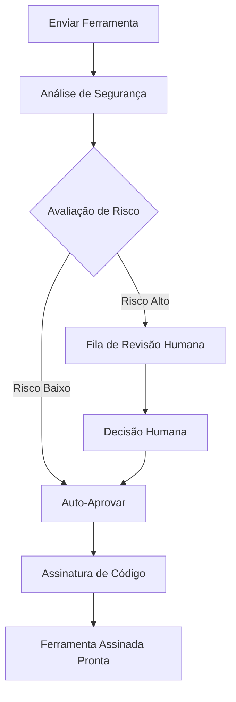

# Referência da API

## 🌐 Outros idiomas
{: .no_toc}

[English](api-reference.md) | [中文简体](api-reference.zh-cn.md) | [Español](api-reference.es.md) | **Português** | [日本語](api-reference.ja.md) | [Deutsch](api-reference.de.md)

---

Este documento fornece documentação abrangente para as APIs do runtime Symbiont. O projeto Symbiont expõe dois sistemas de API distintos projetados para diferentes casos de uso e estágios de desenvolvimento.

## Visão Geral

O Symbiont oferece duas interfaces de API:

1. **API de Revisão de Ferramentas (Produção)** - Uma API abrangente e pronta para produção para fluxos de trabalho de revisão e assinatura de ferramentas orientadas por IA
2. **API HTTP do Runtime (Prévia de Desenvolvimento)** - Uma API em evolução para interação direta com o runtime (atualmente incompleta)

---

## API de Revisão de Ferramentas (Produção)

A API de Revisão de Ferramentas fornece um fluxo de trabalho completo para revisar, analisar e assinar ferramentas MCP (Protocolo de Contexto de Modelo) de forma segura usando análise de segurança orientada por IA com capacidades de supervisão humana.

### URL Base
```
https://your-symbiont-instance.com/api/v1
```

### Autenticação
Todos os endpoints requerem autenticação JWT Bearer:
```
Authorization: Bearer <your-jwt-token>
```

### Fluxo de Trabalho Principal

A API de Revisão de Ferramentas segue este fluxo de solicitação/resposta:



### Endpoints

#### Sessões de Revisão

##### Enviar Ferramenta para Revisão
```http
POST /sessions
```

Envia uma ferramenta MCP para revisão e análise de segurança.

**Corpo da Solicitação:**
```json
{
  "tool_name": "string",
  "tool_version": "string",
  "source_code": "string",
  "metadata": {
    "description": "string",
    "author": "string",
    "permissions": ["array", "of", "permissions"]
  }
}
```

**Resposta:**
```json
{
  "review_id": "uuid",
  "status": "submitted",
  "created_at": "2024-01-15T10:30:00Z"
}
```

##### Listar Sessões de Revisão
```http
GET /sessions
```

Recupera uma lista paginada de sessões de revisão com filtragem opcional.

**Parâmetros de Consulta:**
- `page` (integer): Número da página para paginação
- `limit` (integer): Número de itens por página
- `status` (string): Filtrar por status de revisão
- `author` (string): Filtrar por autor da ferramenta

**Resposta:**
```json
{
  "sessions": [
    {
      "review_id": "uuid",
      "tool_name": "string",
      "status": "string",
      "created_at": "2024-01-15T10:30:00Z",
      "updated_at": "2024-01-15T11:00:00Z"
    }
  ],
  "pagination": {
    "page": 1,
    "limit": 20,
    "total": 100,
    "has_next": true
  }
}
```

##### Obter Detalhes da Sessão de Revisão
```http
GET /sessions/{reviewId}
```

Recupera informações detalhadas sobre uma sessão de revisão específica.

**Resposta:**
```json
{
  "review_id": "uuid",
  "tool_name": "string",
  "tool_version": "string",
  "status": "string",
  "analysis_results": {
    "risk_score": 85,
    "findings": ["array", "of", "security", "findings"],
    "recommendations": ["array", "of", "recommendations"]
  },
  "created_at": "2024-01-15T10:30:00Z",
  "updated_at": "2024-01-15T11:00:00Z"
}
```

#### Análise de Segurança

##### Obter Resultados da Análise
```http
GET /analysis/{analysisId}
```

Recupera resultados detalhados de análise de segurança para uma análise específica.

**Resposta:**
```json
{
  "analysis_id": "uuid",
  "review_id": "uuid",
  "risk_score": 85,
  "analysis_type": "automated",
  "findings": [
    {
      "severity": "high",
      "category": "code_injection",
      "description": "Potential code injection vulnerability detected",
      "location": "line 42",
      "recommendation": "Sanitize user input before execution"
    }
  ],
  "rag_insights": [
    {
      "knowledge_source": "security_kb",
      "relevance_score": 0.95,
      "insight": "Similar patterns found in known vulnerabilities"
    }
  ],
  "completed_at": "2024-01-15T10:45:00Z"
}
```

#### Fluxo de Trabalho de Revisão Humana

##### Obter Fila de Revisão
```http
GET /review/queue
```

Recupera itens pendentes de revisão humana, tipicamente ferramentas de alto risco que requerem inspeção manual.

**Resposta:**
```json
{
  "pending_reviews": [
    {
      "review_id": "uuid",
      "tool_name": "string",
      "risk_score": 92,
      "priority": "high",
      "assigned_to": "reviewer@example.com",
      "escalated_at": "2024-01-15T11:00:00Z"
    }
  ],
  "queue_stats": {
    "total_pending": 5,
    "high_priority": 2,
    "average_wait_time": "2h 30m"
  }
}
```

##### Enviar Decisão de Revisão
```http
POST /review/{reviewId}/decision
```

Envia a decisão de um revisor humano sobre uma revisão de ferramenta.

**Corpo da Solicitação:**
```json
{
  "decision": "approve|reject|request_changes",
  "comments": "Detailed review comments",
  "conditions": ["array", "of", "approval", "conditions"],
  "reviewer_id": "reviewer@example.com"
}
```

**Resposta:**
```json
{
  "review_id": "uuid",
  "decision": "approve",
  "processed_at": "2024-01-15T12:00:00Z",
  "next_status": "approved_for_signing"
}
```

#### Assinatura de Ferramentas

##### Obter Status da Assinatura
```http
GET /signing/{reviewId}
```

Recupera o status da assinatura e informações de assinatura para uma ferramenta revisada.

**Resposta:**
```json
{
  "review_id": "uuid",
  "signing_status": "completed",
  "signature_info": {
    "algorithm": "RSA-SHA256",
    "key_id": "signing-key-001",
    "signature": "base64-encoded-signature",
    "signed_at": "2024-01-15T12:30:00Z"
  },
  "certificate_chain": ["array", "of", "certificates"]
}
```

##### Baixar Ferramenta Assinada
```http
GET /signing/{reviewId}/download
```

Baixa o pacote de ferramenta assinada com assinatura incorporada e metadados de verificação.

**Resposta:**
Download binário do pacote de ferramenta assinada.

#### Estatísticas e Monitoramento

##### Obter Estatísticas do Fluxo de Trabalho
```http
GET /stats
```

Recupera estatísticas e métricas abrangentes sobre o fluxo de trabalho de revisão.

**Resposta:**
```json
{
  "workflow_stats": {
    "total_reviews": 1250,
    "approved": 1100,
    "rejected": 125,
    "pending": 25
  },
  "performance_metrics": {
    "average_review_time": "45m",
    "auto_approval_rate": 0.78,
    "human_review_rate": 0.22
  },
  "security_insights": {
    "common_vulnerabilities": ["sql_injection", "xss", "code_injection"],
    "risk_score_distribution": {
      "low": 45,
      "medium": 35,
      "high": 20
    }
  }
}
```

### Limitação de Taxa

A API de Revisão de Ferramentas implementa limitação de taxa por tipo de endpoint:

- **Endpoints de envio**: 10 solicitações por minuto
- **Endpoints de consulta**: 100 solicitações por minuto
- **Endpoints de download**: 20 solicitações por minuto

Cabeçalhos de limite de taxa são incluídos em todas as respostas:
```
X-RateLimit-Limit: 100
X-RateLimit-Remaining: 95
X-RateLimit-Reset: 1642248000
```

### Tratamento de Erros

A API usa códigos de status HTTP padrão e retorna informações detalhadas de erro:

```json
{
  "error": {
    "code": "INVALID_REQUEST",
    "message": "Tool source code is required",
    "details": {
      "field": "source_code",
      "reason": "missing_required_field"
    }
  }
}
```

---

## API HTTP do Runtime

A API HTTP do Runtime fornece acesso direto ao runtime Symbiont para execução de fluxos de trabalho, gerenciamento de agentes e monitoramento do sistema. Todos os endpoints documentados estão totalmente implementados e disponíveis quando o recurso `http-api` está habilitado.

### URL Base
```
http://127.0.0.1:8080/api/v1
```

### Autenticação

Os endpoints de gerenciamento de agentes requerem autenticação com token Bearer. Configure a variável de ambiente `API_AUTH_TOKEN` e inclua o token no cabeçalho Authorization:

```
Authorization: Bearer <your-token>
```

**Endpoints Protegidos:**
- Todos os endpoints `/api/v1/agents/*` requerem autenticação
- Os endpoints `/api/v1/health`, `/api/v1/workflows/execute` e `/api/v1/metrics` não requerem autenticação

### Endpoints Disponíveis

#### Verificação de Saúde
```http
GET /api/v1/health
```

Retorna o status atual de saúde do sistema e informações básicas do runtime.

**Resposta (200 OK):**
```json
{
  "status": "healthy",
  "uptime_seconds": 3600,
  "timestamp": "2024-01-15T10:30:00Z",
  "version": "1.0.0"
}
```

**Resposta (500 Erro Interno do Servidor):**
```json
{
  "status": "unhealthy",
  "error": "Database connection failed",
  "timestamp": "2024-01-15T10:30:00Z"
}
```

### Endpoints Disponíveis

#### Execução de Fluxo de Trabalho
```http
POST /api/v1/workflows/execute
```

Executa um fluxo de trabalho com parâmetros especificados.

**Corpo da Solicitação:**
```json
{
  "workflow_id": "string",
  "parameters": {},
  "agent_id": "optional-agent-id"
}
```

**Resposta (200 OK):**
```json
{
  "result": "workflow execution result"
}
```

#### Gerenciamento de Agentes

##### Listar Agentes
```http
GET /api/v1/agents
```

Recupera uma lista de todos os agentes ativos no runtime.

**Resposta (200 OK):**
```json
[
  "agent-id-1",
  "agent-id-2",
  "agent-id-3"
]
```

##### Obter Status do Agente
```http
GET /api/v1/agents/{id}/status
Authorization: Bearer <your-token>
```

Obtém informações detalhadas de status para um agente específico.

**Resposta (200 OK):**
```json
{
  "agent_id": "uuid",
  "state": "active|idle|busy|error",
  "last_activity": "2024-01-15T10:30:00Z",
  "resource_usage": {
    "memory_bytes": 268435456,
    "cpu_percent": 15.5,
    "active_tasks": 3
  }
}
```

##### Criar Agente
```http
POST /api/v1/agents
Authorization: Bearer <your-token>
```

Cria um novo agente com a configuração fornecida.

**Corpo da Solicitação:**
```json
{
  "name": "meu-agente",
  "dsl": "definição do agente em formato DSL"
}
```

**Resposta (200 OK):**
```json
{
  "id": "uuid",
  "status": "created"
}
```

##### Atualizar Agente
```http
PUT /api/v1/agents/{id}
Authorization: Bearer <your-token>
```

Atualiza a configuração de um agente existente. Pelo menos um campo deve ser fornecido.

**Corpo da Solicitação:**
```json
{
  "name": "nome-agente-atualizado",
  "dsl": "definição do agente atualizada em formato DSL"
}
```

**Resposta (200 OK):**
```json
{
  "id": "uuid",
  "status": "updated"
}
```

##### Excluir Agente
```http
DELETE /api/v1/agents/{id}
Authorization: Bearer <your-token>
```

Exclui um agente existente do runtime.

**Resposta (200 OK):**
```json
{
  "id": "uuid",
  "status": "deleted"
}
```

##### Executar Agente
```http
POST /api/v1/agents/{id}/execute
Authorization: Bearer <your-token>
```

Aciona a execução de um agente específico.

**Corpo da Solicitação:**
```json
{}
```

**Resposta (200 OK):**
```json
{
  "execution_id": "uuid",
  "status": "execution_started"
}
```

##### Obter Histórico de Execução do Agente
```http
GET /api/v1/agents/{id}/history
Authorization: Bearer <your-token>
```

Recupera o histórico de execução para um agente específico.

**Resposta (200 OK):**
```json
{
  "history": [
    {
      "execution_id": "uuid",
      "status": "completed",
      "timestamp": "2024-01-15T10:30:00Z"
    }
  ]
}
```

#### Métricas do Sistema
```http
GET /api/v1/metrics
```

Recupera métricas abrangentes de desempenho do sistema.

**Resposta (200 OK):**
```json
{
  "system": {
    "uptime_seconds": 3600,
    "memory_usage": "75%",
    "cpu_usage": "45%"
  },
  "agents": {
    "total": 5,
    "active": 3,
    "idle": 2
  }
}
```

### Configuração do Servidor

O servidor da API HTTP do Runtime pode ser configurado com as seguintes opções:

- **Endereço de bind padrão**: `127.0.0.1:8080`
- **Suporte CORS**: Configurável para desenvolvimento
- **Rastreamento de solicitações**: Habilitado via middleware Tower
- **Feature gate**: Disponível atrás do recurso `http-api` do Cargo

### Estruturas de Dados

#### Tipos Centrais
```rust
// Solicitação de execução de fluxo de trabalho
WorkflowExecutionRequest {
    workflow_id: String,
    parameters: serde_json::Value,
    agent_id: Option<AgentId>
}

// Resposta de status do agente
AgentStatusResponse {
    agent_id: AgentId,
    state: AgentState,
    last_activity: DateTime<Utc>,
    resource_usage: ResourceUsage
}

// Resposta de verificação de saúde
HealthResponse {
    status: String,
    uptime_seconds: u64,
    timestamp: DateTime<Utc>,
    version: String
}

// Solicitação de criação de agente
CreateAgentRequest {
    name: String,
    dsl: String
}

// Resposta de criação de agente
CreateAgentResponse {
    id: AgentId,
    status: String
}

// Solicitação de atualização de agente
UpdateAgentRequest {
    name: Option<String>,
    dsl: Option<String>
}

// Resposta de atualização de agente
UpdateAgentResponse {
    id: AgentId,
    status: String
}

// Resposta de exclusão de agente
DeleteAgentResponse {
    id: AgentId,
    status: String
}

// Solicitação de execução de agente
ExecuteAgentRequest {}

// Resposta de execução de agente
ExecuteAgentResponse {
    execution_id: String,
    status: String
}

// Resposta de histórico de agente
AgentHistoryResponse {
    history: Vec<AgentExecution>
}

// Execução de agente
AgentExecution {
    execution_id: String,
    status: String,
    timestamp: DateTime<Utc>
}
```

### Interface do Provedor de Runtime

A API implementa uma trait `RuntimeApiProvider` com os seguintes métodos:

- `execute_workflow()` - Executa um fluxo de trabalho com parâmetros dados
- `get_agent_status()` - Recupera informações de status para um agente específico
- `get_system_health()` - Obtém o status geral de saúde do sistema
- `list_agents()` - Lista todos os agentes ativos no runtime
- `shutdown_agent()` - Desliga graciosamente um agente específico
- `get_metrics()` - Recupera métricas de desempenho do sistema
- `create_agent()` - Cria um novo agente com a configuração fornecida
- `update_agent()` - Atualiza a configuração de um agente existente
- `delete_agent()` - Exclui um agente específico do runtime
- `execute_agent()` - Aciona a execução de um agente específico
- `get_agent_history()` - Recupera o histórico de execução para um agente específico

---

## Primeiros Passos

### API de Revisão de Ferramentas

1. Obtenha credenciais de API do seu administrador Symbiont
2. Envie uma ferramenta para revisão usando o endpoint `/sessions`
3. Monitore o progresso da revisão via `/sessions/{reviewId}`
4. Baixe ferramentas assinadas de `/signing/{reviewId}/download`

### API HTTP do Runtime

1. Certifique-se de que o runtime está construído com o recurso `http-api`:
   ```bash
   cargo build --features http-api
   ```
2. Inicie o servidor do runtime:
   ```bash
   ./target/debug/symbiont-runtime --http-api
   ```
3. Verifique se o servidor está executando:
   ```bash
   curl http://127.0.0.1:8080/api/v1/health
   ```

## Suporte

Para suporte de API e questões:
- Revise a [documentação de Arquitetura do Runtime](runtime-architecture.md)
- Consulte a [documentação do Modelo de Segurança](security-model.md)
- Registre problemas no repositório GitHub do projeto