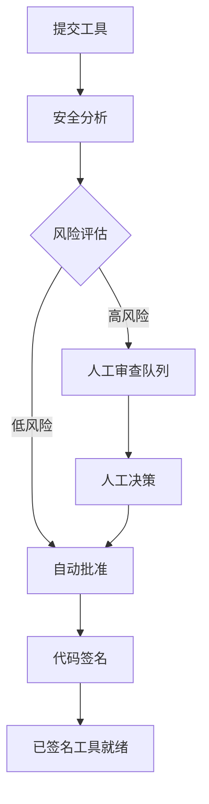

# API 参考

## 🌐 其他语言

[English](api-reference.md) | **中文简体** | [Español](api-reference.es.md) | [Português](api-reference.pt.md) | [日本語](api-reference.ja.md) | [Deutsch](api-reference.de.md)

---

本文档为 Symbiont 运行时 API 提供全面的文档。Symbiont 项目提供两个针对不同用例和开发阶段设计的独立 API 系统。

## 概述

Symbiont 提供两个 API 接口：

1. **工具审查 API（生产环境）** - 一个全面的、生产就绪的 AI 驱动工具审查和签名工作流 API
2. **运行时 HTTP API（开发预览）** - 一个用于直接运行时交互的演进中 API（目前不完整）

---

## 工具审查 API（生产环境）

工具审查 API 提供了一个完整的工作流，用于安全地审查、分析和签名 MCP（模型上下文协议）工具，使用 AI 驱动的安全分析和人工监督功能。

### 基础 URL
```
https://your-symbiont-instance.com/api/v1
```

### 身份验证
所有端点都需要 Bearer JWT 身份验证：
```
Authorization: Bearer <your-jwt-token>
```

### 核心工作流

工具审查 API 遵循以下请求/响应流程：



### 端点

#### 审查会话

##### 提交工具进行审查
```http
POST /sessions
```

提交 MCP 工具进行安全审查和分析。

**请求体：**
```json
{
  "tool_name": "string",
  "tool_version": "string",
  "source_code": "string",
  "metadata": {
    "description": "string",
    "author": "string",
    "permissions": ["array", "of", "permissions"]
  }
}
```

**响应：**
```json
{
  "review_id": "uuid",
  "status": "submitted",
  "created_at": "2024-01-15T10:30:00Z"
}
```

##### 列出审查会话
```http
GET /sessions
```

检索带有可选过滤的分页审查会话列表。

**查询参数：**
- `page` (integer): 分页的页码
- `limit` (integer): 每页项目数
- `status` (string): 按审查状态过滤
- `author` (string): 按工具作者过滤

**响应：**
```json
{
  "sessions": [
    {
      "review_id": "uuid",
      "tool_name": "string",
      "status": "string",
      "created_at": "2024-01-15T10:30:00Z",
      "updated_at": "2024-01-15T11:00:00Z"
    }
  ],
  "pagination": {
    "page": 1,
    "limit": 20,
    "total": 100,
    "has_next": true
  }
}
```

##### 获取审查会话详情
```http
GET /sessions/{reviewId}
```

检索特定审查会话的详细信息。

**响应：**
```json
{
  "review_id": "uuid",
  "tool_name": "string",
  "tool_version": "string",
  "status": "string",
  "analysis_results": {
    "risk_score": 85,
    "findings": ["array", "of", "security", "findings"],
    "recommendations": ["array", "of", "recommendations"]
  },
  "created_at": "2024-01-15T10:30:00Z",
  "updated_at": "2024-01-15T11:00:00Z"
}
```

#### 安全分析

##### 获取分析结果
```http
GET /analysis/{analysisId}
```

检索特定分析的详细安全分析结果。

**响应：**
```json
{
  "analysis_id": "uuid",
  "review_id": "uuid",
  "risk_score": 85,
  "analysis_type": "automated",
  "findings": [
    {
      "severity": "high",
      "category": "code_injection",
      "description": "Potential code injection vulnerability detected",
      "location": "line 42",
      "recommendation": "Sanitize user input before execution"
    }
  ],
  "rag_insights": [
    {
      "knowledge_source": "security_kb",
      "relevance_score": 0.95,
      "insight": "Similar patterns found in known vulnerabilities"
    }
  ],
  "completed_at": "2024-01-15T10:45:00Z"
}
```

#### 人工审查工作流

##### 获取审查队列
```http
GET /review/queue
```

检索等待人工审查的项目，通常是需要手动检查的高风险工具。

**响应：**
```json
{
  "pending_reviews": [
    {
      "review_id": "uuid",
      "tool_name": "string",
      "risk_score": 92,
      "priority": "high",
      "assigned_to": "reviewer@example.com",
      "escalated_at": "2024-01-15T11:00:00Z"
    }
  ],
  "queue_stats": {
    "total_pending": 5,
    "high_priority": 2,
    "average_wait_time": "2h 30m"
  }
}
```

##### 提交审查决策
```http
POST /review/{reviewId}/decision
```

提交人工审查员对工具审查的决策。

**请求体：**
```json
{
  "decision": "approve|reject|request_changes",
  "comments": "Detailed review comments",
  "conditions": ["array", "of", "approval", "conditions"],
  "reviewer_id": "reviewer@example.com"
}
```

**响应：**
```json
{
  "review_id": "uuid",
  "decision": "approve",
  "processed_at": "2024-01-15T12:00:00Z",
  "next_status": "approved_for_signing"
}
```

#### 工具签名

##### 获取签名状态
```http
GET /signing/{reviewId}
```

检索已审查工具的签名状态和签名信息。

**响应：**
```json
{
  "review_id": "uuid",
  "signing_status": "completed",
  "signature_info": {
    "algorithm": "RSA-SHA256",
    "key_id": "signing-key-001",
    "signature": "base64-encoded-signature",
    "signed_at": "2024-01-15T12:30:00Z"
  },
  "certificate_chain": ["array", "of", "certificates"]
}
```

##### 下载已签名工具
```http
GET /signing/{reviewId}/download
```

下载带有嵌入签名和验证元数据的已签名工具包。

**响应：**
已签名工具包的二进制下载。

#### 统计与监控

##### 获取工作流统计
```http
GET /stats
```

检索关于审查工作流的全面统计和指标。

**响应：**
```json
{
  "workflow_stats": {
    "total_reviews": 1250,
    "approved": 1100,
    "rejected": 125,
    "pending": 25
  },
  "performance_metrics": {
    "average_review_time": "45m",
    "auto_approval_rate": 0.78,
    "human_review_rate": 0.22
  },
  "security_insights": {
    "common_vulnerabilities": ["sql_injection", "xss", "code_injection"],
    "risk_score_distribution": {
      "low": 45,
      "medium": 35,
      "high": 20
    }
  }
}
```

### 速率限制

工具审查 API 对每种端点类型实施速率限制：

- **提交端点**：每分钟 10 个请求
- **查询端点**：每分钟 100 个请求
- **下载端点**：每分钟 20 个请求

所有响应中都包含速率限制头：
```
X-RateLimit-Limit: 100
X-RateLimit-Remaining: 95
X-RateLimit-Reset: 1642248000
```

### 错误处理

API 使用标准 HTTP 状态码并返回详细的错误信息：

```json
{
  "error": {
    "code": "INVALID_REQUEST",
    "message": "Tool source code is required",
    "details": {
      "field": "source_code",
      "reason": "missing_required_field"
    }
  }
}
```

---

## 运行时 HTTP API

运行时 HTTP API 提供对 Symbiont 运行时的直接访问，用于工作流执行、代理管理和系统监控。当启用 `http-api` 功能时，所有文档化的端点都已完全实现并可用。

### 基础 URL
```
http://127.0.0.1:8080/api/v1
```

### 可用端点

#### 健康检查
```http
GET /api/v1/health
```

返回当前系统健康状态和基本运行时信息。

**响应（200 OK）：**
```json
{
  "status": "healthy",
  "uptime_seconds": 3600,
  "timestamp": "2024-01-15T10:30:00Z",
  "version": "0.1.0"
}
```

**响应（500 内部服务器错误）：**
```json
{
  "status": "unhealthy",
  "error": "Database connection failed",
  "timestamp": "2024-01-15T10:30:00Z"
}
```

### 可用端点

#### 工作流执行
```http
POST /api/v1/workflows/execute
```

使用指定参数执行工作流。

**请求体：**
```json
{
  "workflow_id": "string",
  "parameters": {},
  "agent_id": "optional-agent-id"
}
```

**响应（200 OK）：**
```json
{
  "result": "workflow execution result"
}
```

#### 代理管理

##### 列出代理
```http
GET /api/v1/agents
```

检索运行时中所有活动代理的列表。

**响应（200 OK）：**
```json
[
  "agent-id-1",
  "agent-id-2",
  "agent-id-3"
]
```

##### 获取代理状态
```http
GET /api/v1/agents/{id}/status
```

获取特定代理的详细状态信息。

**响应（200 OK）：**
```json
{
  "agent_id": "uuid",
  "state": "active|idle|busy|error",
  "last_activity": "2024-01-15T10:30:00Z",
  "resource_usage": {
    "memory_bytes": 268435456,
    "cpu_percent": 15.5,
    "active_tasks": 3
  }
}
```

#### 系统指标
```http
GET /api/v1/metrics
```

检索全面的系统性能指标。

**响应（200 OK）：**
```json
{
  "system": {
    "uptime_seconds": 3600,
    "memory_usage": "75%",
    "cpu_usage": "45%"
  },
  "agents": {
    "total": 5,
    "active": 3,
    "idle": 2
  }
}
```

### 服务器配置

运行时 HTTP API 服务器可以使用以下选项进行配置：

- **默认绑定地址**：`127.0.0.1:8080`
- **CORS 支持**：可为开发配置
- **请求跟踪**：通过 Tower 中间件启用
- **功能门控**：在 `http-api` Cargo 功能后可用

### 数据结构

#### 核心类型
```rust
// 工作流执行请求
WorkflowExecutionRequest {
    workflow_id: String,
    parameters: serde_json::Value,
    agent_id: Option<AgentId>
}

// 代理状态响应
AgentStatusResponse {
    agent_id: AgentId,
    state: AgentState,
    last_activity: DateTime<Utc>,
    resource_usage: ResourceUsage
}

// 健康检查响应
HealthResponse {
    status: String,
    uptime_seconds: u64,
    timestamp: DateTime<Utc>,
    version: String
}
```

### 运行时提供者接口

API 实现了一个具有以下方法的 `RuntimeApiProvider` trait：

- `execute_workflow()` - 使用给定参数执行工作流
- `get_agent_status()` - 检索特定代理的状态信息
- `get_system_health()` - 获取整体系统健康状态
- `list_agents()` - 列出运行时中的所有活动代理
- `shutdown_agent()` - 优雅地关闭特定代理
- `get_metrics()` - 检索系统性能指标

---

## 入门指南

### 工具审查 API

1. 从您的 Symbiont 管理员处获取 API 凭据
2. 使用 `/sessions` 端点提交工具进行审查
3. 通过 `/sessions/{reviewId}` 监控审查进度
4. 从 `/signing/{reviewId}/download` 下载已签名工具

### 运行时 HTTP API

1. 确保运行时是使用 `http-api` 功能构建的：
   ```bash
   cargo build --features http-api
   ```
2. 启动运行时服务器：
   ```bash
   ./target/debug/symbiont-runtime --http-api
   ```
3. 验证服务器正在运行：
   ```bash
   curl http://127.0.0.1:8080/api/v1/health
   ```

## 支持

获取 API 支持和问题：
- 查看[运行时架构文档](runtime-architecture.md)
- 查看[安全模型文档](security-model.md)
- 在项目的 GitHub 仓库中提交问题