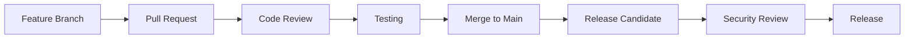

# Contributing
{: .no_toc }

Learn how to contribute to the Symbiont project, from reporting issues to submitting code changes.
{: .fs-6 .fw-300 }

## Table of contents
{: .no_toc .text-delta }

1. TOC
{:toc}

---

## Overview

Symbiont welcomes contributions from the community! Whether you're fixing bugs, adding features, improving documentation, or providing feedback, your contributions help make Symbiont better for everyone.

### Ways to Contribute

- **🐛 Bug Reports**: Help identify and resolve issues
- **💡 Feature Requests**: Suggest new capabilities and improvements
- **📝 Documentation**: Improve guides, examples, and API documentation
- **🔧 Code Contributions**: Fix bugs and implement new features
- **🔒 Security**: Report security vulnerabilities responsibly
- **🧪 Testing**: Add test cases and improve test coverage

---

## Getting Started

### Prerequisites

Before contributing, ensure you have:

- **Rust 1.88+** with cargo
- **Git** for version control
- **Docker** for testing and development
- **Basic knowledge** of Rust, security principles, and AI systems

### Development Environment Setup

1. **Fork and Clone the Repository**
```bash
# Fork the repository on GitHub, then clone your fork
git clone https://github.com/YOUR_USERNAME/symbiont.git
cd symbiont

# Add upstream remote
git remote add upstream https://github.com/thirdkeyai/symbiont.git
```

2. **Set Up Development Environment**
```bash
# Install Rust dependencies
rustup update
rustup component add rustfmt clippy

# Install pre-commit hooks
cargo install pre-commit
pre-commit install

# Build the project
cargo build
```

3. **Run Tests**
```bash
# Run all tests
cargo test --workspace

# Run specific test suites
cargo test --package symbiont-dsl
cargo test --package symbiont-runtime

# Run with coverage
cargo tarpaulin --out html
```

4. **Start Development Services**
```bash
# Start required services with Docker Compose
docker-compose up -d redis postgres

# Verify services are running
cargo run --example basic_agent
```

---

## Development Guidelines

### Code Standards

**Rust Code Style:**
- Use `rustfmt` for consistent formatting
- Follow Rust naming conventions
- Write idiomatic Rust code
- Include comprehensive documentation
- Add unit tests for all new functionality

**Security Requirements:**
- All security-related code must be reviewed
- Cryptographic operations must use approved libraries
- Input validation is required for all public APIs
- Security tests must accompany security features

**Performance Guidelines:**
- Benchmark performance-critical code
- Avoid unnecessary allocations in hot paths
- Use `async`/`await` for I/O operations
- Profile memory usage for resource-intensive features

### Code Organization

```
symbiont/
├── dsl/                    # DSL parser and grammar
│   ├── src/
│   ├── tests/
│   └── tree-sitter-symbiont/
├── runtime/                # Core runtime system
│   ├── src/
│   │   ├── api/           # HTTP API (optional)
│   │   ├── context/       # Context management
│   │   ├── integrations/  # External integrations
│   │   ├── rag/           # RAG engine
│   │   ├── scheduler/     # Task scheduling
│   │   └── types/         # Core type definitions
│   ├── examples/          # Usage examples
│   ├── tests/             # Integration tests
│   └── docs/              # Technical documentation
├── enterprise/             # Enterprise features
│   └── src/
└── docs/                  # Community documentation
```

### Commit Guidelines

**Commit Message Format:**
```
<type>(<scope>): <description>

[optional body]

[optional footer]
```

**Types:**
- `feat`: New feature
- `fix`: Bug fix
- `docs`: Documentation changes
- `style`: Code style changes (formatting, etc.)
- `refactor`: Code refactoring
- `test`: Adding or updating tests
- `chore`: Maintenance tasks

**Examples:**
```bash
feat(runtime): add multi-tier sandbox support

Implements Docker, gVisor, and Firecracker isolation tiers with
automatic risk assessment and tier selection.

Closes #123

fix(dsl): resolve parser error with nested policy blocks

The parser was incorrectly handling nested policy definitions,
causing syntax errors for complex security configurations.

docs(security): update cryptographic implementation details

Add detailed documentation for Ed25519 signature implementation
and key management procedures.
```

---

## Types of Contributions

### Bug Reports

When reporting bugs, please include:

**Required Information:**
- Symbiont version and platform
- Minimal reproduction steps
- Expected vs. actual behavior
- Error messages and logs
- Environment details

**Bug Report Template:**
```markdown
## Bug Description
Brief description of the issue

## Steps to Reproduce
1. Step one
2. Step two
3. Step three

## Expected Behavior
What should happen

## Actual Behavior
What actually happens

## Environment
- OS: [e.g., Ubuntu 22.04]
- Rust version: [e.g., 1.88.0]
- Symbiont version: [e.g., 1.0.0]
- Docker version: [if applicable]

## Additional Context
Any other relevant information
```

### Feature Requests

**Feature Request Process:**
1. Check existing issues for similar requests
2. Create a detailed feature request issue
3. Participate in discussion and design
4. Implement the feature following guidelines

**Feature Request Template:**
```markdown
## Feature Description
Clear description of the proposed feature

## Motivation
Why is this feature needed? What problem does it solve?

## Detailed Design
How should this feature work? Include examples if possible.

## Alternatives Considered
What other solutions were considered?

## Implementation Notes
Any technical considerations or constraints
```

### Code Contributions

**Pull Request Process:**

1. **Create Feature Branch**
```bash
git checkout -b feature/descriptive-name
```

2. **Implement Changes**
- Write code following style guidelines
- Add comprehensive tests
- Update documentation as needed
- Ensure all tests pass

3. **Commit Changes**
```bash
git add .
git commit -m "feat(component): descriptive commit message"
```

4. **Push and Create PR**
```bash
git push origin feature/descriptive-name
# Create pull request on GitHub
```

**Pull Request Requirements:**
- [ ] All tests pass
- [ ] Code follows style guidelines
- [ ] Documentation is updated
- [ ] Security implications are considered
- [ ] Performance impact is assessed
- [ ] Breaking changes are documented

### Documentation Contributions

**Documentation Types:**
- **User Guides**: Help users understand and use features
- **API Documentation**: Technical reference for developers
- **Examples**: Working code examples and tutorials
- **Architecture Docs**: System design and implementation details

**Documentation Standards:**
- Write clear, concise prose
- Include working code examples
- Use consistent formatting and style
- Test all code examples
- Update related documentation

**Documentation Structure:**
```markdown
---
layout: default
title: Page Title
nav_order: N
description: "Brief page description"
---

# Page Title
{: .no_toc }

Brief introduction paragraph.
{: .fs-6 .fw-300 }

## Table of contents
{: .no_toc .text-delta }

1. TOC
{:toc}

---

## Content sections...
```

---

## Testing Guidelines

### Test Types

**Unit Tests:**
- Test individual functions and modules
- Mock external dependencies
- Fast execution (<1s per test)

```rust
#[cfg(test)]
mod tests {
    use super::*;

    #[test]
    fn test_policy_evaluation() {
        let policy = Policy::new("test_policy", PolicyRules::default());
        let context = PolicyContext::new();
        let result = policy.evaluate(&context);
        assert_eq!(result, PolicyDecision::Allow);
    }
}
```

**Integration Tests:**
- Test component interactions
- Use real dependencies where possible
- Moderate execution time (<10s per test)

```rust
#[tokio::test]
async fn test_agent_lifecycle() {
    let runtime = test_runtime().await;
    let agent_config = AgentConfig::default();
    
    let agent_id = runtime.create_agent(agent_config).await.unwrap();
    let status = runtime.get_agent_status(agent_id).await.unwrap();
    
    assert_eq!(status, AgentStatus::Ready);
}
```

**Security Tests:**
- Test security controls and policies
- Verify cryptographic operations
- Test attack scenarios

```rust
#[tokio::test]
async fn test_sandbox_isolation() {
    let sandbox = create_test_sandbox(SecurityTier::Tier2).await;
    
    // Attempt to access restricted resource
    let result = sandbox.execute_malicious_code().await;
    
    // Should be blocked by security controls
    assert!(result.is_err());
    assert_eq!(result.unwrap_err(), SandboxError::AccessDenied);
}
```

### Test Data

**Test Fixtures:**
- Use consistent test data across tests
- Avoid hardcoded values where possible
- Clean up test data after execution

```rust
pub fn create_test_agent_config() -> AgentConfig {
    AgentConfig {
        id: AgentId::new(),
        name: "test_agent".to_string(),
        security_tier: SecurityTier::Tier1,
        memory_limit: 512 * 1024 * 1024, // 512MB
        capabilities: vec!["test".to_string()],
        policies: vec![],
        metadata: HashMap::new(),
    }
}
```

---

## Security Considerations

### Security Review Process

**Security-Sensitive Changes:**
All changes affecting security must undergo additional review:

- Cryptographic implementations
- Authentication and authorization
- Input validation and sanitization
- Sandbox and isolation mechanisms
- Audit and logging systems

**Security Review Checklist:**
- [ ] Threat model updated if necessary
- [ ] Security tests added
- [ ] Cryptographic libraries are approved
- [ ] Input validation is comprehensive
- [ ] Error handling doesn't leak information
- [ ] Audit logging is complete

### Vulnerability Reporting

**Responsible Disclosure:**
If you discover a security vulnerability:

1. **DO NOT** create a public issue
2. Email security@thirdkey.ai with details
3. Provide reproduction steps if possible
4. Allow time for investigation and fix
5. Coordinate disclosure timeline

**Security Report Template:**
```
Subject: Security Vulnerability in Symbiont

Component: [affected component]
Severity: [critical/high/medium/low]
Description: [detailed description]
Reproduction: [steps to reproduce]
Impact: [potential impact]
Suggested Fix: [if applicable]
```

---

## Review Process

### Code Review Guidelines

**For Authors:**
- Keep changes focused and atomic
- Write clear commit messages
- Add tests for new functionality
- Update documentation as needed
- Respond promptly to review feedback

**For Reviewers:**
- Focus on code correctness and security
- Check for adherence to guidelines
- Verify test coverage is adequate
- Ensure documentation is updated
- Be constructive and helpful

**Review Criteria:**
- **Correctness**: Does the code work as intended?
- **Security**: Are there any security implications?
- **Performance**: Is performance acceptable?
- **Maintainability**: Is the code readable and maintainable?
- **Testing**: Are tests comprehensive and reliable?

### Merge Requirements

**All PRs Must:**
- [ ] Pass all automated tests
- [ ] Have at least one approving review
- [ ] Include updated documentation
- [ ] Follow coding standards
- [ ] Include appropriate tests

**Security-Sensitive PRs Must:**
- [ ] Have security team review
- [ ] Include security tests
- [ ] Update threat model if needed
- [ ] Have audit trail documentation

---

## Community Guidelines

### Code of Conduct

We are committed to providing a welcoming and inclusive environment for all contributors. Please read and follow our [Code of Conduct](CODE_OF_CONDUCT.md).

**Key Principles:**
- **Respect**: Treat all community members with respect
- **Inclusion**: Welcome diverse perspectives and backgrounds
- **Collaboration**: Work together constructively
- **Learning**: Support learning and growth
- **Quality**: Maintain high standards for code and behavior

### Communication

**Channels:**
- **GitHub Issues**: Bug reports and feature requests
- **GitHub Discussions**: General questions and ideas
- **Pull Requests**: Code review and collaboration
- **Email**: security@thirdkey.ai for security issues

**Communication Guidelines:**
- Be clear and concise
- Stay on topic
- Be patient and helpful
- Use inclusive language
- Respect different viewpoints

---

## Recognition

### Contributors

We recognize and appreciate all forms of contribution:

- **Code Contributors**: Listed in CONTRIBUTORS.md
- **Documentation Contributors**: Credited in documentation
- **Bug Reporters**: Mentioned in release notes
- **Security Researchers**: Credited in security advisories

### Contributor Levels

**Community Contributor:**
- Submit pull requests
- Report bugs and issues
- Participate in discussions

**Regular Contributor:**
- Consistent quality contributions
- Help review pull requests
- Mentor new contributors

**Maintainer:**
- Core team member
- Merge permissions
- Release management
- Project direction

---

## Getting Help

### Resources

- **Documentation**: Complete guides and references
- **Examples**: Working code examples in `/examples`
- **Tests**: Test cases showing expected behavior
- **Issues**: Search existing issues for solutions

### Support Channels

**Community Support:**
- GitHub Issues for bugs and feature requests
- GitHub Discussions for questions and ideas
- Stack Overflow with `symbiont` tag

**Direct Support:**
- Email: support@thirdkey.ai
- Security: security@thirdkey.ai

### FAQ

**Q: How do I get started contributing?**
A: Start by setting up the development environment, reading the documentation, and looking for "good first issue" labels.

**Q: What skills do I need to contribute?**
A: Rust programming, basic security knowledge, and familiarity with AI/ML concepts are helpful but not required for all contributions.

**Q: How long does code review take?**
A: Typically 1-3 business days for small changes, longer for complex or security-sensitive changes.

**Q: Can I contribute without writing code?**
A: Yes! Documentation, testing, bug reports, and feature requests are valuable contributions.

---

## Release Process

### Development Workflow



### Versioning

Symbiont follows [Semantic Versioning](https://semver.org/):

- **Major** (X.0.0): Breaking changes
- **Minor** (0.X.0): New features, backward compatible
- **Patch** (0.0.X): Bug fixes, backward compatible

### Release Schedule

- **Patch releases**: As needed for critical fixes
- **Minor releases**: Monthly for new features
- **Major releases**: Quarterly for significant changes

---

## Next Steps

Ready to contribute? Here's how to get started:

1. **[Set up your development environment](#development-environment-setup)**
2. **[Find a good first issue](https://github.com/thirdkeyai/symbiont/labels/good%20first%20issue)**
3. **[Join the discussion](https://github.com/thirdkeyai/symbiont/discussions)**
4. **[Read the technical documentation](/runtime-architecture)**

Thank you for your interest in contributing to Symbiont! Your contributions help build the future of secure, AI-native software development.