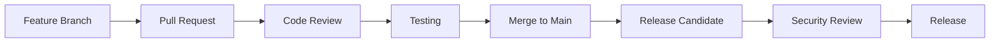

# 贡献指南
{: .no_toc }

## 其他语言
{: .no_toc}

[English](contributing.md) | **中文简体** | [Español](contributing.es.md) | [Português](contributing.pt.md) | [日本語](contributing.ja.md) | [Deutsch](contributing.de.md)

---

了解如何为 Symbiont 项目做贡献，从报告问题到提交代码变更。
{: .fs-6 .fw-300 }

## 目录
{: .no_toc .text-delta }

1. TOC
{:toc}

---

## 概述

Symbiont 欢迎来自社区的贡献！无论您是修复 bug、添加功能、改进文档还是提供反馈，您的贡献都有助于让 Symbiont 变得更好。

### 贡献方式

- **Bug 报告**：帮助识别和解决问题
- **功能请求**：建议新功能和改进
- **文档**：改进指南、示例和 API 文档
- **代码贡献**：修复 bug 和实现新功能
- **安全**：负责任地报告安全漏洞
- **测试**：添加测试用例和提高测试覆盖率

---

## 入门指南

### 前提条件

在贡献之前，请确保您拥有：

- **Rust 1.88+** 及 cargo
- **Git** 版本控制
- **Docker** 用于测试和开发
- **基本知识**：Rust、安全原则和 AI 系统

### 开发环境设置

1. **Fork 并克隆仓库**
```bash
# Fork the repository on GitHub, then clone your fork
git clone https://github.com/YOUR_USERNAME/symbiont.git
cd symbiont

# Add upstream remote
git remote add upstream https://github.com/thirdkeyai/symbiont.git
```

2. **设置开发环境**
```bash
# Install Rust dependencies
rustup update
rustup component add rustfmt clippy

# Install pre-commit hooks
cargo install pre-commit
pre-commit install

# Build the project
cargo build
```

3. **运行测试**
```bash
# Run all tests
cargo test --workspace

# Run specific test suites
cargo test --package symbiont-dsl
cargo test --package symbiont-runtime

# Run with coverage
cargo tarpaulin --out html
```

4. **启动开发服务**
```bash
# Start required services with Docker Compose
docker-compose up -d redis postgres

# Verify services are running
cargo run --example basic_agent
```

---

## 开发规范

### 代码标准

**Rust 代码风格：**
- 使用 `rustfmt` 保持一致的格式
- 遵循 Rust 命名约定
- 编写地道的 Rust 代码
- 包含全面的文档
- 为所有新功能添加单元测试

**安全要求：**
- 所有安全相关代码必须经过审查
- 加密操作必须使用经过批准的库
- 所有公共 API 都需要输入验证
- 安全特性必须附带安全测试

**性能准则：**
- 对性能关键代码进行基准测试
- 避免在热路径中进行不必要的分配
- 对 I/O 操作使用 `async`/`await`
- 对资源密集型功能进行内存分析

### 代码组织

```
symbiont/
├── dsl/                    # DSL parser and grammar
│   ├── src/
│   ├── tests/
│   └── tree-sitter-symbiont/
├── runtime/                # Core runtime system
│   ├── src/
│   │   ├── api/           # HTTP API (optional)
│   │   ├── context/       # Context management
│   │   ├── integrations/  # External integrations
│   │   ├── rag/           # RAG engine
│   │   ├── scheduler/     # Task scheduling
│   │   └── types/         # Core type definitions
│   ├── examples/          # Usage examples
│   ├── tests/             # Integration tests
│   └── docs/              # Technical documentation
├── enterprise/             # Enterprise features
│   └── src/
└── docs/                  # Community documentation
```

### 提交规范

**提交信息格式：**
```
<type>(<scope>): <description>

[optional body]

[optional footer]
```

**类型：**
- `feat`：新功能
- `fix`：Bug 修复
- `docs`：文档变更
- `style`：代码风格变更（格式化等）
- `refactor`：代码重构
- `test`：添加或更新测试
- `chore`：维护任务

**示例：**
```bash
feat(runtime): add multi-tier sandbox support

Implements Docker, gVisor, and Firecracker isolation tiers with
automatic risk assessment and tier selection.

Closes #123

fix(dsl): resolve parser error with nested policy blocks

The parser was incorrectly handling nested policy definitions,
causing syntax errors for complex security configurations.

docs(security): update cryptographic implementation details

Add detailed documentation for Ed25519 signature implementation
and key management procedures.
```

---

## 贡献类型

### Bug 报告

报告 bug 时，请包含以下信息：

**必需信息：**
- Symbiont 版本和平台
- 最小化的复现步骤
- 预期行为与实际行为
- 错误消息和日志
- 环境详情

**Bug 报告模板：**
```markdown
## Bug Description
Brief description of the issue

## Steps to Reproduce
1. Step one
2. Step two
3. Step three

## Expected Behavior
What should happen

## Actual Behavior
What actually happens

## Environment
- OS: [e.g., Ubuntu 22.04]
- Rust version: [e.g., 1.88.0]
- Symbiont version: [e.g., 1.0.0]
- Docker version: [if applicable]

## Additional Context
Any other relevant information
```

### 功能请求

**功能请求流程：**
1. 检查现有 issue 中是否有类似请求
2. 创建详细的功能请求 issue
3. 参与讨论和设计
4. 按照规范实现功能

**功能请求模板：**
```markdown
## Feature Description
Clear description of the proposed feature

## Motivation
Why is this feature needed? What problem does it solve?

## Detailed Design
How should this feature work? Include examples if possible.

## Alternatives Considered
What other solutions were considered?

## Implementation Notes
Any technical considerations or constraints
```

### 代码贡献

**Pull Request 流程：**

1. **创建功能分支**
```bash
git checkout -b feature/descriptive-name
```

2. **实现变更**
- 按照风格指南编写代码
- 添加全面的测试
- 根据需要更新文档
- 确保所有测试通过

3. **提交变更**
```bash
git add .
git commit -m "feat(component): descriptive commit message"
```

4. **推送并创建 PR**
```bash
git push origin feature/descriptive-name
# Create pull request on GitHub
```

**Pull Request 要求：**
- [ ] 所有测试通过
- [ ] 代码符合风格指南
- [ ] 文档已更新
- [ ] 已考虑安全影响
- [ ] 已评估性能影响
- [ ] 已记录破坏性变更

### 文档贡献

**文档类型：**
- **用户指南**：帮助用户理解和使用功能
- **API 文档**：面向开发者的技术参考
- **示例**：可运行的代码示例和教程
- **架构文档**：系统设计和实现细节

**文档标准：**
- 编写清晰、简洁的文字
- 包含可运行的代码示例
- 使用一致的格式和风格
- 测试所有代码示例
- 更新相关文档

**文档结构：**
```markdown
---
layout: default
title: Page Title
nav_order: N
description: "Brief page description"
---

# Page Title
{: .no_toc }

Brief introduction paragraph.
{: .fs-6 .fw-300 }

## Table of contents
{: .no_toc .text-delta }

1. TOC
{:toc}

---

## Content sections...
```

---

## 测试规范

### 测试类型

**单元测试：**
- 测试独立的函数和模块
- Mock 外部依赖
- 快速执行（每个测试 <1 秒）

```rust
#[cfg(test)]
mod tests {
    use super::*;

    #[test]
    fn test_policy_evaluation() {
        let policy = Policy::new("test_policy", PolicyRules::default());
        let context = PolicyContext::new();
        let result = policy.evaluate(&context);
        assert_eq!(result, PolicyDecision::Allow);
    }
}
```

**集成测试：**
- 测试组件交互
- 尽可能使用真实依赖
- 中等执行时间（每个测试 <10 秒）

```rust
#[tokio::test]
async fn test_agent_lifecycle() {
    let runtime = test_runtime().await;
    let agent_config = AgentConfig::default();

    let agent_id = runtime.create_agent(agent_config).await.unwrap();
    let status = runtime.get_agent_status(agent_id).await.unwrap();

    assert_eq!(status, AgentStatus::Ready);
}
```

**安全测试：**
- 测试安全控制和策略
- 验证加密操作
- 测试攻击场景

```rust
#[tokio::test]
async fn test_sandbox_isolation() {
    let sandbox = create_test_sandbox(SecurityTier::Tier2).await;

    // Attempt to access restricted resource
    let result = sandbox.execute_malicious_code().await;

    // Should be blocked by security controls
    assert!(result.is_err());
    assert_eq!(result.unwrap_err(), SandboxError::AccessDenied);
}
```

### 测试数据

**测试 Fixture：**
- 在测试间使用一致的测试数据
- 尽可能避免硬编码值
- 执行后清理测试数据

```rust
pub fn create_test_agent_config() -> AgentConfig {
    AgentConfig {
        id: AgentId::new(),
        name: "test_agent".to_string(),
        security_tier: SecurityTier::Tier1,
        memory_limit: 512 * 1024 * 1024, // 512MB
        capabilities: vec!["test".to_string()],
        policies: vec![],
        metadata: HashMap::new(),
    }
}
```

---

## 安全注意事项

### 安全审查流程

**安全敏感变更：**
所有影响安全的变更必须经过额外审查：

- 加密实现
- 身份验证和授权
- 输入验证和清理
- 沙箱和隔离机制
- 审计和日志系统

**安全审查清单：**
- [ ] 如有必要已更新威胁模型
- [ ] 已添加安全测试
- [ ] 加密库已获批准
- [ ] 输入验证全面
- [ ] 错误处理不会泄露信息
- [ ] 审计日志完整

### 漏洞报告

**负责任的披露：**
如果您发现了安全漏洞：

1. **不要**创建公开的 issue
2. 发送详情到 security@thirdkey.ai
3. 如可能提供复现步骤
4. 留出调查和修复的时间
5. 协调披露时间表

**安全报告模板：**
```
Subject: Security Vulnerability in Symbiont

Component: [affected component]
Severity: [critical/high/medium/low]
Description: [detailed description]
Reproduction: [steps to reproduce]
Impact: [potential impact]
Suggested Fix: [if applicable]
```

---

## 审查流程

### 代码审查规范

**对于作者：**
- 保持变更聚焦和原子化
- 编写清晰的提交信息
- 为新功能添加测试
- 根据需要更新文档
- 及时回应审查反馈

**对于审查者：**
- 关注代码正确性和安全性
- 检查是否遵守规范
- 验证测试覆盖是否充分
- 确保文档已更新
- 给出建设性和有帮助的意见

**审查标准：**
- **正确性**：代码是否按预期工作？
- **安全性**：是否有安全影响？
- **性能**：性能是否可接受？
- **可维护性**：代码是否可读且可维护？
- **测试**：测试是否全面且可靠？

### 合并要求

**所有 PR 必须：**
- [ ] 通过所有自动化测试
- [ ] 至少有一个批准的审查
- [ ] 包含更新的文档
- [ ] 遵循编码标准
- [ ] 包含适当的测试

**安全敏感的 PR 必须：**
- [ ] 经过安全团队审查
- [ ] 包含安全测试
- [ ] 如需要则更新威胁模型
- [ ] 包含审计追踪文档

---

## 社区准则

### 行为准则

我们致力于为所有贡献者提供一个友好和包容的环境。请阅读并遵守我们的[行为准则](CODE_OF_CONDUCT.md)。

**核心原则：**
- **尊重**：尊重所有社区成员
- **包容**：欢迎不同的观点和背景
- **协作**：建设性地合作
- **学习**：支持学习和成长
- **质量**：对代码和行为保持高标准

### 沟通

**渠道：**
- **GitHub Issues**：Bug 报告和功能请求
- **GitHub Discussions**：一般性问题和想法
- **Pull Requests**：代码审查和协作
- **邮件**：security@thirdkey.ai 用于安全问题

**沟通准则：**
- 清晰简洁
- 紧扣主题
- 耐心和乐于助人
- 使用包容性语言
- 尊重不同观点

---

## 认可

### 贡献者

我们认可和感谢所有形式的贡献：

- **代码贡献者**：在 CONTRIBUTORS.md 中列出
- **文档贡献者**：在文档中标注
- **Bug 报告者**：在发行说明中提及
- **安全研究者**：在安全公告中标注

### 贡献者级别

**社区贡献者：**
- 提交 pull request
- 报告 bug 和 issue
- 参与讨论

**常规贡献者：**
- 持续提供高质量的贡献
- 帮助审查 pull request
- 指导新贡献者

**维护者：**
- 核心团队成员
- 合并权限
- 发布管理
- 项目方向

---

## 获取帮助

### 资源

- **文档**：完整的指南和参考
- **示例**：`/examples` 中的可运行代码示例
- **测试**：展示预期行为的测试用例
- **Issues**：搜索现有 issue 寻找解决方案

### 支持渠道

**社区支持：**
- GitHub Issues 用于 bug 和功能请求
- GitHub Discussions 用于问题和想法
- Stack Overflow 使用 `symbiont` 标签

**直接支持：**
- 邮件：support@thirdkey.ai
- 安全：security@thirdkey.ai

### 常见问题

**问：如何开始贡献？**
答：首先设置开发环境，阅读文档，然后寻找标有 "good first issue" 标签的 issue。

**问：贡献需要什么技能？**
答：Rust 编程、基本安全知识和对 AI/ML 概念的了解很有帮助，但并非所有贡献都需要这些。

**问：代码审查需要多长时间？**
答：小变更通常需要 1-3 个工作日，复杂或安全敏感的变更需要更长时间。

**问：可以不写代码就贡献吗？**
答：可以！文档、测试、bug 报告和功能请求都是有价值的贡献。

---

## 发布流程

### 开发工作流



### 版本管理

Symbiont 遵循[语义化版本](https://semver.org/)：

- **主版本** (X.0.0)：破坏性变更
- **次版本** (0.X.0)：新功能，向后兼容
- **修订版本** (0.0.X)：Bug 修复，向后兼容

### 发布计划

- **修订版发布**：根据需要发布关键修复
- **次版本发布**：每月发布新功能
- **主版本发布**：每季度发布重大变更

---

## 下一步

准备好贡献了吗？以下是入门方法：

1. **[设置开发环境](#开发环境设置)**
2. **[寻找适合新手的 issue](https://github.com/thirdkeyai/symbiont/labels/good%20first%20issue)**
3. **[加入讨论](https://github.com/thirdkeyai/symbiont/discussions)**
4. **[阅读技术文档](/runtime-architecture)**

感谢您有兴趣为 Symbiont 做贡献！您的贡献有助于构建安全的 AI 原生软件开发的未来。
