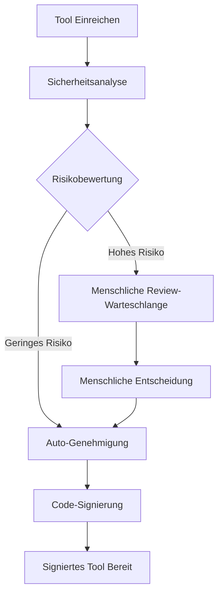

# API-Referenz

Dieses Dokument bietet umfassende Dokumentation fuer die Symbiont Runtime-APIs. Das Symbiont-Projekt stellt zwei unterschiedliche API-Systeme bereit, die fuer verschiedene Anwendungsfaelle und Entwicklungsstadien konzipiert sind.

## Ueberblick

Symbiont bietet zwei API-Schnittstellen:

1. **Runtime HTTP API** - Eine vollstaendige API fuer direkte Runtime-Interaktion, Agent-Management und Workflow-Ausfuehrung
2. **Tool Review API (Produktion)** - Eine umfassende, produktionsbereite API fuer KI-gesteuerte Tool-Review- und Signaturworkflows

---

## Runtime HTTP API

Die Runtime HTTP API bietet direkten Zugang zur Symbiont Runtime fuer Workflow-Ausfuehrung, Agent-Management und Systemueberwachung. Alle Endpunkte sind vollstaendig implementiert und produktionsbereit, wenn das `http-api` Feature aktiviert ist.

### Basis-URL
```
http://127.0.0.1:8080/api/v1
```

### Authentifizierung

Die Agentenverwaltungs-Endpunkte erfordern eine Authentifizierung mit Bearer-Token. Setzen Sie die Umgebungsvariable `API_AUTH_TOKEN` und fuegen Sie das Token im Authorization-Header hinzu:

```
Authorization: Bearer <your-token>
```

**Geschuetzte Endpunkte:**
- Alle Endpunkte unter `/api/v1/agents/*` erfordern Authentifizierung
- Die Endpunkte `/api/v1/health`, `/api/v1/workflows/execute` und `/api/v1/metrics` erfordern keine Authentifizierung

### Verfuegbare Endpunkte

#### Gesundheitspruefung
```http
GET /api/v1/health
```

Gibt den aktuellen Systemgesundheitsstatus und grundlegende Runtime-Informationen zurueck.

**Response (200 OK):**
```json
{
  "status": "healthy",
  "uptime_seconds": 3600,
  "timestamp": "2024-01-15T10:30:00Z",
  "version": "1.0.0"
}
```

**Response (500 Interner Serverfehler):**
```json
{
  "status": "unhealthy",
  "error": "Database connection failed",
  "timestamp": "2024-01-15T10:30:00Z"
}
```

### Verfuegbare Endpunkte

#### Workflow-Ausfuehrung
```http
POST /api/v1/workflows/execute
```

Fuehrt einen Workflow mit angegebenen Parametern aus.

**Request Body:**
```json
{
  "workflow_id": "string",
  "parameters": {},
  "agent_id": "optional-agent-id"
}
```

**Response (200 OK):**
```json
{
  "result": "workflow execution result"
}
```

#### Agent-Management

Alle Agent-Management-Endpunkte erfordern Authentifizierung ueber den `Authorization: Bearer <token>` Header.

##### Agenten auflisten
```http
GET /api/v1/agents
Authorization: Bearer <your-token>
```

Ruft eine Liste aller aktiven Agenten in der Runtime ab.

**Response (200 OK):**
```json
[
  "agent-id-1",
  "agent-id-2",
  "agent-id-3"
]
```

##### Agent-Status abrufen
```http
GET /api/v1/agents/{id}/status
Authorization: Bearer <your-token>
```

Ruft detaillierte Statusinformationen fuer einen bestimmten Agenten ab, einschliesslich Echtzeit-Ausfuehrungsmetriken.

**Response (200 OK):**
```json
{
  "agent_id": "uuid",
  "state": "running|ready|waiting|failed|completed|terminated",
  "last_activity": "2024-01-15T10:30:00Z",
  "scheduled_at": "2024-01-15T10:00:00Z",
  "resource_usage": {
    "memory_usage": 268435456,
    "cpu_usage": 15.5,
    "active_tasks": 1
  },
  "execution_context": {
    "execution_mode": "ephemeral|persistent|scheduled|event_driven",
    "process_id": 12345,
    "uptime": "00:15:30",
    "health_status": "healthy|unhealthy"
  }
}
```

**Neue Agent-Zustaende:**
- `running`: Agent fuehrt aktiv mit einem laufenden Prozess aus
- `ready`: Agent ist initialisiert und bereit zur Ausfuehrung
- `waiting`: Agent wartet in der Warteschlange auf Ausfuehrung
- `failed`: Agent-Ausfuehrung fehlgeschlagen oder Gesundheitspruefung fehlgeschlagen
- `completed`: Agent-Aufgabe erfolgreich abgeschlossen
- `terminated`: Agent wurde ordnungsgemaess oder erzwungen beendet

##### Agent erstellen
```http
POST /api/v1/agents
Authorization: Bearer <your-token>
```

Erstellt einen neuen Agenten mit der angegebenen Konfiguration.

**Request Body:**
```json
{
  "name": "my-agent",
  "dsl": "agent definition in DSL format"
}
```

**Response (200 OK):**
```json
{
  "id": "uuid",
  "status": "created"
}
```

##### Agent aktualisieren
```http
PUT /api/v1/agents/{id}
Authorization: Bearer <your-token>
```

Aktualisiert die Konfiguration eines bestehenden Agenten. Mindestens ein Feld muss angegeben werden.

**Request Body:**
```json
{
  "name": "updated-agent-name",
  "dsl": "updated agent definition in DSL format"
}
```

**Response (200 OK):**
```json
{
  "id": "uuid",
  "status": "updated"
}
```

##### Agent loeschen
```http
DELETE /api/v1/agents/{id}
Authorization: Bearer <your-token>
```

Loescht einen bestehenden Agenten aus der Runtime.

**Response (200 OK):**
```json
{
  "id": "uuid",
  "status": "deleted"
}
```

##### Agent ausfuehren
```http
POST /api/v1/agents/{id}/execute
Authorization: Bearer <your-token>
```

Startet die Ausfuehrung eines bestimmten Agenten.

**Request Body:**
```json
{}
```

**Response (200 OK):**
```json
{
  "execution_id": "uuid",
  "status": "execution_started"
}
```

##### Agenten-Ausfuehrungshistorie abrufen
```http
GET /api/v1/agents/{id}/history
Authorization: Bearer <your-token>
```

Ruft die Ausfuehrungshistorie fuer einen bestimmten Agenten ab.

**Response (200 OK):**
```json
{
  "history": [
    {
      "execution_id": "uuid",
      "status": "completed",
      "timestamp": "2024-01-15T10:30:00Z"
    }
  ]
}
```

##### Agent-Heartbeat
```http
POST /api/v1/agents/{id}/heartbeat
Authorization: Bearer <your-token>
```

Sendet einen Heartbeat von einem laufenden Agenten, um seinen Gesundheitsstatus zu aktualisieren.

##### Event an Agent senden
```http
POST /api/v1/agents/{id}/events
Authorization: Bearer <your-token>
```

Sendet ein externes Event an einen laufenden Agenten fuer ereignisgesteuerte Ausfuehrung.

#### System-Metriken
```http
GET /api/v1/metrics
```

Ruft einen umfassenden Metriken-Snapshot ab, der Scheduler, Task-Manager, Load Balancer und Systemressourcen abdeckt.

**Response (200 OK):**
```json
{
  "timestamp": "2026-02-16T12:00:00Z",
  "scheduler": {
    "total_jobs": 12,
    "active_jobs": 8,
    "paused_jobs": 2,
    "failed_jobs": 1,
    "total_runs": 450,
    "successful_runs": 445,
    "dead_letter_count": 2
  },
  "task_manager": {
    "queued_tasks": 3,
    "running_tasks": 5,
    "completed_tasks": 1200,
    "failed_tasks": 15
  },
  "load_balancer": {
    "total_workers": 4,
    "active_workers": 3,
    "requests_per_second": 12.5
  },
  "system": {
    "cpu_usage_percent": 45.2,
    "memory_usage_bytes": 536870912,
    "memory_total_bytes": 17179869184,
    "uptime_seconds": 3600
  }
}
```

Der Metriken-Snapshot kann auch in Dateien (atomischer JSON-Schreibvorgang) oder OTLP-Endpunkte exportiert werden, indem das `MetricsExporter`-System der Runtime verwendet wird. Siehe den Abschnitt [Metriken und Telemetrie](#metriken--telemetrie) weiter unten.

---

### Metriken und Telemetrie

Symbiont unterstuetzt den Export von Laufzeitmetriken an mehrere Backends:

#### Datei-Exporter

Schreibt Metriken-Snapshots als atomische JSON-Dateien (tempfile + rename):

```rust
use symbi_runtime::metrics::{FileMetricsExporter, MetricsExporterConfig};

let exporter = FileMetricsExporter::new("/var/lib/symbi/metrics.json");
exporter.export(&snapshot)?;
```

#### OTLP-Exporter

Sendet Metriken an jeden OpenTelemetry-kompatiblen Endpunkt (erfordert das `metrics` Feature):

```rust
use symbi_runtime::metrics::{OtlpExporter, OtlpExporterConfig, OtlpProtocol};

let config = OtlpExporterConfig {
    endpoint: "http://localhost:4317".to_string(),
    protocol: OtlpProtocol::Grpc,
    ..Default::default()
};
```

#### Composite-Exporter

Fan-Out an mehrere Backends gleichzeitig -- einzelne Export-Fehler werden protokolliert, blockieren aber andere Exporter nicht:

```rust
use symbi_runtime::metrics::CompositeExporter;

let composite = CompositeExporter::new(vec![
    Box::new(file_exporter),
    Box::new(otlp_exporter),
]);
```

#### Hintergrund-Sammlung

Der `MetricsCollector` laeuft als Hintergrund-Thread und sammelt periodisch Snapshots und exportiert sie:

```rust
use symbi_runtime::metrics::MetricsCollector;

let collector = MetricsCollector::new(exporter, interval);
collector.start();
// ... spaeter ...
collector.stop();
```

---

### Skill-Scanning (ClawHavoc)

Der `SkillScanner` untersucht Agent-Skill-Inhalte auf boeswillige Muster, bevor sie geladen werden. Er wird mit **40 integrierten ClawHavoc-Verteidigungsregeln** in 10 Angriffskategorien ausgeliefert:

| Kategorie | Anzahl | Schweregrad | Beispiele |
|-----------|--------|-------------|----------|
| Urspruengliche Verteidigungsregeln | 10 | Critical/Warning | `pipe-to-shell`, `eval-with-fetch`, `rm-rf-pattern` |
| Reverse Shells | 7 | Critical | bash, nc, ncat, mkfifo, python, perl, ruby |
| Credential Harvesting | 6 | High | SSH-Schluessel, AWS-Zugangsdaten, Cloud-Konfiguration, Browser-Cookies, Keychain |
| Netzwerk-Exfiltration | 3 | High | DNS-Tunnel, `/dev/tcp`, netcat outbound |
| Prozessinjektion | 4 | Critical | ptrace, LD_PRELOAD, `/proc/mem`, gdb attach |
| Privilegien-Eskalation | 5 | High | sudo, setuid, setcap, chown root, nsenter |
| Symlink- / Pfadtraversal | 2 | Medium | Symlink-Escape, tiefe Pfadtraversal |
| Downloader-Ketten | 3 | Medium | curl save, wget save, chmod exec |

Siehe das [Sicherheitsmodell](/security-model#clawhavoc-skill-scanner) fuer die vollstaendige Regelliste und das Schweregrad-Modell.

#### Verwendung

```rust
use symbi_runtime::skills::SkillScanner;

let scanner = SkillScanner::new(); // enthaelt alle 40 Standardregeln
let result = scanner.scan_skill("/path/to/skill/");

if !result.passed {
    for finding in &result.findings {
        eprintln!("[{}] {}: {} (line {})",
            finding.severity, finding.rule, finding.message, finding.line);
    }
}
```

Benutzerdefinierte Deny-Muster koennen neben den Standards hinzugefuegt werden:

```rust
let scanner = SkillScanner::with_custom_rules(vec![
    ("custom-pattern".into(), r"my_dangerous_pattern".into(),
     ScanSeverity::Warning, "Custom rule description".into()),
]);
```

### Server-Konfiguration

Der Runtime HTTP API-Server kann mit den folgenden Optionen konfiguriert werden:

- **Standard-Bind-Adresse**: `127.0.0.1:8080`
- **CORS-Unterstuetzung**: Konfigurierbar fuer Entwicklung
- **Request-Tracing**: Aktiviert ueber Tower-Middleware
- **Feature Gate**: Verfuegbar hinter dem `http-api` Cargo-Feature

---

### Feature-Konfigurationsreferenz

#### Cloud-LLM-Inferenz (`cloud-llm`)

Verbindung zu Cloud-LLM-Anbietern ueber OpenRouter fuer Agent-Reasoning:

```bash
cargo build --features cloud-llm
```

**Umgebungsvariablen:**
- `OPENROUTER_API_KEY` -- Ihr OpenRouter-API-Schluessel (erforderlich)
- `OPENROUTER_MODEL` -- Zu verwendendes Modell (Standard: `google/gemini-2.0-flash-001`)

Der Cloud-LLM-Anbieter integriert sich in die `execute_actions()`-Pipeline der Reasoning-Schleife. Er unterstuetzt Streaming-Antworten, automatische Wiederholungsversuche mit exponentiellem Backoff und Token-Nutzungsverfolgung.

#### Standalone Agent-Modus (`standalone-agent`)

Kombiniert Cloud-LLM-Inferenz mit Composio-Tool-Zugriff fuer Cloud-native Agenten:

```bash
cargo build --features standalone-agent
# Aktiviert: cloud-llm + composio
```

**Umgebungsvariablen:**
- `OPENROUTER_API_KEY` -- OpenRouter API-Schluessel
- `COMPOSIO_API_KEY` -- Composio API-Schluessel
- `COMPOSIO_MCP_URL` -- Composio MCP-Server-URL

#### Cedar Policy Engine (`cedar`)

Formale Autorisierung mit der [Cedar-Richtliniensprache](https://www.cedarpolicy.com/):

```bash
cargo build --features cedar
```

Cedar-Richtlinien integrieren sich in die Gate-Phase der Reasoning-Schleife und bieten feingranulare Autorisierungsentscheidungen. Siehe das [Sicherheitsmodell](/security-model#cedar-policy-engine) fuer Richtlinienbeispiele.

#### Vektordatenbank-Konfiguration

Symbiont wird mit **LanceDB** als Standard-eingebettetem Vektor-Backend ausgeliefert -- kein externer Dienst erforderlich. Fuer skalierte Deployments ist Qdrant als optionales Backend verfuegbar.

**LanceDB (Standard):**
```toml
[vector_db]
enabled = true
backend = "lancedb"
collection_name = "symbi_knowledge"
```

Keine zusaetzliche Konfiguration erforderlich. Daten werden lokal neben der Runtime gespeichert.

**Qdrant (optional):**
```bash
cargo build --features vector-qdrant
```

```toml
[vector_db]
enabled = true
backend = "qdrant"
collection_name = "symbi_knowledge"
url = "http://localhost:6333"
```

**Umgebungsvariablen:**
- `SYMBIONT_VECTOR_BACKEND` -- `lancedb` (Standard) oder `qdrant`
- `QDRANT_URL` -- Qdrant-Server-URL (nur bei Verwendung von Qdrant)

#### Erweiterte Reasoning-Primitiven (`orga-adaptive`)

Tool-Kuratierung, Stuck-Loop-Erkennung, Kontext-Pre-Fetch und verzeichnisspezifische Konventionen aktivieren:

```bash
cargo build --features orga-adaptive
```

Siehe den [orga-adaptive-Leitfaden](/orga-adaptive) fuer die vollstaendige Konfigurationsreferenz.

---

### Datenstrukturen

#### Kern-Typen
```rust
// Workflow-Ausfuehrungsanfrage
WorkflowExecutionRequest {
    workflow_id: String,
    parameters: serde_json::Value,
    agent_id: Option<AgentId>
}

// Agent-Status-Response
AgentStatusResponse {
    agent_id: AgentId,
    state: AgentState,
    last_activity: DateTime<Utc>,
    resource_usage: ResourceUsage
}

// Gesundheitspruefungs-Response
HealthResponse {
    status: String,
    uptime_seconds: u64,
    timestamp: DateTime<Utc>,
    version: String
}

// Agent-Erstellungsanfrage
CreateAgentRequest {
    name: String,
    dsl: String
}

// Agent-Erstellungsantwort
CreateAgentResponse {
    id: String,
    status: String
}

// Agent-Aktualisierungsanfrage
UpdateAgentRequest {
    name: Option<String>,
    dsl: Option<String>
}

// Agent-Aktualisierungsantwort
UpdateAgentResponse {
    id: String,
    status: String
}

// Agent-Loeschantwort
DeleteAgentResponse {
    id: String,
    status: String
}

// Agent-Ausfuehrungsanfrage
ExecuteAgentRequest {
    // Leere Struktur vorerst
}

// Agent-Ausfuehrungsantwort
ExecuteAgentResponse {
    execution_id: String,
    status: String
}

// Agent-Ausfuehrungseintrag
AgentExecutionRecord {
    execution_id: String,
    status: String,
    timestamp: String
}

// Agenten-Ausfuehrungshistorie-Response
GetAgentHistoryResponse {
    history: Vec<AgentExecutionRecord>
}
```

### Runtime Provider Interface

Die API implementiert ein `RuntimeApiProvider` Trait mit den folgenden erweiterten Methoden:

- `execute_workflow()` - Fuehrt einen Workflow mit gegebenen Parametern aus
- `get_agent_status()` - Ruft detaillierten Status mit Echtzeit-Ausfuehrungsmetriken ab
- `get_system_health()` - Ruft den allgemeinen Systemgesundheitsstatus mit Scheduler-Statistiken ab
- `list_agents()` - Listet alle Agenten auf (laufend, wartend und abgeschlossen)
- `shutdown_agent()` - Ordnungsgemaesses Herunterfahren mit Ressourcenbereinigung und Timeout-Behandlung
- `get_metrics()` - Ruft umfassende Systemmetriken einschliesslich Aufgabenstatistiken ab
- `create_agent()` - Erstellt Agenten mit Ausfuehrungsmodus-Spezifikation
- `update_agent()` - Aktualisiert Agent-Konfiguration mit Persistenz
- `delete_agent()` - Loescht Agenten mit ordnungsgemaesser Bereinigung laufender Prozesse
- `execute_agent()` - Startet Ausfuehrung mit Ueberwachung und Gesundheitspruefungen
- `get_agent_history()` - Ruft detaillierte Ausfuehrungshistorie mit Leistungsmetriken ab

#### Scheduling-API

Alle Scheduling-Endpunkte erfordern Authentifizierung. Erfordert das `cron` Feature.

##### Zeitplaene auflisten
```http
GET /api/v1/schedules
Authorization: Bearer <your-token>
```

**Response (200 OK):**
```json
[
  {
    "job_id": "uuid",
    "name": "daily-report",
    "cron_expression": "0 0 9 * * *",
    "timezone": "America/New_York",
    "status": "active",
    "enabled": true,
    "next_run": "2026-03-04T09:00:00Z",
    "run_count": 42
  }
]
```

##### Zeitplan erstellen
```http
POST /api/v1/schedules
Authorization: Bearer <your-token>
```

**Request Body:**
```json
{
  "name": "daily-report",
  "cron_expression": "0 0 9 * * *",
  "timezone": "America/New_York",
  "agent_name": "report-agent",
  "policy_ids": ["policy-1"],
  "one_shot": false
}
```

Der `cron_expression` verwendet sechs Felder: `sec min hour day month weekday` (optionales siebtes Feld fuer Jahr).

**Response (200 OK):**
```json
{
  "job_id": "uuid",
  "next_run": "2026-03-04T09:00:00Z",
  "status": "created"
}
```

##### Zeitplan aktualisieren
```http
PUT /api/v1/schedules/{id}
Authorization: Bearer <your-token>
```

**Request Body (alle Felder optional):**
```json
{
  "cron_expression": "0 */10 * * * *",
  "timezone": "UTC",
  "policy_ids": ["policy-2"],
  "one_shot": true
}
```

##### Zeitplan pausieren / fortsetzen / ausloesen
```http
POST /api/v1/schedules/{id}/pause
POST /api/v1/schedules/{id}/resume
POST /api/v1/schedules/{id}/trigger
Authorization: Bearer <your-token>
```

**Response (200 OK):**
```json
{
  "job_id": "uuid",
  "action": "paused",
  "status": "ok"
}
```

##### Zeitplan loeschen
```http
DELETE /api/v1/schedules/{id}
Authorization: Bearer <your-token>
```

**Response (200 OK):**
```json
{
  "job_id": "uuid",
  "deleted": true
}
```

##### Zeitplan-Historie abrufen
```http
GET /api/v1/schedules/{id}/history
Authorization: Bearer <your-token>
```

**Response (200 OK):**
```json
{
  "job_id": "uuid",
  "history": [
    {
      "run_id": "uuid",
      "started_at": "2026-03-03T09:00:00Z",
      "completed_at": "2026-03-03T09:01:23Z",
      "status": "completed",
      "error": null,
      "execution_time_ms": 83000
    }
  ]
}
```

##### Naechste Laeufe abrufen
```http
GET /api/v1/schedules/{id}/next?count=5
Authorization: Bearer <your-token>
```

**Response (200 OK):**
```json
{
  "job_id": "uuid",
  "next_runs": [
    "2026-03-04T09:00:00Z",
    "2026-03-05T09:00:00Z"
  ]
}
```

##### Scheduler-Gesundheit
```http
GET /api/v1/health/scheduler
```

Gibt Scheduler-spezifische Gesundheits- und Statistikdaten zurueck.

---

#### Channel-Adapter-API

Alle Channel-Endpunkte erfordern Authentifizierung. Verbindet Agenten mit Slack, Microsoft Teams und Mattermost.

##### Channels auflisten
```http
GET /api/v1/channels
Authorization: Bearer <your-token>
```

**Response (200 OK):**
```json
[
  {
    "id": "uuid",
    "name": "slack-general",
    "platform": "slack",
    "status": "running"
  }
]
```

##### Channel registrieren
```http
POST /api/v1/channels
Authorization: Bearer <your-token>
```

**Request Body:**
```json
{
  "name": "slack-general",
  "platform": "slack",
  "config": {
    "webhook_url": "https://hooks.slack.com/...",
    "channel": "#general"
  }
}
```

Unterstuetzte Plattformen: `slack`, `teams`, `mattermost`.

**Response (200 OK):**
```json
{
  "id": "uuid",
  "name": "slack-general",
  "platform": "slack",
  "status": "registered"
}
```

##### Channel abrufen / aktualisieren / loeschen
```http
GET    /api/v1/channels/{id}
PUT    /api/v1/channels/{id}
DELETE /api/v1/channels/{id}
Authorization: Bearer <your-token>
```

##### Channel starten / stoppen
```http
POST /api/v1/channels/{id}/start
POST /api/v1/channels/{id}/stop
Authorization: Bearer <your-token>
```

**Response (200 OK):**
```json
{
  "id": "uuid",
  "action": "started",
  "status": "ok"
}
```

##### Channel-Gesundheit
```http
GET /api/v1/channels/{id}/health
Authorization: Bearer <your-token>
```

**Response (200 OK):**
```json
{
  "id": "uuid",
  "connected": true,
  "platform": "slack",
  "workspace_name": "my-team",
  "channels_active": 3,
  "last_message_at": "2026-03-03T15:42:00Z",
  "uptime_secs": 86400
}
```

##### Identitaetszuordnungen
```http
GET  /api/v1/channels/{id}/mappings
POST /api/v1/channels/{id}/mappings
Authorization: Bearer <your-token>
```

Ordnet Plattform-Benutzer Symbiont-Identitaeten fuer Agent-Interaktionen zu.

##### Channel-Audit-Log
```http
GET /api/v1/channels/{id}/audit
Authorization: Bearer <your-token>
```

---

### Scheduler-Features

**Echte Aufgabenausfuehrung:**
- Prozess-Spawning mit sicheren Ausfuehrungsumgebungen
- Ressourcenueberwachung (Speicher, CPU) mit 5-Sekunden-Intervallen
- Gesundheitspruefungen und automatische Fehlererkennung
- Unterstuetzung fuer ephemere, persistente, geplante und ereignisgesteuerte Ausfuehrungsmodi

**Ordnungsgemaesses Herunterfahren:**
- 30-Sekunden-Frist fuer ordnungsgemaesse Beendigung
- Erzwungene Beendigung fuer nicht reagierende Prozesse
- Ressourcenbereinigung und Metriken-Persistenz
- Warteschlangenbereinigung und Zustandssynchronisierung

### Erweiterte Kontextverwaltung

**Erweiterte Suchfaehigkeiten:**
```json
{
  "query_type": "keyword|temporal|similarity|hybrid",
  "search_terms": ["term1", "term2"],
  "time_range": {
    "start": "2024-01-01T00:00:00Z",
    "end": "2024-01-31T23:59:59Z"
  },
  "memory_types": ["factual", "procedural", "episodic"],
  "relevance_threshold": 0.7,
  "max_results": 10
}
```

**Wichtigkeitsberechnung:**
- Multi-Faktor-Bewertung mit Zugriffshaeufigkeit, Aktualitaet und Benutzerfeedback
- Speichertyp-Gewichtung und Alterungsabklingfaktoren
- Vertrauensbewertungsberechnung fuer geteiltes Wissen

**Zugriffskontrollintegration:**
- Richtlinien-Engine verbunden mit Kontextoperationen
- Agentenspezifischer Zugriff mit sicheren Grenzen
- Wissensaustausch mit granularen Berechtigungen

---

## Tool Review API (Produktion)

Die Tool Review API bietet einen vollstaendigen Workflow zur sicheren Ueberpruefung, Analyse und Signierung von MCP (Model Context Protocol) Tools unter Verwendung KI-gesteuerter Sicherheitsanalyse mit menschlichen Ueberwachungsfaehigkeiten.

### Basis-URL
```
https://your-symbiont-instance.com/api/v1
```

### Authentifizierung
Alle Endpunkte erfordern Bearer JWT-Authentifizierung:
```
Authorization: Bearer <your-jwt-token>
```

### Kern-Workflow

Die Tool Review API folgt diesem Request/Response-Flow:



### Endpunkte

#### Review-Sitzungen

##### Tool zur Ueberpruefung einreichen
```http
POST /sessions
```

Reicht ein MCP-Tool zur Sicherheitsueberpruefung und -analyse ein.

**Request Body:**
```json
{
  "tool_name": "string",
  "tool_version": "string",
  "source_code": "string",
  "metadata": {
    "description": "string",
    "author": "string",
    "permissions": ["array", "of", "permissions"]
  }
}
```

**Response:**
```json
{
  "review_id": "uuid",
  "status": "submitted",
  "created_at": "2024-01-15T10:30:00Z"
}
```

##### Review-Sitzungen auflisten
```http
GET /sessions
```

Ruft eine paginierte Liste von Review-Sitzungen mit optionaler Filterung ab.

**Query-Parameter:**
- `page` (integer): Seitennummer fuer Paginierung
- `limit` (integer): Anzahl der Elemente pro Seite
- `status` (string): Nach Review-Status filtern
- `author` (string): Nach Tool-Autor filtern

**Response:**
```json
{
  "sessions": [
    {
      "review_id": "uuid",
      "tool_name": "string",
      "status": "string",
      "created_at": "2024-01-15T10:30:00Z",
      "updated_at": "2024-01-15T11:00:00Z"
    }
  ],
  "pagination": {
    "page": 1,
    "limit": 20,
    "total": 100,
    "has_next": true
  }
}
```

##### Review-Sitzungsdetails abrufen
```http
GET /sessions/{reviewId}
```

Ruft detaillierte Informationen ueber eine bestimmte Review-Sitzung ab.

**Response:**
```json
{
  "review_id": "uuid",
  "tool_name": "string",
  "tool_version": "string",
  "status": "string",
  "analysis_results": {
    "risk_score": 85,
    "findings": ["array", "of", "security", "findings"],
    "recommendations": ["array", "of", "recommendations"]
  },
  "created_at": "2024-01-15T10:30:00Z",
  "updated_at": "2024-01-15T11:00:00Z"
}
```

#### Sicherheitsanalyse

##### Analyseergebnisse abrufen
```http
GET /analysis/{analysisId}
```

Ruft detaillierte Sicherheitsanalyseergebnisse fuer eine bestimmte Analyse ab.

**Response:**
```json
{
  "analysis_id": "uuid",
  "review_id": "uuid",
  "risk_score": 85,
  "analysis_type": "automated",
  "findings": [
    {
      "severity": "high",
      "category": "code_injection",
      "description": "Potential code injection vulnerability detected",
      "location": "line 42",
      "recommendation": "Sanitize user input before execution"
    }
  ],
  "rag_insights": [
    {
      "knowledge_source": "security_kb",
      "relevance_score": 0.95,
      "insight": "Similar patterns found in known vulnerabilities"
    }
  ],
  "completed_at": "2024-01-15T10:45:00Z"
}
```

#### Menschlicher Review-Workflow

##### Review-Warteschlange abrufen
```http
GET /review/queue
```

Ruft Elemente ab, die auf menschliche Ueberpruefung warten, typischerweise hochriskante Tools, die manuelle Inspektion erfordern.

**Response:**
```json
{
  "pending_reviews": [
    {
      "review_id": "uuid",
      "tool_name": "string",
      "risk_score": 92,
      "priority": "high",
      "assigned_to": "reviewer@example.com",
      "escalated_at": "2024-01-15T11:00:00Z"
    }
  ],
  "queue_stats": {
    "total_pending": 5,
    "high_priority": 2,
    "average_wait_time": "2h 30m"
  }
}
```

##### Review-Entscheidung einreichen
```http
POST /review/{reviewId}/decision
```

Reicht die Entscheidung eines menschlichen Reviewers zu einem Tool-Review ein.

**Request Body:**
```json
{
  "decision": "approve|reject|request_changes",
  "comments": "Detailed review comments",
  "conditions": ["array", "of", "approval", "conditions"],
  "reviewer_id": "reviewer@example.com"
}
```

**Response:**
```json
{
  "review_id": "uuid",
  "decision": "approve",
  "processed_at": "2024-01-15T12:00:00Z",
  "next_status": "approved_for_signing"
}
```

#### Tool-Signierung

##### Signierungsstatus abrufen
```http
GET /signing/{reviewId}
```

Ruft den Signierungsstatus und Signaturinformationen fuer ein ueberprueftes Tool ab.

**Response:**
```json
{
  "review_id": "uuid",
  "signing_status": "completed",
  "signature_info": {
    "algorithm": "RSA-SHA256",
    "key_id": "signing-key-001",
    "signature": "base64-encoded-signature",
    "signed_at": "2024-01-15T12:30:00Z"
  },
  "certificate_chain": ["array", "of", "certificates"]
}
```

##### Signiertes Tool herunterladen
```http
GET /signing/{reviewId}/download
```

Laedt das signierte Tool-Paket mit eingebetteter Signatur und Verifizierungsmetadaten herunter.

**Response:**
Binaerer Download des signierten Tool-Pakets.

#### Statistiken und Ueberwachung

##### Workflow-Statistiken abrufen
```http
GET /stats
```

Ruft umfassende Statistiken und Metriken zum Review-Workflow ab.

**Response:**
```json
{
  "workflow_stats": {
    "total_reviews": 1250,
    "approved": 1100,
    "rejected": 125,
    "pending": 25
  },
  "performance_metrics": {
    "average_review_time": "45m",
    "auto_approval_rate": 0.78,
    "human_review_rate": 0.22
  },
  "security_insights": {
    "common_vulnerabilities": ["sql_injection", "xss", "code_injection"],
    "risk_score_distribution": {
      "low": 45,
      "medium": 35,
      "high": 20
    }
  }
}
```

### Rate Limiting

Die Tool Review API implementiert Rate Limiting pro Endpunkt-Typ:

- **Einreichungs-Endpunkte**: 10 Anfragen pro Minute
- **Abfrage-Endpunkte**: 100 Anfragen pro Minute
- **Download-Endpunkte**: 20 Anfragen pro Minute

Rate Limit-Header sind in allen Responses enthalten:
```
X-RateLimit-Limit: 100
X-RateLimit-Remaining: 95
X-RateLimit-Reset: 1642248000
```

### Fehlerbehandlung

Die API verwendet Standard-HTTP-Statuscodes und gibt detaillierte Fehlerinformationen zurueck:

```json
{
  "error": {
    "code": "INVALID_REQUEST",
    "message": "Tool source code is required",
    "details": {
      "field": "source_code",
      "reason": "missing_required_field"
    }
  }
}
```


---

## Erste Schritte

### Runtime HTTP API

1. Sicherstellen, dass die Runtime mit dem `http-api` Feature gebaut ist:
   ```bash
   cargo build --features http-api
   ```

2. Authentifizierungstoken fuer Agent-Endpunkte setzen:
   ```bash
   export API_AUTH_TOKEN="<your-token>"
   ```

3. Runtime-Server starten:
   ```bash
   ./target/debug/symbiont-runtime --http-api
   ```

4. Ueberpruefen, ob der Server laeuft:
   ```bash
   curl http://127.0.0.1:8080/api/v1/health
   ```

5. Authentifizierten Agent-Endpunkt testen:
   ```bash
   curl -H "Authorization: Bearer $API_AUTH_TOKEN" \
        http://127.0.0.1:8080/api/v1/agents
   ```

### Tool Review API

1. API-Anmeldedaten von Ihrem Symbiont-Administrator erhalten
2. Tool zur Ueberpruefung ueber den `/sessions` Endpunkt einreichen
3. Review-Fortschritt ueber `/sessions/{reviewId}` ueberwachen
4. Signierte Tools von `/signing/{reviewId}/download` herunterladen

## Support

Fuer API-Support und Fragen:
- Ueberpruefen Sie die [Runtime-Architektur-Dokumentation](runtime-architecture.md)
- Konsultieren Sie die [Sicherheitsmodell-Dokumentation](security-model.md)
- Melden Sie Probleme im GitHub-Repository des Projekts
