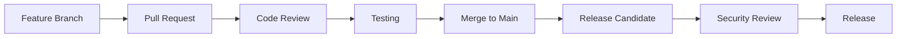

# Mitwirken

## Andere Sprachen


---

Erfahren Sie, wie Sie zum Symbiont-Projekt beitragen koennen -- von der Meldung von Problemen bis zur Einreichung von Codeaenderungen.

## Inhaltsverzeichnis


---

## Ueberblick

Symbiont freut sich ueber Beitraege aus der Community! Ob Sie Bugs beheben, Features hinzufuegen, Dokumentation verbessern oder Feedback geben -- Ihre Beitraege helfen, Symbiont fuer alle besser zu machen.

### Moeglichkeiten zur Mitwirkung

- **Fehlerberichte**: Helfen Sie, Probleme zu identifizieren und zu loesen
- **Feature-Anfragen**: Schlagen Sie neue Faehigkeiten und Verbesserungen vor
- **Dokumentation**: Verbessern Sie Anleitungen, Beispiele und API-Dokumentation
- **Code-Beitraege**: Beheben Sie Bugs und implementieren Sie neue Features
- **Sicherheit**: Melden Sie Sicherheitsluecken verantwortungsvoll
- **Testen**: Fuegen Sie Testfaelle hinzu und verbessern Sie die Testabdeckung

---

## Erste Schritte

### Voraussetzungen

Stellen Sie vor der Mitwirkung sicher, dass Sie Folgendes haben:

- **Rust 1.82+** mit cargo
- **Git** fuer Versionskontrolle
- **Docker** fuer Tests und Entwicklung
- **Grundkenntnisse** in Rust, Sicherheitsprinzipien und KI-Systemen

### Entwicklungsumgebung einrichten

1. **Repository forken und klonen**
```bash
# Repository auf GitHub forken, dann Ihren Fork klonen
git clone https://github.com/YOUR_USERNAME/symbiont.git
cd symbiont

# Upstream-Remote hinzufuegen
git remote add upstream https://github.com/thirdkeyai/symbiont.git
```

2. **Entwicklungsumgebung einrichten**
```bash
# Rust-Abhaengigkeiten installieren
rustup update
rustup component add rustfmt clippy

# Pre-Commit-Hooks installieren
cargo install pre-commit
pre-commit install

# Projekt bauen
cargo build
```

3. **Tests ausfuehren**
```bash
# Alle Tests ausfuehren
cargo test --workspace

# Spezifische Testsuiten ausfuehren
cargo test --package symbiont-dsl
cargo test --package symbiont-runtime

# Mit Coverage ausfuehren
cargo tarpaulin --out html
```

4. **Entwicklungsdienste starten**
```bash
# Erforderliche Dienste mit Docker Compose starten
docker-compose up -d redis postgres

# Dienste ueberpruefen
cargo run --example basic_agent
```

---

## Entwicklungsrichtlinien

### Code-Standards

**Rust-Code-Stil:**
- `rustfmt` fuer konsistente Formatierung verwenden
- Rust-Namenskonventionen befolgen
- Idiomatischen Rust-Code schreiben
- Umfassende Dokumentation einschliessen
- Unit-Tests fuer alle neuen Funktionalitaeten hinzufuegen

**Sicherheitsanforderungen:**
- Gesamter sicherheitsrelevanter Code muss ueberpieft werden
- Kryptographische Operationen muessen zugelassene Bibliotheken verwenden
- Eingabevalidierung ist fuer alle oeffentlichen APIs erforderlich
- Sicherheitstests muessen Sicherheitsfeatures begleiten

**Performance-Richtlinien:**
- Performance-kritischen Code benchmarken
- Unnoetige Allokationen in Hot Paths vermeiden
- `async`/`await` fuer I/O-Operationen verwenden
- Speichernutzung fuer ressourcenintensive Features profilen

### Code-Organisation

```
symbiont/
├── dsl/                    # DSL-Parser und Grammatik
│   ├── src/
│   ├── tests/
│   └── tree-sitter-symbiont/
├── runtime/                # Kern-Laufzeitsystem
│   ├── src/
│   │   ├── api/           # HTTP-API (optional)
│   │   ├── context/       # Kontextverwaltung
│   │   ├── integrations/  # Externe Integrationen
│   │   ├── rag/           # RAG-Engine
│   │   ├── scheduler/     # Aufgabenplanung
│   │   └── types/         # Kern-Typdefinitionen
│   ├── examples/          # Anwendungsbeispiele
│   ├── tests/             # Integrationstests
│   └── docs/              # Technische Dokumentation
├── enterprise/             # Enterprise-Features
│   └── src/
└── docs/                  # Community-Dokumentation
```

### Commit-Richtlinien

**Commit-Nachrichtenformat:**
```
<type>(<scope>): <description>

[optionaler Textkörper]

[optionale Fußzeile]
```

**Typen:**
- `feat`: Neues Feature
- `fix`: Fehlerbehebung
- `docs`: Dokumentationsaenderungen
- `style`: Code-Stilaenderungen (Formatierung, etc.)
- `refactor`: Code-Refactoring
- `test`: Hinzufuegen oder Aktualisieren von Tests
- `chore`: Wartungsaufgaben

**Beispiele:**
```bash
feat(runtime): add multi-tier sandbox support

Implements Docker, gVisor, and Firecracker isolation tiers with
automatic risk assessment and tier selection.

Closes #123

fix(dsl): resolve parser error with nested policy blocks

The parser was incorrectly handling nested policy definitions,
causing syntax errors for complex security configurations.

docs(security): update cryptographic implementation details

Add detailed documentation for Ed25519 signature implementation
and key management procedures.
```

---

## Arten von Beitraegen

### Fehlerberichte

Bitte geben Sie beim Melden von Fehlern Folgendes an:

**Erforderliche Informationen:**
- Symbiont-Version und Plattform
- Minimale Reproduktionsschritte
- Erwartetes vs. tatsaechliches Verhalten
- Fehlermeldungen und Logs
- Umgebungsdetails

**Fehlerbericht-Vorlage:**
```markdown
## Fehlerbeschreibung
Kurze Beschreibung des Problems

## Reproduktionsschritte
1. Schritt eins
2. Schritt zwei
3. Schritt drei

## Erwartetes Verhalten
Was passieren sollte

## Tatsaechliches Verhalten
Was tatsaechlich passiert

## Umgebung
- OS: [z.B. Ubuntu 22.04]
- Rust-Version: [z.B. 1.88.0]
- Symbiont-Version: [z.B. 1.0.0]
- Docker-Version: [falls zutreffend]

## Zusaetzlicher Kontext
Alle weiteren relevanten Informationen
```

### Feature-Anfragen

**Prozess fuer Feature-Anfragen:**
1. Vorhandene Issues nach aehnlichen Anfragen pruefen
2. Detailliertes Feature-Anfrage-Issue erstellen
3. An Diskussion und Design teilnehmen
4. Feature gemaess den Richtlinien implementieren

**Feature-Anfrage-Vorlage:**
```markdown
## Feature-Beschreibung
Klare Beschreibung des vorgeschlagenen Features

## Motivation
Warum wird dieses Feature benoetigt? Welches Problem loest es?

## Detailliertes Design
Wie soll dieses Feature funktionieren? Beispiele einschliessen, wenn moeglich.

## Betrachtete Alternativen
Welche anderen Loesungen wurden in Betracht gezogen?

## Implementierungshinweise
Technische Ueberlegungen oder Einschraenkungen
```

### Code-Beitraege

**Pull-Request-Prozess:**

1. **Feature-Branch erstellen**
```bash
git checkout -b feature/descriptive-name
```

2. **Aenderungen implementieren**
- Code gemaess den Stilrichtlinien schreiben
- Umfassende Tests hinzufuegen
- Dokumentation bei Bedarf aktualisieren
- Sicherstellen, dass alle Tests bestehen

3. **Aenderungen committen**
```bash
git add .
git commit -m "feat(component): descriptive commit message"
```

4. **Pushen und PR erstellen**
```bash
git push origin feature/descriptive-name
# Pull Request auf GitHub erstellen
```

**Pull-Request-Anforderungen:**
- [ ] Alle Tests bestehen
- [ ] Code entspricht den Stilrichtlinien
- [ ] Dokumentation ist aktualisiert
- [ ] Sicherheitsimplikationen sind beruecksichtigt
- [ ] Performance-Auswirkungen sind bewertet
- [ ] Breaking Changes sind dokumentiert

### Dokumentationsbeitraege

**Dokumentationstypen:**
- **Benutzeranleitungen**: Helfen Benutzern, Features zu verstehen und zu verwenden
- **API-Dokumentation**: Technische Referenz fuer Entwickler
- **Beispiele**: Funktionierende Codebeispiele und Tutorials
- **Architekturdokumentation**: Systemdesign und Implementierungsdetails

**Dokumentationsstandards:**
- Klare, praegnante Prosa schreiben
- Funktionierende Codebeispiele einschliessen
- Konsistente Formatierung und Stil verwenden
- Alle Codebeispiele testen
- Verwandte Dokumentation aktualisieren

**Dokumentationsstruktur:**
```markdown
---
layout: default
title: Seitentitel
nav_order: N
description: "Kurze Seitenbeschreibung"
---

# Seitentitel

Kurzer Einleitungsabsatz.

## Inhaltsverzeichnis


---

## Inhaltsabschnitte...
```

---

## Testrichtlinien

### Testtypen

**Unit-Tests:**
- Einzelne Funktionen und Module testen
- Externe Abhaengigkeiten mocken
- Schnelle Ausfuehrung (<1s pro Test)

```rust
#[cfg(test)]
mod tests {
    use super::*;

    #[test]
    fn test_policy_evaluation() {
        let policy = Policy::new("test_policy", PolicyRules::default());
        let context = PolicyContext::new();
        let result = policy.evaluate(&context);
        assert_eq!(result, PolicyDecision::Allow);
    }
}
```

**Integrationstests:**
- Komponenteninteraktionen testen
- Wo moeglich echte Abhaengigkeiten verwenden
- Moderate Ausfuehrungszeit (<10s pro Test)

```rust
#[tokio::test]
async fn test_agent_lifecycle() {
    let runtime = test_runtime().await;
    let agent_config = AgentConfig::default();

    let agent_id = runtime.create_agent(agent_config).await.unwrap();
    let status = runtime.get_agent_status(agent_id).await.unwrap();

    assert_eq!(status, AgentStatus::Ready);
}
```

**Sicherheitstests:**
- Sicherheitskontrollen und Policies testen
- Kryptographische Operationen verifizieren
- Angriffsszenarien testen

```rust
#[tokio::test]
async fn test_sandbox_isolation() {
    let sandbox = create_test_sandbox(SecurityTier::Tier2).await;

    // Versuch, auf eingeschraenkte Ressource zuzugreifen
    let result = sandbox.execute_malicious_code().await;

    // Sollte durch Sicherheitskontrollen blockiert werden
    assert!(result.is_err());
    assert_eq!(result.unwrap_err(), SandboxError::AccessDenied);
}
```

### Testdaten

**Test-Fixtures:**
- Konsistente Testdaten ueber Tests hinweg verwenden
- Wo moeglich fest codierte Werte vermeiden
- Testdaten nach der Ausfuehrung aufraeumen

```rust
pub fn create_test_agent_config() -> AgentConfig {
    AgentConfig {
        id: AgentId::new(),
        name: "test_agent".to_string(),
        security_tier: SecurityTier::Tier1,
        memory_limit: 512 * 1024 * 1024, // 512MB
        capabilities: vec!["test".to_string()],
        policies: vec![],
        metadata: HashMap::new(),
    }
}
```

---

## Sicherheitsueberlegungen

### Sicherheitsueberpruefungsprozess

**Sicherheitsrelevante Aenderungen:**
Alle Aenderungen, die die Sicherheit betreffen, muessen einer zusaetzlichen Ueberpruefung unterzogen werden:

- Kryptographische Implementierungen
- Authentifizierung und Autorisierung
- Eingabevalidierung und Bereinigung
- Sandbox- und Isolationsmechanismen
- Audit- und Protokollierungssysteme

**Sicherheitsueberpruefungs-Checkliste:**
- [ ] Bedrohungsmodell bei Bedarf aktualisiert
- [ ] Sicherheitstests hinzugefuegt
- [ ] Kryptographische Bibliotheken sind zugelassen
- [ ] Eingabevalidierung ist umfassend
- [ ] Fehlerbehandlung gibt keine Informationen preis
- [ ] Audit-Protokollierung ist vollstaendig

### Meldung von Sicherheitsluecken

**Verantwortungsvolle Offenlegung:**
Wenn Sie eine Sicherheitsluecke entdecken:

1. Erstellen Sie **KEIN** oeffentliches Issue
2. Senden Sie eine E-Mail an security@thirdkey.ai mit Details
3. Geben Sie Reproduktionsschritte an, wenn moeglich
4. Lassen Sie Zeit fuer Untersuchung und Behebung
5. Koordinieren Sie den Offenlegungszeitplan

**Sicherheitsbericht-Vorlage:**
```
Betreff: Sicherheitsluecke in Symbiont

Komponente: [betroffene Komponente]
Schweregrad: [kritisch/hoch/mittel/niedrig]
Beschreibung: [detaillierte Beschreibung]
Reproduktion: [Reproduktionsschritte]
Auswirkung: [moegliche Auswirkung]
Vorgeschlagene Behebung: [falls zutreffend]
```

---

## Ueberpruefungsprozess

### Code-Review-Richtlinien

**Fuer Autoren:**
- Aenderungen fokussiert und atomar halten
- Klare Commit-Nachrichten schreiben
- Tests fuer neue Funktionalitaeten hinzufuegen
- Dokumentation bei Bedarf aktualisieren
- Zeitnah auf Review-Feedback reagieren

**Fuer Reviewer:**
- Auf Korrektheit und Sicherheit des Codes achten
- Einhaltung der Richtlinien pruefen
- Testabdeckung auf Angemessenheit verifizieren
- Aktualisierung der Dokumentation sicherstellen
- Konstruktiv und hilfreich sein

**Review-Kriterien:**
- **Korrektheit**: Funktioniert der Code wie beabsichtigt?
- **Sicherheit**: Gibt es Sicherheitsimplikationen?
- **Performance**: Ist die Performance akzeptabel?
- **Wartbarkeit**: Ist der Code lesbar und wartbar?
- **Testen**: Sind die Tests umfassend und zuverlaessig?

### Merge-Anforderungen

**Alle PRs muessen:**
- [ ] Alle automatisierten Tests bestehen
- [ ] Mindestens eine genehmigende Review haben
- [ ] Aktualisierte Dokumentation enthalten
- [ ] Codierungsstandards befolgen
- [ ] Angemessene Tests enthalten

**Sicherheitsrelevante PRs muessen:**
- [ ] Vom Sicherheitsteam ueberprueft werden
- [ ] Sicherheitstests enthalten
- [ ] Bedrohungsmodell bei Bedarf aktualisieren
- [ ] Audit-Trail-Dokumentation haben

---

## Community-Richtlinien

### Verhaltenskodex

Wir sind bestrebt, eine einladende und integrative Umgebung fuer alle Mitwirkenden zu schaffen. Bitte lesen und befolgen Sie unseren [Verhaltenskodex](CODE_OF_CONDUCT.md).

**Grundprinzipien:**
- **Respekt**: Alle Community-Mitglieder mit Respekt behandeln
- **Inklusion**: Vielfaeltige Perspektiven und Hintergruende willkommen heissen
- **Zusammenarbeit**: Konstruktiv zusammenarbeiten
- **Lernen**: Lernen und Wachstum unterstuetzen
- **Qualitaet**: Hohe Standards fuer Code und Verhalten aufrechterhalten

### Kommunikation

**Kanaele:**
- **GitHub Issues**: Fehlerberichte und Feature-Anfragen
- **GitHub Discussions**: Allgemeine Fragen und Ideen
- **Pull Requests**: Code-Review und Zusammenarbeit
- **E-Mail**: security@thirdkey.ai fuer Sicherheitsprobleme

**Kommunikationsrichtlinien:**
- Klar und praegnant sein
- Beim Thema bleiben
- Geduldig und hilfsbereit sein
- Inklusive Sprache verwenden
- Unterschiedliche Standpunkte respektieren

---

## Anerkennung

### Mitwirkende

Wir erkennen alle Formen von Beitraegen an und schaetzen sie:

- **Code-Mitwirkende**: Aufgefuehrt in CONTRIBUTORS.md
- **Dokumentations-Mitwirkende**: In der Dokumentation erwaehnt
- **Fehlermeldende**: In Release-Notes erwaehnt
- **Sicherheitsforscher**: In Sicherheitshinweisen erwaehnt

### Mitwirkungsstufen

**Community-Mitwirkender:**
- Pull Requests einreichen
- Bugs und Issues melden
- An Diskussionen teilnehmen

**Regelmaessiger Mitwirkender:**
- Konsistente qualitativ hochwertige Beitraege
- Bei der Ueberpruefung von Pull Requests helfen
- Neue Mitwirkende betreuen

**Maintainer:**
- Kern-Teammitglied
- Merge-Berechtigungen
- Release-Management
- Projektrichtung

---

## Hilfe erhalten

### Ressourcen

- **Dokumentation**: Vollstaendige Anleitungen und Referenzen
- **Beispiele**: Funktionierende Codebeispiele in `/examples`
- **Tests**: Testfaelle, die das erwartete Verhalten zeigen
- **Issues**: Vorhandene Issues nach Loesungen durchsuchen

### Support-Kanaele

**Community-Support:**
- GitHub Issues fuer Bugs und Feature-Anfragen
- GitHub Discussions fuer Fragen und Ideen
- Stack Overflow mit dem Tag `symbiont`

**Direkter Support:**
- E-Mail: support@thirdkey.ai
- Sicherheit: security@thirdkey.ai

### FAQ

**F: Wie fange ich an, mitzuwirken?**
A: Beginnen Sie mit der Einrichtung der Entwicklungsumgebung, lesen Sie die Dokumentation und suchen Sie nach Labels fuer "good first issue".

**F: Welche Faehigkeiten brauche ich, um mitzuwirken?**
A: Rust-Programmierung, grundlegende Sicherheitskenntnisse und Vertrautheit mit KI/ML-Konzepten sind hilfreich, aber nicht fuer alle Beitraege erforderlich.

**F: Wie lange dauert das Code-Review?**
A: Typischerweise 1-3 Werktage fuer kleine Aenderungen, laenger fuer komplexe oder sicherheitsrelevante Aenderungen.

**F: Kann ich ohne Code zu schreiben beitragen?**
A: Ja! Dokumentation, Tests, Fehlerberichte und Feature-Anfragen sind wertvolle Beitraege.

---

## Release-Prozess

### Entwicklungsworkflow



### Versionierung

Symbiont folgt der [Semantischen Versionierung](https://semver.org/):

- **Major** (X.0.0): Breaking Changes
- **Minor** (0.X.0): Neue Features, rueckwaertskompatibel
- **Patch** (0.0.X): Fehlerbehebungen, rueckwaertskompatibel

### Release-Zeitplan

- **Patch-Releases**: Bei Bedarf fuer kritische Fehlerbehebungen
- **Minor-Releases**: Monatlich fuer neue Features
- **Major-Releases**: Vierteljaehrlich fuer signifikante Aenderungen

---

## Naechste Schritte

Bereit mitzuwirken? So beginnen Sie:

1. **[Entwicklungsumgebung einrichten](#entwicklungsumgebung-einrichten)**
2. **[Ein gutes erstes Issue finden](https://github.com/thirdkeyai/symbiont/labels/good%20first%20issue)**
3. **[Der Diskussion beitreten](https://github.com/thirdkeyai/symbiont/discussions)**
4. **[Technische Dokumentation lesen](/runtime-architecture)**

Vielen Dank fuer Ihr Interesse, zum Symbiont-Projekt beizutragen! Ihre Beitraege helfen, die Zukunft sicherer, KI-nativer Softwareentwicklung aufzubauen.
