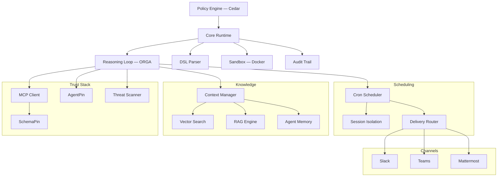

# Symbiont Dokumentation

Richtliniengesteuertes Agenten-Runtime fuer Produktion. Fuehren Sie KI-Agenten und Tools unter expliziten Richtlinien-, Identitaets- und Audit-Kontrollen aus.

## Was ist Symbiont?

Symbiont ist ein Rust-natives Runtime zur Ausfuehrung von KI-Agenten und Tools unter expliziten Richtlinien-, Identitaets- und Audit-Kontrollen.

Die meisten Agenten-Frameworks konzentrieren sich auf Orchestrierung. Symbiont konzentriert sich darauf, was passiert, wenn Agenten in realen Umgebungen mit echtem Risiko laufen muessen: nicht vertrauenswuerdige Tools, sensible Daten, Genehmigungsgrenzen, Audit-Anforderungen und wiederholbare Durchsetzung.

### Funktionsweise

Symbiont trennt die Absicht des Agenten von der Ausfuehrungsberechtigung:

1. **Agenten schlagen vor** — Aktionen werden ueber die Reasoning-Schleife (Observe-Reason-Gate-Act) vorgeschlagen
2. **Das Runtime bewertet** — jede Aktion wird gegen Richtlinien-, Identitaets- und Vertrauenspruefungen evaluiert
3. **Die Richtlinie entscheidet** — erlaubte Aktionen werden ausgefuehrt; abgelehnte werden blockiert oder zur Genehmigung weitergeleitet
4. **Alles wird protokolliert** — manipulationssicherer Audit-Trail fuer jede Entscheidung

Modellausgaben werden niemals als Ausfuehrungsberechtigung behandelt. Das Runtime kontrolliert, was tatsaechlich geschieht.

### Kernfaehigkeiten

| Faehigkeit | Beschreibung |
|-----------|-------------|
| **Richtlinien-Engine** | Feingranulare [Cedar](https://www.cedarpolicy.com/)-Autorisierung fuer Agentenaktionen, Tool-Aufrufe und Ressourcenzugriff |
| **Tool-Verifikation** | [SchemaPin](https://schemapin.org) kryptographische Verifikation von MCP-Tool-Schemas vor der Ausfuehrung |
| **Agenten-Identitaet** | [AgentPin](https://agentpin.org) domainverankerte ES256-Identitaet fuer Agenten und geplante Aufgaben |
| **Reasoning-Schleife** | Typestate-erzwungener Observe-Reason-Gate-Act-Zyklus mit Richtlinien-Gates und Circuit Breakern |
| **Sandboxing** | Docker-basierte Isolation mit Ressourcenlimits fuer nicht vertrauenswuerdige Workloads |
| **Audit-Protokollierung** | Manipulationssichere Protokolle mit strukturierten Eintraegen fuer jede Richtlinienentscheidung |
| **Geheimnismanagement** | Vault/OpenBao-Integration, AES-256-GCM-verschluesselter Speicher, pro Agent isoliert |
| **MCP-Integration** | Nativer Model Context Protocol-Support mit gesteuertem Tool-Zugriff |

Weitere Faehigkeiten: Bedrohungsscan fuer Tool-/Skill-Inhalte, Cron-Scheduling, persistenter Agenten-Speicher, hybride RAG-Suche (LanceDB/Qdrant), Webhook-Verifikation, Zustellungsrouting, OTLP-Telemetrie, HTTP-Sicherheitshaertung, Channel-Adapter (Slack/Teams/Mattermost) sowie Governance-Plugins fuer [Claude Code](https://github.com/thirdkeyai/symbi-claude-code) und [Gemini CLI](https://github.com/thirdkeyai/symbi-gemini-cli).

---

## Schnellstart

### Projekt erstellen und starten (Docker, ~60 Sekunden)

```bash
# 1. Projekt erstellen. Erzeugt symbiont.toml, agents/, policies/,
#    docker-compose.yml und eine .env mit einem frisch generierten SYMBIONT_MASTER_KEY.
docker run --rm -v $(pwd):/workspace ghcr.io/thirdkeyai/symbi:latest \
  init --profile assistant --no-interact --dir /workspace

# 2. Runtime starten. Liest .env automatisch.
docker compose up
```

Runtime-API auf `http://localhost:8080`, HTTP Input auf `http://localhost:8081`.

### Installation (ohne Docker)

**Installationsskript (macOS / Linux):**
```bash
curl -fsSL https://symbiont.dev/install.sh | bash
```

**Homebrew (macOS):**
```bash
brew tap thirdkeyai/tap
brew install symbi
```

**Aus dem Quellcode:**
```bash
git clone https://github.com/thirdkeyai/symbiont.git
cd symbiont
cargo build --release
```

Vorkompilierte Binaerdateien sind auch ueber [GitHub Releases](https://github.com/thirdkeyai/symbiont/releases) verfuegbar. Weitere Details finden Sie im [Einstiegsleitfaden](/getting-started).

### Ihr erster Agent

```symbiont
agent secure_analyst(input: DataSet) -> Result {
    policy access_control {
        allow: read(input) if input.verified == true
        deny: send_email without approval
        audit: all_operations
    }

    with memory = "persistent", requires = "approval" {
        result = analyze(input);
        return result;
    }
}
```

Die vollstaendige Grammatik einschliesslich `metadata`-, `schedule`-, `webhook`- und `channel`-Bloecke finden Sie im [DSL-Leitfaden](/dsl-guide).

### Projekt-Scaffolding

```bash
symbi init        # Interaktives Projekt-Setup — schreibt symbiont.toml, agents/,
                  # policies/, docker-compose.yml und eine .env mit einem generierten
                  # SYMBIONT_MASTER_KEY. --dir <PATH> uebergeben, um ein bestimmtes
                  # Verzeichnis anzusteuern (erforderlich beim Ausfuehren in einem Container).
symbi run agent   # Einzelnen Agenten ausfuehren ohne das volle Runtime zu starten
symbi up          # Volles Runtime mit Auto-Konfiguration starten
```

---

## Architektur



---

## Sicherheitsmodell

Symbiont ist um ein einfaches Prinzip herum konzipiert: **Modellausgaben sollten niemals als Ausfuehrungsberechtigung vertraut werden.**

Aktionen durchlaufen Runtime-Kontrollen:

- **Zero Trust** — alle Agenteneingaben sind standardmaessig nicht vertrauenswuerdig
- **Richtlinienpruefungen** — Cedar-Autorisierung vor jedem Tool-Aufruf und Ressourcenzugriff
- **Tool-Verifikation** — SchemaPin kryptographische Verifikation von Tool-Schemas
- **Sandbox-Grenzen** — Docker-Isolation fuer nicht vertrauenswuerdige Ausfuehrung
- **Operator-Genehmigung** — menschliche Ueberpruefungs-Gates fuer sensible Aktionen
- **Geheimnis-Kontrolle** — Vault/OpenBao-Backends, verschluesselter lokaler Speicher, Agenten-Namespaces
- **Audit-Protokollierung** — kryptographisch manipulationssichere Eintraege fuer jede Entscheidung

Weitere Details finden Sie im Leitfaden zum [Sicherheitsmodell](/security-model).

---

## Leitfaeden

- [Einstieg](/getting-started) — Installation, Konfiguration, erster Agent
- [Sicherheitsmodell](/security-model) — Zero-Trust-Architektur, Richtliniendurchsetzung
- [Runtime-Architektur](/runtime-architecture) — Runtime-Interna und Ausfuehrungsmodell
- [Reasoning-Schleife](/reasoning-loop) — ORGA-Zyklus, Richtlinien-Gates, Circuit Breaker
- [DSL-Leitfaden](/dsl-guide) — Referenz der Agenten-Definitionssprache
- [API-Referenz](/api-reference) — HTTP-API-Endpunkte und Konfiguration
- [Scheduling](/scheduling) — Cron-Engine, Zustellungsrouting, Dead-Letter-Warteschlangen
- [HTTP-Eingabe](/http-input) — Webhook-Server, Authentifizierung, Rate Limiting

---

## Community und Ressourcen

- **Pakete**: [crates.io/crates/symbi](https://crates.io/crates/symbi) | [npm symbiont-sdk-js](https://www.npmjs.com/package/symbiont-sdk-js) | [PyPI symbiont-sdk](https://pypi.org/project/symbiont-sdk/)
- **SDKs**: [JavaScript/TypeScript](https://github.com/ThirdKeyAI/symbiont-sdk-js) | [Python](https://github.com/ThirdKeyAI/symbiont-sdk-python)
- **Plugins**: [Claude Code](https://github.com/thirdkeyai/symbi-claude-code) | [Gemini CLI](https://github.com/thirdkeyai/symbi-gemini-cli)
- **Issues**: [GitHub Issues](https://github.com/thirdkeyai/symbiont/issues)
- **Lizenz**: Apache 2.0 (Community Edition)

---

## Naechste Schritte

<div class="grid grid-cols-1 md:grid-cols-3 gap-6 mt-8">
  <div class="card">
    <h3>Loslegen</h3>
    <p>Installieren Sie Symbiont und fuehren Sie Ihren ersten gesteuerten Agenten aus.</p>
    <a href="/getting-started" class="btn btn-outline">Schnellstart-Leitfaden</a>
  </div>

  <div class="card">
    <h3>Sicherheitsmodell</h3>
    <p>Verstehen Sie die Vertrauensgrenzen und Richtliniendurchsetzung.</p>
    <a href="/security-model" class="btn btn-outline">Sicherheitsleitfaden</a>
  </div>

  <div class="card">
    <h3>DSL-Referenz</h3>
    <p>Lernen Sie die Agenten-Definitionssprache.</p>
    <a href="/dsl-guide" class="btn btn-outline">DSL-Leitfaden</a>
  </div>
</div>
