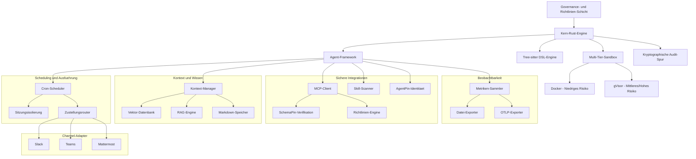

# Symbiont Dokumentation

KI-natives Agent-Framework fuer den Aufbau autonomer, richtlinienbasierter Agenten mit Scheduling, Channel-Adaptern und kryptographischer Identitaet -- entwickelt in Rust.


---

## Was ist Symbiont?

Symbiont ist ein KI-natives Agent-Framework fuer den Aufbau autonomer, richtlinienbasierter Agenten, die sicher mit Menschen, anderen Agenten und grossen Sprachmodellen zusammenarbeiten. Es bietet einen vollstaendigen Produktionsstack -- von einer deklarativen DSL und einer Scheduling-Engine bis hin zu Multiplattform-Channel-Adaptern und kryptographischer Identitaetsverifikation -- alles in Rust entwickelt fuer Leistung und Sicherheit.

### Hauptmerkmale

- **🛡️ Sicherheitsorientiertes Design**: Zero-Trust-Architektur mit mehrstufiger Sandbox, Richtliniendurchsetzung und kryptographischen Audit-Spuren
- **📋 Deklarative DSL**: Zweckbestimmte Sprache zur Definition von Agenten, Richtlinien, Zeitplaenen und Channel-Integrationen mit tree-sitter-Parsing
- **📅 Produktions-Scheduling**: Cron-basierte Aufgabenausfuehrung mit Sitzungsisolierung, Zustellungsrouting, Dead-Letter-Warteschlangen und Jitter-Unterstuetzung
- **💬 Channel-Adapter**: Agenten mit Slack, Microsoft Teams und Mattermost verbinden -- mit Webhook-Verifizierung und Identitaetszuordnung
- **🌐 HTTP-Eingabemodul**: Webhook-Server fuer externe Integrationen mit Bearer/JWT-Authentifizierung, Rate Limiting und CORS
- **🔑 AgentPin-Identitaet**: Kryptographische Agent-Identitaetsverifikation ueber ES256 JWTs, verankert an Well-Known-Endpunkten
- **🔐 Geheimnismanagement**: HashiCorp Vault-Integration mit verschluesseltem Datei- und OS-Keychain-Backend
- **🧠 Kontext und Wissen**: RAG-verstaerkte Wissenssysteme mit Vektorsuche (LanceDB eingebettet als Standard, Qdrant optional) und optionalen lokalen Embeddings
- **🔗 MCP-Integration**: Model Context Protocol Client mit kryptographischer SchemaPin-Tool-Verifikation
- **⚡ Multi-Language SDKs**: JavaScript- und Python-SDKs fuer vollstaendigen API-Zugriff einschliesslich Scheduling, Channels und Enterprise-Funktionen
- **🔄 Agentische Reasoning-Schleife**: Typestate-erzwungener Observe-Reason-Gate-Act (ORGA)-Zyklus mit Richtlinien-Gates, Circuit Breakern, dauerhaftem Journal und Wissensbruecke
- **🧪 Erweitertes Reasoning** (`orga-adaptive`): Tool-Profilfilterung, Stuck-Loop-Erkennung, deterministischer Kontext-Pre-Fetch und verzeichnisspezifische Konventionen
- **📜 Cedar Policy Engine**: Integration der formalen Autorisierungssprache fuer feingranulare Zugriffskontrolle
- **🏗️ Hohe Leistung**: Rust-native Laufzeitumgebung, optimiert fuer Produktionsworkloads mit durchgehender asynchroner Ausfuehrung
- **🤖 KI-Assistenten-Plugins**: First-Party-Governance-Plugins fuer [Claude Code](https://github.com/thirdkeyai/symbi-claude-code) und [Gemini CLI](https://github.com/thirdkeyai/symbi-gemini-cli) mit Cedar-Richtliniendurchsetzung, SchemaPin-Verifikation und Audit-Spuren

### Projektinitialisierung (`symbi init`)

Interaktives Projekt-Scaffolding mit profilbasierten Vorlagen. Waehlen Sie zwischen minimal, assistant, dev-agent oder multi-agent Profilen. Konfigurierbarer SchemaPin-Verifikationsmodus und Sandbox-Stufen. Enthaelt einen integrierten Agent-Katalog zum Importieren vorgefertigter, verwalteter Agenten. Funktioniert nicht-interaktiv fuer CI/CD-Pipelines mit `--no-interact`.

### Einzelne Agent-Ausfuehrung (`symbi run`)

Fuehren Sie einen beliebigen Agenten direkt ueber die CLI aus, ohne die vollstaendige Laufzeitumgebung zu starten:

```bash
symbi run recon --input '{"target": "10.0.1.5"}'
```

Laedt die Agenten-DSL, richtet die ORGA-Reasoning-Schleife mit Cloud-Inferenz ein, fuehrt aus, gibt die Ergebnisse aus und beendet sich. Loest Agentennamen automatisch aus dem `agents/`-Verzeichnis auf.

### Inter-Agent-Kommunikations-Governance

Alle Inter-Agent-Builtins (`ask`, `delegate`, `send_to`, `parallel`, `race`) werden ueber den CommunicationBus mit Richtlinienbewertung geleitet. Das `CommunicationPolicyGate` erzwingt Cedar-Stil-Regeln fuer Inter-Agent-Aufrufe -- kontrolliert, welche Agenten kommunizieren duerfen, mit prioritaetsbasierter Regelbewertung und hartem Deny bei Richtlinienverletzungen. Nachrichten werden kryptographisch signiert, verschluesselt und auditiert.

---

## Erste Schritte

### Schnellinstallation

```bash
# Repository klonen
git clone https://github.com/thirdkeyai/symbiont.git
cd symbiont

# Einheitlichen symbi-Container erstellen
docker build -t symbi:latest .

# Oder vorgefertigten Container verwenden
docker pull ghcr.io/thirdkeyai/symbi:latest

# System testen
cargo test

# Einheitliche CLI testen
docker run --rm symbi:latest --version
docker run --rm -v $(pwd):/workspace symbi:latest dsl parse --help
docker run --rm symbi:latest mcp --help
```

### Ihr erster Agent

```rust
metadata {
    version = "1.0.0"
    author = "developer"
    description = "Simple analysis agent"
}

agent analyze_data(input: DataSet) -> Result {
    capabilities = ["data_analysis"]

    policy secure_analysis {
        allow: read(input) if input.anonymized == true
        deny: store(input) if input.contains_pii == true
        audit: all_operations with signature
    }

    with memory = "ephemeral", privacy = "high" {
        if (validate_input(input)) {
            result = process_data(input);
            audit_log("analysis_completed", result.metadata);
            return result;
        } else {
            return reject("Invalid input data");
        }
    }
}
```

---

## Architektur-Uebersicht



---

## Anwendungsfaelle

### Entwicklung und Forschung
- Sichere Code-Generierung und automatisierte Tests
- Multi-Agent-Kollaborationsexperimente
- Kontextbewusste KI-Systementwicklung

### Datenschutzkritische Anwendungen
- Gesundheitsdatenverarbeitung mit Datenschutzkontrollen
- Finanzdienstleistungsautomatisierung mit Audit-Funktionen
- Regierungs- und Verteidigungssysteme mit Sicherheitsfeatures

---

## Projektstatus

### v1.9.0 Stabil

Symbiont v1.9.0 ist die neueste stabile Version und bietet ein vollstaendiges KI-Agent-Framework mit produktionsreifen Funktionen:

- **ToolClad-Integration**: Deklarative Tool-Vertraege mit Manifest-Laden, Argument-Validierung, HTTP/MCP-Proxy-Backends, Secrets-Injection und Session-/Browser-Executors
- **`symbi tools`-CLI**: Scope-Durchsetzung, Cedar-Policy-Generierung und Hot-Reload-Dateiueberwachung fuer ToolClad-Manifeste
- **Produktionshaertung**: Begrenzte Kanaele, Health-Probes, Secrets-TTL, Cedar-Policy-Reload, Audit-Export und Rate-Limiting
- **Sicherheitskorrekturen**: Kritische DoS-Vektor-Mitigierung, JWT-Validierungshaertung, Umgebungsvariablen-Leak-Praevention und Sandbox-Guard-Verbesserungen
- **W3C-Traceparent-Propagierung**: OpenTelemetry Distributed-Trace-Kontext-Propagierung ueber Agentengrenzen hinweg
- **Agentische Reasoning-Schleife**: Typestate-erzwungener ORGA-Zyklus mit Multi-Turn-Konversation, Cloud- und SLM-Inferenz, Circuit Breakern, dauerhaftem Journal und Wissensbruecke
- **Erweiterte Reasoning-Primitiven** (`orga-adaptive`): Tool-Profilfilterung, schrittweise Stuck-Loop-Erkennung, deterministischer Kontext-Pre-Fetch und verzeichnisspezifische Konventionen
- **Cedar Policy Engine**: Formale Autorisierung ueber Cedar-Richtliniensprachen-Integration (`cedar` Feature)
- **Cloud-LLM-Inferenz**: OpenRouter-kompatible Cloud-Inferenz (`cloud-llm` Feature)
- **Standalone Agent-Modus**: Einzeiler fuer Cloud-native Agenten mit LLM + Composio-Tools (`standalone-agent` Feature)
- **LanceDB Eingebettetes Vektor-Backend**: Konfigurationsfreie Vektorsuche -- LanceDB als Standard, Qdrant optional ueber `vector-qdrant` Feature Flag
- **Kontext-Kompaktierungspipeline**: Gestufte Kompaktierung mit LLM-Zusammenfassung und Multi-Modell-Token-Zaehlung (OpenAI, Claude, Gemini, Llama, Mistral und mehr)
- **ClawHavoc-Scanner**: 40 Erkennungsregeln in 10 Angriffskategorien mit 5-stufigem Schweregrad-Modell und ausfuehrbarer Whitelisting
- **Composio MCP-Integration**: Feature-gated SSE-basierte Verbindung zum Composio MCP-Server fuer externen Tool-Zugriff
- **Persistenter Speicher**: Markdown-basierter Agent-Speicher mit Fakten, Prozeduren, gelernten Mustern und aufbewahrungsbasierter Kompaktierung
- **Webhook-Verifizierung**: HMAC-SHA256- und JWT-Verifizierung mit GitHub-, Stripe-, Slack- und benutzerdefinierten Presets
- **HTTP-Sicherheitshaertung**: Loopback-only-Bindung, CORS-Allowlists, JWT EdDSA-Validierung, Health-Endpunkt-Trennung
- **Metriken und Telemetrie**: Datei- und OTLP-Exporter mit Composite-Fan-Out, OpenTelemetry Distributed Tracing
- **Scheduling-Engine**: Cron-basierte Ausfuehrung mit Sitzungsisolierung, Zustellungsrouting, Dead-Letter-Warteschlangen und Jitter
- **Channel-Adapter**: Slack (Community), Microsoft Teams und Mattermost (Enterprise) mit HMAC-Signierung
- **AgentPin-Identitaet**: Kryptographische Agent-Identitaet ueber ES256 JWTs, verankert an Well-Known-Endpunkten
- **Geheimnismanagement**: HashiCorp Vault, verschluesselte Datei- und OS-Keychain-Backends
- **JavaScript- und Python-SDKs**: Vollstaendige API-Clients fuer Scheduling, Channels, Webhooks, Speicher, Skills und Metriken

---

## Community

- **Dokumentation**: Umfassende Leitfaeden und API-Referenzen
  - [API-Referenz](api-reference.md)
  - [Reasoning-Loop-Leitfaden](reasoning-loop.md)
  - [Erweitertes Reasoning (orga-adaptive)](orga-adaptive.md)
  - [Scheduling-Leitfaden](scheduling.md)
  - [HTTP-Eingabemodul](http-input.md)
  - [DSL-Leitfaden](dsl-guide.md)
  - [Sicherheitsmodell](security-model.md)
  - [Laufzeit-Architektur](runtime-architecture.md)
- **Pakete**: [crates.io/crates/symbi](https://crates.io/crates/symbi) | [npm symbiont-sdk-js](https://www.npmjs.com/package/symbiont-sdk-js) | [PyPI symbiont-sdk](https://pypi.org/project/symbiont-sdk/)
- **Plugins**: [Claude Code](https://github.com/thirdkeyai/symbi-claude-code) | [Gemini CLI](https://github.com/thirdkeyai/symbi-gemini-cli)
- **Issues**: [GitHub Issues](https://github.com/thirdkeyai/symbiont/issues)
- **Diskussionen**: [GitHub Discussions](https://github.com/thirdkeyai/symbiont/discussions)
- **Lizenz**: Open Source Software von ThirdKey

---

## Naechste Schritte

<div class="grid grid-cols-1 md:grid-cols-3 gap-6 mt-8">
  <div class="card">
    <h3>🚀 Beginnen</h3>
    <p>Folgen Sie unserem Einstiegsleitfaden, um Ihre erste Symbiont-Umgebung einzurichten.</p>
    <a href="/getting-started" class="btn btn-outline">Schnellstart-Leitfaden</a>
  </div>

  <div class="card">
    <h3>📖 DSL lernen</h3>
    <p>Meistern Sie die Symbiont DSL fuer den Aufbau richtlinienbasierter Agenten.</p>
    <a href="/dsl-guide" class="btn btn-outline">DSL-Dokumentation</a>
  </div>

  <div class="card">
    <h3>🏗️ Architektur</h3>
    <p>Verstehen Sie das Laufzeitsystem und Sicherheitsmodell.</p>
    <a href="/runtime-architecture" class="btn btn-outline">Architektur-Leitfaden</a>
  </div>
</div>
