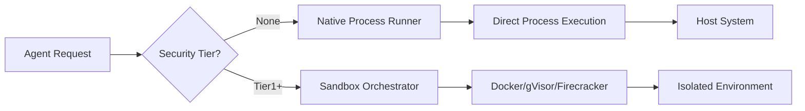

# Nativer Ausfuehrungsmodus (ohne Docker/Isolation)

## Andere Sprachen

[English](native-execution-guide.md) | [中文简体](native-execution-guide.zh-cn.md) | [Español](native-execution-guide.es.md) | [Português](native-execution-guide.pt.md) | [日本語](native-execution-guide.ja.md) | **Deutsch**

---

## Ueberblick

Symbiont unterstuetzt den Betrieb von Agenten ohne Docker oder Container-Isolation fuer Entwicklungsumgebungen oder vertrauenswuerdige Deployments, bei denen maximale Performance und minimale Abhaengigkeiten gewuenscht sind.

## Sicherheitswarnungen

**WICHTIG**: Der native Ausfuehrungsmodus umgeht alle containerbasierten Sicherheitskontrollen:

- Keine Prozessisolation
- Keine Dateisystemisolation
- Keine Netzwerkisolation
- Keine Durchsetzung von Ressourcenlimits
- Direkter Zugriff auf das Hostsystem

**NUR VERWENDEN FUER**:
- Lokale Entwicklung mit vertrauenswuerdigem Code
- Kontrollierte Umgebungen mit vertrauenswuerdigen Agenten
- Testen und Debuggen
- Umgebungen, in denen Docker nicht verfuegbar ist

**NICHT VERWENDEN FUER**:
- Produktionsumgebungen mit nicht vertrauenswuerdigem Code
- Mandantenfaehige Deployments
- Oeffentlich zugaengliche Dienste
- Verarbeitung nicht vertrauenswuerdiger Benutzereingaben

## Architektur

### Sandbox-Stufenhierarchie

```
┌─────────────────────────────────────────┐
│ SecurityTier::None (Native Execution)   │ ← Keine Isolation
├─────────────────────────────────────────┤
│ SecurityTier::Tier1 (Docker)            │ ← Container-Isolation
├─────────────────────────────────────────┤
│ SecurityTier::Tier2 (gVisor)            │ ← Erweiterte Isolation
├─────────────────────────────────────────┤
│ SecurityTier::Tier3 (Firecracker)       │ ← Maximale Isolation
└─────────────────────────────────────────┘
```

### Nativer Ausfuehrungsablauf



## Konfiguration

### Option 1: TOML-Konfiguration

```toml
# config.toml

[security]
# Native Ausfuehrung erlauben (Standard: false)
allow_native_execution = true
# Standard-Sandbox-Stufe
default_sandbox_tier = "None"  # oder "Tier1", "Tier2", "Tier3"

[security.native_execution]
# Ressourcenlimits auch im nativen Modus anwenden
enforce_resource_limits = true
# Maximaler Speicher in MB
max_memory_mb = 2048
# Maximale CPU-Kerne
max_cpu_cores = 4.0
# Maximale Ausfuehrungszeit in Sekunden
max_execution_time_seconds = 300
# Arbeitsverzeichnis fuer native Ausfuehrung
working_directory = "/tmp/symbiont-native"
# Erlaubte Befehle/ausfuehrbare Dateien
allowed_executables = ["python3", "node", "bash"]
```

### Vollstaendiges Konfigurationsbeispiel

Eine vollstaendige `config.toml` mit nativer Ausfuehrung neben anderen Systemeinstellungen:

```toml
# config.toml
[api]
port = 8080
host = "127.0.0.1"
timeout_seconds = 30
max_body_size = 10485760

[database]
# Standard: LanceDB eingebettet (keine Konfiguration noetig, keine externen Dienste erforderlich)
vector_backend = "lancedb"
vector_data_path = "./data/vector_db"
vector_dimension = 384

# Optional: Qdrant (auskommentieren, um Qdrant statt LanceDB zu verwenden)
# vector_backend = "qdrant"
# qdrant_url = "http://localhost:6333"
# qdrant_collection = "symbiont"

[logging]
level = "info"
format = "Pretty"
structured = true

[security]
key_provider = { Environment = { var_name = "SYMBIONT_KEY" } }
enable_compression = true
enable_backups = true
enable_safety_checks = true

[storage]
context_path = "./data/context"
git_clone_path = "./data/git"
backup_path = "./data/backups"
max_context_size_mb = 1024

[native_execution]
enabled = true
default_executable = "python3"
working_directory = "/tmp/symbiont-native"
enforce_resource_limits = true
max_memory_mb = 2048
max_cpu_seconds = 300
max_execution_time_seconds = 300
allowed_executables = ["python3", "python", "node", "bash", "sh"]
```

### NativeExecutionConfig-Felder

| Feld | Typ | Standard | Beschreibung |
|------|-----|---------|-------------|
| `enabled` | bool | `false` | Nativen Ausfuehrungsmodus aktivieren |
| `default_executable` | string | `"bash"` | Standard-Interpreter/Shell |
| `working_directory` | path | `/tmp/symbiont-native` | Ausfuehrungsverzeichnis |
| `enforce_resource_limits` | bool | `true` | OS-Level-Limits anwenden |
| `max_memory_mb` | Option<u64> | `Some(2048)` | Speicherlimit in MB |
| `max_cpu_seconds` | Option<u64> | `Some(300)` | CPU-Zeitlimit |
| `max_execution_time_seconds` | u64 | `300` | Echtzeit-Timeout |
| `allowed_executables` | Vec<String> | `[bash, python3, etc.]` | Whitelist ausfuehrbarer Dateien |

### Option 2: Umgebungsvariablen

```bash
export SYMBIONT_ALLOW_NATIVE_EXECUTION=true
export SYMBIONT_DEFAULT_SANDBOX_TIER=None
export SYMBIONT_NATIVE_MAX_MEMORY_MB=2048
export SYMBIONT_NATIVE_MAX_CPU_CORES=4.0
export SYMBIONT_NATIVE_WORKING_DIR=/tmp/symbiont-native
```

### Option 3: Konfiguration auf Agentenebene

```symbi
agent NativeWorker {
  metadata {
    name: "Local Development Agent"
    version: "1.0.0"
  }

  security {
    tier: None
    sandbox: Permissive
    capabilities: ["local_filesystem", "network"]
  }

  on trigger "local_processing" {
    // Wird direkt auf dem Host ausgefuehrt
    execute_native("python3 process.py")
  }
}
```

## Anwendungsbeispiele

### Beispiel 1: Entwicklungsmodus

```rust
use symbi_runtime::{Config, SecurityTier, SandboxOrchestrator};

#[tokio::main]
async fn main() -> Result<(), Box<dyn std::error::Error>> {
    // Native Ausfuehrung fuer Entwicklung aktivieren
    let mut config = Config::default();
    config.security.allow_native_execution = true;
    config.security.default_sandbox_tier = SecurityTier::None;

    let orchestrator = SandboxOrchestrator::new(config)?;

    // Code nativ ausfuehren
    let result = orchestrator.execute_code(
        SecurityTier::None,
        "print('Hello from native execution!')",
        HashMap::new()
    ).await?;

    println!("Output: {}", result.stdout);
    Ok(())
}
```

### Beispiel 2: CLI-Flag

```bash
# Mit nativer Ausfuehrung starten
symbiont run agent.dsl --native

# Oder mit expliziter Stufe
symbiont run agent.dsl --sandbox-tier=none

# Mit Ressourcenlimits
symbiont run agent.dsl --native \
  --max-memory=1024 \
  --max-cpu=2.0 \
  --timeout=300
```

### Beispiel 3: Gemischte Ausfuehrung

```rust
// Native Ausfuehrung fuer vertrauenswuerdige lokale Operationen
let local_result = orchestrator.execute_code(
    SecurityTier::None,
    local_code,
    env_vars
).await?;

// Docker fuer externe/nicht vertrauenswuerdige Operationen
let isolated_result = orchestrator.execute_code(
    SecurityTier::Tier1,
    untrusted_code,
    env_vars
).await?;
```

## Implementierungsdetails

### Native Process Runner

Der native Runner verwendet `std::process::Command` mit optionalen Ressourcenlimits:

```rust
pub struct NativeRunner {
    config: NativeConfig,
}

impl NativeRunner {
    pub async fn execute(&self, code: &str, env: HashMap<String, String>)
        -> Result<ExecutionResult> {
        // Direkte Prozessausfuehrung
        let mut command = Command::new(&self.config.executable);
        command.current_dir(&self.config.working_dir);
        command.envs(env);

        // Optional: Ressourcenlimits ueber rlimit anwenden (Unix)
        #[cfg(unix)]
        if self.config.enforce_limits {
            self.apply_resource_limits(&mut command)?;
        }

        let output = command.output().await?;

        Ok(ExecutionResult {
            stdout: String::from_utf8_lossy(&output.stdout).to_string(),
            stderr: String::from_utf8_lossy(&output.stderr).to_string(),
            exit_code: output.status.code().unwrap_or(-1),
            success: output.status.success(),
        })
    }
}
```

### Ressourcenlimits (Unix)

Auf Unix-Systemen kann die native Ausfuehrung dennoch einige Limits durchsetzen:

- **Speicher**: Mit `setrlimit(RLIMIT_AS)`
- **CPU-Zeit**: Mit `setrlimit(RLIMIT_CPU)`
- **Prozessanzahl**: Mit `setrlimit(RLIMIT_NPROC)`
- **Dateigroesse**: Mit `setrlimit(RLIMIT_FSIZE)`

### Plattformunterstuetzung

| Plattform | Native Ausfuehrung | Ressourcenlimits |
|-----------|-------------------|-----------------|
| Linux     | Vollstaendig      | rlimit          |
| macOS     | Vollstaendig      | Teilweise       |
| Windows   | Vollstaendig      | Eingeschraenkt  |

## Migration von Docker

### Schritt 1: Konfiguration aktualisieren

```diff
# config.toml
[security]
- default_sandbox_tier = "Tier1"
+ default_sandbox_tier = "None"
+ allow_native_execution = true
```

### Schritt 2: Docker-Abhaengigkeiten entfernen

```bash
# Nicht mehr erforderlich
# docker build -t symbi:latest .
# docker run ...

# Direkte Ausfuehrung
cargo build --release
./target/release/symbiont run agent.dsl
```

### Hybridansatz

Verwenden Sie beide Ausfuehrungsmodi strategisch -- nativ fuer vertrauenswuerdige lokale Operationen, Docker fuer nicht vertrauenswuerdigen Code:

```rust
// Vertrauenswuerdige lokale Operationen
let local_result = orchestrator.execute_code(
    SecurityTier::None,  // Nativ
    trusted_code,
    env
).await?;

// Externe/nicht vertrauenswuerdige Operationen
let isolated_result = orchestrator.execute_code(
    SecurityTier::Tier1,  // Docker
    external_code,
    env
).await?;
```

### Schritt 3: Umgebungsvariablen verwalten

Docker hat Umgebungsvariablen automatisch isoliert. Bei nativer Ausfuehrung muessen sie explizit gesetzt werden:

```bash
export AGENT_API_KEY="xxx"
export AGENT_DB_URL="postgresql://..."
symbiont run agent.dsl --native
```

## Performance-Vergleich

| Modus | Startzeit | Durchsatz | Speicher | Isolation |
|-------|-----------|-----------|----------|-----------|
| Nativ | ~10ms | 100% | Minimal | Keine |
| Docker | ~500ms | ~95% | +128MB | Gut |
| gVisor | ~800ms | ~70% | +256MB | Besser |
| Firecracker | ~125ms | ~90% | +64MB | Am besten |

## Fehlerbehebung

### Problem: Zugriff verweigert

```bash
# Loesung: Sicherstellen, dass das Arbeitsverzeichnis beschreibbar ist
mkdir -p /tmp/symbiont-native
chmod 755 /tmp/symbiont-native
```

### Problem: Befehl nicht gefunden

```bash
# Loesung: Sicherstellen, dass die ausfuehrbare Datei im PATH ist oder absoluten Pfad verwenden
export PATH=$PATH:/usr/local/bin
# Oder absoluten Pfad konfigurieren
allowed_executables = ["/usr/bin/python3", "/usr/bin/node"]
```

### Problem: Ressourcenlimits werden nicht angewendet

Native Ausfuehrung unter Windows hat eingeschraenkte Unterstuetzung fuer Ressourcenlimits. Erwaegen Sie:
- Verwendung von Job Objects (Windows-spezifisch)
- Ueberwachung und Beendigung ausser Kontrolle geratener Prozesse
- Upgrade auf containerbasierte Ausfuehrung

## Bewaeehrte Praktiken

1. **Nur fuer Entwicklung**: Native Ausfuehrung primaer fuer die Entwicklung verwenden
2. **Schrittweise Migration**: Mit Containern beginnen, bei Stabilitaet zu nativ wechseln
3. **Ueberwachung**: Auch ohne Isolation die Ressourcennutzung ueberwachen
4. **Whitelists**: Erlaubte ausfuehrbare Dateien und Pfade einschraenken
5. **Protokollierung**: Umfassende Audit-Protokollierung aktivieren
6. **Testen**: Vor dem nativen Deployment mit Containern testen

## Sicherheitscheckliste

Vor der Aktivierung nativer Ausfuehrung in jeder Umgebung:

- [ ] Gesamter Agentencode stammt aus vertrauenswuerdigen Quellen
- [ ] Umgebung ist von der Produktion isoliert
- [ ] Keine externen Benutzereingaben werden verarbeitet
- [ ] Ueberwachung und Protokollierung sind aktiviert
- [ ] Ressourcenlimits sind konfiguriert
- [ ] Whitelist fuer ausfuehrbare Dateien ist restriktiv
- [ ] Dateisystemzugriff ist eingeschraenkt
- [ ] Team versteht die Sicherheitsimplikationen

## Verwandte Dokumentation

- [Sicherheitsmodell](security-model.md) - Vollstaendige Sicherheitsarchitektur
- [Sandbox-Architektur](runtime-architecture.md#sandbox-architecture) - Container-Stufen
- [Konfigurationsleitfaden](getting-started.md#configuration) - Einrichtungsoptionen
- [DSL-Sicherheitsanweisungen](dsl-guide.md#security) - Sicherheit auf Agentenebene

---

**Hinweis**: Die native Ausfuehrung tauscht Sicherheit gegen Komfort. Verstehen Sie immer die Risiken und wenden Sie geeignete Kontrollen fuer Ihre Deployment-Umgebung an.
