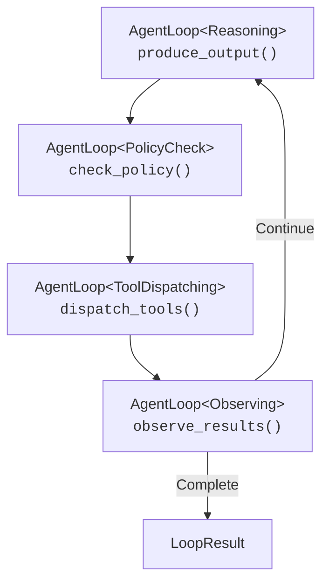

# Leitfaden zur Reasoning-Schleife

## Andere Sprachen

[English](reasoning-loop.md) | [中文简体](reasoning-loop.zh-cn.md) | [Español](reasoning-loop.es.md) | [Português](reasoning-loop.pt.md) | [日本語](reasoning-loop.ja.md) | **Deutsch**

---

Vollstaendiger Leitfaden zur agentischen Reasoning-Schleife von Symbiont: ein typestate-erzwungener Observe-Reason-Gate-Act (ORGA)-Zyklus fuer autonomes Agentenverhalten.

## Inhaltsverzeichnis


---

## Ueberblick

Die Reasoning-Schleife ist die zentrale Ausfuehrungsmaschine fuer autonome Agenten in Symbiont. Sie treibt eine mehrrundige Konversation zwischen einem LLM, einem Policy-Gate und externen Tools durch einen strukturierten Zyklus:

1. **Observe** -- Ergebnisse vorheriger Tool-Ausfuehrungen sammeln
2. **Reason** -- LLM erzeugt vorgeschlagene Aktionen (Tool-Aufrufe oder Textantworten)
3. **Gate** -- Policy-Engine bewertet jede vorgeschlagene Aktion
4. **Act** -- Genehmigte Aktionen werden an Tool-Executors dispatcht

Die Schleife laeuft weiter, bis das LLM eine finale Textantwort erzeugt, Iterations-/Token-Limits erreicht oder ein Timeout eintritt.

### Designprinzipien

- **Compile-Time-Sicherheit**: Ungueltige Phasenwechsel werden zur Kompilierzeit durch Rusts Typsystem erkannt
- **Opt-in-Komplexitaet**: Die Schleife funktioniert nur mit einem Provider und Policy-Gate; Knowledge-Bridge, Cedar-Policies und Human-in-the-Loop sind alle optional
- **Rueckwaertskompatibel**: Das Hinzufuegen neuer Features (wie der Knowledge-Bridge) bricht niemals bestehenden Code
- **Beobachtbar**: Jede Phase emittiert Journal-Events und Tracing-Spans

---

## Schnellstart

### Minimales Beispiel

```rust
use std::sync::Arc;
use symbi_runtime::reasoning::circuit_breaker::CircuitBreakerRegistry;
use symbi_runtime::reasoning::context_manager::DefaultContextManager;
use symbi_runtime::reasoning::conversation::{Conversation, ConversationMessage};
use symbi_runtime::reasoning::executor::DefaultActionExecutor;
use symbi_runtime::reasoning::loop_types::{BufferedJournal, LoopConfig};
use symbi_runtime::reasoning::policy_bridge::DefaultPolicyGate;
use symbi_runtime::reasoning::reasoning_loop::ReasoningLoopRunner;
use symbi_runtime::types::AgentId;

// Set up the runner with default components
let runner = ReasoningLoopRunner {
    provider: Arc::new(my_inference_provider),
    policy_gate: Arc::new(DefaultPolicyGate::permissive()),
    executor: Arc::new(DefaultActionExecutor::default()),
    context_manager: Arc::new(DefaultContextManager::default()),
    circuit_breakers: Arc::new(CircuitBreakerRegistry::default()),
    journal: Arc::new(BufferedJournal::new(1000)),
    knowledge_bridge: None,
};

// Build a conversation
let mut conv = Conversation::with_system("You are a helpful assistant.");
conv.push(ConversationMessage::user("What is 6 * 7?"));

// Run the loop
let result = runner.run(AgentId::new(), conv, LoopConfig::default()).await;

println!("Output: {}", result.output);
println!("Iterations: {}", result.iterations);
println!("Tokens used: {}", result.total_usage.total_tokens);
```

### Mit Tool-Definitionen

```rust
use symbi_runtime::reasoning::inference::ToolDefinition;

let config = LoopConfig {
    max_iterations: 10,
    tool_definitions: vec![
        ToolDefinition {
            name: "web_search".into(),
            description: "Search the web for information".into(),
            parameters: serde_json::json!({
                "type": "object",
                "properties": {
                    "query": { "type": "string" }
                },
                "required": ["query"]
            }),
        },
    ],
    ..Default::default()
};

let result = runner.run(agent_id, conv, config).await;
```

---

## Phasensystem

### Typestate-Muster

Die Schleife nutzt Rusts Typsystem, um gueltige Phasenwechsel zur Kompilierzeit zu erzwingen. Jede Phase ist ein Zero-Sized-Type-Marker:

```rust
pub struct Reasoning;      // LLM produces proposed actions
pub struct PolicyCheck;    // Each action evaluated by the gate
pub struct ToolDispatching; // Approved actions executed
pub struct Observing;      // Results collected for next iteration
```

Die `AgentLoop<Phase>`-Struktur traegt den Schleifenstatus und kann nur Methoden aufrufen, die fuer ihre aktuelle Phase geeignet sind. Zum Beispiel stellt `AgentLoop<Reasoning>` nur `produce_output()` bereit, das self konsumiert und `AgentLoop<PolicyCheck>` zurueckgibt.

Das bedeutet, die folgenden Fehler sind **Kompilierfehler**, keine Laufzeitbugs:
- Policy-Check ueberspringen
- Tools dispatchen, ohne vorher zu schlussfolgern
- Ergebnisse beobachten, ohne zu dispatchen

### Phasenablauf



---

## Inference-Provider

Das `InferenceProvider`-Trait abstrahiert ueber LLM-Backends:

```rust
#[async_trait]
pub trait InferenceProvider: Send + Sync {
    async fn complete(
        &self,
        conversation: &Conversation,
        options: &InferenceOptions,
    ) -> Result<InferenceResponse, InferenceError>;

    fn provider_name(&self) -> &str;
    fn default_model(&self) -> &str;
    fn supports_native_tools(&self) -> bool;
    fn supports_structured_output(&self) -> bool;
}
```

### Cloud-Provider (OpenRouter)

Der `CloudInferenceProvider` verbindet sich mit OpenRouter (oder jedem OpenAI-kompatiblen Endpunkt):

```bash
export OPENROUTER_API_KEY="sk-or-..."
export OPENROUTER_MODEL="google/gemini-2.0-flash-001"  # optional
```

```rust
use symbi_runtime::reasoning::providers::cloud::CloudInferenceProvider;

let provider = CloudInferenceProvider::from_env()
    .expect("OPENROUTER_API_KEY must be set");
```

---

## Policy-Gate

Jede vorgeschlagene Aktion durchlaeuft das Policy-Gate vor der Ausfuehrung:

```rust
#[async_trait]
pub trait ReasoningPolicyGate: Send + Sync {
    async fn evaluate_action(
        &self,
        agent_id: &AgentId,
        action: &ProposedAction,
        state: &LoopState,
    ) -> LoopDecision;
}

pub enum LoopDecision {
    Allow,
    Deny { reason: String },
    Modify { modified_action: Box<ProposedAction>, reason: String },
}
```

### Integrierte Gates

- **`DefaultPolicyGate::permissive()`** -- Erlaubt alle Aktionen (Entwicklung/Tests)
- **`DefaultPolicyGate::new()`** -- Standard-Policy-Regeln
- **`OpaPolicyGateBridge`** -- Bruecke zur OPA-basierten Policy-Engine
- **`CedarGate`** -- Cedar Policy Language Integration

### Policy-Ablehnungs-Feedback

Wenn eine Aktion abgelehnt wird, wird der Ablehnungsgrund als Policy-Feedback-Observation an das LLM zurueckgegeben, damit es seinen Ansatz in der naechsten Iteration anpassen kann.

---

## Aktionsausfuehrung

### ActionExecutor-Trait

```rust
#[async_trait]
pub trait ActionExecutor: Send + Sync {
    async fn execute_actions(
        &self,
        actions: &[ProposedAction],
        config: &LoopConfig,
        circuit_breakers: &CircuitBreakerRegistry,
    ) -> Vec<Observation>;
}
```

### Integrierte Executors

| Executor | Beschreibung |
|----------|-------------|
| `DefaultActionExecutor` | Paralleles Dispatching mit tool-spezifischen Timeouts |
| `EnforcedActionExecutor` | Delegiert durch `ToolInvocationEnforcer` an die MCP-Pipeline |
| `KnowledgeAwareExecutor` | Faengt Wissens-Tools ab, delegiert den Rest an den inneren Executor |

### Circuit Breaker

Jedes Tool hat einen zugeordneten Circuit Breaker, der Fehler verfolgt:

- **Closed** (normal): Tool-Aufrufe werden normal ausgefuehrt
- **Open** (ausgeloest): Zu viele aufeinanderfolgende Fehler; Aufrufe werden sofort abgelehnt
- **Half-open** (probing): Begrenzte Aufrufe erlaubt, um Wiederherstellung zu testen

```rust
let circuit_breakers = CircuitBreakerRegistry::new(CircuitBreakerConfig {
    failure_threshold: 3,
    recovery_timeout: Duration::from_secs(60),
    half_open_max_calls: 1,
});
```

---

## Wissens-Reasoning-Bruecke

Die `KnowledgeBridge` verbindet den Wissensspeicher des Agenten (hierarchischer Speicher, Wissensbasis, Vektorsuche) mit der Reasoning-Schleife.

### Einrichtung

```rust
use symbi_runtime::reasoning::knowledge_bridge::{KnowledgeBridge, KnowledgeConfig};

let bridge = Arc::new(KnowledgeBridge::new(
    context_manager.clone(),  // Arc<dyn context::ContextManager>
    KnowledgeConfig {
        max_context_items: 5,
        relevance_threshold: 0.3,
        auto_persist: true,
    },
));

let runner = ReasoningLoopRunner {
    // ... other fields ...
    knowledge_bridge: Some(bridge),
};
```

### Funktionsweise

**Vor jedem Reasoning-Schritt:**
1. Suchbegriffe werden aus aktuellen Benutzer-/Tool-Nachrichten extrahiert
2. `query_context()` und `search_knowledge()` rufen relevante Elemente ab
3. Ergebnisse werden formatiert und als Systemnachricht injiziert (ersetzen die vorherige Injektion)

**Waehrend des Tool-Dispatchings:**
Der `KnowledgeAwareExecutor` faengt zwei spezielle Tools ab:

- **`recall_knowledge`** -- Durchsucht die Wissensbasis und gibt formatierte Ergebnisse zurueck
  ```json
  { "query": "capital of France", "limit": 5 }
  ```

- **`store_knowledge`** -- Speichert ein neues Faktum als Subjekt-Praedikat-Objekt-Tripel
  ```json
  { "subject": "Earth", "predicate": "has", "object": "one moon", "confidence": 0.95 }
  ```

Alle anderen Tool-Aufrufe werden unveraendert an den inneren Executor delegiert.

**Nach Abschluss der Schleife:**
Wenn `auto_persist` aktiviert ist, extrahiert die Bridge Assistenten-Antworten und speichert sie als Arbeitsspeicher fuer zukuenftige Konversationen.

### Rueckwaertskompatibilitaet

Das Setzen von `knowledge_bridge: None` laesst den Runner sich identisch wie zuvor verhalten -- keine Kontextinjektion, keine Wissens-Tools, keine Persistenz.

---

## Konversationsverwaltung

### Konversationstyp

`Conversation` verwaltet eine geordnete Sequenz von Nachrichten mit Serialisierung in OpenAI- und Anthropic-API-Formate:

```rust
let mut conv = Conversation::with_system("You are a helpful assistant.");
conv.push(ConversationMessage::user("Hello"));
conv.push(ConversationMessage::assistant("Hi there!"));

// Serialize for API calls
let openai_msgs = conv.to_openai_messages();
let (system, anthropic_msgs) = conv.to_anthropic_messages();
```

### Token-Budget-Durchsetzung

Der In-Loop-`ContextManager` (nicht zu verwechseln mit dem Wissens-`ContextManager`) verwaltet das Konversations-Token-Budget:

- **Sliding Window**: Aelteste Nachrichten zuerst entfernen
- **Observation Masking**: Ausfuehrliche Tool-Ergebnisse ausblenden
- **Anchored Summary**: Systemnachricht + N aktuelle Nachrichten beibehalten

---

## Dauerhaftes Journal

Jeder Phasenwechsel emittiert einen `JournalEntry` an den konfigurierten `JournalWriter`:

```rust
pub struct JournalEntry {
    pub sequence: u64,
    pub timestamp: DateTime<Utc>,
    pub agent_id: AgentId,
    pub iteration: u32,
    pub event: LoopEvent,
}

pub enum LoopEvent {
    Started { agent_id, config },
    ReasoningComplete { iteration, actions, usage },
    PolicyEvaluated { iteration, action_count, denied_count },
    ToolsDispatched { iteration, tool_count, duration },
    ObservationsCollected { iteration, observation_count },
    Terminated { reason, iterations, total_usage, duration },
    RecoveryTriggered { iteration, tool_name, strategy, error },
}
```

Das Standard-`BufferedJournal` speichert Eintraege im Speicher. Produktionsumgebungen koennen `JournalWriter` fuer persistente Speicherung implementieren.

---

## Konfiguration

### LoopConfig

```rust
pub struct LoopConfig {
    pub max_iterations: u32,        // Default: 25
    pub max_total_tokens: u32,      // Default: 100,000
    pub timeout: Duration,          // Default: 5 minutes
    pub default_recovery: RecoveryStrategy,
    pub tool_timeout: Duration,     // Default: 30 seconds
    pub max_concurrent_tools: usize, // Default: 5
    pub context_token_budget: usize, // Default: 32,000
    pub tool_definitions: Vec<ToolDefinition>,
}
```

### Wiederherstellungsstrategien

Wenn die Tool-Ausfuehrung fehlschlaegt, kann die Schleife verschiedene Wiederherstellungsstrategien anwenden:

| Strategie | Beschreibung |
|-----------|-------------|
| `Retry` | Wiederholung mit exponentiellem Backoff |
| `Fallback` | Alternative Tools ausprobieren |
| `CachedResult` | Gecachtes Ergebnis verwenden, falls aktuell genug |
| `LlmRecovery` | LLM nach einem alternativen Ansatz fragen |
| `Escalate` | An eine menschliche Operator-Warteschlange weiterleiten |
| `DeadLetter` | Aufgeben und den Fehler protokollieren |

---

## Testen

### Unit-Tests (kein API-Key erforderlich)

```bash
cargo test -j2 -p symbi-runtime --lib -- reasoning::knowledge
```

### Integrationstests mit Mock-Provider

```bash
cargo test -j2 -p symbi-runtime --test knowledge_reasoning_tests
```

### Live-Tests mit echtem LLM

```bash
OPENROUTER_API_KEY="sk-or-..." OPENROUTER_MODEL="google/gemini-2.0-flash-001" \
  cargo test -j2 -p symbi-runtime --features http-input --test reasoning_live_tests -- --nocapture
```

---

## Implementierungsphasen

Die Reasoning-Schleife wurde in fuenf Phasen aufgebaut, die jeweils Faehigkeiten hinzufuegen:

| Phase | Fokus | Kernkomponenten |
|-------|-------|----------------|
| **1** | Kern-Schleife | `conversation`, `inference`, `phases`, `reasoning_loop` |
| **2** | Resilienz | `circuit_breaker`, `executor`, `context_manager`, `policy_bridge` |
| **3** | DSL-Integration | `human_critic`, `pipeline_config`, REPL-Builtins |
| **4** | Multi-Agent | `agent_registry`, `critic_audit`, `saga` |
| **5** | Beobachtbarkeit | `cedar_gate`, `journal`, `metrics`, `scheduler`, `tracing_spans` |
| **Bridge** | Wissen | `knowledge_bridge`, `knowledge_executor` |
| **orga-adaptive** | Erweitert | `tool_profile`, `progress_tracker`, `pre_hydrate`, erweitertes `knowledge_bridge` |

---

## Erweiterte Primitiven (orga-adaptive)

Das `orga-adaptive` Feature Gate fuegt vier erweiterte Faehigkeiten hinzu. Siehe den [vollstaendigen Leitfaden](orga-adaptive.md) fuer Details.

| Primitive | Zweck |
|-----------|---------|
| **Tool Profile** | Glob-basierte Filterung der fuer das LLM sichtbaren Tools |
| **Progress Tracker** | Schrittweise Wiederholungslimits mit Stuck-Loop-Erkennung |
| **Pre-Hydration** | Deterministischer Kontext-Pre-Fetch aus Aufgabeneingabe-Referenzen |
| **Scoped Conventions** | Verzeichnisspezifischer Konventionsabruf ueber `recall_knowledge` |

```rust
let config = LoopConfig {
    tool_profile: Some(ToolProfile::include_only(&["search_*", "file_*"])),
    pre_hydration: Some(PreHydrationConfig::default()),
    ..Default::default()
};
```

---

## Naechste Schritte

- **[Laufzeit-Architektur](runtime-architecture.md)** -- Vollstaendige Systemarchitektur-Uebersicht
- **[Sicherheitsmodell](security-model.md)** -- Policy-Durchsetzung und Audit-Trails
- **[DSL-Leitfaden](dsl-guide.md)** -- Agenten-Definitionssprache
- **[API-Referenz](api-reference.md)** -- Vollstaendige API-Dokumentation
