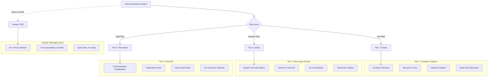
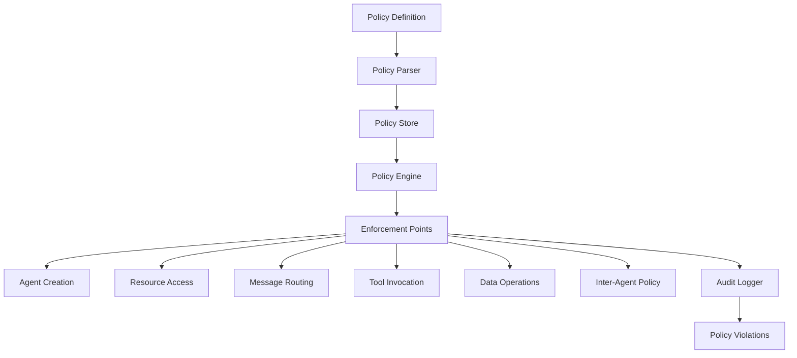
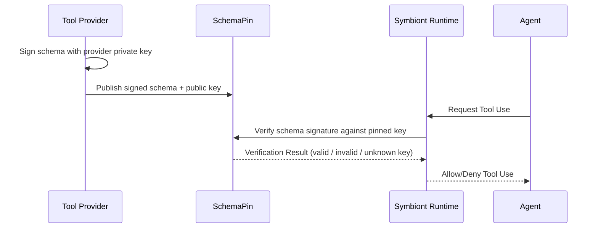
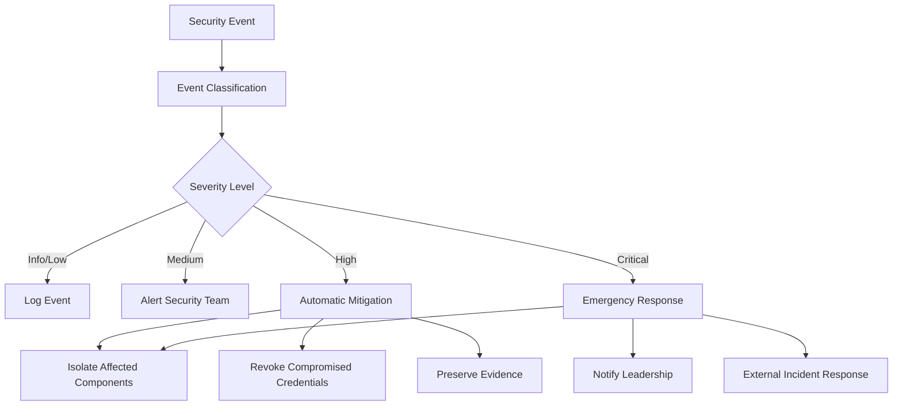

# Sicherheitsmodell

Umfassende Sicherheitsarchitektur, die Zero-Trust, richtliniengesteuerten Schutz fuer KI-Agenten gewaehrleistet.

## Andere Sprachen


---

## Inhaltsverzeichnis


---

## Ueberblick

Symbiont implementiert eine sicherheitsorientierte Architektur, die fuer regulierte und hochsichere Umgebungen entwickelt wurde. Das Sicherheitsmodell basiert auf Zero-Trust-Prinzipien mit umfassender Richtliniendurchsetzung, mehrstufiger Sandbox und kryptographischer Auditierbarkeit.

### Sicherheitsprinzipien

- **Zero Trust**: Alle Komponenten und Kommunikationen werden verifiziert
- **Defense in Depth**: Mehrere Sicherheitsschichten ohne Single Point of Failure
- **Richtliniengesteuert**: Deklarative Sicherheitsrichtlinien zur Laufzeit durchgesetzt
- **Vollstaendige Auditierbarkeit**: Jede Operation mit kryptographischer Integritaet protokolliert
- **Least Privilege**: Minimale fuer den Betrieb erforderliche Berechtigungen

---

## Mehrstufige Sandbox

Die Laufzeitumgebung liefert drei Host-Isolationsstufen (Stufe 1 → Stufe 3) plus ein Hosted-Execution-Backend (E2B). Die Stufen bilden eine monoton zunehmende Isolationsleiter; E2B ist **kein** Peer auf dieser Leiter — es laeuft auf Drittanbieter-Infrastruktur und wird unten separat dokumentiert.



> **Alle drei Host-Isolationsstufen — Docker, gVisor und Firecracker — werden im OSS-Runtime ausgeliefert.** Betreiber waehlen die Stufe pro Agent ueber den DSL-Block `with { sandbox = ... }` oder setzen einen Projekt-Standard via `[sandbox] tier = "..."` in `symbiont.toml`. E2B ist ausschliesslich ueber DSL Opt-in (`with { sandbox = "e2b" }`) und wird absichtlich nicht als `[sandbox] tier`-Wert angeboten.

### Stufe 1: Docker-Isolation

**Anwendungsfaelle:**
- Vertrauenswuerdige Entwicklungsaufgaben
- Datenverarbeitung mit geringer Sensibilitaet
- Interne Tool-Operationen

**Sicherheitsmerkmale:**
```yaml
docker_security:
  memory_limit: "512MB"
  cpu_limit: "0.5"
  network_mode: "none"
  read_only_root: true
  security_opts:
    - "no-new-privileges:true"
    - "seccomp:default"
  capabilities:
    drop: ["ALL"]
    add: ["SETUID", "SETGID"]
```

**Bedrohungsschutz:**
- Prozessisolation vom Host
- Ressourcenerschoepfungsschutz
- Netzwerkzugriffskontrolle
- Dateisystemschutz

### Stufe 2: gVisor-Isolation

**Anwendungsfaelle:**
- Standard-Produktionsworkloads
- Verarbeitung sensibler Daten
- Integration externer Tools

**Sicherheitsmerkmale:**
- Benutzerbereich-Kernel-Implementierung
- Systemaufruf-Filterung und -Uebersetzung
- Speicherschutzgrenzen
- E/A-Anfrageverifizierung

**Konfiguration:**
```yaml
gvisor_security:
  runtime: "runsc"
  platform: "ptrace"
  network: "sandbox"
  file_access: "exclusive"
  debug: false
  strace: false
```

**Erweiterter Schutz:**
- Kernel-Sicherheitsluecken-Isolation
- Systemaufruf-Abfangung
- Speicherkorruptions-Praevention
- Seitenkanalangriff-Minderung

**Voraussetzungen:** Installieren Sie [`runsc`](https://gvisor.dev/docs/user_guide/install/) und registrieren Sie es als Docker-Runtime in `/etc/docker/daemon.json`. `symbi doctor` meldet, ob `runsc` erreichbar ist.

### Stufe 3: Firecracker microVM

**Anwendungsfaelle:**
- Workloads mit hoechster Isolationsanforderung (nicht vertrauenswuerdiger Code, mandantenfaehig, regulierte Daten)
- Wenn die Granularitaet der Syscall-Filter (gVisor) unzureichend ist und eine echte Kernel-Grenze erforderlich ist
- VM-Lebenszyklus pro Ausfuehrung fuer staerkere Eindaemmung des Schadensradius

**Sicherheitsmerkmale:**
- Hardware-Virtualisierung via KVM
- microVM pro Ausfuehrung mit vom Betreiber bereitgestelltem Kernel + rootfs
- Standardmaessig schreibgeschuetztes Root-Dateisystem
- Keine geteilte Kernel-Oberflaeche mit dem Host

**Konfiguration:** `[sandbox.firecracker]` in `symbiont.toml`:

```toml
[sandbox]
tier = "tier3"

[sandbox.firecracker]
kernel_image_path = "/var/lib/firecracker/vmlinux"
rootfs_path       = "/var/lib/firecracker/rootfs.ext4"
vcpus             = 1
mem_mib           = 512
rootfs_read_only  = true
```

**Voraussetzungen:** Der Betreiber muss (a) ein Firecracker-kompatibles Kernel-Image und (b) ein Root-Dateisystem-Image mit einem init-Skript bereitstellen, das die Agenten-Payload liest. **Siehe [`docs/firecracker-setup.md`](firecracker-setup.md) fuer einen schrittweisen Quickstart, den In-VM-Init-Kontrakt und eine Haertungs-Checkliste.** `symbi doctor` meldet, ob das `firecracker`-Binary erreichbar ist.

Sobald Sie beide Artefakte haben, scaffolden Sie ein tier3-Projekt mit:

```bash
symbi init --profile assistant --sandbox tier3 \
  --firecracker-kernel /var/lib/firecracker/vmlinux \
  --firecracker-rootfs /var/lib/firecracker/rootfs.ext4
```

`symbi init` validiert, dass beide Dateien existieren, bevor `symbiont.toml` geschrieben wird, sodass Fehlkonfigurationen zur Scaffold-Zeit auftreten und nicht erst beim ersten Agent-Lauf.

### Hosted-Ausfuehrung: E2B

**E2B ist ein Hosted-Cloud-Sandbox-Backend, keine Host-Isolationsstufe.** Es liegt ausserhalb der Stufen-1-bis-3-Leiter und wird hier der Vollstaendigkeit halber dokumentiert.

**Was es ist:** Code laeuft auf der Infrastruktur von E2B ueber deren HTTPS-API; die Laufzeit liefert nur einen HTTP-Client. Setzen Sie `E2B_API_KEY` und waehlen Sie es pro Agent mit `with { sandbox = "e2b" }`. Es gibt kein `--sandbox e2b`-Flag fuer `symbi init` — E2B ist absichtlich ausschliesslich per DSL Opt-in, da es ein anderes Vertrauensmodell als die Host-Stufen darstellt.

**Anwendungsfaelle:**
- Quickstart-Demos und Evaluierung ohne Installation von Docker, gVisor oder Firecracker.
- Entwicklungsumgebungen, in denen der Betreiber keinen Sandbox-Host betreiben kann (CI ohne privilegierten Modus, abgeschottete Laptops, ARM-Entwickler-Maschinen).

**Was es nicht ist:**
- Kein Ersatz fuer Host-Isolation. Code, Prompts und Tool-Ausgaben durchlaufen die Infrastruktur von E2B. Nicht fuer Workloads mit Datenschutz-, Residenz- oder Compliance-Anforderungen verwenden.
- In einer Sicherheitsbewertung nicht mit Stufe 1/2/3 vergleichbar. Die Laufzeit bildet `E2B → SecurityTier::Hosted` ab, das beim Sortieren **unterhalb** von `Tier1` einsortiert wird — Richtlinien, die Host-Isolation verlangen (`tier >= Tier1`), lehnen Hosted-Ausfuehrung ab.

**Konfiguration:** Keine projektweite Konfiguration; setzen Sie `E2B_API_KEY` in der Umgebung und verwenden Sie `with { sandbox = "e2b" }` pro Agent.

---

## Richtlinien-Engine

### Richtlinienarchitektur

Die Richtlinien-Engine bietet deklarative Sicherheitskontrollen mit Laufzeitdurchsetzung:



### Richtlinientypen

#### Zugriffskontrollrichtlinien

Definieren, wer unter welchen Bedingungen auf welche Ressourcen zugreifen kann:

```rust
policy secure_data_access {
    allow: read(sensitive_data) if (
        user.clearance >= "secret" &&
        user.need_to_know.contains(data.classification) &&
        session.mfa_verified == true
    )

    deny: export(data) if data.contains_pii == true

    require: [
        user.background_check.current,
        session.secure_connection,
        audit_trail = "detailed"
    ]
}
```

#### Datenflussrichtlinien

Kontrollieren, wie Daten durch das System fliessen:

```rust
policy data_flow_control {
    allow: transform(data) if (
        source.classification <= target.classification &&
        user.transform_permissions.contains(operation.type)
    )

    deny: aggregate(datasets) if (
        any(datasets, |d| d.privacy_level > operation.privacy_budget)
    )

    require: differential_privacy for statistical_operations
}
```

#### Ressourcennutzungsrichtlinien

Verwalten die Zuweisung von Rechenressourcen:

```rust
policy resource_governance {
    allow: allocate(resources) if (
        user.resource_quota.remaining >= resources.total &&
        operation.priority <= user.max_priority
    )

    deny: long_running_operations if system.maintenance_mode

    require: supervisor_approval for high_memory_operations
}
```

### Richtlinienbewertungs-Engine

```rust
pub trait PolicyEngine {
    async fn evaluate_policy(
        &self,
        context: PolicyContext,
        action: Action
    ) -> PolicyDecision;

    async fn register_policy(&self, policy: Policy) -> Result<PolicyId>;
    async fn update_policy(&self, policy_id: PolicyId, policy: Policy) -> Result<()>;
}

pub enum PolicyDecision {
    Allow,
    Deny { reason: String },
    AllowWithConditions { conditions: Vec<PolicyCondition> },
    RequireApproval { approver: String },
}
```

### Leistungsoptimierung

**Richtlinien-Caching:**
- Kompilierte Richtlinienbewertung fuer Leistung
- LRU-Cache fuer haeufige Entscheidungen
- Batch-Bewertung fuer Massenoperationen
- Submillisekunden-Bewertungszeiten

**Inkrementelle Updates:**
- Echtzeit-Richtlinienaktualisierungen ohne Neustart
- Versionierte Richtlinienbereitstellung
- Rollback-Faehigkeiten fuer Richtlinienfehler

### Cedar Policy Engine (`cedar` Feature)

Symbiont integriert die [Cedar-Richtliniensprache](https://www.cedarpolicy.com/) fuer formale Autorisierung. Cedar ermoeglicht feingranulare, auditierbare Zugriffskontrollrichtlinien, die an der Policy-Gate-Phase der Reasoning-Schleife ausgewertet werden.

**Standardmaessig aktiv seit v1.14.x:** Cedar gehoert zum Standard-Feature-Set von `symbi-runtime` und ist in jeder veroeffentlichten Binary enthalten (crates.io, Docker, GitHub-Release-Tarballs). `symbi up` und `symbi run` verdrahten `CedarPolicyGate` beim Start automatisch aus `policies/*.cedar`-Dateien; ist mindestens eine Richtliniendatei vorhanden, wird das Gate mit `deny_by_default()` konstruiert und jede `.cedar`-Datei als benannte Richtlinie geladen. Sind keine Richtliniendateien vorhanden, faellt die Runtime auf den fail-closed `DefaultPolicyGate::new()` zurueck (der jede `ToolCall`- und `Delegate`-Aktion ablehnt). Um Cedar vollstaendig zu deaktivieren — fuer Builds, die `OpaPolicyGateBridge` oder ein eigenes `ReasoningPolicyGate` festlegen — bauen Sie mit `cargo build --no-default-features --features "keychain,vector-lancedb"`.

```bash
cargo build --features cedar
```

**Hauptfaehigkeiten:**
- **Formale Verifikation**: Cedar-Richtlinien koennen statisch auf Korrektheit analysiert werden
- **Feingranulare Autorisierung**: Entitaetsbasierte Zugriffskontrolle mit hierarchischen Berechtigungen
- **Reasoning-Loop-Integration**: `CedarPolicyGate` implementiert das `ReasoningPolicyGate` Trait und bewertet jede vorgeschlagene Aktion gegen Cedar-Richtlinien vor der Ausfuehrung
- **Audit-Spur**: Alle Cedar-Richtlinienentscheidungen werden mit vollstaendigem Kontext protokolliert

```rust
use symbi_runtime::reasoning::cedar_gate::CedarPolicyGate;

// Cedar-Policy-Gate mit Deny-by-Default-Haltung erstellen
let cedar_gate = CedarPolicyGate::deny_by_default();
let runner = ReasoningLoopRunner::builder()
    .provider(provider)
    .executor(executor)
    .policy_gate(Arc::new(cedar_gate))
    .build();
```

### Standardverhalten des Reasoning-Loop-Policy-Gates (nach dem v1.13.0-Audit)

Die Reasoning-Schleife in `symbi up` und `symbi run` ist standardmaessig **fail-closed**. `DefaultPolicyGate::new()` liefert `LoopDecision::Deny` fuer jede `ToolCall`- und `Delegate`-Aktion zurueck, mit der Begruendung `"No policy gate configured (DefaultPolicyGate::new is fail-closed; wire OpaPolicyGateBridge or pass --insecure-allow-all)"`. `Respond`-Aktionen bleiben weiterhin erlaubt, damit der Agent weiterhin Textausgaben produzieren kann.

Diese Aenderung schliesst die Luecke, in der das Produktions-Binary zuvor `DefaultPolicyGate::permissive()` fest verdrahtet hatte und jede Aktion stillschweigend zuliess -- siehe `SECURITY_AUDIT.md` C2 fuer die Audit-Spur.

Betreiber haben zwei Pfade:

1. **Ein echtes Policy-Backend anbinden** (empfohlen): `CedarPolicyGate`, `OpaPolicyGateBridge` oder Ihre eigene Implementierung des Traits `ReasoningPolicyGate` konstruieren und an den Runner uebergeben.
2. **Opt-in in den permissiven Modus fuer lokale Entwicklung**: `--insecure-allow-all` an `symbi up` / `symbi run` uebergeben oder `SYMBI_INSECURE_ALLOW_ALL=1` setzen. Bei jedem Start in diesem Modus wird ein mehrzeiliger stderr-Banner ausgegeben, und `tracing::warn!` feuert bei jeder ausgewerteten Aktion.

Der bisherige Konstruktor `permissive()` wurde in `permissive_for_dev_only()` umbenannt und mit `#[doc(hidden)]` markiert, um eine versehentliche Verwendung in Produktionscodepfaden zu verhindern.

### Inter-Agent-Kommunikationsrichtlinie

Das `CommunicationPolicyGate` erzwingt Autorisierungsregeln fuer die gesamte Inter-Agent-Kommunikation. Jeder Aufruf ueber `ask`, `delegate`, `send_to`, `parallel` oder `race` wird vor der Ausfuehrung gegen Richtlinienregeln ausgewertet.

**Regelstruktur:**
- **Bedingungen**: `SenderIs(agent)`, `RecipientIs(agent)`, `Always`, zusammengesetzte `All`/`Any`
- **Wirkungen**: `Allow` oder `Deny { reason }`
- **Prioritaet**: Regeln werden mit hoechster Prioritaet zuerst ausgewertet; erster Treffer gewinnt
- **Standard**: Allow (rueckwaertskompatibel -- bestehende Projekte funktionieren unveraendert)

**Richtlinienablehnung ist ein harter Fehler** -- der aufrufende Agent erhaelt einen Fehler durch die ORGA-Schleife und kann darueber nachdenken. Alle Inter-Agent-Nachrichten werden kryptographisch ueber Ed25519 signiert und mit AES-256-GCM verschluesselt.

Beispielrichtlinie: einen Worker-Agenten daran hindern, an andere Agenten zu delegieren:
```cedar
forbid(
    principal == Agent::"worker",
    action == Action::"delegate",
    resource
);
```

---

## Kryptographische Sicherheit

### Digitale Signaturen

Alle sicherheitsrelevanten Operationen sind kryptographisch signiert:

**Signaturalgorithmus:** Ed25519 (RFC 8032)
- **Schluesselgroesse:** 256-Bit private Schluessel, 256-Bit oeffentliche Schluessel
- **Signaturgroesse:** 512 Bits (64 Bytes)
- **Leistung:** 70.000+ Signaturen/Sekunde, 25.000+ Verifikationen/Sekunde

```rust
pub struct MessageSignature {
    pub signature: Vec<u8>,
    pub algorithm: SignatureAlgorithm,
    pub public_key: Vec<u8>,
}

impl AuditEvent {
    pub fn sign(&mut self, private_key: &PrivateKey) -> Result<()> {
        let message = self.serialize_for_signing()?;
        self.signature = private_key.sign(&message);
        Ok(())
    }

    pub fn verify(&self, public_key: &PublicKey) -> bool {
        let message = self.serialize_for_signing().unwrap();
        public_key.verify(&message, &self.signature)
    }
}
```

### Schluesselverwaltung

**Schluesselspeicherung:**
- Hardware Security Module (HSM) Integration
- Secure Enclave Unterstuetzung fuer Schluesselschutz
- Schluesselrotation mit konfigurierbaren Intervallen
- Verteilte Schluesselsicherung und -wiederherstellung

**Schluesselhierarchie:**
- Root-Signierschluessel fuer Systemoperationen
- Pro-Agent-Schluessel fuer Operationssignierung
- Ephemere Schluessel fuer Sitzungsverschluesselung
- Externe Schluessel fuer Tool-Verifikation

> **Geplantes Feature** -- Die unten gezeigte `KeyManager`-API ist Teil der Sicherheits-Roadmap und noch nicht im aktuellen Release verfuegbar. Die aktuelle Implementierung stellt Schluesseldienstprogramme ueber `KeyUtils` in `crypto.rs` bereit.

```rust
pub struct KeyManager {
    hsm: HardwareSecurityModule,
    key_store: SecureKeyStore,
    rotation_policy: KeyRotationPolicy,
}

impl KeyManager {
    pub async fn generate_agent_keys(&self, agent_id: AgentId) -> Result<KeyPair>;
    pub async fn rotate_keys(&self, key_id: KeyId) -> Result<KeyPair>;
    pub async fn revoke_key(&self, key_id: KeyId) -> Result<()>;
}
```

### Verschluesselungsstandards

**Symmetrische Verschluesselung:** AES-256-GCM
- 256-Bit-Schluessel mit authentifizierter Verschluesselung
- Eindeutige Nonces fuer jede Verschluesselungsoperation
- Zugehoerige Daten fuer Kontextbindung

**Asymmetrische Verschluesselung:** X25519 + ChaCha20-Poly1305
- Elliptische Kurven-Schluesselaustausch
- Stream-Verschluesselung mit authentifizierter Verschluesselung
- Perfect Forward Secrecy

**Nachrichtenverschluesselung:**
```rust
pub fn encrypt_message(
    plaintext: &[u8],
    recipient_public_key: &PublicKey,
    sender_private_key: &PrivateKey
) -> Result<EncryptedMessage> {
    let shared_secret = sender_private_key.diffie_hellman(recipient_public_key);
    let nonce = generate_random_nonce();
    let ciphertext = ChaCha20Poly1305::new(&shared_secret)
        .encrypt(&nonce, plaintext)?;

    Ok(EncryptedMessage {
        nonce,
        ciphertext,
        sender_public_key: sender_private_key.public_key(),
    })
}
```

---

## Audit und Compliance

### Kryptographische Audit-Spur

Jede sicherheitsrelevante Operation generiert ein unveraenderliches Audit-Event:

```rust
pub struct AuditEvent {
    pub event_id: Uuid,
    pub timestamp: SystemTime,
    pub agent_id: AgentId,
    pub event_type: AuditEventType,
    pub details: serde_json::Value,
    pub signature: Ed25519Signature,
    pub previous_hash: Hash,
    pub event_hash: Hash,
}
```

**Audit-Event-Typen:**
- Agent-Lebenszyklus-Events (Erstellung, Beendigung)
- Richtlinienbewertungsentscheidungen
- Ressourcenzuweisung und -nutzung
- Nachrichten-Versendung und -Routing
- Externe Tool-Aufrufe
- Sicherheitsverletzungen und Warnungen

### Hash-Verkettung

Events sind in einer unveraenderlichen Kette verknuepft:

```rust
impl AuditChain {
    pub fn append_event(&mut self, mut event: AuditEvent) -> Result<()> {
        event.previous_hash = self.last_hash;
        event.event_hash = self.calculate_event_hash(&event);
        event.sign(&self.signing_key)?;

        self.events.push(event.clone());
        self.last_hash = event.event_hash;

        self.verify_chain_integrity()?;
        Ok(())
    }

    pub fn verify_integrity(&self) -> Result<bool> {
        for (i, event) in self.events.iter().enumerate() {
            // Verify signature
            if !event.verify(&self.public_key) {
                return Ok(false);
            }

            // Verify hash chain
            if i > 0 && event.previous_hash != self.events[i-1].event_hash {
                return Ok(false);
            }
        }
        Ok(true)
    }
}
```

---

## Human Approval Relay (`symbi-approval-relay`)

Wenn eine Richtlinienentscheidung `require: approval` zurueckgibt, blockiert die Aktion, bis ein menschlicher Pruefer sie freigibt oder ablehnt. `symbi-approval-relay` ist die Crate, die diese Anfragen an einen Menschen und die Entscheidung zurueck transportiert und dabei beide Schritte pruefbar haelt.

### Zweikanal-Design

Das Relay ist **zweikanalig** aufgebaut: jede Freigabe durchlaeuft zwei unabhaengige Pfade, und beide muessen uebereinstimmen, bevor die Runtime die Aktion entsperrt.

- **Primaerkanal** -- eine interaktive Oberflaeche fuer den Pruefer (Chat-Adapter, Web-UI, CLI-Prompt). Dort liest der Pruefer die Anfrage und entscheidet.
- **Attestierungskanal** -- ein unabhaengiger Verifizierungspfad (zum Beispiel ein signierter Callback, ein zweiter Operator oder eine Out-of-Band-Bestaetigung). Die Runtime entsperrt die Aktion nicht allein auf eine Freigabe ueber den Primaerkanal hin.

Diese Struktur schlaegt den Einkanal-Kompromissfall: Ein Angreifer, der den Primaerkanal uebernimmt, kann dennoch keine Freigaben erteilen, da der Attestierungskanal sein Vertrauen nicht mit ihm teilt.

### Was das Relay transportiert

Jede laufende Freigabeanforderung enthaelt:
- Die Agent-Identitaet (AgentPin-verankert) und die Richtlinienentscheidung, die die Anfrage ausgeloest hat
- Den vollstaendigen Aktionskontext -- Tool-Aufruf, Ressource, Argumente -- als Hash, damit Pruefer bestaetigen koennen, dass sie *diese* Aktion und keine ausgetauschte freigegeben haben
- Eine Frist, nach der die Anfrage automatisch abgelehnt wird
- Korrelations-IDs, damit der Audit-Trail die Entscheidungen beider Kanaele einer einzigen Aktion zuordnet

Freigaben und Ablehnungen werden in derselben kryptographisch manipulationssicheren Audit-Kette aufgezeichnet wie jede andere Runtime-Entscheidung. Ein menschliches "Ja" ist eine Entscheidung im Protokoll, kein Bypass desselben.

### Wo es eingesetzt wird

- Cedar-Richtlinien, die `RequireApproval { approver: "..." }`-Urteile ausgeben
- Destruktive oder hochprivilegierte Tool-Aufrufe, abgesichert durch ToolClad-`approval`-Hooks
- Geplante Jobs mit `one_shot = true` plus einer Freigaberichtlinie
- Jeder DSL-`policy`-Block, der `require: <role>_approval` nennt

Ist kein Relay konfiguriert, scheitern freigabepflichtige Aktionen fail-closed -- sie werden abgelehnt, nicht stillschweigend zugelassen.

---

## Tool-Sicherheit mit SchemaPin

### Tool-Verifikationsprozess

Externe Tools werden mit kryptographischen Signaturen verifiziert:



> **Hinweis:** Die SchemaPin-Verifikation ist rein kryptographisch -- Signaturvalidierung und Schluessel-Pinning (TOFU). Sie fuehrt keine KI- oder menschliche Ueberpruefung des Tool-Verhaltens durch; das ist eine separate, geplante Faehigkeit, die weiter unten im Abschnitt *KI-gesteuerte Tool-Ueberpruefung* beschrieben wird.

### Trust-On-First-Use (TOFU)

**Schluessel-Pinning-Prozess:**
1. Erste Begegnung mit einem Tool-Anbieter
2. Oeffentlichen Schluessel des Anbieters ueber externe Kanaele verifizieren
3. Oeffentlichen Schluessel im lokalen Trust Store anheften
4. Angehefteten Schluessel fuer alle zukuenftigen Verifikationen verwenden

> **Geplantes Feature** -- Die unten gezeigte `TOFUKeyStore`-API ist Teil der Sicherheits-Roadmap und noch nicht im aktuellen Release verfuegbar.

```rust
pub struct TOFUKeyStore {
    pinned_keys: HashMap<ProviderId, PinnedKey>,
    trust_policies: Vec<TrustPolicy>,
}

impl TOFUKeyStore {
    pub async fn pin_key(&mut self, provider: ProviderId, key: PublicKey) -> Result<()> {
        if self.pinned_keys.contains_key(&provider) {
            return Err("Key already pinned for provider");
        }

        self.pinned_keys.insert(provider, PinnedKey {
            public_key: key,
            pinned_at: SystemTime::now(),
            trust_level: TrustLevel::Unverified,
        });

        Ok(())
    }

    pub fn verify_tool(&self, tool: &MCPTool) -> VerificationResult {
        if let Some(pinned_key) = self.pinned_keys.get(&tool.provider_id) {
            if pinned_key.public_key.verify(&tool.schema_hash, &tool.signature) {
                VerificationResult::Trusted
            } else {
                VerificationResult::SignatureInvalid
            }
        } else {
            VerificationResult::UnknownProvider
        }
    }
}
```

### KI-gesteuerte Tool-Ueberpruefung

Automatisierte Sicherheitsanalyse vor Tool-Genehmigung:

**Analysekomponenten:**
- **Sicherheitsluecken-Erkennung**: Musterabgleich gegen bekannte Sicherheitsluecken-Signaturen
- **Schaedlicher Code-Erkennung**: ML-basierte Identifikation von boesartigem Verhalten
- **Ressourcennutzungsanalyse**: Bewertung von Rechenressourcenanforderungen
- **Datenschutz-Folgenabschaetzung**: Datenbehandlung und Datenschutzauswirkungen

> **Geplantes Feature** -- Die unten gezeigte `SecurityAnalyzer`-API ist Teil der Sicherheits-Roadmap und noch nicht im aktuellen Release verfuegbar.

```rust
pub struct SecurityAnalyzer {
    vulnerability_patterns: VulnerabilityDatabase,
    ml_detector: MaliciousCodeDetector,
    resource_analyzer: ResourceAnalyzer,
    privacy_assessor: PrivacyAssessor,
}

impl SecurityAnalyzer {
    pub async fn analyze_tool(&self, tool: &MCPTool) -> SecurityAnalysis {
        let mut findings = Vec::new();

        // Vulnerability pattern matching
        findings.extend(self.vulnerability_patterns.scan(&tool.schema));

        // ML-based detection
        let ml_result = self.ml_detector.analyze(&tool.schema).await?;
        findings.extend(ml_result.findings);

        // Resource usage analysis
        let resource_risk = self.resource_analyzer.assess(&tool.schema);

        // Privacy impact assessment
        let privacy_impact = self.privacy_assessor.evaluate(&tool.schema);

        SecurityAnalysis {
            tool_id: tool.id.clone(),
            risk_score: calculate_risk_score(&findings),
            findings,
            resource_requirements: resource_risk,
            privacy_impact,
            recommendation: self.generate_recommendation(&findings),
        }
    }
}
```

---

## ClawHavoc Skill-Scanner

Der ClawHavoc-Scanner bietet inhaltsbezogene Verteidigung fuer Agent-Skills. Jede Skill-Datei wird Zeile fuer Zeile vor dem Laden gescannt, und Befunde mit Critical- oder High-Schweregrad blockieren die Ausfuehrung des Skills.

### Schweregrad-Modell

| Stufe | Aktion | Beschreibung |
|-------|--------|-------------|
| **Critical** | Scan fehlschlagen | Aktive Ausnutzungsmuster (Reverse Shells, Code-Injektion) |
| **High** | Scan fehlschlagen | Zugangsdatendiebstahl, Privilegien-Eskalation, Prozessinjektion |
| **Medium** | Warnen | Verdaechtig, aber moeglicherweise legitim (Downloader, Symlinks) |
| **Warning** | Warnen | Indikatoren mit geringem Risiko (Env-Datei-Referenzen, chmod) |
| **Info** | Protokollieren | Informationsbefunde |

### Erkennungskategorien (40 Regeln)

**Urspruengliche Verteidigungsregeln (10)**
- `pipe-to-shell`, `wget-pipe-to-shell` -- Entfernte Code-Ausfuehrung ueber weitergeleitete Downloads
- `eval-with-fetch`, `fetch-with-eval` -- Code-Injektion ueber eval + Netzwerk
- `base64-decode-exec` -- Verschleierte Ausfuehrung ueber Base64-Dekodierung
- `soul-md-modification`, `memory-md-modification` -- Identitaetsmanipulation
- `rm-rf-pattern` -- Destruktive Dateisystemoperationen
- `env-file-reference`, `chmod-777` -- Sensibler Dateizugriff, weltbeschreibbare Berechtigungen

**Reverse Shells (7)** -- Critical Schweregrad
- `reverse-shell-bash`, `reverse-shell-nc`, `reverse-shell-ncat`, `reverse-shell-mkfifo`, `reverse-shell-python`, `reverse-shell-perl`, `reverse-shell-ruby`

**Credential Harvesting (6)** -- High Schweregrad
- `credential-ssh-keys`, `credential-aws`, `credential-cloud-config`, `credential-browser-cookies`, `credential-keychain`, `credential-etc-shadow`

**Netzwerk-Exfiltration (3)** -- High Schweregrad
- `exfil-dns-tunnel`, `exfil-dev-tcp`, `exfil-nc-outbound`

**Prozessinjektion (4)** -- Critical Schweregrad
- `injection-ptrace`, `injection-ld-preload`, `injection-proc-mem`, `injection-gdb-attach`

**Privilegien-Eskalation (5)** -- High Schweregrad
- `privesc-sudo`, `privesc-setuid`, `privesc-setcap`, `privesc-chown-root`, `privesc-nsenter`

**Symlink- / Pfadtraversal (2)** -- Medium Schweregrad
- `symlink-escape`, `path-traversal-deep`

**Downloader-Ketten (3)** -- Medium Schweregrad
- `downloader-curl-save`, `downloader-wget-save`, `downloader-chmod-exec`

### Ausfuehrbare-Whitelisting

Der `AllowedExecutablesOnly`-Regeltyp beschraenkt, welche ausfuehrbaren Dateien ein Agent-Skill aufrufen kann:

```rust
// Nur diese Ausfuehrbaren erlauben -- alles andere wird blockiert
ScanRule::AllowedExecutablesOnly(vec![
    "python3".into(),
    "node".into(),
    "cargo".into(),
])
```

### Benutzerdefinierte Regeln

Domaenenspezifische Muster koennen neben den ClawHavoc-Standards hinzugefuegt werden:

```rust
let mut scanner = SkillScanner::new();
scanner.add_custom_rule(
    "block-internal-api",
    r"internal\.corp\.example\.com",
    ScanSeverity::High,
    "References to internal API endpoints are not allowed in skills",
);
```

---

## Bereinigung unsichtbarer Zeichen (`symbi-invis-strip`)

`symbi-invis-strip` ist ein abhaengigkeitsfreier Utility-Crate, der im gesamten Runtime verwendet wird, um Zeichen zu entfernen, die als nichts gerendert werden, aber die Bedeutung veraendern -- die klassische Nutzlast fuer Prompt-Injection- und Richtlinien-Umgehungs-Angriffe.

### Was es entfernt

- ASCII C0 (0x00--0x1F) und DEL (0x7F), ausser `\t` `\n` `\r`
- ASCII C1 (0x80--0x9F)
- Zero-Width-Zeichen (ZWSP, ZWNJ, ZWJ)
- Bidirektionale Overrides (LRO, RLO, PDF, LRE, RLE, LRI, RLI, FSI, PDI)
- Word Joiner und den Block unsichtbarer Operatoren
- Byte-Order-Marks (BOM)
- Variation Selectors (VS1--VS16 und ergaenzende VS17--VS256)
- Zeichen im Unicode-Tag-Block (U+E0000--U+E007F)

### Wo es laeuft

- Eingehende Chat- und Webhook-Payloads -- bevor sie den Orchestrator erreichen
- Tool-Call-Argumente -- bevor sie die Cedar-Evaluierung erreichen
- Skill- und Agent-DSL-Inhalte -- vor Scanner und Parser

### Optionale Markup-Entfernung

Die optionale `sanitize_field_with_markup`-Variante entfernt zusaetzlich:
- `<!-- ... -->` HTML-Kommentare
- Dreifach-Backtick-Fenced-Codebloecke

Markup-Entfernung ist fuer Oberflaechen geeignet, auf denen vom Renderer verborgenes Markup keine legitime Nutzung hat -- beispielsweise kurze Felder fuer Richtlinienbegruendungen oder reine Anzeige-Metadaten. Sie wird **nicht** auf Felder angewendet, die legitim Markdown oder Code tragen (wie Agent-Quellcode, Richtlinientexte oder Tool-Ausgaben).

---

## Cedar Policy Linter

`.github/scripts/lint-cedar-policies.py` ist ein statischer Analyse-Pass, der auf jeder `.cedar`-Datei im Repository ausgefuehrt wird. Er faengt eine Klasse von Angriffen ab, bei denen ein boeswilliger (oder kompromittierter) Authoring-Flow eine Richtlinie schreibt, die *korrekt aussieht*, aber Zeichen enthaelt, die eine andere Autorisierungsentscheidung erzeugen, als der Reviewer erwartet.

### Was er abfaengt

- **Homoglyph-Bezeichner** -- kyrillisches `а` (U+0430), das sich als lateinisches `a` ausgibt, griechisches `ο` (U+03BF) als lateinisches `o` und aehnliche Verwechslungen in Principal-, Action- oder Resource-Namen.
- **Unsichtbare Steuerzeichen** innerhalb von Bezeichnern, String-Literalen oder zwischen Tokens.

### Wo er laeuft

- **Pre-Commit-Hook** -- blockiert Commits, die eine der beiden Problemklassen einfuehren.
- **CI** -- dieselbe Pruefung ist ein erforderlicher Test-Job, sodass Commits, die den Hook umgehen (via `--no-verify`), trotzdem in CI fehlschlagen.

Kombiniert mit `symbi-invis-strip` auf dem Datenpfad schliesst der Linter den Authoring-Pfad-Vektor: unsichtbare Tricks koennen nicht in das Repo gelangen, und solche, die zur Laufzeit durchrutschen, werden vor der Richtlinienevaluierung entfernt.

---

## Netzwerksicherheit

### Sichere Kommunikation

**Transport Layer Security:**
- TLS 1.3 fuer alle externe Kommunikation
- Mutual TLS (mTLS) fuer Service-zu-Service-Kommunikation
- Zertifikat-Pinning fuer bekannte Services
- Perfect Forward Secrecy

**Nachrichten-Level-Sicherheit:**
- Ende-zu-Ende-Verschluesselung fuer Agent-Nachrichten
- Message Authentication Codes (MAC)
- Replay-Angriff-Praevention mit Zeitstempeln
- Nachrichten-Reihenfolgen-Garantien

```rust
pub struct SecureChannel {
    encryption_key: [u8; 32],
    mac_key: [u8; 32],
    send_counter: AtomicU64,
    recv_counter: AtomicU64,
}

impl SecureChannel {
    pub fn encrypt_message(&self, plaintext: &[u8]) -> Result<Vec<u8>> {
        let counter = self.send_counter.fetch_add(1, Ordering::SeqCst);
        let nonce = self.generate_nonce(counter);

        let ciphertext = ChaCha20Poly1305::new(&self.encryption_key)
            .encrypt(&nonce, plaintext)?;

        let mac = Hmac::<Sha256>::new_from_slice(&self.mac_key)?
            .chain_update(&ciphertext)
            .chain_update(&counter.to_le_bytes())
            .finalize()
            .into_bytes();

        Ok([ciphertext, mac.to_vec()].concat())
    }
}
```

### Netzwerkisolation

**Sandbox-Netzwerkkontrolle:**
- Standardmaessig kein Netzwerkzugriff
- Explizite Allowlist fuer externe Verbindungen
- Traffic-Ueberwachung und Anomalieerkennung
- DNS-Filterung und -Validierung

**Netzwerkrichtlinien:**
```yaml
network_policy:
  default_action: "deny"
  allowed_destinations:
    - domain: "api.openai.com"
      ports: [443]
      protocol: "https"
    - ip_range: "10.0.0.0/8"
      ports: [6333]  # Qdrant (only needed if using optional Qdrant backend)
      protocol: "http"

  monitoring:
    log_all_connections: true
    detect_anomalies: true
    rate_limiting: true
```

---

## Incident Response

### Sicherheitsereignis-Erkennung

**Automatisierte Erkennung:**
- Richtlinienverletzungsueberwachung
- Anomales Verhaltenserkennung
- Ressourcennutzungsanomalien
- Fehlgeschlagene Authentifizierungsverfolgung

**Alert-Klassifikation:**
```rust
pub enum ViolationSeverity {
    Info,       // Normale Sicherheitsereignisse
    Warning,    // Geringfuegige Richtlinienverletzungen
    Error,      // Bestaetigte Sicherheitsprobleme
    Critical,   // Aktive Sicherheitsverletzungen
}

pub struct SecurityEvent {
    pub id: Uuid,
    pub timestamp: SystemTime,
    pub severity: ViolationSeverity,
    pub category: SecurityEventCategory,
    pub description: String,
    pub affected_components: Vec<ComponentId>,
    pub recommended_actions: Vec<String>,
}
```

### Incident Response Workflow



### Wiederherstellungsverfahren

**Automatisierte Wiederherstellung:**
- Agent-Neustart mit sauberem Zustand
- Schluesselrotation fuer kompromittierte Anmeldedaten
- Richtlinienaktualisierungen zur Wiederholungsverhinderung
- Systemgesundheitsverifikation

**Manuelle Wiederherstellung:**
- Forensische Analyse von Sicherheitsereignissen
- Ursachenanalyse und Remediation
- Sicherheitskontrollaktualisierungen
- Vorfallsdokumentation und Lessons Learned

---

## Sicherheits-Best-Practices

### Entwicklungsrichtlinien

1. **Secure by Default**: Alle Sicherheitsfeatures standardmaessig aktiviert
2. **Principle of Least Privilege**: Minimale Berechtigungen fuer alle Operationen
3. **Defense in Depth**: Mehrere Sicherheitsschichten mit Redundanz
4. **Fail Securely**: Sicherheitsfehler sollten Zugriff verweigern, nicht gewaehren
5. **Audit Everything**: Vollstaendige Protokollierung sicherheitsrelevanter Operationen

### Deployment-Sicherheit

**Umgebungshaertung:**
```bash
# Disable unnecessary services
systemctl disable cups bluetooth

# Kernel hardening
echo "kernel.dmesg_restrict=1" >> /etc/sysctl.conf
echo "kernel.kptr_restrict=2" >> /etc/sysctl.conf

# File system security
mount -o remount,nodev,nosuid,noexec /tmp
```

**Container-Sicherheit:**
```dockerfile
# Use minimal base image
FROM scratch
COPY --from=builder /app/symbiont /bin/symbiont

# Run as non-root user
USER 1000:1000

# Set security options
LABEL security.no-new-privileges=true
```

### Operative Sicherheit

**Ueberwachungs-Checkliste:**
- [ ] Echtzeit-Sicherheitsereignisueberwachung
- [ ] Richtlinienverletzungsverfolgung
- [ ] Ressourcennutzungsanomalieerkennung
- [ ] Fehlgeschlagene Authentifizierungsueberwachung
- [ ] Zertifikatsablaufverfolgung

**Wartungsverfahren:**
- Regelmaessige Sicherheitsupdates und Patches
- Geplante Schluesselrotation
- Richtlinienueberpruefung und -aktualisierungen
- Sicherheitsaudit und Penetrationstests
- Incident Response Plan Tests

---

## Sicherheitskonfiguration

### Umgebungsvariablen

```bash
# Cryptographic settings
export SYMBIONT_CRYPTO_PROVIDER=ring
export SYMBIONT_KEY_STORE_TYPE=hsm
export SYMBIONT_HSM_CONFIG_PATH=/etc/symbiont/hsm.conf

# Audit settings
export SYMBIONT_AUDIT_ENABLED=true
export SYMBIONT_AUDIT_STORAGE=/var/audit/symbiont
export SYMBIONT_AUDIT_RETENTION_DAYS=2555  # 7 years

# Security policies
export SYMBIONT_POLICY_ENFORCEMENT=strict
export SYMBIONT_DEFAULT_SANDBOX_TIER=gvisor
export SYMBIONT_TOFU_ENABLED=true
```

### Sicherheitskonfigurationsdatei

```toml
[security]
# Cryptographic settings
crypto_provider = "ring"
signature_algorithm = "ed25519"
encryption_algorithm = "chacha20_poly1305"

# Key management
key_rotation_interval_days = 90
hsm_enabled = true
hsm_config_path = "/etc/symbiont/hsm.conf"

# Audit settings
audit_enabled = true
audit_storage_path = "/var/audit/symbiont"
audit_retention_days = 2555
audit_compression = true

# Sandbox security
default_sandbox_tier = "gvisor"
sandbox_escape_detection = true
resource_limit_enforcement = "strict"

# Network security
tls_min_version = "1.3"
certificate_pinning = true
network_isolation = true

# Policy enforcement
policy_enforcement_mode = "strict"
policy_violation_action = "deny_and_alert"
emergency_override_enabled = false

[tofu]
enabled = true
key_verification_required = true
trust_on_first_use_timeout_hours = 24
automatic_key_pinning = false
```

---

## Sicherheitsmetriken

### Key Performance Indicators

**Sicherheitsoperationen:**
- Richtlinienbewertungslatenz: Durchschnitt <1ms
- Audit-Event-Generierungsrate: 10.000+ Events/Sekunde
- Sicherheitsvorfallreaktionszeit: <5 Minuten
- Kryptographischer Operationsdurchsatz: 70.000+ Ops/Sekunde

**Compliance-Metriken:**
- Richtlinien-Compliance-Rate: >99,9%
- Audit-Spur-Integritaet: 100%
- Sicherheitsereignis-False-Positive-Rate: <1%
- Vorfallaufloesungszeit: <24 Stunden

**Risikobewertung:**
- Sicherheitsluecken-Patch-Zeit: <48 Stunden
- Sicherheitskontrolleffektivitaet: >95%
- Bedrohungserkennungsgenauigkeit: >99%
- Recovery Time Objective: <1 Stunde

---

## Zukuenftige Verbesserungen

### Erweiterte Kryptographie

**Post-Quantum-Kryptographie:**
- NIST-genehmigte Post-Quantum-Algorithmen
- Hybride klassische/Post-Quantum-Schemas
- Migrationsplaene fuer Quantenbedrohungen

**Homomorphe Verschluesselung:**
- Datenschutzwahrende Berechnung auf verschluesselten Daten
- CKKS-Schema fuer approximative Arithmetik
- Integration mit Machine Learning Workflows

**Zero-Knowledge Proofs:**
- zk-SNARKs fuer Berechnungsverifikation
- Datenschutzwahrende Authentifizierung
- Compliance-Beweisgenerierung

### KI-verstaerkte Sicherheit

**Verhaltensanalyse:**
- Machine Learning fuer Anomalieerkennung
- Praediktive Sicherheitsanalysen
- Adaptive Bedrohungsreaktion

**Automatisierte Antwort:**
- Selbstheilende Sicherheitskontrollen
- Dynamische Richtliniengenerierung
- Intelligente Vorfallklassifizierung

---

## Naechste Schritte

- **[Beitraege](/contributing)** - Sicherheitsentwicklungsrichtlinien
- **[Runtime-Architektur](/runtime-architecture)** - Technische Implementierungsdetails
- **[API-Referenz](/api-reference)** - Sicherheits-API-Dokumentation

Das Symbiont-Sicherheitsmodell bietet unternehmenstauglichen Schutz fuer regulierte Industrien und Hochsicherheitsumgebungen. Sein geschichteter Ansatz gewaehrleistet robusten Schutz vor sich entwickelnden Bedrohungen bei gleichzeitiger Aufrechterhaltung der betrieblichen Effizienz.
