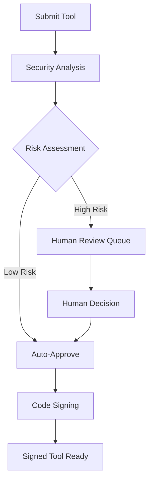

layout: default
title: Referencia de API
description: "Documentacion completa de las APIs del runtime de Symbiont"
nav_exclude: true
---

# Referencia de API

Este documento proporciona documentacion completa para las APIs del runtime de Symbiont. El proyecto Symbiont expone dos sistemas de API distintos diseñados para diferentes casos de uso y etapas de desarrollo.

## Descripcion General

Symbiont ofrece dos interfaces de API:

1. **API HTTP del Runtime** - Una API completa para interaccion directa con el runtime, gestion de agentes y ejecucion de flujos de trabajo
2. **API de Revision de Herramientas (Produccion)** - Una API completa y lista para produccion para flujos de trabajo de revision y firma de herramientas impulsados por IA

---

## API HTTP del Runtime

La API HTTP del Runtime proporciona acceso directo al runtime de Symbiont para ejecucion de flujos de trabajo, gestion de agentes y monitoreo del sistema. Todos los endpoints estan completamente implementados y listos para produccion cuando la caracteristica `http-api` esta habilitada.

### URL Base
```
http://127.0.0.1:8080/api/v1
```

### Autenticacion

Los endpoints de gestion de agentes requieren autenticacion con token Bearer. Configure la variable de entorno `API_AUTH_TOKEN` e incluya el token en el encabezado Authorization:

```
Authorization: Bearer <your-token>
```

**Endpoints Protegidos:**
- Todos los endpoints `/api/v1/agents/*` requieren autenticacion
- Los endpoints `/api/v1/health`, `/api/v1/workflows/execute` y `/api/v1/metrics` no requieren autenticacion

### Endpoints Disponibles

#### Verificacion de Salud
```http
GET /api/v1/health
```

Devuelve el estado actual de salud del sistema e informacion basica del runtime.

**Respuesta (200 OK):**
```json
{
  "status": "healthy",
  "uptime_seconds": 3600,
  "timestamp": "2024-01-15T10:30:00Z",
  "version": "1.0.0"
}
```

**Respuesta (500 Error Interno del Servidor):**
```json
{
  "status": "unhealthy",
  "error": "Database connection failed",
  "timestamp": "2024-01-15T10:30:00Z"
}
```

### Endpoints Disponibles

#### Ejecucion de Flujo de Trabajo
```http
POST /api/v1/workflows/execute
```

Ejecuta un flujo de trabajo con parametros especificados.

**Cuerpo de Solicitud:**
```json
{
  "workflow_id": "string",
  "parameters": {},
  "agent_id": "optional-agent-id"
}
```

**Respuesta (200 OK):**
```json
{
  "result": "workflow execution result"
}
```

#### Gestion de Agentes

Todos los endpoints de gestion de agentes requieren autenticacion via el encabezado `Authorization: Bearer <token>`.

##### Listar Agentes
```http
GET /api/v1/agents
Authorization: Bearer <your-token>
```

Recupera una lista de todos los agentes activos en el runtime.

**Respuesta (200 OK):**
```json
[
  "agent-id-1",
  "agent-id-2",
  "agent-id-3"
]
```

##### Obtener Estado del Agente
```http
GET /api/v1/agents/{id}/status
Authorization: Bearer <your-token>
```

Obtiene informacion detallada del estado para un agente especifico incluyendo metricas de ejecucion en tiempo real.

**Respuesta (200 OK):**
```json
{
  "agent_id": "uuid",
  "state": "running|ready|waiting|failed|completed|terminated",
  "last_activity": "2024-01-15T10:30:00Z",
  "scheduled_at": "2024-01-15T10:00:00Z",
  "resource_usage": {
    "memory_usage": 268435456,
    "cpu_usage": 15.5,
    "active_tasks": 1
  },
  "execution_context": {
    "execution_mode": "ephemeral|persistent|scheduled|event_driven",
    "process_id": 12345,
    "uptime": "00:15:30",
    "health_status": "healthy|unhealthy"
  }
}
```

**Nuevos Estados del Agente:**
- `running`: El agente esta ejecutando activamente con un proceso en ejecucion
- `ready`: El agente esta inicializado y listo para ejecucion
- `waiting`: El agente esta en cola para ejecucion
- `failed`: La ejecucion del agente fallo o la verificacion de salud fallo
- `completed`: La tarea del agente se completo exitosamente
- `terminated`: El agente fue terminado graciosamente o forzosamente

##### Crear Agente
```http
POST /api/v1/agents
Authorization: Bearer <your-token>
```

Crea un nuevo agente con la configuracion proporcionada.

**Cuerpo de Solicitud:**
```json
{
  "name": "my-agent",
  "dsl": "agent definition in DSL format"
}
```

**Respuesta (200 OK):**
```json
{
  "id": "uuid",
  "status": "created"
}
```

##### Actualizar Agente
```http
PUT /api/v1/agents/{id}
Authorization: Bearer <your-token>
```

Actualiza la configuracion de un agente existente. Al menos un campo debe ser proporcionado.

**Cuerpo de Solicitud:**
```json
{
  "name": "updated-agent-name",
  "dsl": "updated agent definition in DSL format"
}
```

**Respuesta (200 OK):**
```json
{
  "id": "uuid",
  "status": "updated"
}
```

##### Eliminar Agente
```http
DELETE /api/v1/agents/{id}
Authorization: Bearer <your-token>
```

Elimina un agente existente del runtime.

**Respuesta (200 OK):**
```json
{
  "id": "uuid",
  "status": "deleted"
}
```

##### Ejecutar Agente
```http
POST /api/v1/agents/{id}/execute
Authorization: Bearer <your-token>
```

Activa la ejecucion de un agente especifico.

**Cuerpo de Solicitud:**
```json
{}
```

**Respuesta (200 OK):**
```json
{
  "execution_id": "uuid",
  "status": "execution_started"
}
```

##### Obtener Historial de Ejecucion del Agente
```http
GET /api/v1/agents/{id}/history
Authorization: Bearer <your-token>
```

Recupera el historial de ejecucion para un agente especifico.

**Respuesta (200 OK):**
```json
{
  "history": [
    {
      "execution_id": "uuid",
      "status": "completed",
      "timestamp": "2024-01-15T10:30:00Z"
    }
  ]
}
```

##### Heartbeat del Agente
```http
POST /api/v1/agents/{id}/heartbeat
Authorization: Bearer <your-token>
```

Envia un heartbeat desde un agente en ejecucion para actualizar su estado de salud.

##### Enviar Evento al Agente
```http
POST /api/v1/agents/{id}/events
Authorization: Bearer <your-token>
```

Envia un evento externo a un agente en ejecucion para ejecucion basada en eventos.

#### Metricas del Sistema
```http
GET /api/v1/metrics
```

Recupera una instantanea de metricas completa cubriendo programador, gestor de tareas, balanceador de carga y recursos del sistema.

**Respuesta (200 OK):**
```json
{
  "timestamp": "2026-02-16T12:00:00Z",
  "scheduler": {
    "total_jobs": 12,
    "active_jobs": 8,
    "paused_jobs": 2,
    "failed_jobs": 1,
    "total_runs": 450,
    "successful_runs": 445,
    "dead_letter_count": 2
  },
  "task_manager": {
    "queued_tasks": 3,
    "running_tasks": 5,
    "completed_tasks": 1200,
    "failed_tasks": 15
  },
  "load_balancer": {
    "total_workers": 4,
    "active_workers": 3,
    "requests_per_second": 12.5
  },
  "system": {
    "cpu_usage_percent": 45.2,
    "memory_usage_bytes": 536870912,
    "memory_total_bytes": 17179869184,
    "uptime_seconds": 3600
  }
}
```

La instantanea de metricas tambien puede exportarse a archivos (escritura JSON atomica) o endpoints OTLP usando el sistema `MetricsExporter` del runtime. Consulta la seccion [Metricas y Telemetria](#metricas--telemetria) a continuacion.

---

### Metricas y Telemetria

Symbiont soporta la exportacion de metricas del runtime a multiples backends:

#### Exportador de Archivos

Escribe instantaneas de metricas como archivos JSON atomicos (tempfile + rename):

```rust
use symbi_runtime::metrics::{FileMetricsExporter, MetricsExporterConfig};

let exporter = FileMetricsExporter::new("/var/lib/symbi/metrics.json");
exporter.export(&snapshot)?;
```

#### Exportador OTLP

Envia metricas a cualquier endpoint compatible con OpenTelemetry (requiere la feature `metrics`):

```rust
use symbi_runtime::metrics::{OtlpExporter, OtlpExporterConfig, OtlpProtocol};

let config = OtlpExporterConfig {
    endpoint: "http://localhost:4317".to_string(),
    protocol: OtlpProtocol::Grpc,
    ..Default::default()
};
```

#### Exportador Compuesto

Fan-out a multiples backends simultaneamente — los fallos de exportacion individuales se registran pero no bloquean otros exportadores:

```rust
use symbi_runtime::metrics::CompositeExporter;

let composite = CompositeExporter::new(vec![
    Box::new(file_exporter),
    Box::new(otlp_exporter),
]);
```

#### Recoleccion en Segundo Plano

El `MetricsCollector` se ejecuta como un hilo en segundo plano, recopilando periodicamente instantaneas y exportandolas:

```rust
use symbi_runtime::metrics::MetricsCollector;

let collector = MetricsCollector::new(exporter, interval);
collector.start();
// ... later ...
collector.stop();
```

---

### Escaneo de Habilidades (ClawHavoc)

El `SkillScanner` inspecciona el contenido de habilidades de agentes en busca de patrones maliciosos antes de cargarlas. Incluye **40 reglas de defensa ClawHavoc integradas** en 10 categorias de ataque:

| Categoria | Cantidad | Severidad | Ejemplos |
|-----------|----------|-----------|----------|
| Reglas de defensa originales | 10 | Critico/Advertencia | `pipe-to-shell`, `eval-with-fetch`, `rm-rf-pattern` |
| Shells inversos | 7 | Critico | bash, nc, ncat, mkfifo, python, perl, ruby |
| Recoleccion de credenciales | 6 | Alto | Claves SSH, credenciales AWS, config de nube, cookies del navegador, llavero |
| Exfiltracion de red | 3 | Alto | Tunel DNS, `/dev/tcp`, netcat saliente |
| Inyeccion de procesos | 4 | Critico | ptrace, LD_PRELOAD, `/proc/mem`, gdb attach |
| Escalada de privilegios | 5 | Alto | sudo, setuid, setcap, chown root, nsenter |
| Symlink / travesia de ruta | 2 | Medio | escape de symlink, travesia de ruta profunda |
| Cadenas de descarga | 3 | Medio | curl save, wget save, chmod exec |

Consulta el [Modelo de Seguridad](/security-model#clawhavoc-skill-scanner) para la lista completa de reglas y modelo de severidad.

#### Uso

```rust
use symbi_runtime::skills::SkillScanner;

let scanner = SkillScanner::new(); // includes all 40 default rules
let result = scanner.scan_skill("/path/to/skill/");

if !result.passed {
    for finding in &result.findings {
        eprintln!("[{}] {}: {} (line {})",
            finding.severity, finding.rule, finding.message, finding.line);
    }
}
```

Se pueden agregar patrones de denegacion personalizados junto con los predeterminados:

```rust
let scanner = SkillScanner::with_custom_rules(vec![
    ("custom-pattern".into(), r"my_dangerous_pattern".into(),
     ScanSeverity::Warning, "Custom rule description".into()),
]);
```

### Configuracion del Servidor

El servidor de la API HTTP del Runtime puede configurarse con las siguientes opciones:

- **Direccion de enlace predeterminada**: `127.0.0.1:8080`
- **Soporte CORS**: Configurable para desarrollo
- **Rastreo de solicitudes**: Habilitado via middleware Tower
- **Feature gate**: Disponible tras la caracteristica `http-api` de Cargo

---

### Referencia de Configuracion de Features

#### Inferencia LLM en la Nube (`cloud-llm`)

Conecta a proveedores de LLM en la nube via OpenRouter para razonamiento de agentes:

```bash
cargo build --features cloud-llm
```

**Variables de Entorno:**
- `OPENROUTER_API_KEY` — Tu clave de API de OpenRouter (requerida)
- `OPENROUTER_MODEL` — Modelo a usar (por defecto: `google/gemini-2.0-flash-001`)

El proveedor de LLM en la nube se integra con el pipeline `execute_actions()` del bucle de razonamiento. Soporta respuestas en streaming, reintentos automaticos con retroceso exponencial y seguimiento de uso de tokens.

#### Modo Agente Autonomo (`standalone-agent`)

Combina inferencia LLM en la nube con acceso a herramientas Composio para agentes nativos de la nube:

```bash
cargo build --features standalone-agent
# Enables: cloud-llm + composio
```

**Variables de Entorno:**
- `OPENROUTER_API_KEY` — Clave de API de OpenRouter
- `COMPOSIO_API_KEY` — Clave de API de Composio
- `COMPOSIO_MCP_URL` — URL del servidor MCP de Composio

#### Motor de Politicas Cedar (`cedar`)

Autorizacion formal usando el [lenguaje de politicas Cedar](https://www.cedarpolicy.com/):

```bash
cargo build --features cedar
```

Las politicas Cedar se integran con la fase Gate del bucle de razonamiento, proporcionando decisiones de autorizacion granulares. Consulta el [Modelo de Seguridad](/security-model#cedar-policy-engine) para ejemplos de politicas.

#### Configuracion de Base de Datos Vectorial

Symbiont incluye **LanceDB** como backend vectorial embebido por defecto — no se requiere servicio externo. Para despliegues a escala, Qdrant esta disponible como backend opcional.

**LanceDB (por defecto):**
```toml
[vector_db]
enabled = true
backend = "lancedb"
collection_name = "symbi_knowledge"
```

No se necesita configuracion adicional. Los datos se almacenan localmente junto al runtime.

**Qdrant (opcional):**
```bash
cargo build --features vector-qdrant
```

```toml
[vector_db]
enabled = true
backend = "qdrant"
collection_name = "symbi_knowledge"
url = "http://localhost:6333"
```

**Variables de Entorno:**
- `SYMBIONT_VECTOR_BACKEND` — `lancedb` (por defecto) o `qdrant`
- `QDRANT_URL` — URL del servidor Qdrant (solo cuando se usa Qdrant)

#### Primitivas de Razonamiento Avanzado (`orga-adaptive`)

Habilita curacion de herramientas, deteccion de bucles atascados, pre-carga de contexto y convenciones con alcance:

```bash
cargo build --features orga-adaptive
```

Consulta la [guia de orga-adaptive](/orga-adaptive) para la referencia completa de configuracion.

---

### Estructuras de Datos

#### Tipos Centrales
```rust
// Workflow execution request
WorkflowExecutionRequest {
    workflow_id: String,
    parameters: serde_json::Value,
    agent_id: Option<AgentId>
}

// Agent status response
AgentStatusResponse {
    agent_id: AgentId,
    state: AgentState,
    last_activity: DateTime<Utc>,
    resource_usage: ResourceUsage
}

// Health check response
HealthResponse {
    status: String,
    uptime_seconds: u64,
    timestamp: DateTime<Utc>,
    version: String
}

// Agent creation request
CreateAgentRequest {
    name: String,
    dsl: String
}

// Agent creation response
CreateAgentResponse {
    id: String,
    status: String
}

// Agent update request
UpdateAgentRequest {
    name: Option<String>,
    dsl: Option<String>
}

// Agent update response
UpdateAgentResponse {
    id: String,
    status: String
}

// Agent deletion response
DeleteAgentResponse {
    id: String,
    status: String
}

// Agent execution request
ExecuteAgentRequest {
    // Empty struct for now
}

// Agent execution response
ExecuteAgentResponse {
    execution_id: String,
    status: String
}

// Agent execution record
AgentExecutionRecord {
    execution_id: String,
    status: String,
    timestamp: String
}

// Agent execution history response
GetAgentHistoryResponse {
    history: Vec<AgentExecutionRecord>
}
```

### Interfaz del Proveedor de Runtime

La API implementa un trait `RuntimeApiProvider` con los siguientes metodos mejorados:

- `execute_workflow()` - Ejecuta un flujo de trabajo con parametros dados
- `get_agent_status()` - Recupera estado detallado con metricas de ejecucion en tiempo real
- `get_system_health()` - Obtiene el estado general de salud del sistema con estadisticas del programador
- `list_agents()` - Lista todos los agentes (en ejecucion, en cola y completados)
- `shutdown_agent()` - Apagado gracioso con limpieza de recursos y manejo de timeout
- `get_metrics()` - Recupera metricas completas del sistema incluyendo estadisticas de tareas
- `create_agent()` - Crea agentes con especificacion de modo de ejecucion
- `update_agent()` - Actualiza la configuracion del agente con persistencia
- `delete_agent()` - Elimina agente con limpieza adecuada de procesos en ejecucion
- `execute_agent()` - Activa ejecucion con monitoreo y verificaciones de salud
- `get_agent_history()` - Recupera historial de ejecucion detallado con metricas de rendimiento

#### API de Programacion

Todos los endpoints de programacion requieren autenticacion. Requiere la feature `cron`.

##### Listar Programaciones
```http
GET /api/v1/schedules
Authorization: Bearer <your-token>
```

**Respuesta (200 OK):**
```json
[
  {
    "job_id": "uuid",
    "name": "daily-report",
    "cron_expression": "0 0 9 * * *",
    "timezone": "America/New_York",
    "status": "active",
    "enabled": true,
    "next_run": "2026-03-04T09:00:00Z",
    "run_count": 42
  }
]
```

##### Crear Programacion
```http
POST /api/v1/schedules
Authorization: Bearer <your-token>
```

**Cuerpo de Solicitud:**
```json
{
  "name": "daily-report",
  "cron_expression": "0 0 9 * * *",
  "timezone": "America/New_York",
  "agent_name": "report-agent",
  "policy_ids": ["policy-1"],
  "one_shot": false
}
```

La `cron_expression` usa seis campos: `sec min hour day month weekday` (campo septimo opcional para año).

**Respuesta (200 OK):**
```json
{
  "job_id": "uuid",
  "next_run": "2026-03-04T09:00:00Z",
  "status": "created"
}
```

##### Actualizar Programacion
```http
PUT /api/v1/schedules/{id}
Authorization: Bearer <your-token>
```

**Cuerpo de Solicitud (todos los campos opcionales):**
```json
{
  "cron_expression": "0 */10 * * * *",
  "timezone": "UTC",
  "policy_ids": ["policy-2"],
  "one_shot": true
}
```

##### Pausar / Reanudar / Activar Programacion
```http
POST /api/v1/schedules/{id}/pause
POST /api/v1/schedules/{id}/resume
POST /api/v1/schedules/{id}/trigger
Authorization: Bearer <your-token>
```

**Respuesta (200 OK):**
```json
{
  "job_id": "uuid",
  "action": "paused",
  "status": "ok"
}
```

##### Eliminar Programacion
```http
DELETE /api/v1/schedules/{id}
Authorization: Bearer <your-token>
```

**Respuesta (200 OK):**
```json
{
  "job_id": "uuid",
  "deleted": true
}
```

##### Obtener Historial de Programacion
```http
GET /api/v1/schedules/{id}/history
Authorization: Bearer <your-token>
```

**Respuesta (200 OK):**
```json
{
  "job_id": "uuid",
  "history": [
    {
      "run_id": "uuid",
      "started_at": "2026-03-03T09:00:00Z",
      "completed_at": "2026-03-03T09:01:23Z",
      "status": "completed",
      "error": null,
      "execution_time_ms": 83000
    }
  ]
}
```

##### Obtener Proximas Ejecuciones
```http
GET /api/v1/schedules/{id}/next?count=5
Authorization: Bearer <your-token>
```

**Respuesta (200 OK):**
```json
{
  "job_id": "uuid",
  "next_runs": [
    "2026-03-04T09:00:00Z",
    "2026-03-05T09:00:00Z"
  ]
}
```

##### Salud del Programador
```http
GET /api/v1/health/scheduler
```

Devuelve salud y estadisticas especificas del programador.

---

#### API de Adaptadores de Canal

Todos los endpoints de canal requieren autenticacion. Conecta agentes a Slack, Microsoft Teams y Mattermost.

##### Listar Canales
```http
GET /api/v1/channels
Authorization: Bearer <your-token>
```

**Respuesta (200 OK):**
```json
[
  {
    "id": "uuid",
    "name": "slack-general",
    "platform": "slack",
    "status": "running"
  }
]
```

##### Registrar Canal
```http
POST /api/v1/channels
Authorization: Bearer <your-token>
```

**Cuerpo de Solicitud:**
```json
{
  "name": "slack-general",
  "platform": "slack",
  "config": {
    "webhook_url": "https://hooks.slack.com/...",
    "channel": "#general"
  }
}
```

Plataformas soportadas: `slack`, `teams`, `mattermost`.

**Respuesta (200 OK):**
```json
{
  "id": "uuid",
  "name": "slack-general",
  "platform": "slack",
  "status": "registered"
}
```

##### Obtener / Actualizar / Eliminar Canal
```http
GET    /api/v1/channels/{id}
PUT    /api/v1/channels/{id}
DELETE /api/v1/channels/{id}
Authorization: Bearer <your-token>
```

##### Iniciar / Detener Canal
```http
POST /api/v1/channels/{id}/start
POST /api/v1/channels/{id}/stop
Authorization: Bearer <your-token>
```

**Respuesta (200 OK):**
```json
{
  "id": "uuid",
  "action": "started",
  "status": "ok"
}
```

##### Salud del Canal
```http
GET /api/v1/channels/{id}/health
Authorization: Bearer <your-token>
```

**Respuesta (200 OK):**
```json
{
  "id": "uuid",
  "connected": true,
  "platform": "slack",
  "workspace_name": "my-team",
  "channels_active": 3,
  "last_message_at": "2026-03-03T15:42:00Z",
  "uptime_secs": 86400
}
```

##### Mapeo de Identidades
```http
GET  /api/v1/channels/{id}/mappings
POST /api/v1/channels/{id}/mappings
Authorization: Bearer <your-token>
```

Mapea usuarios de plataforma a identidades de Symbiont para interacciones con agentes.

##### Registro de Auditoria del Canal
```http
GET /api/v1/channels/{id}/audit
Authorization: Bearer <your-token>
```

---

### Funciones del Programador

**Ejecucion Real de Tareas:**
- Generacion de procesos con entornos de ejecucion seguros
- Monitoreo de recursos (memoria, CPU) con intervalos de 5 segundos
- Verificaciones de salud y deteccion automatica de fallos
- Soporte para modos de ejecucion efimeros, persistentes, programados y basados en eventos

**Apagado Gracioso:**
- Periodo de terminacion graciosa de 30 segundos
- Terminacion forzada para procesos que no responden
- Limpieza de recursos y persistencia de metricas
- Limpieza de cola y sincronizacion de estado

### Gestion de Contexto Mejorada

**Capacidades de Busqueda Avanzada:**
```json
{
  "query_type": "keyword|temporal|similarity|hybrid",
  "search_terms": ["term1", "term2"],
  "time_range": {
    "start": "2024-01-01T00:00:00Z",
    "end": "2024-01-31T23:59:59Z"
  },
  "memory_types": ["factual", "procedural", "episodic"],
  "relevance_threshold": 0.7,
  "max_results": 10
}
```

**Calculo de Importancia:**
- Puntuacion multi-factor con frecuencia de acceso, recencia y retroalimentacion del usuario
- Ponderacion por tipo de memoria y factores de decaimiento por edad
- Calculo de puntuacion de confianza para conocimiento compartido

**Integracion de Control de Acceso:**
- Motor de politicas conectado a operaciones de contexto
- Acceso con alcance de agente con limites seguros
- Comparticion de conocimiento con permisos granulares

---

## API de Revision de Herramientas (Produccion)

La API de Revision de Herramientas proporciona un flujo de trabajo completo para revisar, analizar y firmar herramientas MCP (Protocolo de Contexto de Modelo) de forma segura utilizando analisis de seguridad impulsado por IA con capacidades de supervision humana.

### URL Base
```
https://your-symbiont-instance.com/api/v1
```

### Autenticacion
Todos los endpoints requieren autenticacion JWT Bearer:
```
Authorization: Bearer <your-jwt-token>
```

### Flujo de Trabajo Principal

La API de Revision de Herramientas sigue este flujo de solicitud/respuesta:



### Endpoints

#### Sesiones de Revision

##### Enviar Herramienta para Revision
```http
POST /sessions
```

Envia una herramienta MCP para revision y analisis de seguridad.

**Cuerpo de Solicitud:**
```json
{
  "tool_name": "string",
  "tool_version": "string",
  "source_code": "string",
  "metadata": {
    "description": "string",
    "author": "string",
    "permissions": ["array", "of", "permissions"]
  }
}
```

**Respuesta:**
```json
{
  "review_id": "uuid",
  "status": "submitted",
  "created_at": "2024-01-15T10:30:00Z"
}
```

##### Listar Sesiones de Revision
```http
GET /sessions
```

Recupera una lista paginada de sesiones de revision con filtrado opcional.

**Parametros de Consulta:**
- `page` (integer): Numero de pagina para paginacion
- `limit` (integer): Numero de elementos por pagina
- `status` (string): Filtrar por estado de revision
- `author` (string): Filtrar por autor de herramienta

**Respuesta:**
```json
{
  "sessions": [
    {
      "review_id": "uuid",
      "tool_name": "string",
      "status": "string",
      "created_at": "2024-01-15T10:30:00Z",
      "updated_at": "2024-01-15T11:00:00Z"
    }
  ],
  "pagination": {
    "page": 1,
    "limit": 20,
    "total": 100,
    "has_next": true
  }
}
```

##### Obtener Detalles de Sesion de Revision
```http
GET /sessions/{reviewId}
```

Recupera informacion detallada sobre una sesion de revision especifica.

**Respuesta:**
```json
{
  "review_id": "uuid",
  "tool_name": "string",
  "tool_version": "string",
  "status": "string",
  "analysis_results": {
    "risk_score": 85,
    "findings": ["array", "of", "security", "findings"],
    "recommendations": ["array", "of", "recommendations"]
  },
  "created_at": "2024-01-15T10:30:00Z",
  "updated_at": "2024-01-15T11:00:00Z"
}
```

#### Analisis de Seguridad

##### Obtener Resultados de Analisis
```http
GET /analysis/{analysisId}
```

Recupera resultados detallados de analisis de seguridad para un analisis especifico.

**Respuesta:**
```json
{
  "analysis_id": "uuid",
  "review_id": "uuid",
  "risk_score": 85,
  "analysis_type": "automated",
  "findings": [
    {
      "severity": "high",
      "category": "code_injection",
      "description": "Potential code injection vulnerability detected",
      "location": "line 42",
      "recommendation": "Sanitize user input before execution"
    }
  ],
  "rag_insights": [
    {
      "knowledge_source": "security_kb",
      "relevance_score": 0.95,
      "insight": "Similar patterns found in known vulnerabilities"
    }
  ],
  "completed_at": "2024-01-15T10:45:00Z"
}
```

#### Flujo de Trabajo de Revision Humana

##### Obtener Cola de Revision
```http
GET /review/queue
```

Recupera elementos pendientes de revision humana, tipicamente herramientas de alto riesgo que requieren inspeccion manual.

**Respuesta:**
```json
{
  "pending_reviews": [
    {
      "review_id": "uuid",
      "tool_name": "string",
      "risk_score": 92,
      "priority": "high",
      "assigned_to": "reviewer@example.com",
      "escalated_at": "2024-01-15T11:00:00Z"
    }
  ],
  "queue_stats": {
    "total_pending": 5,
    "high_priority": 2,
    "average_wait_time": "2h 30m"
  }
}
```

##### Enviar Decision de Revision
```http
POST /review/{reviewId}/decision
```

Envia la decision de un revisor humano sobre una revision de herramienta.

**Cuerpo de Solicitud:**
```json
{
  "decision": "approve|reject|request_changes",
  "comments": "Detailed review comments",
  "conditions": ["array", "of", "approval", "conditions"],
  "reviewer_id": "reviewer@example.com"
}
```

**Respuesta:**
```json
{
  "review_id": "uuid",
  "decision": "approve",
  "processed_at": "2024-01-15T12:00:00Z",
  "next_status": "approved_for_signing"
}
```

#### Firma de Herramientas

##### Obtener Estado de Firma
```http
GET /signing/{reviewId}
```

Recupera el estado de firma e informacion de firma para una herramienta revisada.

**Respuesta:**
```json
{
  "review_id": "uuid",
  "signing_status": "completed",
  "signature_info": {
    "algorithm": "RSA-SHA256",
    "key_id": "signing-key-001",
    "signature": "base64-encoded-signature",
    "signed_at": "2024-01-15T12:30:00Z"
  },
  "certificate_chain": ["array", "of", "certificates"]
}
```

##### Descargar Herramienta Firmada
```http
GET /signing/{reviewId}/download
```

Descarga el paquete de herramienta firmada con firma incrustada y metadatos de verificacion.

**Respuesta:**
Descarga binaria del paquete de herramienta firmada.

#### Estadisticas y Monitoreo

##### Obtener Estadisticas de Flujo de Trabajo
```http
GET /stats
```

Recupera estadisticas y metricas completas sobre el flujo de trabajo de revision.

**Respuesta:**
```json
{
  "workflow_stats": {
    "total_reviews": 1250,
    "approved": 1100,
    "rejected": 125,
    "pending": 25
  },
  "performance_metrics": {
    "average_review_time": "45m",
    "auto_approval_rate": 0.78,
    "human_review_rate": 0.22
  },
  "security_insights": {
    "common_vulnerabilities": ["sql_injection", "xss", "code_injection"],
    "risk_score_distribution": {
      "low": 45,
      "medium": 35,
      "high": 20
    }
  }
}
```

### Limitacion de Velocidad

La API de Revision de Herramientas implementa limitacion de velocidad por tipo de endpoint:

- **Endpoints de envio**: 10 solicitudes por minuto
- **Endpoints de consulta**: 100 solicitudes por minuto
- **Endpoints de descarga**: 20 solicitudes por minuto

Los encabezados de limite de velocidad se incluyen en todas las respuestas:
```
X-RateLimit-Limit: 100
X-RateLimit-Remaining: 95
X-RateLimit-Reset: 1642248000
```

### Manejo de Errores

La API utiliza codigos de estado HTTP estandar y devuelve informacion detallada del error:

```json
{
  "error": {
    "code": "INVALID_REQUEST",
    "message": "Tool source code is required",
    "details": {
      "field": "source_code",
      "reason": "missing_required_field"
    }
  }
}
```


---

## Primeros Pasos

### API HTTP del Runtime

1. Asegurate de que el runtime este construido con la caracteristica `http-api`:
   ```bash
   cargo build --features http-api
   ```

2. Configura el token de autenticacion para endpoints de agentes:
   ```bash
   export API_AUTH_TOKEN="<your-token>"
   ```

3. Inicia el servidor del runtime:
   ```bash
   ./target/debug/symbiont-runtime --http-api
   ```

4. Verifica que el servidor este ejecutandose:
   ```bash
   curl http://127.0.0.1:8080/api/v1/health
   ```

5. Prueba un endpoint autenticado de agentes:
   ```bash
   curl -H "Authorization: Bearer $API_AUTH_TOKEN" \
        http://127.0.0.1:8080/api/v1/agents
   ```

### API de Revision de Herramientas

1. Obten credenciales de API de tu administrador de Symbiont
2. Envia una herramienta para revision usando el endpoint `/sessions`
3. Monitorea el progreso de revision via `/sessions/{reviewId}`
4. Descarga herramientas firmadas desde `/signing/{reviewId}/download`

## Soporte

Para soporte de API y preguntas:
- Revisa la [documentacion de Arquitectura del Runtime](runtime-architecture.md)
- Consulta la [documentacion del Modelo de Seguridad](security-model.md)
- Presenta issues en el repositorio GitHub del proyecto
