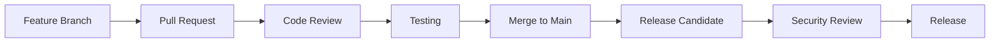

# Contribuir

## Otros idiomas

[English](contributing.md) | [中文简体](contributing.zh-cn.md) | Aprenda como contribuir al proyecto Symbiont, desde reportar problemas hasta enviar cambios de codigo.

## Tabla de contenidos


---

## Descripcion General

Symbiont da la bienvenida a contribuciones de la comunidad. Ya sea que estes corrigiendo errores, agregando funcionalidades, mejorando la documentacion o proporcionando retroalimentacion, tus contribuciones ayudan a hacer Symbiont mejor para todos.

### Formas de Contribuir

- **Reportes de Errores**: Ayuda a identificar y resolver problemas
- **Solicitudes de Funcionalidades**: Sugiere nuevas capacidades y mejoras
- **Documentacion**: Mejora guias, ejemplos y documentacion de API
- **Contribuciones de Codigo**: Corrige errores e implementa nuevas funcionalidades
- **Seguridad**: Reporta vulnerabilidades de seguridad de forma responsable
- **Pruebas**: Agrega casos de prueba y mejora la cobertura de pruebas

---

## Primeros Pasos

### Requisitos Previos

Antes de contribuir, asegurese de tener:

- **Rust 1.88+** con cargo
- **Git** para control de versiones
- **Docker** para pruebas y desarrollo
- **Conocimiento basico** de Rust, principios de seguridad y sistemas de IA

### Configuracion del Entorno de Desarrollo

1. **Hacer Fork y Clonar el Repositorio**
```bash
# Fork the repository on GitHub, then clone your fork
git clone https://github.com/YOUR_USERNAME/symbiont.git
cd symbiont

# Add upstream remote
git remote add upstream https://github.com/thirdkeyai/symbiont.git
```

2. **Configurar el Entorno de Desarrollo**
```bash
# Install Rust dependencies
rustup update
rustup component add rustfmt clippy

# Install pre-commit hooks
cargo install pre-commit
pre-commit install

# Build the project
cargo build
```

3. **Ejecutar Pruebas**
```bash
# Run all tests
cargo test --workspace

# Run specific test suites
cargo test --package symbiont-dsl
cargo test --package symbiont-runtime

# Run with coverage
cargo tarpaulin --out html
```

4. **Iniciar Servicios de Desarrollo**
```bash
# Start required services with Docker Compose
docker-compose up -d redis postgres

# Verify services are running
cargo run --example basic_agent
```

---

## Directrices de Desarrollo

### Estandares de Codigo

**Estilo de Codigo Rust:**
- Usar `rustfmt` para formateo consistente
- Seguir las convenciones de nomenclatura de Rust
- Escribir codigo Rust idiomatico
- Incluir documentacion completa
- Agregar pruebas unitarias para toda funcionalidad nueva

**Requisitos de Seguridad:**
- Todo el codigo relacionado con seguridad debe ser revisado
- Las operaciones criptograficas deben usar bibliotecas aprobadas
- Se requiere validacion de entrada para todas las APIs publicas
- Las pruebas de seguridad deben acompanar las funcionalidades de seguridad

**Directrices de Rendimiento:**
- Hacer benchmarks del codigo critico para el rendimiento
- Evitar asignaciones innecesarias en rutas criticas
- Usar `async`/`await` para operaciones de E/S
- Perfilar el uso de memoria para funcionalidades intensivas en recursos

### Organizacion del Codigo

```
symbiont/
├── dsl/                    # DSL parser and grammar
│   ├── src/
│   ├── tests/
│   └── tree-sitter-symbiont/
├── runtime/                # Core runtime system
│   ├── src/
│   │   ├── api/           # HTTP API (optional)
│   │   ├── context/       # Context management
│   │   ├── integrations/  # External integrations
│   │   ├── rag/           # RAG engine
│   │   ├── scheduler/     # Task scheduling
│   │   └── types/         # Core type definitions
│   ├── examples/          # Usage examples
│   ├── tests/             # Integration tests
│   └── docs/              # Technical documentation
├── enterprise/             # Enterprise features
│   └── src/
└── docs/                  # Community documentation
```

### Directrices de Commits

**Formato de Mensajes de Commit:**
```
<type>(<scope>): <description>

[optional body]

[optional footer]
```

**Tipos:**
- `feat`: Nueva funcionalidad
- `fix`: Correccion de error
- `docs`: Cambios en documentacion
- `style`: Cambios de estilo de codigo (formateo, etc.)
- `refactor`: Refactorizacion de codigo
- `test`: Agregar o actualizar pruebas
- `chore`: Tareas de mantenimiento

**Ejemplos:**
```bash
feat(runtime): add multi-tier sandbox support

Implements Docker, gVisor, and Firecracker isolation tiers with
automatic risk assessment and tier selection.

Closes #123

fix(dsl): resolve parser error with nested policy blocks

The parser was incorrectly handling nested policy definitions,
causing syntax errors for complex security configurations.

docs(security): update cryptographic implementation details

Add detailed documentation for Ed25519 signature implementation
and key management procedures.
```

---

## Tipos de Contribuciones

### Reportes de Errores

Al reportar errores, por favor incluya:

**Informacion Requerida:**
- Version de Symbiont y plataforma
- Pasos minimos de reproduccion
- Comportamiento esperado vs. real
- Mensajes de error y registros
- Detalles del entorno

**Plantilla de Reporte de Errores:**
```markdown
## Bug Description
Brief description of the issue

## Steps to Reproduce
1. Step one
2. Step two
3. Step three

## Expected Behavior
What should happen

## Actual Behavior
What actually happens

## Environment
- OS: [e.g., Ubuntu 22.04]
- Rust version: [e.g., 1.88.0]
- Symbiont version: [e.g., 1.0.0]
- Docker version: [if applicable]

## Additional Context
Any other relevant information
```

### Solicitudes de Funcionalidades

**Proceso de Solicitud de Funcionalidades:**
1. Verificar issues existentes para solicitudes similares
2. Crear un issue detallado de solicitud de funcionalidad
3. Participar en la discusion y el diseno
4. Implementar la funcionalidad siguiendo las directrices

**Plantilla de Solicitud de Funcionalidad:**
```markdown
## Feature Description
Clear description of the proposed feature

## Motivation
Why is this feature needed? What problem does it solve?

## Detailed Design
How should this feature work? Include examples if possible.

## Alternatives Considered
What other solutions were considered?

## Implementation Notes
Any technical considerations or constraints
```

### Contribuciones de Codigo

**Proceso de Pull Request:**

1. **Crear Rama de Funcionalidad**
```bash
git checkout -b feature/descriptive-name
```

2. **Implementar Cambios**
- Escribir codigo siguiendo las guias de estilo
- Agregar pruebas completas
- Actualizar la documentacion segun sea necesario
- Asegurarse de que todas las pruebas pasen

3. **Hacer Commit de los Cambios**
```bash
git add .
git commit -m "feat(component): descriptive commit message"
```

4. **Push y Crear PR**
```bash
git push origin feature/descriptive-name
# Create pull request on GitHub
```

**Requisitos del Pull Request:**
- [ ] Todas las pruebas pasan
- [ ] El codigo sigue las guias de estilo
- [ ] La documentacion esta actualizada
- [ ] Se han considerado las implicaciones de seguridad
- [ ] Se ha evaluado el impacto en el rendimiento
- [ ] Los cambios que rompen compatibilidad estan documentados

### Contribuciones de Documentacion

**Tipos de Documentacion:**
- **Guias de Usuario**: Ayudan a los usuarios a comprender y usar las funcionalidades
- **Documentacion de API**: Referencia tecnica para desarrolladores
- **Ejemplos**: Ejemplos de codigo funcional y tutoriales
- **Documentacion de Arquitectura**: Diseno del sistema y detalles de implementacion

**Estandares de Documentacion:**
- Escribir prosa clara y concisa
- Incluir ejemplos de codigo funcional
- Usar formato y estilo consistentes
- Probar todos los ejemplos de codigo
- Actualizar documentacion relacionada

**Estructura de la Documentacion:**
```markdown
---
layout: default
title: Page Title
nav_order: N
description: "Brief page description"
---

# Page Title

Brief introduction paragraph.


---

## Content sections...
```

---

## Directrices de Pruebas

### Tipos de Pruebas

**Pruebas Unitarias:**
- Probar funciones y modulos individuales
- Simular dependencias externas
- Ejecucion rapida (<1s por prueba)

```rust
#[cfg(test)]
mod tests {
    use super::*;

    #[test]
    fn test_policy_evaluation() {
        let policy = Policy::new("test_policy", PolicyRules::default());
        let context = PolicyContext::new();
        let result = policy.evaluate(&context);
        assert_eq!(result, PolicyDecision::Allow);
    }
}
```

**Pruebas de Integracion:**
- Probar interacciones entre componentes
- Usar dependencias reales cuando sea posible
- Tiempo de ejecucion moderado (<10s por prueba)

```rust
#[tokio::test]
async fn test_agent_lifecycle() {
    let runtime = test_runtime().await;
    let agent_config = AgentConfig::default();

    let agent_id = runtime.create_agent(agent_config).await.unwrap();
    let status = runtime.get_agent_status(agent_id).await.unwrap();

    assert_eq!(status, AgentStatus::Ready);
}
```

**Pruebas de Seguridad:**
- Probar controles y politicas de seguridad
- Verificar operaciones criptograficas
- Probar escenarios de ataque

```rust
#[tokio::test]
async fn test_sandbox_isolation() {
    let sandbox = create_test_sandbox(SecurityTier::Tier2).await;

    // Attempt to access restricted resource
    let result = sandbox.execute_malicious_code().await;

    // Should be blocked by security controls
    assert!(result.is_err());
    assert_eq!(result.unwrap_err(), SandboxError::AccessDenied);
}
```

### Datos de Prueba

**Fixtures de Prueba:**
- Usar datos de prueba consistentes entre pruebas
- Evitar valores codificados de forma fija cuando sea posible
- Limpiar datos de prueba despues de la ejecucion

```rust
pub fn create_test_agent_config() -> AgentConfig {
    AgentConfig {
        id: AgentId::new(),
        name: "test_agent".to_string(),
        security_tier: SecurityTier::Tier1,
        memory_limit: 512 * 1024 * 1024, // 512MB
        capabilities: vec!["test".to_string()],
        policies: vec![],
        metadata: HashMap::new(),
    }
}
```

---

## Consideraciones de Seguridad

### Proceso de Revision de Seguridad

**Cambios Sensibles a la Seguridad:**
Todos los cambios que afecten la seguridad deben pasar por una revision adicional:

- Implementaciones criptograficas
- Autenticacion y autorizacion
- Validacion y sanitizacion de entrada
- Mecanismos de sandbox y aislamiento
- Sistemas de auditoria y registro

**Lista de Verificacion de Revision de Seguridad:**
- [ ] Modelo de amenazas actualizado si es necesario
- [ ] Pruebas de seguridad agregadas
- [ ] Bibliotecas criptograficas aprobadas
- [ ] Validacion de entrada completa
- [ ] El manejo de errores no filtra informacion
- [ ] Registro de auditoria completo

### Reporte de Vulnerabilidades

**Divulgacion Responsable:**
Si descubre una vulnerabilidad de seguridad:

1. **NO** cree un issue publico
2. Envie un correo a security@thirdkey.ai con los detalles
3. Proporcione pasos de reproduccion si es posible
4. Permita tiempo para investigacion y correccion
5. Coordine el cronograma de divulgacion

**Plantilla de Reporte de Seguridad:**
```
Subject: Security Vulnerability in Symbiont

Component: [affected component]
Severity: [critical/high/medium/low]
Description: [detailed description]
Reproduction: [steps to reproduce]
Impact: [potential impact]
Suggested Fix: [if applicable]
```

---

## Proceso de Revision

### Directrices de Revision de Codigo

**Para Autores:**
- Mantener los cambios enfocados y atomicos
- Escribir mensajes de commit claros
- Agregar pruebas para funcionalidad nueva
- Actualizar la documentacion segun sea necesario
- Responder prontamente a la retroalimentacion de revision

**Para Revisores:**
- Enfocarse en la correccion del codigo y la seguridad
- Verificar el cumplimiento de las directrices
- Verificar que la cobertura de pruebas sea adecuada
- Asegurarse de que la documentacion este actualizada
- Ser constructivo y util

**Criterios de Revision:**
- **Correccion**: El codigo funciona como se espera?
- **Seguridad**: Hay implicaciones de seguridad?
- **Rendimiento**: El rendimiento es aceptable?
- **Mantenibilidad**: El codigo es legible y mantenible?
- **Pruebas**: Las pruebas son completas y confiables?

### Requisitos de Merge

**Todos los PRs Deben:**
- [ ] Pasar todas las pruebas automatizadas
- [ ] Tener al menos una revision aprobatoria
- [ ] Incluir documentacion actualizada
- [ ] Seguir los estandares de codificacion
- [ ] Incluir pruebas apropiadas

**PRs Sensibles a la Seguridad Deben:**
- [ ] Tener revision del equipo de seguridad
- [ ] Incluir pruebas de seguridad
- [ ] Actualizar el modelo de amenazas si es necesario
- [ ] Tener documentacion de pista de auditoria

---

## Directrices de la Comunidad

### Codigo de Conducta

Estamos comprometidos a proporcionar un entorno acogedor e inclusivo para todos los contribuyentes. Por favor lea y siga nuestro [Codigo de Conducta](CODE_OF_CONDUCT.md).

**Principios Clave:**
- **Respeto**: Tratar a todos los miembros de la comunidad con respeto
- **Inclusion**: Dar la bienvenida a perspectivas y origenes diversos
- **Colaboracion**: Trabajar juntos de manera constructiva
- **Aprendizaje**: Apoyar el aprendizaje y el crecimiento
- **Calidad**: Mantener altos estandares para el codigo y el comportamiento

### Comunicacion

**Canales:**
- **GitHub Issues**: Reportes de errores y solicitudes de funcionalidades
- **GitHub Discussions**: Preguntas generales e ideas
- **Pull Requests**: Revision de codigo y colaboracion
- **Correo electronico**: security@thirdkey.ai para problemas de seguridad

**Directrices de Comunicacion:**
- Ser claro y conciso
- Mantenerse en el tema
- Ser paciente y util
- Usar lenguaje inclusivo
- Respetar diferentes puntos de vista

---

## Reconocimiento

### Contribuyentes

Reconocemos y apreciamos todas las formas de contribucion:

- **Contribuyentes de Codigo**: Listados en CONTRIBUTORS.md
- **Contribuyentes de Documentacion**: Acreditados en la documentacion
- **Reportadores de Errores**: Mencionados en las notas de lanzamiento
- **Investigadores de Seguridad**: Acreditados en avisos de seguridad

### Niveles de Contribuyentes

**Contribuyente de la Comunidad:**
- Enviar pull requests
- Reportar errores y problemas
- Participar en discusiones

**Contribuyente Regular:**
- Contribuciones de calidad consistente
- Ayudar a revisar pull requests
- Mentorizar nuevos contribuyentes

**Mantenedor:**
- Miembro del equipo principal
- Permisos de merge
- Gestion de lanzamientos
- Direccion del proyecto

---

## Obtener Ayuda

### Recursos

- **Documentacion**: Guias y referencias completas
- **Ejemplos**: Ejemplos de codigo funcional en `/examples`
- **Pruebas**: Casos de prueba que muestran el comportamiento esperado
- **Issues**: Buscar issues existentes para soluciones

### Canales de Soporte

**Soporte de la Comunidad:**
- GitHub Issues para errores y solicitudes de funcionalidades
- GitHub Discussions para preguntas e ideas
- Stack Overflow con la etiqueta `symbiont`

**Soporte Directo:**
- Correo electronico: support@thirdkey.ai
- Seguridad: security@thirdkey.ai

### Preguntas Frecuentes

**P: Como empiezo a contribuir?**
R: Comience configurando el entorno de desarrollo, leyendo la documentacion y buscando etiquetas "good first issue".

**P: Que habilidades necesito para contribuir?**
R: Programacion en Rust, conocimiento basico de seguridad y familiaridad con conceptos de IA/ML son utiles pero no requeridos para todas las contribuciones.

**P: Cuanto tiempo toma la revision de codigo?**
R: Tipicamente de 1 a 3 dias habiles para cambios pequenos, mas tiempo para cambios complejos o sensibles a la seguridad.

**P: Puedo contribuir sin escribir codigo?**
R: Si. La documentacion, las pruebas, los reportes de errores y las solicitudes de funcionalidades son contribuciones valiosas.

---

## Proceso de Lanzamiento

### Flujo de Trabajo de Desarrollo



### Versionado

Symbiont sigue [Versionado Semantico](https://semver.org/):

- **Mayor** (X.0.0): Cambios que rompen compatibilidad
- **Menor** (0.X.0): Nuevas funcionalidades, retrocompatible
- **Parche** (0.0.X): Correcciones de errores, retrocompatible

### Calendario de Lanzamientos

- **Lanzamientos de parche**: Segun sea necesario para correcciones criticas
- **Lanzamientos menores**: Mensualmente para nuevas funcionalidades
- **Lanzamientos mayores**: Trimestralmente para cambios significativos

---

## Proximos Pasos

Listo para contribuir? Asi es como empezar:

1. **[Configure su entorno de desarrollo](#configuracion-del-entorno-de-desarrollo)**
2. **[Encuentre un buen primer issue](https://github.com/thirdkeyai/symbiont/labels/good%20first%20issue)**
3. **[Unase a la discusion](https://github.com/thirdkeyai/symbiont/discussions)**
4. **[Lea la documentacion tecnica](/runtime-architecture)**

Gracias por su interes en contribuir a Symbiont. Sus contribuciones ayudan a construir el futuro del desarrollo de software seguro y nativo de IA.
