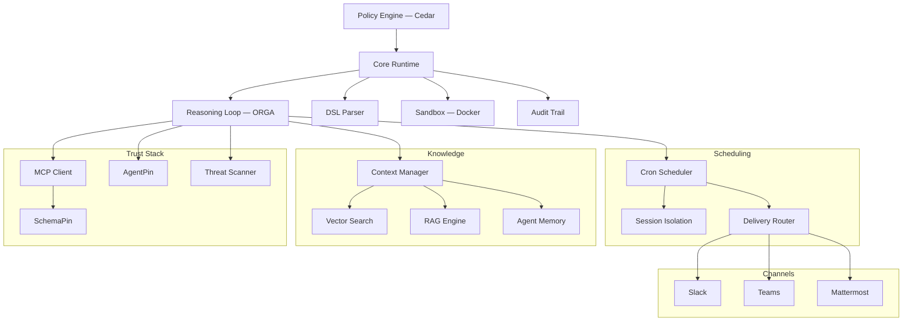

# Documentacion de Symbiont

Runtime de agentes gobernado por politicas para produccion. Ejecute agentes de IA y herramientas bajo controles explicitos de politicas, identidad y auditoria.

## Que es Symbiont?

Symbiont es un runtime nativo en Rust para ejecutar agentes de IA y herramientas bajo controles explicitos de politicas, identidad y auditoria.

La mayoria de los frameworks de agentes se centran en la orquestacion. Symbiont se centra en lo que sucede cuando los agentes necesitan ejecutarse en entornos reales con riesgo real: herramientas no confiables, datos sensibles, limites de aprobacion, requisitos de auditoria y aplicacion repetible.

### Como funciona

Symbiont separa la intencion del agente de la autoridad de ejecucion:

1. **Los agentes proponen** acciones a traves del bucle de razonamiento (Observe-Reason-Gate-Act)
2. **El runtime evalua** cada accion contra verificaciones de politica, identidad y confianza
3. **La politica decide** — las acciones permitidas se ejecutan; las denegadas se bloquean o se derivan para aprobacion
4. **Todo se registra** — rastro de auditoria a prueba de manipulacion para cada decision

La salida del modelo nunca se trata como autoridad de ejecucion. El runtime controla lo que realmente sucede.

### Capacidades principales

| Capacidad | Que hace |
|-----------|-------------|
| **Motor de politicas** | Autorizacion granular con [Cedar](https://www.cedarpolicy.com/) para acciones de agentes, llamadas a herramientas y acceso a recursos |
| **Verificacion de herramientas** | Verificacion criptografica [SchemaPin](https://schemapin.org) de esquemas de herramientas MCP antes de la ejecucion |
| **Identidad de agentes** | Identidad ES256 anclada al dominio con [AgentPin](https://agentpin.org) para agentes y tareas programadas |
| **Bucle de razonamiento** | Ciclo Observe-Reason-Gate-Act con aplicacion de typestate, compuertas de politicas y circuit breakers |
| **Sandboxing** | Aislamiento basado en Docker con limites de recursos para cargas de trabajo no confiables |
| **Registro de auditoria** | Registros a prueba de manipulacion con registros estructurados para cada decision de politica |
| **Gestion de secretos** | Integracion con Vault/OpenBao, almacenamiento cifrado AES-256-GCM, con alcance por agente |
| **Integracion MCP** | Soporte nativo de Model Context Protocol con acceso gobernado a herramientas |

Capacidades adicionales: escaneo de amenazas para contenido de herramientas/habilidades, programacion cron, memoria persistente de agentes, busqueda RAG hibrida (LanceDB/Qdrant), verificacion de webhooks, enrutamiento de entregas, telemetria OTLP, endurecimiento de seguridad HTTP, adaptadores de canal (Slack/Teams/Mattermost), y plugins de gobernanza para [Claude Code](https://github.com/thirdkeyai/symbi-claude-code) y [Gemini CLI](https://github.com/thirdkeyai/symbi-gemini-cli).

---

## Inicio rapido

### Instalacion

**Script de instalacion (macOS / Linux):**
```bash
curl -fsSL https://symbiont.dev/install.sh | bash
```

**Homebrew (macOS):**
```bash
brew tap thirdkeyai/tap
brew install symbi
```

**Docker:**
```bash
docker run --rm -p 8080:8080 -p 8081:8081 ghcr.io/thirdkeyai/symbi:latest up
```

**Desde fuente:**
```bash
git clone https://github.com/thirdkeyai/symbiont.git
cd symbiont
cargo build --release
```

Los binarios precompilados tambien estan disponibles en [GitHub Releases](https://github.com/thirdkeyai/symbiont/releases). Consulte la [Guia de inicio](/getting-started) para mas detalles.

### Su primer agente

```symbiont
agent secure_analyst(input: DataSet) -> Result {
    policy access_control {
        allow: read(input) if input.verified == true
        deny: send_email without approval
        audit: all_operations
    }

    with memory = "persistent", requires = "approval" {
        result = analyze(input);
        return result;
    }
}
```

Consulte la [guia DSL](/dsl-guide) para la gramatica completa incluyendo bloques `metadata`, `schedule`, `webhook` y `channel`.

### Scaffolding de proyecto

```bash
symbi init        # Configuracion interactiva de proyecto con plantillas de perfil
symbi run agent   # Ejecutar un solo agente sin iniciar el runtime completo
symbi up          # Iniciar el runtime completo con auto-configuracion
```

---

## Arquitectura



---

## Modelo de seguridad

Symbiont esta diseñado en torno a un principio simple: **la salida del modelo nunca debe ser confiada como autoridad de ejecucion.**

Las acciones fluyen a traves de controles del runtime:

- **Confianza cero** — todas las entradas de agentes son no confiables por defecto
- **Verificaciones de politica** — autorizacion Cedar antes de cada llamada a herramienta y acceso a recursos
- **Verificacion de herramientas** — verificacion criptografica SchemaPin de esquemas de herramientas
- **Limites de sandbox** — aislamiento Docker para ejecucion no confiable
- **Aprobacion del operador** — compuertas de revision humana para acciones sensibles
- **Control de secretos** — backends Vault/OpenBao, almacenamiento local cifrado, namespaces de agentes
- **Registro de auditoria** — registros criptograficamente a prueba de manipulacion de cada decision

Consulte la guia del [Modelo de seguridad](/security-model) para mas detalles.

---

## Guias

- [Inicio](/getting-started) — Instalacion, configuracion, primer agente
- [Modelo de seguridad](/security-model) — Arquitectura de confianza cero, aplicacion de politicas
- [Arquitectura del runtime](/runtime-architecture) — Internos del runtime y modelo de ejecucion
- [Bucle de razonamiento](/reasoning-loop) — Ciclo ORGA, compuertas de politicas, circuit breakers
- [Guia DSL](/dsl-guide) — Referencia del lenguaje de definicion de agentes
- [Referencia de API](/api-reference) — Endpoints HTTP API y configuracion
- [Programacion](/scheduling) — Motor cron, enrutamiento de entregas, colas de mensajes muertos
- [Entrada HTTP](/http-input) — Servidor de webhooks, autenticacion, limitacion de velocidad

---

## Comunidad y recursos

- **Paquetes**: [crates.io/crates/symbi](https://crates.io/crates/symbi) | [npm symbiont-sdk-js](https://www.npmjs.com/package/symbiont-sdk-js) | [PyPI symbiont-sdk](https://pypi.org/project/symbiont-sdk/)
- **SDKs**: [JavaScript/TypeScript](https://github.com/ThirdKeyAI/symbiont-sdk-js) | [Python](https://github.com/ThirdKeyAI/symbiont-sdk-python)
- **Plugins**: [Claude Code](https://github.com/thirdkeyai/symbi-claude-code) | [Gemini CLI](https://github.com/thirdkeyai/symbi-gemini-cli)
- **Issues**: [GitHub Issues](https://github.com/thirdkeyai/symbiont/issues)
- **Licencia**: Apache 2.0 (Community Edition)

---

## Proximos pasos

<div class="grid grid-cols-1 md:grid-cols-3 gap-6 mt-8">
  <div class="card">
    <h3>Comenzar</h3>
    <p>Instale Symbiont y ejecute su primer agente gobernado.</p>
    <a href="/getting-started" class="btn btn-outline">Guia de inicio rapido</a>
  </div>

  <div class="card">
    <h3>Modelo de seguridad</h3>
    <p>Comprenda los limites de confianza y la aplicacion de politicas.</p>
    <a href="/security-model" class="btn btn-outline">Guia de seguridad</a>
  </div>

  <div class="card">
    <h3>Referencia DSL</h3>
    <p>Aprenda el lenguaje de definicion de agentes.</p>
    <a href="/dsl-guide" class="btn btn-outline">Guia DSL</a>
  </div>
</div>
