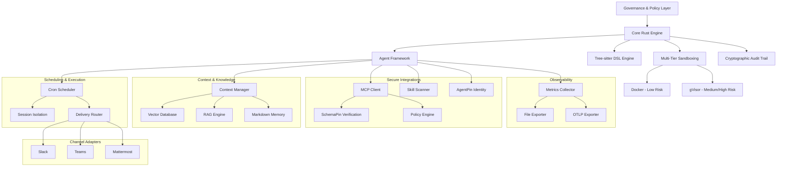

# Documentacion de Symbiont

Framework de agentes nativo de IA para construir agentes autonomos y conscientes de politicas con programacion de tareas, adaptadores de canal e identidad criptografica — construido en Rust.


---

## ¿Que es Symbiont?

Symbiont es un framework de agentes nativo de IA para construir agentes autonomos y conscientes de politicas que colaboran de forma segura con humanos, otros agentes y modelos de lenguaje grandes. Proporciona una pila de produccion completa — desde un DSL declarativo y motor de programacion hasta adaptadores de canal multiplataforma e identidad criptografica verificable — todo construido en Rust para rendimiento y seguridad.

### Caracteristicas Principales

- **🛡️ Diseño Centrado en Seguridad**: Arquitectura de confianza cero con sandboxing multinivel, aplicacion de politicas y rastros de auditoria criptograficos
- **📋 DSL Declarativo**: Lenguaje diseñado para definir agentes, politicas, programaciones e integraciones de canal con parseo tree-sitter
- **📅 Programacion de Produccion**: Ejecucion de tareas basada en cron con aislamiento de sesion, enrutamiento de entregas, colas de mensajes muertos y soporte de jitter
- **💬 Adaptadores de Canal**: Conecta agentes a Slack, Microsoft Teams y Mattermost con verificacion de webhook y mapeo de identidad
- **🌐 Modulo de Entrada HTTP**: Servidor webhook para integraciones externas con autenticacion Bearer/JWT, limitacion de velocidad y CORS
- **🔑 Identidad AgentPin**: Verificacion criptografica de identidad de agentes via ES256 JWTs anclados a endpoints well-known
- **🔐 Gestion de Secretos**: Integracion con HashiCorp Vault con backends de archivo cifrado y llavero del sistema operativo
- **🧠 Contexto y Conocimiento**: Sistemas de conocimiento mejorados con RAG con busqueda vectorial (LanceDB embebido por defecto, Qdrant opcional) y embeddings locales opcionales
- **🔗 Integracion MCP**: Cliente del Protocolo de Contexto de Modelo con verificacion criptografica de herramientas SchemaPin
- **⚡ SDKs Multi-Lenguaje**: SDKs de JavaScript y Python para acceso completo a la API incluyendo programacion, canales y funciones empresariales
- **🔄 Bucle de Razonamiento Agentico**: Ciclo Observe-Reason-Gate-Act (ORGA) con typestates, compuertas de politicas, circuit breakers, diario durable y puente de conocimiento
- **🧪 Razonamiento Avanzado** (`orga-adaptive`): Filtrado de perfiles de herramientas, deteccion de bucles atascados, pre-carga determinista de contexto y convenciones con alcance de directorio
- **📜 Motor de Politicas Cedar**: Integracion de lenguaje de autorizacion formal para control de acceso granular
- **🏗️ Alto Rendimiento**: Runtime nativo en Rust optimizado para cargas de trabajo de produccion con ejecucion asincrona completa
- **🤖 Plugins para Asistentes de IA**: Plugins de gobernanza de primera mano para [Claude Code](https://github.com/thirdkeyai/symbi-claude-code) y [Gemini CLI](https://github.com/thirdkeyai/symbi-gemini-cli) con aplicacion de politicas Cedar, verificacion SchemaPin y rastros de auditoria

### Inicializacion de Proyecto (`symbi init`)

Scaffolding interactivo de proyectos con plantillas basadas en perfiles. Elige entre perfiles minimal, assistant, dev-agent o multi-agent. Modo de verificacion SchemaPin y niveles de sandbox configurables. Incluye un catalogo de agentes integrado para importar agentes gobernados preconstruidos. Funciona de forma no interactiva para pipelines CI/CD con `--no-interact`.

### Ejecucion de Agente Individual (`symbi run`)

Ejecuta cualquier agente directamente desde la CLI sin iniciar el runtime completo:

```bash
symbi run recon --input '{"target": "10.0.1.5"}'
```

Carga el DSL del agente, configura el bucle de razonamiento ORGA con inferencia en la nube, ejecuta, imprime los resultados y sale. Resuelve nombres de agentes desde el directorio `agents/` automaticamente.

### Gobernanza de Comunicacion Inter-Agente

Todos los builtins inter-agente (`ask`, `delegate`, `send_to`, `parallel`, `race`) se enrutan a traves del CommunicationBus con evaluacion de politicas. El `CommunicationPolicyGate` aplica reglas de estilo Cedar para llamadas inter-agente — controlando que agentes pueden comunicarse, con evaluacion de reglas basada en prioridad y denegacion estricta ante violaciones de politica. Los mensajes se firman criptograficamente, se cifran y se auditan.

---

## Primeros Pasos

### Instalacion Rapida

**Homebrew (macOS):**
```bash
brew tap thirdkeyai/tap
brew install symbi
```

**Script de instalacion (macOS / Linux):**
```bash
curl -fsSL https://raw.githubusercontent.com/thirdkeyai/symbiont/main/scripts/install.sh | bash
```

Tambien puedes descargar binarios preconstruidos desde [GitHub Releases](https://github.com/thirdkeyai/symbiont/releases). Consulta la [Guia de Primeros Pasos](/getting-started) para opciones de Docker e instalacion desde fuente.

**Docker:**
```bash
docker pull ghcr.io/thirdkeyai/symbi:latest
docker run --rm symbi:latest --version
```

**Desde fuente:**
```bash
git clone https://github.com/thirdkeyai/symbiont.git
cd symbiont
cargo build --release
```

### Tu Primer Agente

```rust
metadata {
    version = "1.0.0"
    author = "developer"
    description = "Simple analysis agent"
}

agent analyze_data(input: DataSet) -> Result {
    capabilities = ["data_analysis"]

    policy secure_analysis {
        allow: read(input) if input.anonymized == true
        deny: store(input) if input.contains_pii == true
        audit: all_operations with signature
    }

    with memory = "ephemeral", privacy = "high" {
        if (validate_input(input)) {
            result = process_data(input);
            audit_log("analysis_completed", result.metadata);
            return result;
        } else {
            return reject("Invalid input data");
        }
    }
}
```

---

## Vision General de la Arquitectura



---

## Casos de Uso

### Desarrollo e Investigacion
- Generacion segura de codigo y pruebas automatizadas
- Experimentos de colaboracion multi-agente
- Desarrollo de sistemas de IA conscientes del contexto

### Aplicaciones Criticas de Privacidad
- Procesamiento de datos de salud con controles de privacidad
- Automatizacion de servicios financieros con capacidades de auditoria
- Sistemas gubernamentales y de defensa con caracteristicas de seguridad

---

## Estado del Proyecto

### v1.8.1 Estable

Symbiont v1.8.1 es la ultima version estable, que ofrece un framework completo de agentes de IA con capacidades de nivel de produccion:

- **Bucle de Razonamiento Agentico**: Ciclo ORGA con typestates, conversacion multi-turno, inferencia en la nube y SLM, circuit breakers, diario durable y puente de conocimiento
- **Primitivas de Razonamiento Avanzado** (`orga-adaptive`): Filtrado de perfiles de herramientas, deteccion de bucles atascados por paso, pre-carga determinista de contexto y convenciones con alcance de directorio
- **Motor de Politicas Cedar**: Autorizacion formal via integracion del lenguaje de politicas Cedar (feature `cedar`)
- **Inferencia LLM en la Nube**: Proveedor de inferencia en la nube compatible con OpenRouter (feature `cloud-llm`)
- **Modo Agente Autonomo**: Una sola linea para agentes nativos de la nube con LLM + herramientas Composio (feature `standalone-agent`)
- **Backend Vectorial LanceDB Embebido**: Busqueda vectorial sin configuracion — LanceDB por defecto, Qdrant opcional via feature flag `vector-qdrant`
- **Pipeline de Compactacion de Contexto**: Compactacion por niveles con resumenes por LLM y conteo de tokens multi-modelo (OpenAI, Claude, Gemini, Llama, Mistral y mas)
- **Escaner ClawHavoc**: 40 reglas de deteccion en 10 categorias de ataque con modelo de severidad de 5 niveles y lista blanca de ejecutables
- **Integracion Composio MCP**: Conexion SSE con feature gate al servidor MCP de Composio para acceso a herramientas externas
- **Memoria Persistente**: Memoria de agente respaldada en Markdown con hechos, procedimientos, patrones aprendidos y compactacion basada en retencion
- **Verificacion de Webhook**: Verificacion HMAC-SHA256 y JWT con presets para GitHub, Stripe, Slack y personalizados
- **Endurecimiento de Seguridad HTTP**: Enlace solo a loopback, listas de permitidos CORS, validacion JWT EdDSA, separacion de endpoint de salud
- **Metricas y Telemetria**: Exportadores de archivos y OTLP con fan-out compuesto, trazado distribuido OpenTelemetry
- **Motor de Programacion**: Ejecucion basada en cron con aislamiento de sesion, enrutamiento de entregas, colas de mensajes muertos y jitter
- **Adaptadores de Canal**: Slack (comunidad), Microsoft Teams y Mattermost (enterprise) con firma HMAC
- **Identidad AgentPin**: Identidad criptografica de agente via ES256 JWTs anclados a endpoints well-known
- **Gestion de Secretos**: Backends de HashiCorp Vault, archivo cifrado y llavero del sistema operativo
- **SDKs de JavaScript y Python**: Clientes API completos cubriendo programacion, canales, webhooks, memoria, habilidades y metricas

### 🔮 Hoja de Ruta v1.7.0
- ~~Gobernanza de comunicacion inter-agente~~ ✅ Entregado
- ~~Inicializacion de proyecto (`symbi init`)~~ ✅ Entregado
- Integracion de agentes externos y soporte del protocolo A2A
- Soporte RAG multi-modal (imagenes, audio, datos estructurados)
- Adaptadores de canal adicionales (Discord, Matrix)

---

## Comunidad

- **Documentacion**: Guias completas y referencias de API
  - [Referencia de API](api-reference.md)
  - [Guia del Bucle de Razonamiento](reasoning-loop.md)
  - [Razonamiento Avanzado (orga-adaptive)](orga-adaptive.md)
  - [Guia de Programacion](scheduling.md)
  - [Modulo de Entrada HTTP](http-input.md)
  - [Guia DSL](dsl-guide.md)
  - [Modelo de Seguridad](security-model.md)
  - [Arquitectura del Runtime](runtime-architecture.md)
- **Paquetes**: [crates.io/crates/symbi](https://crates.io/crates/symbi) | [npm symbiont-sdk-js](https://www.npmjs.com/package/symbiont-sdk-js) | [PyPI symbiont-sdk](https://pypi.org/project/symbiont-sdk/)
- **Plugins**: [Claude Code](https://github.com/thirdkeyai/symbi-claude-code) | [Gemini CLI](https://github.com/thirdkeyai/symbi-gemini-cli)
- **Issues**: [GitHub Issues](https://github.com/thirdkeyai/symbiont/issues)
- **Discusiones**: [GitHub Discussions](https://github.com/thirdkeyai/symbiont/discussions)
- **Licencia**: Software de codigo abierto por ThirdKey

---

## Proximos Pasos

<div class="grid grid-cols-1 md:grid-cols-3 gap-6 mt-8">
  <div class="card">
    <h3>🚀 Comenzar</h3>
    <p>Sigue nuestra guia de inicio para configurar tu primer entorno Symbiont.</p>
    <a href="/getting-started" class="btn btn-outline">Guia de Inicio Rapido</a>
  </div>

  <div class="card">
    <h3>📖 Aprender el DSL</h3>
    <p>Domina el DSL de Symbiont para construir agentes conscientes de politicas.</p>
    <a href="/dsl-guide" class="btn btn-outline">Documentacion DSL</a>
  </div>

  <div class="card">
    <h3>🏗️ Arquitectura</h3>
    <p>Comprende el sistema de tiempo de ejecucion y el modelo de seguridad.</p>
    <a href="/runtime-architecture" class="btn btn-outline">Guia de Arquitectura</a>
  </div>
</div>
