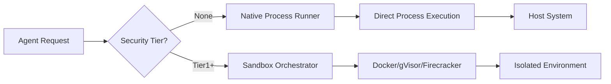

# Modo de Ejecucion Nativa (Sin Docker/Aislamiento)

## Otros idiomas

[English](native-execution-guide.md) | [中文简体](native-execution-guide.zh-cn.md) | ## Descripcion General

Symbiont soporta la ejecucion de agentes sin Docker ni aislamiento de contenedores para entornos de desarrollo o despliegues de confianza donde se desea el maximo rendimiento y las minimas dependencias.

## Advertencias de Seguridad

**IMPORTANTE**: El modo de ejecucion nativa omite todos los controles de seguridad basados en contenedores:

- No hay aislamiento de procesos
- No hay aislamiento del sistema de archivos
- No hay aislamiento de red
- No hay aplicacion de limites de recursos
- Acceso directo al sistema anfitrion

**USAR SOLO PARA**:
- Desarrollo local con codigo de confianza
- Entornos controlados con agentes de confianza
- Pruebas y depuracion
- Entornos donde Docker no esta disponible

**NO USAR PARA**:
- Entornos de produccion con codigo no confiable
- Despliegues multi-tenant
- Servicios publicos
- Procesamiento de entrada de usuarios no confiables

## Arquitectura

### Jerarquia de Niveles de Sandbox

```
┌─────────────────────────────────────────┐
│ SecurityTier::None (Native Execution)   │ ← No isolation
├─────────────────────────────────────────┤
│ SecurityTier::Tier1 (Docker)            │ ← Container isolation
├─────────────────────────────────────────┤
│ SecurityTier::Tier2 (gVisor)            │ ← Enhanced isolation
├─────────────────────────────────────────┤
│ SecurityTier::Tier3 (Firecracker)       │ ← Maximum isolation
└─────────────────────────────────────────┘
```

### Flujo de Ejecucion Nativa



## Configuracion

### Opcion 1: Configuracion TOML

```toml
# config.toml

[security]
# Allow native execution (default: false)
allow_native_execution = true
# Default sandbox tier
default_sandbox_tier = "None"  # or "Tier1", "Tier2", "Tier3"

[security.native_execution]
# Apply resource limits even in native mode
enforce_resource_limits = true
# Maximum memory in MB
max_memory_mb = 2048
# Maximum CPU cores
max_cpu_cores = 4.0
# Maximum execution time in seconds
max_execution_time_seconds = 300
# Working directory for native execution
working_directory = "/tmp/symbiont-native"
# Allowed commands/executables
allowed_executables = ["python3", "node", "bash"]
```

### Ejemplo de Configuracion Completa

Un `config.toml` completo con ejecucion nativa junto a otras configuraciones del sistema:

```toml
# config.toml
[api]
port = 8080
host = "127.0.0.1"
timeout_seconds = 30
max_body_size = 10485760

[database]
# Default: LanceDB embedded (zero-config, no external services needed)
vector_backend = "lancedb"
vector_data_path = "./data/vector_db"
vector_dimension = 384

# Optional: Qdrant (uncomment to use Qdrant instead of LanceDB)
# vector_backend = "qdrant"
# qdrant_url = "http://localhost:6333"
# qdrant_collection = "symbiont"

[logging]
level = "info"
format = "Pretty"
structured = true

[security]
key_provider = { Environment = { var_name = "SYMBIONT_KEY" } }
enable_compression = true
enable_backups = true
enable_safety_checks = true

[storage]
context_path = "./data/context"
git_clone_path = "./data/git"
backup_path = "./data/backups"
max_context_size_mb = 1024

[native_execution]
enabled = true
default_executable = "python3"
working_directory = "/tmp/symbiont-native"
enforce_resource_limits = true
max_memory_mb = 2048
max_cpu_seconds = 300
max_execution_time_seconds = 300
allowed_executables = ["python3", "python", "node", "bash", "sh"]
```

### Campos de NativeExecutionConfig

| Campo | Tipo | Predeterminado | Descripcion |
|-------|------|----------------|-------------|
| `enabled` | bool | `false` | Habilitar el modo de ejecucion nativa |
| `default_executable` | string | `"bash"` | Interprete/shell predeterminado |
| `working_directory` | path | `/tmp/symbiont-native` | Directorio de ejecucion |
| `enforce_resource_limits` | bool | `true` | Aplicar limites a nivel de SO |
| `max_memory_mb` | Option<u64> | `Some(2048)` | Limite de memoria en MB |
| `max_cpu_seconds` | Option<u64> | `Some(300)` | Limite de tiempo de CPU |
| `max_execution_time_seconds` | u64 | `300` | Timeout de tiempo real |
| `allowed_executables` | Vec<String> | `[bash, python3, etc.]` | Lista blanca de ejecutables |

### Opcion 2: Variables de Entorno

```bash
export SYMBIONT_ALLOW_NATIVE_EXECUTION=true
export SYMBIONT_DEFAULT_SANDBOX_TIER=None
export SYMBIONT_NATIVE_MAX_MEMORY_MB=2048
export SYMBIONT_NATIVE_MAX_CPU_CORES=4.0
export SYMBIONT_NATIVE_WORKING_DIR=/tmp/symbiont-native
```

### Opcion 3: Configuracion a Nivel de Agente

```symbi
agent NativeWorker {
  metadata {
    name: "Local Development Agent"
    version: "1.0.0"
  }

  security {
    tier: None
    sandbox: Permissive
    capabilities: ["local_filesystem", "network"]
  }

  on trigger "local_processing" {
    // Executes directly on host
    execute_native("python3 process.py")
  }
}
```

## Ejemplos de Uso

### Ejemplo 1: Modo de Desarrollo

```rust
use symbi_runtime::{Config, SecurityTier, SandboxOrchestrator};

#[tokio::main]
async fn main() -> Result<(), Box<dyn std::error::Error>> {
    // Enable native execution for development
    let mut config = Config::default();
    config.security.allow_native_execution = true;
    config.security.default_sandbox_tier = SecurityTier::None;

    let orchestrator = SandboxOrchestrator::new(config)?;

    // Execute code natively
    let result = orchestrator.execute_code(
        SecurityTier::None,
        "print('Hello from native execution!')",
        HashMap::new()
    ).await?;

    println!("Output: {}", result.stdout);
    Ok(())
}
```

### Ejemplo 2: Flag de CLI

```bash
# Run with native execution
symbiont run agent.dsl --native

# Or with explicit tier
symbiont run agent.dsl --sandbox-tier=none

# With resource limits
symbiont run agent.dsl --native \
  --max-memory=1024 \
  --max-cpu=2.0 \
  --timeout=300
```

### Ejemplo 3: Ejecucion Mixta

```rust
// Use native execution for trusted local operations
let local_result = orchestrator.execute_code(
    SecurityTier::None,
    local_code,
    env_vars
).await?;

// Use Docker for external/untrusted operations
let isolated_result = orchestrator.execute_code(
    SecurityTier::Tier1,
    untrusted_code,
    env_vars
).await?;
```

## Detalles de Implementacion

### Ejecutor de Procesos Nativos

El ejecutor nativo usa `std::process::Command` con limites de recursos opcionales:

```rust
pub struct NativeRunner {
    config: NativeConfig,
}

impl NativeRunner {
    pub async fn execute(&self, code: &str, env: HashMap<String, String>)
        -> Result<ExecutionResult> {
        // Direct process execution
        let mut command = Command::new(&self.config.executable);
        command.current_dir(&self.config.working_dir);
        command.envs(env);

        // Optional: Apply resource limits via rlimit (Unix)
        #[cfg(unix)]
        if self.config.enforce_limits {
            self.apply_resource_limits(&mut command)?;
        }

        let output = command.output().await?;

        Ok(ExecutionResult {
            stdout: String::from_utf8_lossy(&output.stdout).to_string(),
            stderr: String::from_utf8_lossy(&output.stderr).to_string(),
            exit_code: output.status.code().unwrap_or(-1),
            success: output.status.success(),
        })
    }
}
```

### Limites de Recursos (Unix)

En sistemas Unix, la ejecucion nativa puede aplicar algunos limites:

- **Memoria**: Usando `setrlimit(RLIMIT_AS)`
- **Tiempo de CPU**: Usando `setrlimit(RLIMIT_CPU)`
- **Conteo de Procesos**: Usando `setrlimit(RLIMIT_NPROC)`
- **Tamano de Archivo**: Usando `setrlimit(RLIMIT_FSIZE)`

### Soporte de Plataformas

| Plataforma | Ejecucion Nativa | Limites de Recursos |
|------------|-----------------|---------------------|
| Linux      | Completa        | rlimit              |
| macOS      | Completa        | Parcial             |
| Windows    | Completa        | Limitado            |

## Migracion desde Docker

### Paso 1: Actualizar la Configuracion

```diff
# config.toml
[security]
- default_sandbox_tier = "Tier1"
+ default_sandbox_tier = "None"
+ allow_native_execution = true
```

### Paso 2: Eliminar Dependencias de Docker

```bash
# No longer required
# docker build -t symbi:latest .
# docker run ...

# Direct execution
cargo build --release
./target/release/symbiont run agent.dsl
```

### Enfoque Hibrido

Use ambos modos de ejecucion estrategicamente — nativo para operaciones locales de confianza, Docker para codigo no confiable:

```rust
// Trusted local operations
let local_result = orchestrator.execute_code(
    SecurityTier::None,  // Native
    trusted_code,
    env
).await?;

// External/untrusted operations
let isolated_result = orchestrator.execute_code(
    SecurityTier::Tier1,  // Docker
    external_code,
    env
).await?;
```

### Paso 3: Gestionar Variables de Entorno

Docker aislaba automaticamente las variables de entorno. Con ejecucion nativa, configurelas explicitamente:

```bash
export AGENT_API_KEY="xxx"
export AGENT_DB_URL="postgresql://..."
symbiont run agent.dsl --native
```

## Comparacion de Rendimiento

| Modo | Inicio | Rendimiento | Memoria | Aislamiento |
|------|--------|-------------|---------|-------------|
| Nativo | ~10ms | 100% | Minima | Ninguno |
| Docker | ~500ms | ~95% | +128MB | Bueno |
| gVisor | ~800ms | ~70% | +256MB | Mejor |
| Firecracker | ~125ms | ~90% | +64MB | El mejor |

## Solucion de Problemas

### Problema: Permiso Denegado

```bash
# Solution: Ensure working directory is writable
mkdir -p /tmp/symbiont-native
chmod 755 /tmp/symbiont-native
```

### Problema: Comando No Encontrado

```bash
# Solution: Ensure executable is in PATH or use absolute path
export PATH=$PATH:/usr/local/bin
# Or configure absolute path
allowed_executables = ["/usr/bin/python3", "/usr/bin/node"]
```

### Problema: Limites de Recursos No Aplicados

La ejecucion nativa en Windows tiene soporte limitado de limites de recursos. Considere:
- Usar Job Objects (especifico de Windows)
- Monitorear y terminar procesos descontrolados
- Actualizar a ejecucion basada en contenedores

## Mejores Practicas

1. **Solo para Desarrollo**: Usar ejecucion nativa principalmente para desarrollo
2. **Migracion Gradual**: Comenzar con contenedores, cambiar a nativo cuando sea estable
3. **Monitoreo**: Incluso sin aislamiento, monitorear el uso de recursos
4. **Listas de Permitidos**: Restringir ejecutables y rutas permitidas
5. **Registro**: Habilitar registro de auditoria completo
6. **Pruebas**: Probar con contenedores antes de desplegar en nativo

## Lista de Verificacion de Seguridad

Antes de habilitar la ejecucion nativa en cualquier entorno:

- [ ] Todo el codigo de agentes proviene de fuentes de confianza
- [ ] El entorno esta aislado de produccion
- [ ] No se procesa entrada de usuarios externos
- [ ] El monitoreo y registro estan habilitados
- [ ] Los limites de recursos estan configurados
- [ ] La lista de ejecutables permitidos es restrictiva
- [ ] El acceso al sistema de archivos esta limitado
- [ ] El equipo comprende las implicaciones de seguridad

## Documentacion Relacionada

- [Modelo de Seguridad](security-model.md) - Arquitectura de seguridad completa
- [Arquitectura de Sandbox](runtime-architecture.md#sandbox-architecture) - Niveles de contenedores
- [Guia de Configuracion](getting-started.md#configuration) - Opciones de configuracion
- [Directivas de Seguridad DSL](dsl-guide.md#security) - Seguridad a nivel de agente

---

**Recuerde**: La ejecucion nativa intercambia seguridad por conveniencia. Siempre comprenda los riesgos y aplique los controles apropiados para su entorno de despliegue.
