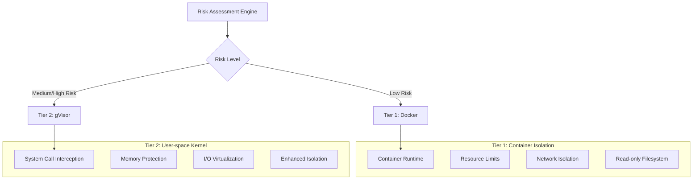
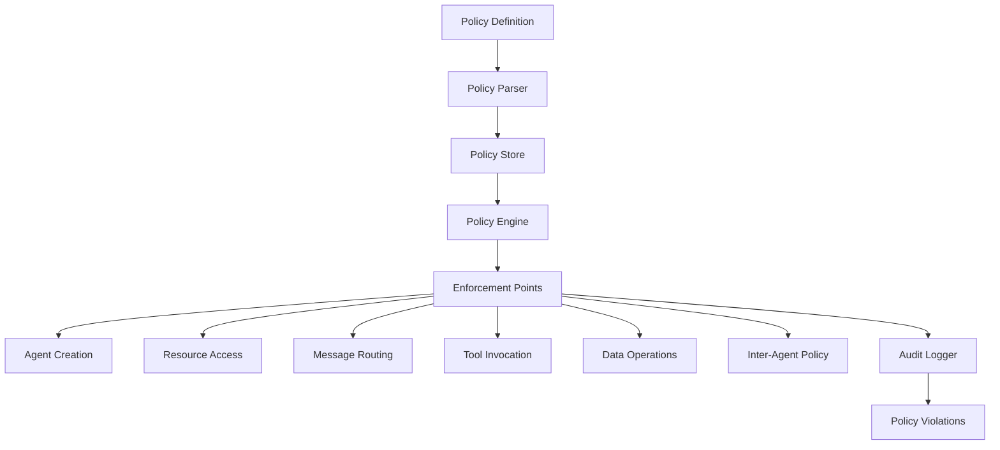
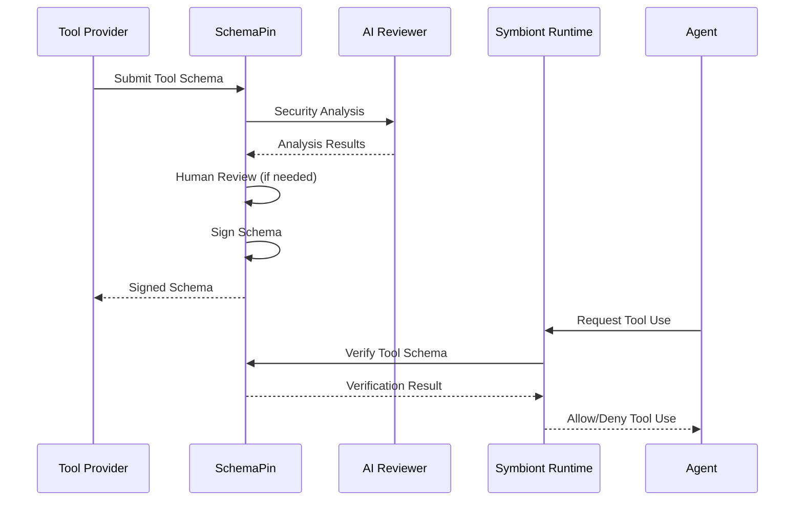
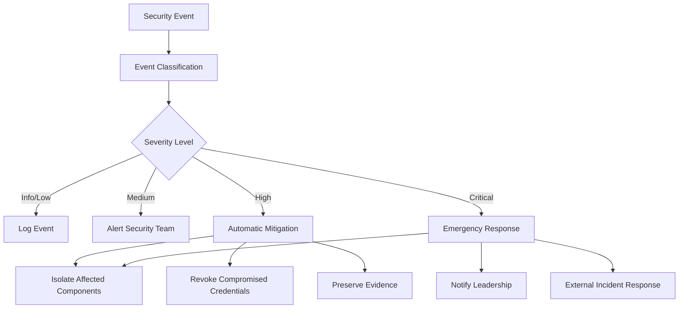

# Modelo de Seguridad

Arquitectura de seguridad integral que garantiza proteccion de confianza cero e impulsada por politicas para agentes de IA.

## Otros idiomas


---

## Descripcion General

Symbiont implementa una arquitectura de seguridad primero disenada para entornos regulados y de alta seguridad. El modelo de seguridad se basa en principios de confianza cero con cumplimiento integral de politicas, sandboxing de multiples niveles y auditabilidad criptografica.

### Principios de Seguridad

- **Confianza Cero**: Todos los componentes y comunicaciones son verificados
- **Defensa en Profundidad**: Multiples capas de seguridad sin un unico punto de falla
- **Impulsado por Politicas**: Politicas de seguridad declarativas aplicadas en tiempo de ejecucion
- **Auditabilidad Completa**: Cada operacion registrada con integridad criptografica
- **Privilegio Minimo**: Permisos minimos requeridos para la operacion

---

## Sandboxing de Multiples Niveles

El tiempo de ejecucion implementa dos niveles de aislamiento basados en la evaluacion de riesgo:



> **Nota**: Niveles de aislamiento adicionales con virtualizacion de hardware estan disponibles en las ediciones Enterprise.

### Nivel 1: Aislamiento Docker

**Casos de Uso:**
- Tareas de desarrollo confiables
- Procesamiento de datos de baja sensibilidad
- Operaciones de herramientas internas

**Caracteristicas de Seguridad:**
```yaml
docker_security:
  memory_limit: "512MB"
  cpu_limit: "0.5"
  network_mode: "none"
  read_only_root: true
  security_opts:
    - "no-new-privileges:true"
    - "seccomp:default"
  capabilities:
    drop: ["ALL"]
    add: ["SETUID", "SETGID"]
```

**Proteccion contra Amenazas:**
- Aislamiento de procesos del host
- Prevencion de agotamiento de recursos
- Control de acceso a la red
- Proteccion del sistema de archivos

### Nivel 2: Aislamiento gVisor

**Casos de Uso:**
- Cargas de trabajo de produccion estandar
- Procesamiento de datos sensibles
- Integracion de herramientas externas

**Caracteristicas de Seguridad:**
- Implementacion de kernel en espacio de usuario
- Filtrado y traduccion de llamadas del sistema
- Limites de proteccion de memoria
- Validacion de solicitudes de E/S

**Configuracion:**
```yaml
gvisor_security:
  runtime: "runsc"
  platform: "ptrace"
  network: "sandbox"
  file_access: "exclusive"
  debug: false
  strace: false
```

**Proteccion Avanzada:**
- Aislamiento de vulnerabilidades del kernel
- Interceptacion de llamadas del sistema
- Prevencion de corrupcion de memoria
- Mitigacion de ataques de canal lateral

> **Caracteristica Enterprise**: El aislamiento avanzado con virtualizacion de hardware (Firecracker) esta disponible en las ediciones Enterprise para los requisitos de seguridad maxima.

---

## Motor de Politicas

### Arquitectura de Politicas

El motor de politicas proporciona controles de seguridad declarativos con aplicacion en tiempo de ejecucion:



### Tipos de Politicas

#### Politicas de Control de Acceso

Definen quien puede acceder a que recursos bajo que condiciones:

```rust
policy secure_data_access {
    allow: read(sensitive_data) if (
        user.clearance >= "secret" &&
        user.need_to_know.contains(data.classification) &&
        session.mfa_verified == true
    )

    deny: export(data) if data.contains_pii == true

    require: [
        user.background_check.current,
        session.secure_connection,
        audit_trail = "detailed"
    ]
}
```

#### Politicas de Flujo de Datos

Controlan como se mueven los datos a traves del sistema:

```rust
policy data_flow_control {
    allow: transform(data) if (
        source.classification <= target.classification &&
        user.transform_permissions.contains(operation.type)
    )

    deny: aggregate(datasets) if (
        any(datasets, |d| d.privacy_level > operation.privacy_budget)
    )

    require: differential_privacy for statistical_operations
}
```

#### Politicas de Uso de Recursos

Gestionan la asignacion de recursos computacionales:

```rust
policy resource_governance {
    allow: allocate(resources) if (
        user.resource_quota.remaining >= resources.total &&
        operation.priority <= user.max_priority
    )

    deny: long_running_operations if system.maintenance_mode

    require: supervisor_approval for high_memory_operations
}
```

### Motor de Evaluacion de Politicas

```rust
pub trait PolicyEngine {
    async fn evaluate_policy(
        &self,
        context: PolicyContext,
        action: Action
    ) -> PolicyDecision;

    async fn register_policy(&self, policy: Policy) -> Result<PolicyId>;
    async fn update_policy(&self, policy_id: PolicyId, policy: Policy) -> Result<()>;
}

pub enum PolicyDecision {
    Allow,
    Deny { reason: String },
    AllowWithConditions { conditions: Vec<PolicyCondition> },
    RequireApproval { approver: String },
}
```

### Optimizacion de Rendimiento

**Cache de Politicas:**
- Evaluacion de politicas compiladas para rendimiento
- Cache LRU para decisiones frecuentes
- Evaluacion por lotes para operaciones masivas
- Tiempos de evaluacion de sub-milisegundos

**Actualizaciones Incrementales:**
- Actualizaciones de politicas en tiempo real sin reinicio
- Implementacion de politicas versionadas
- Capacidades de rollback para errores de politicas

### Motor de Politicas Cedar (Feature `cedar`)

Symbiont integra el [lenguaje de politicas Cedar](https://www.cedarpolicy.com/) para autorizacion formal. Cedar permite politicas de control de acceso granulares y auditables que se evaluan en la compuerta de politicas del bucle de razonamiento.

```bash
cargo build --features cedar
```

**Capacidades clave:**
- **Verificacion formal**: Las politicas Cedar pueden ser analizadas estaticamente para verificar su correccion
- **Autorizacion granular**: Control de acceso basado en entidades con permisos jerarquicos
- **Integracion con el bucle de razonamiento**: `CedarPolicyGate` implementa el trait `ReasoningPolicyGate`, evaluando cada accion propuesta contra las politicas Cedar antes de la ejecucion
- **Rastro de auditoria**: Todas las decisiones de politicas Cedar se registran con contexto completo

```rust
use symbi_runtime::reasoning::cedar_gate::CedarPolicyGate;

// Create a Cedar policy gate with deny-by-default stance
let cedar_gate = CedarPolicyGate::deny_by_default();
let runner = ReasoningLoopRunner::builder()
    .provider(provider)
    .executor(executor)
    .policy_gate(Arc::new(cedar_gate))
    .build();
```

### Politica de Comunicacion Inter-Agente

El `CommunicationPolicyGate` aplica reglas de autorizacion para toda la comunicacion inter-agente. Cada llamada a traves de `ask`, `delegate`, `send_to`, `parallel` o `race` se evalua contra las reglas de politica antes de su ejecucion.

**Estructura de reglas:**
- **Condiciones**: `SenderIs(agent)`, `RecipientIs(agent)`, `Always`, compuestas `All`/`Any`
- **Efectos**: `Allow` o `Deny { reason }`
- **Prioridad**: Las reglas se evaluan de mayor a menor prioridad; la primera coincidencia gana
- **Por defecto**: Allow (compatible con versiones anteriores — los proyectos existentes funcionan sin cambios)

**La denegacion de politica es un fallo estricto** — el agente que llama recibe un error a traves del bucle ORGA y puede razonar sobre el. Todos los mensajes inter-agente se firman criptograficamente via Ed25519 y se cifran con AES-256-GCM.

Ejemplo de politica: impedir que un agente worker delegue a otros agentes:
```cedar
forbid(
    principal == Agent::"worker",
    action == Action::"delegate",
    resource
);
```

---

## Seguridad Criptografica

### Firmas Digitales

Todas las operaciones relevantes para la seguridad estan firmadas criptograficamente:

**Algoritmo de Firma:** Ed25519 (RFC 8032)
- **Tamano de Clave:** Claves privadas de 256 bits, claves publicas de 256 bits
- **Tamano de Firma:** 512 bits (64 bytes)
- **Rendimiento:** 70,000+ firmas/segundo, 25,000+ verificaciones/segundo

```rust
pub struct MessageSignature {
    pub signature: Vec<u8>,
    pub algorithm: SignatureAlgorithm,
    pub public_key: Vec<u8>,
}

impl AuditEvent {
    pub fn sign(&mut self, private_key: &PrivateKey) -> Result<()> {
        let message = self.serialize_for_signing()?;
        self.signature = private_key.sign(&message);
        Ok(())
    }

    pub fn verify(&self, public_key: &PublicKey) -> bool {
        let message = self.serialize_for_signing().unwrap();
        public_key.verify(&message, &self.signature)
    }
}
```

### Gestion de Claves

**Almacenamiento de Claves:**
- Integracion de Modulo de Seguridad de Hardware (HSM)
- Soporte de enclave seguro para proteccion de claves
- Rotacion de claves con intervalos configurables
- Copia de seguridad y recuperacion de claves distribuidas

**Jerarquia de Claves:**
- Claves de firma raiz para operaciones del sistema
- Claves por agente para firma de operaciones
- Claves efimeras para cifrado de sesion
- Claves externas para verificacion de herramientas

> **Caracteristica planificada** — La API `KeyManager` mostrada a continuacion es parte de la hoja de ruta de seguridad y aun no esta disponible en la version actual. La implementacion actual proporciona utilidades de claves via `KeyUtils` en `crypto.rs`.

```rust
pub struct KeyManager {
    hsm: HardwareSecurityModule,
    key_store: SecureKeyStore,
    rotation_policy: KeyRotationPolicy,
}

impl KeyManager {
    pub async fn generate_agent_keys(&self, agent_id: AgentId) -> Result<KeyPair>;
    pub async fn rotate_keys(&self, key_id: KeyId) -> Result<KeyPair>;
    pub async fn revoke_key(&self, key_id: KeyId) -> Result<()>;
}
```

### Estandares de Cifrado

**Cifrado Simetrico:** AES-256-GCM
- Claves de 256 bits con cifrado autenticado
- Nonces unicos para cada operacion de cifrado
- Datos asociados para vinculacion de contexto

**Cifrado Asimetrico:** X25519 + ChaCha20-Poly1305
- Intercambio de claves de curva eliptica
- Cifrado de flujo con cifrado autenticado
- Secreto perfecto hacia adelante

**Cifrado de Mensajes:**
```rust
pub fn encrypt_message(
    plaintext: &[u8],
    recipient_public_key: &PublicKey,
    sender_private_key: &PrivateKey
) -> Result<EncryptedMessage> {
    let shared_secret = sender_private_key.diffie_hellman(recipient_public_key);
    let nonce = generate_random_nonce();
    let ciphertext = ChaCha20Poly1305::new(&shared_secret)
        .encrypt(&nonce, plaintext)?;

    Ok(EncryptedMessage {
        nonce,
        ciphertext,
        sender_public_key: sender_private_key.public_key(),
    })
}
```

---

## Auditoria y Cumplimiento

### Rastro de Auditoria Criptografica

Cada operacion relevante para la seguridad genera un evento de auditoria inmutable:

```rust
pub struct AuditEvent {
    pub event_id: Uuid,
    pub timestamp: SystemTime,
    pub agent_id: AgentId,
    pub event_type: AuditEventType,
    pub details: serde_json::Value,
    pub signature: Ed25519Signature,
    pub previous_hash: Hash,
    pub event_hash: Hash,
}
```

**Tipos de Eventos de Auditoria:**
- Eventos del ciclo de vida del agente (creacion, terminacion)
- Decisiones de evaluacion de politicas
- Asignacion y uso de recursos
- Envio y enrutamiento de mensajes
- Invocaciones de herramientas externas
- Violaciones de seguridad y alertas

### Encadenamiento de Hash

Los eventos estan vinculados en una cadena inmutable:

```rust
impl AuditChain {
    pub fn append_event(&mut self, mut event: AuditEvent) -> Result<()> {
        event.previous_hash = self.last_hash;
        event.event_hash = self.calculate_event_hash(&event);
        event.sign(&self.signing_key)?;

        self.events.push(event.clone());
        self.last_hash = event.event_hash;

        self.verify_chain_integrity()?;
        Ok(())
    }

    pub fn verify_integrity(&self) -> Result<bool> {
        for (i, event) in self.events.iter().enumerate() {
            // Verify signature
            if !event.verify(&self.public_key) {
                return Ok(false);
            }

            // Verify hash chain
            if i > 0 && event.previous_hash != self.events[i-1].event_hash {
                return Ok(false);
            }
        }
        Ok(true)
    }
}
```

### Caracteristicas de Cumplimiento

**Soporte Regulatorio:**

**HIPAA (Salud):**
- Registro de acceso a PHI con identificacion de usuario
- Aplicacion de minimizacion de datos
- Deteccion y notificacion de brechas
- Retencion de rastro de auditoria por 6 anos

**GDPR (Privacidad):**
- Registros de procesamiento de datos personales
- Seguimiento de verificacion de consentimiento
- Aplicacion de derechos del sujeto de datos
- Cumplimiento de politica de retencion de datos

**SOX (Financiero):**
- Documentacion de controles internos
- Seguimiento de gestion de cambios
- Verificacion de controles de acceso
- Proteccion de datos financieros

**Cumplimiento Personalizado:**

> **Caracteristica planificada** — La API `ComplianceFramework` mostrada a continuacion es parte de la hoja de ruta de seguridad y aun no esta disponible en la version actual.

```rust
pub struct ComplianceFramework {
    pub name: String,
    pub audit_requirements: Vec<AuditRequirement>,
    pub retention_policy: RetentionPolicy,
    pub access_controls: Vec<AccessControl>,
    pub data_protection: DataProtectionRules,
}

impl ComplianceFramework {
    pub fn validate_compliance(&self, audit_trail: &AuditChain) -> ComplianceReport;
    pub fn generate_compliance_report(&self, period: TimePeriod) -> Report;
}
```

---

## Relay de Aprobacion Humana (`symbi-approval-relay`)

Cuando una decision de politica devuelve `require: approval`, la accion se bloquea hasta que un revisor humano la aprueba o la deniega. `symbi-approval-relay` es el crate que lleva esas solicitudes a un humano y la decision de vuelta, manteniendo ambos tramos auditables.

### Diseno de canal dual

El relay es **de canal dual** por diseno: cada aprobacion hace un viaje de ida y vuelta por dos rutas independientes, y ambas deben coincidir antes de que el runtime desbloquee la accion.

- **Canal primario** — una superficie interactiva para el revisor (adaptador de chat, interfaz web, prompt de CLI). Aqui es donde el revisor lee la solicitud y decide.
- **Canal de atestacion** — una ruta de verificacion independiente (por ejemplo, una devolucion de llamada firmada, un segundo operador o una confirmacion fuera de banda). El runtime no desbloqueara una aprobacion basada solo en el canal primario.

Esta estructura derrota el caso de compromiso de canal unico — un atacante que tome el canal primario aun no puede otorgar aprobaciones, porque el canal de atestacion no comparte confianza con el.

### Que transporta el relay

Cada solicitud de aprobacion en transito transporta:
- La identidad del agente (anclada con AgentPin) y la decision de politica que desencadeno la solicitud
- El contexto completo de la accion — invocacion de la herramienta, recurso, argumentos — con hash para que los revisores puedan confirmar que aprobaron *esta* accion y no una sustituida
- Un plazo limite tras el cual la solicitud se deniega automaticamente
- IDs de correlacion para que el rastro de auditoria vincule las decisiones de ambos canales a una unica accion

Las aprobaciones y denegaciones se registran en la misma cadena de auditoria criptograficamente a prueba de manipulaciones que cualquier otra decision del runtime. Un humano diciendo "si" es una decision en el registro, no un bypass de el.

### Donde se usa

- Politicas Cedar que emiten veredictos `RequireApproval { approver: "..." }`
- Llamadas a herramientas destructivas o de alto privilegio controladas por hooks `approval` de ToolClad
- Trabajos programados configurados con `one_shot = true` mas una politica de aprobacion
- Cualquier bloque `policy` de DSL que nombre `require: <role>_approval`

Si no hay un relay configurado, las acciones con aprobacion requerida fallan cerradas — se deniegan, no se permiten silenciosamente.

---

## Seguridad de Herramientas con SchemaPin

### Proceso de Verificacion de Herramientas

Las herramientas externas se verifican usando firmas criptograficas:



### Confianza en Primer Uso (TOFU)

**Proceso de Fijacion de Claves:**
1. Primer encuentro con un proveedor de herramientas
2. Verificar la clave publica del proveedor a traves de canales externos
3. Fijar la clave publica en el almacen de confianza local
4. Usar la clave fijada para todas las verificaciones futuras

> **Caracteristica planificada** — La API `TOFUKeyStore` mostrada a continuacion es parte de la hoja de ruta de seguridad y aun no esta disponible en la version actual.

```rust
pub struct TOFUKeyStore {
    pinned_keys: HashMap<ProviderId, PinnedKey>,
    trust_policies: Vec<TrustPolicy>,
}

impl TOFUKeyStore {
    pub async fn pin_key(&mut self, provider: ProviderId, key: PublicKey) -> Result<()> {
        if self.pinned_keys.contains_key(&provider) {
            return Err("Key already pinned for provider");
        }

        self.pinned_keys.insert(provider, PinnedKey {
            public_key: key,
            pinned_at: SystemTime::now(),
            trust_level: TrustLevel::Unverified,
        });

        Ok(())
    }

    pub fn verify_tool(&self, tool: &MCPTool) -> VerificationResult {
        if let Some(pinned_key) = self.pinned_keys.get(&tool.provider_id) {
            if pinned_key.public_key.verify(&tool.schema_hash, &tool.signature) {
                VerificationResult::Trusted
            } else {
                VerificationResult::SignatureInvalid
            }
        } else {
            VerificationResult::UnknownProvider
        }
    }
}
```

### Revision de Herramientas Impulsada por IA

Analisis de seguridad automatizado antes de la aprobacion de herramientas:

**Componentes de Analisis:**
- **Deteccion de Vulnerabilidades**: Coincidencia de patrones contra firmas de vulnerabilidades conocidas
- **Deteccion de Codigo Malicioso**: Identificacion de comportamientos maliciosos basada en ML
- **Analisis de Uso de Recursos**: Evaluacion de requisitos de recursos computacionales
- **Evaluacion de Impacto en Privacidad**: Manejo de datos e implicaciones de privacidad

> **Caracteristica planificada** — La API `SecurityAnalyzer` mostrada a continuacion es parte de la hoja de ruta de seguridad y aun no esta disponible en la version actual.

```rust
pub struct SecurityAnalyzer {
    vulnerability_patterns: VulnerabilityDatabase,
    ml_detector: MaliciousCodeDetector,
    resource_analyzer: ResourceAnalyzer,
    privacy_assessor: PrivacyAssessor,
}

impl SecurityAnalyzer {
    pub async fn analyze_tool(&self, tool: &MCPTool) -> SecurityAnalysis {
        let mut findings = Vec::new();

        // Vulnerability pattern matching
        findings.extend(self.vulnerability_patterns.scan(&tool.schema));

        // ML-based detection
        let ml_result = self.ml_detector.analyze(&tool.schema).await?;
        findings.extend(ml_result.findings);

        // Resource usage analysis
        let resource_risk = self.resource_analyzer.assess(&tool.schema);

        // Privacy impact assessment
        let privacy_impact = self.privacy_assessor.evaluate(&tool.schema);

        SecurityAnalysis {
            tool_id: tool.id.clone(),
            risk_score: calculate_risk_score(&findings),
            findings,
            resource_requirements: resource_risk,
            privacy_impact,
            recommendation: self.generate_recommendation(&findings),
        }
    }
}
```

---

## Escaner de Habilidades ClawHavoc

El escaner ClawHavoc proporciona defensa a nivel de contenido para habilidades de agentes. Cada archivo de habilidad se escanea linea por linea antes de cargarse, y los hallazgos de severidad Critica o Alta bloquean la ejecucion de la habilidad.

### Modelo de Severidad

| Nivel | Accion | Descripcion |
|-------|--------|-------------|
| **Critico** | Fallar escaneo | Patrones de explotacion activa (shells inversos, inyeccion de codigo) |
| **Alto** | Fallar escaneo | Robo de credenciales, escalada de privilegios, inyeccion de procesos |
| **Medio** | Advertir | Sospechoso pero potencialmente legitimo (descargadores, symlinks) |
| **Advertencia** | Advertir | Indicadores de bajo riesgo (referencias a archivos env, chmod) |
| **Info** | Registrar | Hallazgos informativos |

### Categorias de Deteccion (40 Reglas)

**Reglas de Defensa Originales (10)**
- `pipe-to-shell`, `wget-pipe-to-shell` — Ejecucion remota de codigo via descargas canalizadas
- `eval-with-fetch`, `fetch-with-eval` — Inyeccion de codigo via eval + red
- `base64-decode-exec` — Ejecucion ofuscada via decodificacion base64
- `soul-md-modification`, `memory-md-modification` — Manipulacion de identidad
- `rm-rf-pattern` — Operaciones destructivas del sistema de archivos
- `env-file-reference`, `chmod-777` — Acceso a archivos sensibles, permisos de escritura mundial

**Shells Inversos (7)** — Severidad critica
- `reverse-shell-bash`, `reverse-shell-nc`, `reverse-shell-ncat`, `reverse-shell-mkfifo`, `reverse-shell-python`, `reverse-shell-perl`, `reverse-shell-ruby`

**Recoleccion de Credenciales (6)** — Severidad alta
- `credential-ssh-keys`, `credential-aws`, `credential-cloud-config`, `credential-browser-cookies`, `credential-keychain`, `credential-etc-shadow`

**Exfiltracion de Red (3)** — Severidad alta
- `exfil-dns-tunnel`, `exfil-dev-tcp`, `exfil-nc-outbound`

**Inyeccion de Procesos (4)** — Severidad critica
- `injection-ptrace`, `injection-ld-preload`, `injection-proc-mem`, `injection-gdb-attach`

**Escalada de Privilegios (5)** — Severidad alta
- `privesc-sudo`, `privesc-setuid`, `privesc-setcap`, `privesc-chown-root`, `privesc-nsenter`

**Symlink / Travesia de Ruta (2)** — Severidad media
- `symlink-escape`, `path-traversal-deep`

**Cadenas de Descarga (3)** — Severidad media
- `downloader-curl-save`, `downloader-wget-save`, `downloader-chmod-exec`

### Lista Blanca de Ejecutables

El tipo de regla `AllowedExecutablesOnly` restringe que ejecutables puede invocar una habilidad de agente:

```rust
// Only allow these executables — everything else is blocked
ScanRule::AllowedExecutablesOnly(vec![
    "python3".into(),
    "node".into(),
    "cargo".into(),
])
```

### Reglas Personalizadas

Se pueden agregar patrones especificos del dominio junto con los predeterminados de ClawHavoc:

```rust
let mut scanner = SkillScanner::new();
scanner.add_custom_rule(
    "block-internal-api",
    r"internal\.corp\.example\.com",
    ScanSeverity::High,
    "References to internal API endpoints are not allowed in skills",
);
```

---

## Sanitizacion de Caracteres Invisibles (`symbi-invis-strip`)

`symbi-invis-strip` es un crate utilitario sin dependencias usado en todo el runtime para eliminar caracteres que se renderizan como nada pero cambian el significado — la carga util clasica para ataques de inyeccion de prompts y evasion de politicas.

### Que elimina

- ASCII C0 (0x00–0x1F) y DEL (0x7F), excepto `\t` `\n` `\r`
- ASCII C1 (0x80–0x9F)
- Caracteres de ancho cero (ZWSP, ZWNJ, ZWJ)
- Overrides bidireccionales (LRO, RLO, PDF, LRE, RLE, LRI, RLI, FSI, PDI)
- Word joiner y el bloque de operadores invisibles
- Marcas de orden de bytes (BOM)
- Selectores de variacion (VS1–VS16 y VS17–VS256 suplementarios)
- Caracteres del bloque Unicode Tag (U+E0000–U+E007F)

### Donde se ejecuta

- Cargas utiles entrantes de chat y webhook — antes de que lleguen al orquestador
- Argumentos de llamadas a herramientas — antes de que lleguen a la evaluacion Cedar
- Contenido de skills y DSL de agentes — antes del escaner y el parser

### Eliminacion opcional de markup

La variante opcional `sanitize_field_with_markup` adicionalmente elimina:
- Comentarios HTML `<!-- ... -->`
- Bloques de codigo delimitados por triples comillas invertidas

La eliminacion de markup es apropiada para superficies donde el markup oculto al renderizador no tiene uso legitimo — por ejemplo, campos breves de justificacion de politicas o metadatos solo de visualizacion. **No** se aplica a campos que legitimamente llevan markdown o codigo (como fuente de agente, cuerpos de politica o salidas de herramientas).

---

## Linter de Politicas Cedar

`scripts/lint-cedar-policies.py` es un pase de analisis estatico que se ejecuta sobre cada archivo `.cedar` del repositorio. Detecta una clase de ataque en la que un flujo de autoria malicioso (o comprometido) escribe una politica que *parece* correcta pero contiene caracteres que producen una decision de autorizacion diferente a la que el revisor espera.

### Que detecta

- **Identificadores homoglifo** — `а` cirilica (U+0430) haciendose pasar por `a` latina, `ο` griega (U+03BF) como `o` latina y similares imitaciones en nombres de principal/accion/recurso.
- **Caracteres de control invisibles** dentro de identificadores, literales de cadena o entre tokens.

### Donde se ejecuta

- **Hook pre-commit** — bloquea commits que introducen cualquiera de las dos clases de problema.
- **CI** — la misma verificacion es un job de prueba obligatorio, de modo que los commits que eluden el hook (via `--no-verify`) aun fallan en CI.

Combinado con `symbi-invis-strip` en la ruta de datos, el linter cierra el vector de la ruta de autoria: los trucos invisibles no pueden entrar al repo, y cualquiera que se cuele en tiempo de ejecucion se elimina antes de la evaluacion de politicas.

---

## Seguridad de Red

### Comunicacion Segura

**Seguridad de Capa de Transporte:**
- TLS 1.3 para todas las comunicaciones externas
- TLS mutuo (mTLS) para comunicacion servicio a servicio
- Fijacion de certificados para servicios conocidos
- Secreto perfecto hacia adelante

**Seguridad a Nivel de Mensaje:**
- Cifrado de extremo a extremo para mensajes de agentes
- Codigos de autenticacion de mensajes (MAC)
- Prevencion de ataques de repeticion con marcas de tiempo
- Garantias de ordenamiento de mensajes

```rust
pub struct SecureChannel {
    encryption_key: [u8; 32],
    mac_key: [u8; 32],
    send_counter: AtomicU64,
    recv_counter: AtomicU64,
}

impl SecureChannel {
    pub fn encrypt_message(&self, plaintext: &[u8]) -> Result<Vec<u8>> {
        let counter = self.send_counter.fetch_add(1, Ordering::SeqCst);
        let nonce = self.generate_nonce(counter);

        let ciphertext = ChaCha20Poly1305::new(&self.encryption_key)
            .encrypt(&nonce, plaintext)?;

        let mac = Hmac::<Sha256>::new_from_slice(&self.mac_key)?
            .chain_update(&ciphertext)
            .chain_update(&counter.to_le_bytes())
            .finalize()
            .into_bytes();

        Ok([ciphertext, mac.to_vec()].concat())
    }
}
```

### Aislamiento de Red

**Control de Red del Sandbox:**
- Sin acceso a red por defecto
- Lista de permitidos explicita para conexiones externas
- Monitoreo de trafico y deteccion de anomalias
- Filtrado y validacion de DNS

**Politicas de Red:**
```yaml
network_policy:
  default_action: "deny"
  allowed_destinations:
    - domain: "api.openai.com"
      ports: [443]
      protocol: "https"
    - ip_range: "10.0.0.0/8"
      ports: [6333]  # Qdrant (only needed if using optional Qdrant backend)
      protocol: "http"

  monitoring:
    log_all_connections: true
    detect_anomalies: true
    rate_limiting: true
```

---

## Respuesta a Incidentes

### Deteccion de Eventos de Seguridad

**Deteccion Automatizada:**
- Monitoreo de violaciones de politicas
- Deteccion de comportamiento anomalo
- Anomalias de uso de recursos
- Seguimiento de autenticacion fallida

**Clasificacion de Alertas:**
```rust
pub enum ViolationSeverity {
    Info,       // Normal security events
    Warning,    // Minor policy violations
    Error,      // Confirmed security issues
    Critical,   // Active security breaches
}

pub struct SecurityEvent {
    pub id: Uuid,
    pub timestamp: SystemTime,
    pub severity: ViolationSeverity,
    pub category: SecurityEventCategory,
    pub description: String,
    pub affected_components: Vec<ComponentId>,
    pub recommended_actions: Vec<String>,
}
```

### Flujo de Trabajo de Respuesta a Incidentes



### Procedimientos de Recuperacion

**Recuperacion Automatizada:**
- Reinicio de agente con estado limpio
- Rotacion de claves para credenciales comprometidas
- Actualizaciones de politicas para prevenir recurrencia
- Verificacion de salud del sistema

**Recuperacion Manual:**
- Analisis forense de eventos de seguridad
- Analisis de causa raiz y remediacion
- Actualizaciones de controles de seguridad
- Documentacion de incidentes y lecciones aprendidas

---

## Mejores Practicas de Seguridad

### Directrices de Desarrollo

1. **Seguro por Defecto**: Todas las caracteristicas de seguridad habilitadas por defecto
2. **Principio de Privilegio Minimo**: Permisos minimos para todas las operaciones
3. **Defensa en Profundidad**: Multiples capas de seguridad con redundancia
4. **Fallar de Forma Segura**: Las fallas de seguridad deben denegar el acceso, no otorgarlo
5. **Auditar Todo**: Registro completo de operaciones relevantes para la seguridad

### Seguridad de Implementacion

**Endurecimiento del Entorno:**
```bash
# Disable unnecessary services
systemctl disable cups bluetooth

# Kernel hardening
echo "kernel.dmesg_restrict=1" >> /etc/sysctl.conf
echo "kernel.kptr_restrict=2" >> /etc/sysctl.conf

# File system security
mount -o remount,nodev,nosuid,noexec /tmp
```

**Seguridad de Contenedores:**
```dockerfile
# Use minimal base image
FROM scratch
COPY --from=builder /app/symbiont /bin/symbiont

# Run as non-root user
USER 1000:1000

# Set security options
LABEL security.no-new-privileges=true
```

### Seguridad Operacional

**Lista de Verificacion de Monitoreo:**
- [ ] Monitoreo de eventos de seguridad en tiempo real
- [ ] Seguimiento de violaciones de politicas
- [ ] Deteccion de anomalias de uso de recursos
- [ ] Monitoreo de autenticacion fallida
- [ ] Seguimiento de expiracion de certificados

**Procedimientos de Mantenimiento:**
- Actualizaciones y parches de seguridad regulares
- Rotacion de claves programada
- Revision y actualizaciones de politicas
- Auditoria de seguridad y pruebas de penetracion
- Pruebas del plan de respuesta a incidentes

---

## Configuracion de Seguridad

### Variables de Entorno

```bash
# Cryptographic settings
export SYMBIONT_CRYPTO_PROVIDER=ring
export SYMBIONT_KEY_STORE_TYPE=hsm
export SYMBIONT_HSM_CONFIG_PATH=/etc/symbiont/hsm.conf

# Audit settings
export SYMBIONT_AUDIT_ENABLED=true
export SYMBIONT_AUDIT_STORAGE=/var/audit/symbiont
export SYMBIONT_AUDIT_RETENTION_DAYS=2555  # 7 years

# Security policies
export SYMBIONT_POLICY_ENFORCEMENT=strict
export SYMBIONT_DEFAULT_SANDBOX_TIER=gvisor
export SYMBIONT_TOFU_ENABLED=true
```

### Archivo de Configuracion de Seguridad

```toml
[security]
# Cryptographic settings
crypto_provider = "ring"
signature_algorithm = "ed25519"
encryption_algorithm = "chacha20_poly1305"

# Key management
key_rotation_interval_days = 90
hsm_enabled = true
hsm_config_path = "/etc/symbiont/hsm.conf"

# Audit settings
audit_enabled = true
audit_storage_path = "/var/audit/symbiont"
audit_retention_days = 2555
audit_compression = true

# Sandbox security
default_sandbox_tier = "gvisor"
sandbox_escape_detection = true
resource_limit_enforcement = "strict"

# Network security
tls_min_version = "1.3"
certificate_pinning = true
network_isolation = true

# Policy enforcement
policy_enforcement_mode = "strict"
policy_violation_action = "deny_and_alert"
emergency_override_enabled = false

[tofu]
enabled = true
key_verification_required = true
trust_on_first_use_timeout_hours = 24
automatic_key_pinning = false
```

---

## Metricas de Seguridad

### Indicadores Clave de Rendimiento

**Operaciones de Seguridad:**
- Latencia de evaluacion de politicas: promedio <1ms
- Tasa de generacion de eventos de auditoria: 10,000+ eventos/segundo
- Tiempo de respuesta a incidentes de seguridad: <5 minutos
- Rendimiento de operaciones criptograficas: 70,000+ ops/segundo

**Metricas de Cumplimiento:**
- Tasa de cumplimiento de politicas: >99.9%
- Integridad del rastro de auditoria: 100%
- Tasa de falsos positivos de eventos de seguridad: <1%
- Tiempo de resolucion de incidentes: <24 horas

**Evaluacion de Riesgo:**
- Tiempo de parcheo de vulnerabilidades: <48 horas
- Efectividad de controles de seguridad: >95%
- Precision de deteccion de amenazas: >99%
- Objetivo de tiempo de recuperacion: <1 hora

---

## Mejoras Futuras

### Criptografia Avanzada

**Criptografia Post-Cuantica:**
- Algoritmos post-cuanticos aprobados por NIST
- Esquemas hibridos clasicos/post-cuanticos
- Planificacion de migracion para amenazas cuanticas

**Cifrado Homomorfico:**
- Computacion que preserva la privacidad en datos cifrados
- Esquema CKKS para aritmetica aproximada
- Integracion con flujos de trabajo de aprendizaje automatico

**Pruebas de Conocimiento Cero:**
- zk-SNARKs para verificacion de computacion
- Autenticacion que preserva la privacidad
- Generacion de pruebas de cumplimiento

### Seguridad Mejorada por IA

**Analisis de Comportamiento:**
- Aprendizaje automatico para deteccion de anomalias
- Analisis de seguridad predictiva
- Respuesta adaptativa a amenazas

**Respuesta Automatizada:**
- Controles de seguridad auto-curativos
- Generacion dinamica de politicas
- Clasificacion inteligente de incidentes

---

## Proximos Pasos

- **[Contribuir](/contributing)** - Directrices de desarrollo de seguridad
- **[Arquitectura del Runtime](/runtime-architecture)** - Detalles de implementacion tecnica
- **[Referencia de API](/api-reference)** - Documentacion de API de seguridad

El modelo de seguridad de Symbiont proporciona proteccion de grado empresarial adecuada para industrias reguladas y entornos de alta seguridad. Su enfoque en capas asegura una proteccion robusta contra amenazas en evolucion mientras mantiene la eficiencia operacional.
