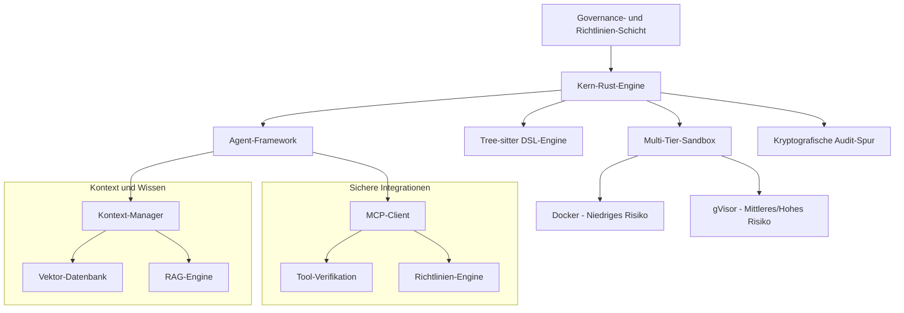

# Symbiont Dokumentation
{: .fs-9 }

KI-native, datenschutzorientierte Programmiersprache und Agent-Framework für autonome, richtlinienbasierte Softwareentwicklung.
{: .fs-6 .fw-300 }

[Jetzt starten](#getting-started){: .btn .btn-primary .fs-5 .mb-4 .mb-md-0 .mr-2 }
[Auf GitHub ansehen](https://github.com/thirdkeyai/symbiont){: .btn .fs-5 .mb-4 .mb-md-0 }

---

## 🌐 Andere Sprachen
{: .no_toc}

[English](index.md) | [中文简体](index.zh-cn.md) | [Español](index.es.md) | [Português](index.pt.md) | [日本語](index.ja.md) | **Deutsch**

---

## Was ist Symbiont?

Symbiont repräsentiert die nächste Evolution in der Softwareentwicklung — wo KI-Agenten und menschliche Entwickler sicher, transparent und effektiv zusammenarbeiten. Es ermöglicht Entwicklern, autonome, richtlinienbasierte Agenten zu erstellen, die sicher mit Menschen, anderen Agenten und großen Sprachmodellen zusammenarbeiten können, während sie Zero-Trust-Sicherheit, Datenschutz und verifizierbares Verhalten durchsetzen.

### Hauptmerkmale

- **🛡️ Sicherheitsorientiertes Design**: Multi-Tier-Sandbox mit Docker und gVisor
- **📋 Richtlinienbasierte Programmierung**: Deklarative Sicherheitsrichtlinien mit Laufzeit-Durchsetzung
- **🔐 Enterprise-Geheimnismanagement**: HashiCorp Vault-Integration mit verschlüsselten Datei-Backends
- **🔑 Kryptografische Überprüfbarkeit**: Vollständige Operationsprotokollierung mit Ed25519-Signaturen
- **🧠 Intelligentes Kontextmanagement**: RAG-verstärkte Wissenssysteme mit Vektorsuche
- **🔗 Sichere Tool-Integration**: MCP-Protokoll mit kryptografischer Verifikation
- **⚡ Hohe Leistung**: Rust-native Implementierung für Produktionsworkloads

---

## Erste Schritte

### Schnellinstallation

```bash
# Repository klonen
git clone https://github.com/thirdkeyai/symbiont.git
cd symbiont

# Einheitlichen symbi-Container erstellen
docker build -t symbi:latest .

# Oder vorgefertigten Container verwenden
docker pull ghcr.io/thirdkeyai/symbi:latest

# System testen
cargo test

# Einheitliche CLI testen
docker run --rm symbi:latest --version
docker run --rm -v $(pwd):/workspace symbi:latest dsl parse --help
docker run --rm symbi:latest mcp --help
```

### Ihr erster Agent

```rust
metadata {
    version = "1.0.0"
    author = "developer"
    description = "Simple analysis agent"
}

agent analyze_data(input: DataSet) -> Result {
    capabilities = ["data_analysis"]
    
    policy secure_analysis {
        allow: read(input) if input.anonymized == true
        deny: store(input) if input.contains_pii == true
        audit: all_operations with signature
    }
    
    with memory = "ephemeral", privacy = "high" {
        if (validate_input(input)) {
            result = process_data(input);
            audit_log("analysis_completed", result.metadata);
            return result;
        } else {
            return reject("Invalid input data");
        }
    }
}
```

---

## Architektur-Übersicht



---

## Anwendungsfälle

### Entwicklung und Forschung
- Sichere Code-Generierung und automatisierte Tests
- Multi-Agent-Kollaborationsexperimente
- Kontextbewusste KI-Systementwicklung

### Datenschutzkritische Anwendungen
- Gesundheitsdatenverarbeitung mit Datenschutzkontrollen
- Finanzdienstleistungsautomatisierung mit Audit-Funktionen
- Regierungs- und Verteidigungssysteme mit Sicherheitsfeatures

---

## Projektstatus

### v1.0.0 Veröffentlicht

Symbiont v1.0.0 ist die erste stabile Version und liefert ein vollständiges AI-Agent-Framework mit produktionsreifen Funktionen:

- **Scheduling**: Cron-basierte Aufgabenausführung mit Sitzungsisolierung, Zustellungsrouting und Dead-Letter-Warteschlangen
- **Sitzungsisolierung**: Ephemere, gemeinsame oder vollständig isolierte Agent-Kontexte
- **Zustellungsrouting**: Ausgabe an Stdout, LogFile, Webhook, Slack, Email oder benutzerdefinierte Kanäle
- **Richtliniendurchsetzung**: Sicherheits- und Compliance-Prüfungen mit Zeitfenster- und Fähigkeitskontrollen
- **AgentPin-Identität**: Kryptografische Agent-Identitätsverifikation über ES256 JWTs
- **Beobachtbarkeit**: Prometheus-kompatible Metriken, strukturierte Audit-Events und Health-Endpunkte

### 🔮 Geplante Features
- Multi-modale RAG-Unterstützung (Bilder, Audio, strukturierte Daten)
- Agentenübergreifende Wissenssynthese und Kollaboration
- Föderierte Agentennetzwerke mit domänenübergreifendem Vertrauen
- Leistungsoptimierung und intelligentes Caching

---

## Community

- **Dokumentation**: Umfassende Leitfäden und API-Referenzen
- [API-Referenz](api-reference.md)
- [Scheduling-Leitfaden](scheduling.md)
- [HTTP-Eingabemodul](http-input.md)
- **Issues**: [GitHub Issues](https://github.com/thirdkeyai/symbiont/issues)
- **Diskussionen**: [GitHub Discussions](https://github.com/thirdkeyai/symbiont/discussions)
- **Lizenz**: Open Source Software von ThirdKey

---

## Nächste Schritte

<div class="grid grid-cols-1 md:grid-cols-3 gap-6 mt-8">
  <div class="card">
    <h3>🚀 Beginnen</h3>
    <p>Folgen Sie unserem Einstiegsleitfaden, um Ihre erste Symbiont-Umgebung einzurichten.</p>
    <a href="/getting-started" class="btn btn-outline">Schnellstart-Leitfaden</a>
  </div>
  
  <div class="card">
    <h3>📖 DSL lernen</h3>
    <p>Meistern Sie die Symbiont DSL für den Aufbau richtlinienbasierter Agenten.</p>
    <a href="/dsl-guide" class="btn btn-outline">DSL-Dokumentation</a>
  </div>
  
  <div class="card">
    <h3>🏗️ Architektur</h3>
    <p>Verstehen Sie das Laufzeitsystem und Sicherheitsmodell.</p>
    <a href="/runtime-architecture" class="btn btn-outline">Architektur-Leitfaden</a>
  </div>
</div>