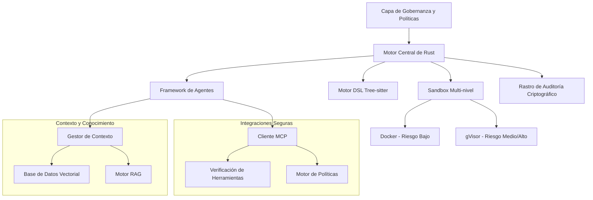

# Documentación de Symbiont
{: .fs-9 }

Lenguaje de programación nativo de IA y framework de agentes con privacidad prioritaria para desarrollo de software autónomo y consciente de políticas.
{: .fs-6 .fw-300 }

[Comenzar ahora](#getting-started){: .btn .btn-primary .fs-5 .mb-4 .mb-md-0 .mr-2 }
[Ver en GitHub](https://github.com/thirdkeyai/symbiont){: .btn .fs-5 .mb-4 .mb-md-0 }

---

## 🌐 Otros idiomas
{: .no_toc}

[English](index.md) | [中文简体](index.zh-cn.md) | **Español** | [Português](index.pt.md) | [日本語](index.ja.md) | [Deutsch](index.de.md)

---

## ¿Qué es Symbiont?

Symbiont representa la próxima evolución en el desarrollo de software: donde los agentes de IA y los desarrolladores humanos colaboran de manera segura, transparente y efectiva. Permite a los desarrolladores construir agentes autónomos y conscientes de políticas que pueden colaborar de forma segura con humanos, otros agentes y modelos de lenguaje grandes, mientras aplican seguridad de confianza cero, privacidad de datos y comportamiento verificable.

### Características Principales

- **🛡️ Diseño Centrado en Seguridad**: Sandbox multi-nivel con Docker y gVisor
- **📋 Programación Consciente de Políticas**: Políticas de seguridad declarativas con aplicación en tiempo de ejecución
- **🔐 Gestión de Secretos Empresariales**: Integración con HashiCorp Vault y backends de archivos cifrados
- **🔑 Auditabilidad Criptográfica**: Registro completo de operaciones con firmas Ed25519
- **🧠 Gestión Inteligente de Contexto**: Sistemas de conocimiento mejorados con RAG y búsqueda vectorial
- **🔗 Integración Segura de Herramientas**: Protocolo MCP con verificación criptográfica
- **⚡ Alto Rendimiento**: Implementación nativa en Rust para cargas de trabajo de producción

---

## Primeros Pasos

### Instalación Rápida

```bash
# Clonar el repositorio
git clone https://github.com/thirdkeyai/symbiont.git
cd symbiont

# Construir contenedor symbi unificado
docker build -t symbi:latest .

# O usar contenedor pre-construido
docker pull ghcr.io/thirdkeyai/symbi:latest

# Probar el sistema
cargo test

# Probar el CLI unificado
docker run --rm symbi:latest --version
docker run --rm -v $(pwd):/workspace symbi:latest dsl parse --help
docker run --rm symbi:latest mcp --help
```

### Tu Primer Agente

```rust
metadata {
    version = "1.0.0"
    author = "developer"
    description = "Simple analysis agent"
}

agent analyze_data(input: DataSet) -> Result {
    capabilities = ["data_analysis"]
    
    policy secure_analysis {
        allow: read(input) if input.anonymized == true
        deny: store(input) if input.contains_pii == true
        audit: all_operations with signature
    }
    
    with memory = "ephemeral", privacy = "high" {
        if (validate_input(input)) {
            result = process_data(input);
            audit_log("analysis_completed", result.metadata);
            return result;
        } else {
            return reject("Invalid input data");
        }
    }
}
```

---

## Visión General de la Arquitectura



---

## Casos de Uso

### Desarrollo e Investigación
- Generación segura de código y pruebas automatizadas
- Experimentos de colaboración multi-agente
- Desarrollo de sistemas de IA conscientes del contexto

### Aplicaciones Críticas de Privacidad
- Procesamiento de datos de salud con controles de privacidad
- Automatización de servicios financieros con capacidades de auditoría
- Sistemas gubernamentales y de defensa con características de seguridad

---

## Estado del Proyecto

### v1.0.0 Publicado

Symbiont v1.0.0 es la primera versión estable, que ofrece un framework completo de agentes de IA con capacidades de nivel de producción:

- **Programación**: Ejecución de tareas basada en cron con aislamiento de sesión, enrutamiento de entregas y colas de mensajes muertos
- **Aislamiento de Sesión**: Contextos de agente efímeros, compartidos o completamente aislados
- **Enrutamiento de Entregas**: Salida a Stdout, LogFile, Webhook, Slack, Email o canales personalizados
- **Aplicación de Políticas**: Comprobaciones de seguridad y cumplimiento con ventanas de tiempo y verificación de capacidades
- **Identidad AgentPin**: Verificación criptográfica de identidad de agentes mediante ES256 JWTs
- **Observabilidad**: Métricas compatibles con Prometheus, eventos de auditoría estructurados y endpoints de salud

### 🔮 Características Planificadas
- Soporte RAG multi-modal (imágenes, audio, datos estructurados)
- Síntesis de conocimiento y colaboración entre agentes
- Redes federadas de agentes con confianza entre dominios
- Optimización de rendimiento y caché inteligente

---

## Comunidad

- **Documentación**: Guías completas y referencias de API
- [Referencia de API](api-reference.md)
- [Guía de Programación](scheduling.md)
- [Módulo de Entrada HTTP](http-input.md)
- **Problemas**: [GitHub Issues](https://github.com/thirdkeyai/symbiont/issues)
- **Discusiones**: [GitHub Discussions](https://github.com/thirdkeyai/symbiont/discussions)
- **Licencia**: Software de código abierto por ThirdKey

---

## Próximos Pasos

<div class="grid grid-cols-1 md:grid-cols-3 gap-6 mt-8">
  <div class="card">
    <h3>🚀 Comenzar</h3>
    <p>Sigue nuestra guía de inicio para configurar tu primer entorno Symbiont.</p>
    <a href="/getting-started" class="btn btn-outline">Guía de Inicio Rápido</a>
  </div>
  
  <div class="card">
    <h3>📖 Aprender el DSL</h3>
    <p>Domina el DSL de Symbiont para construir agentes conscientes de políticas.</p>
    <a href="/dsl-guide" class="btn btn-outline">Documentación DSL</a>
  </div>
  
  <div class="card">
    <h3>🏗️ Arquitectura</h3>
    <p>Comprende el sistema de tiempo de ejecución y el modelo de seguridad.</p>
    <a href="/runtime-architecture" class="btn btn-outline">Guía de Arquitectura</a>
  </div>
</div>