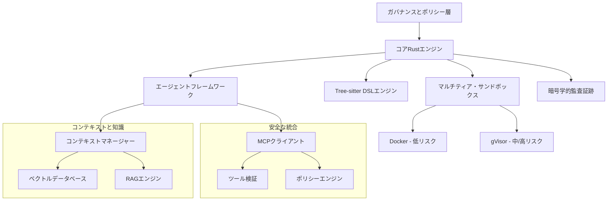

# Symbiont ドキュメント
{: .fs-9 }

自律的でポリシー対応のソフトウェア開発のための、AIネイティブでプライバシーファーストのプログラミング言語とエージェントフレームワーク。
{: .fs-6 .fw-300 }

[今すぐ始める](#getting-started){: .btn .btn-primary .fs-5 .mb-4 .mb-md-0 .mr-2 }
[GitHubで見る](https://github.com/thirdkeyai/symbiont){: .btn .fs-5 .mb-4 .mb-md-0 }

---

## 🌐 他の言語
{: .no_toc}

[English](index.md) | [中文简体](index.zh-cn.md) | [Español](index.es.md) | [Português](index.pt.md) | **日本語** | [Deutsch](index.de.md)

---

## Symbiotとは？

Symbiotはソフトウェア開発の次の進化を表しています — AIエージェントと人間の開発者が安全、透明、効果的に協力する世界です。開発者は、ゼロトラスト・セキュリティ、データプライバシー、検証可能な動作を実施しながら、人間、他のエージェント、大規模言語モデルと安全に協力できる自律的でポリシー対応のエージェントを構築できます。

### 主要機能

- **🛡️ セキュリティファースト設計**: DockerとgVisorによるマルチティア・サンドボックス
- **📋 ポリシー対応プログラミング**: ランタイム実行による宣言的セキュリティポリシー
- **🔐 エンタープライズ機密管理**: HashiCorp Vault統合と暗号化ファイルバックエンド
- **🔑 暗号学的監査可能性**: Ed25519署名による完全な操作ログ
- **🧠 インテリジェント・コンテキスト管理**: ベクトル検索によるRAG強化知識システム
- **🔗 安全なツール統合**: 暗号学的検証によるMCPプロトコル
- **⚡ 高性能**: 本番ワークロード向けRustネイティブ実装

---

## 始めに

### クイックインストール

```bash
# リポジトリをクローン
git clone https://github.com/thirdkeyai/symbiont.git
cd symbiont

# 統合symbiコンテナを構築
docker build -t symbi:latest .

# またはプリビルドコンテナを使用
docker pull ghcr.io/thirdkeyai/symbi:latest

# システムをテスト
cargo test

# 統合CLIをテスト
docker run --rm symbi:latest --version
docker run --rm -v $(pwd):/workspace symbi:latest dsl parse --help
docker run --rm symbi:latest mcp --help
```

### 最初のエージェント

```rust
metadata {
    version = "1.0.0"
    author = "developer"
    description = "Simple analysis agent"
}

agent analyze_data(input: DataSet) -> Result {
    capabilities = ["data_analysis"]
    
    policy secure_analysis {
        allow: read(input) if input.anonymized == true
        deny: store(input) if input.contains_pii == true
        audit: all_operations with signature
    }
    
    with memory = "ephemeral", privacy = "high" {
        if (validate_input(input)) {
            result = process_data(input);
            audit_log("analysis_completed", result.metadata);
            return result;
        } else {
            return reject("Invalid input data");
        }
    }
}
```

---

## アーキテクチャ概要



---

## ユースケース

### 開発と研究
- 安全なコード生成と自動テスト
- マルチエージェント協力実験
- コンテキスト対応AIシステム開発

### プライバシー重要アプリケーション
- プライバシー制御による医療データ処理
- 監査機能による金融サービス自動化
- セキュリティ機能による政府・防衛システム

---

## プロジェクト状況

### ✅ 完了フェーズ
- **フェーズ1-3**: コアインフラ、エージェントフレームワーク、セキュリティ実装
- **フェーズ4**: RAG機能によるコンテキストと知識システム
- **フェーズ5**: ツール検証による安全なMCP統合
- **フェーズ6**: HashiCorp Vault統合によるエンタープライズ機密管理

### 🔮 計画機能
- マルチモーダルRAGサポート（画像、音声、構造化データ）
- エージェント間知識合成と協力
- ポリシー適応による高度学習機能
- パフォーマンス最適化とインテリジェント・キャッシュ
- ブロックチェーン統合による強化監査証跡

---

## コミュニティ

- **ドキュメント**: 包括的なガイドとAPIリファレンス
- [APIリファレンス](api-reference.md)
- [HTTP入力モジュール](http-input.md)
- **課題**: [GitHub Issues](https://github.com/thirdkeyai/symbiont/issues)
- **議論**: [GitHub Discussions](https://github.com/thirdkeyai/symbiont/discussions)
- **ライセンス**: ThirdKeyによるオープンソースソフトウェア

---

## 次のステップ

<div class="grid grid-cols-1 md:grid-cols-3 gap-6 mt-8">
  <div class="card">
    <h3>🚀 開始する</h3>
    <p>入門ガイドに従って、最初のSymbiont環境をセットアップしてください。</p>
    <a href="/getting-started" class="btn btn-outline">クイックスタートガイド</a>
  </div>
  
  <div class="card">
    <h3>📖 DSLを学ぶ</h3>
    <p>ポリシー対応エージェントを構築するためのSymbiont DSLをマスターしてください。</p>
    <a href="/dsl-guide" class="btn btn-outline">DSLドキュメント</a>
  </div>
  
  <div class="card">
    <h3>🏗️ アーキテクチャ</h3>
    <p>ランタイムシステムとセキュリティモデルを理解してください。</p>
    <a href="/runtime-architecture" class="btn btn-outline">アーキテクチャガイド</a>
  </div>
</div>