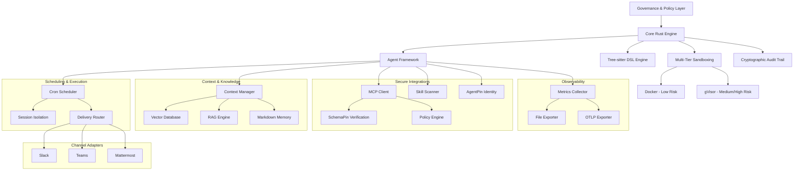

# Symbiont ドキュメント
{: .fs-9 }

スケジューリング、チャネルアダプター、暗号学的アイデンティティを備えた、自律的でポリシー対応のエージェントを構築するためのAIネイティブエージェントフレームワーク -- Rustで構築。
{: .fs-6 .fw-300 }

[今すぐ始める](#getting-started){: .btn .btn-primary .fs-5 .mb-4 .mb-md-0 .mr-2 }
[GitHubで見る](https://github.com/thirdkeyai/symbiont){: .btn .fs-5 .mb-4 .mb-md-0 }

---

## 🌐 他の言語
{: .no_toc}

[English](index.md) | [中文简体](index.zh-cn.md) | [Español](index.es.md) | [Português](index.pt.md) | **日本語** | [Deutsch](index.de.md)

---

## Symbiontとは？

Symbiontは、人間、他のエージェント、大規模言語モデルと安全に協力する自律的でポリシー対応のエージェントを構築するためのAIネイティブエージェントフレームワークです。宣言的DSLとスケジューリングエンジンからマルチプラットフォームのチャネルアダプターと暗号学的アイデンティティ検証まで、完全な本番スタックを提供します -- すべてRustでパフォーマンスと安全性を実現しています。

### 主要機能

- **🛡️ セキュリティファースト設計**: マルチティアサンドボックス、ポリシー実行、暗号学的監査証跡を備えたゼロトラストアーキテクチャ
- **📋 宣言的DSL**: tree-sitterパーシングによるエージェント、ポリシー、スケジュール、チャネル統合を定義するための専用言語
- **📅 本番スケジューリング**: セッション分離、配信ルーティング、デッドレターキュー、ジッターサポートを備えたcronベースのタスク実行
- **💬 チャネルアダプター**: Webhook検証とアイデンティティマッピングによるSlack、Microsoft Teams、Mattermostへのエージェント接続
- **🌐 HTTP入力モジュール**: Bearer/JWT認証、レート制限、CORSを備えた外部統合用Webhookサーバー
- **🔑 AgentPinアイデンティティ**: well-knownエンドポイントに固定されたES256 JWTによる暗号学的エージェントアイデンティティ検証
- **🔐 シークレット管理**: 暗号化ファイルとOSキーチェーンバックエンドを備えたHashiCorp Vault統合
- **🧠 コンテキストと知識**: ベクトル検索（LanceDB組み込みデフォルト、Qdrantオプション）とオプションのローカルエンベディングによるRAG強化知識システム
- **🔗 MCP統合**: SchemaPin暗号学的ツール検証を備えたModel Context Protocolクライアント
- **⚡ マルチ言語SDK**: スケジューリング、チャネル、エンタープライズ機能を含む完全なAPIアクセスのためのJavaScriptとPython SDK
- **🔄 エージェント推論ループ**: ポリシーゲート、サーキットブレーカー、耐久ジャーナル、知識ブリッジを備えた型状態強制のObserve-Reason-Gate-Act（ORGA）サイクル
- **🧪 高度な推論** (`orga-adaptive`): ツールプロファイルフィルタリング、スタックループ検出、決定的コンテキストプリフェッチ、ディレクトリスコープのコンベンション
- **📜 Cedarポリシーエンジン**: きめ細かなアクセス制御のための正式認可言語統合
- **🏗️ 高性能**: 全体を通じた非同期実行により本番ワークロード向けに最適化されたRustネイティブランタイム
- **🤖 AIアシスタントプラグイン**: Cedarポリシー実行、SchemaPin検証、監査証跡を備えた[Claude Code](https://github.com/thirdkeyai/symbi-claude-code)と[Gemini CLI](https://github.com/thirdkeyai/symbi-gemini-cli)向けのファーストパーティガバナンスプラグイン

### プロジェクト初期化（`symbi init`）

プロファイルベースのテンプレートによるインタラクティブなプロジェクトスキャフォールディング。minimal、assistant、dev-agent、multi-agentプロファイルから選択可能。SchemaPin検証モードとサンドボックスティアの設定が可能。ビルド済みのガバナンスエージェントをインポートするためのエージェントカタログを内蔵。CI/CDパイプライン向けに `--no-interact` で非インタラクティブに動作。

### エージェント間通信ガバナンス

すべてのエージェント間ビルトイン（`ask`、`delegate`、`send_to`、`parallel`、`race`）はCommunicationBusを介してポリシー評価付きでルーティングされます。`CommunicationPolicyGate` はエージェント間呼び出しに対するCedarスタイルのルールを実行し、通信可能なエージェントを制御します。優先度ベースのルール評価とポリシー違反時のハード拒否を備えています。メッセージは暗号署名、暗号化、監査されます。

---

## 始めに

### クイックインストール

```bash
# リポジトリをクローン
git clone https://github.com/thirdkeyai/symbiont.git
cd symbiont

# 統合symbiコンテナを構築
docker build -t symbi:latest .

# またはプリビルドコンテナを使用
docker pull ghcr.io/thirdkeyai/symbi:latest

# システムをテスト
cargo test

# 統合CLIをテスト
docker run --rm symbi:latest --version
docker run --rm -v $(pwd):/workspace symbi:latest dsl parse --help
docker run --rm symbi:latest mcp --help
```

### 最初のエージェント

```rust
metadata {
    version = "1.0.0"
    author = "developer"
    description = "Simple analysis agent"
}

agent analyze_data(input: DataSet) -> Result {
    capabilities = ["data_analysis"]

    policy secure_analysis {
        allow: read(input) if input.anonymized == true
        deny: store(input) if input.contains_pii == true
        audit: all_operations with signature
    }

    with memory = "ephemeral", privacy = "high" {
        if (validate_input(input)) {
            result = process_data(input);
            audit_log("analysis_completed", result.metadata);
            return result;
        } else {
            return reject("Invalid input data");
        }
    }
}
```

---

## アーキテクチャ概要


```mermaid
graph TB
    A[Governance & Policy Layer] --> B[Core Rust Engine]
    B --> C[Agent Framework]
    B --> D[Tree-sitter DSL Engine]
    B --> E[Multi-Tier Sandboxing]
    E --> F[Docker - Low Risk]
    E --> G[gVisor - Medium/High Risk]
    B --> I[Cryptographic Audit Trail]

    subgraph "Scheduling & Execution"
        S[Cron Scheduler]
        H[Session Isolation]
        R[Delivery Router]
    end

    subgraph "Channel Adapters"
        SL[Slack]
        TM[Teams]
        MM[Mattermost]
    end

    subgraph "Context & Knowledge"
        J[Context Manager]
        K[Vector Database]
        L[RAG Engine]
        MD[Markdown Memory]
    end

    subgraph "Secure Integrations"
        M[MCP Client]
        N[SchemaPin Verification]
        O[Policy Engine]
        P[AgentPin Identity]
        SK[Skill Scanner]
    end

    subgraph "Observability"
        MET[Metrics Collector]
        FE[File Exporter]
        OT[OTLP Exporter]
    end

    C --> S
    S --> H
    S --> R
    R --> SL
    R --> TM
    R --> MM
    C --> J
    C --> M
    C --> SK
    J --> K
    J --> L
    J --> MD
    M --> N
    M --> O
    C --> P
    C --> MET
    MET --> FE
    MET --> OT
```

---

## ユースケース

### 開発と研究
- 安全なコード生成と自動テスト
- マルチエージェント協力実験
- コンテキスト対応AIシステム開発

### プライバシー重要アプリケーション
- プライバシー制御による医療データ処理
- 監査機能による金融サービス自動化
- セキュリティ機能による政府・防衛システム

---

## プロジェクト状況

### v1.7.1 安定版

Symbiont v1.7.1は最新の安定版リリースであり、本番レベルの機能を備えた完全なAIエージェントフレームワークを提供します：

- **エージェント推論ループ**: マルチターン会話、クラウドおよびSLM推論、サーキットブレーカー、耐久ジャーナル、知識ブリッジを備えた型状態強制のORGAサイクル
- **高度な推論プリミティブ** (`orga-adaptive`): ツールプロファイルフィルタリング、ステップごとのスタックループ検出、決定的コンテキストプリフェッチ、ディレクトリスコープのコンベンション
- **Cedarポリシーエンジン**: Cedarポリシー言語統合による正式認可（`cedar` feature）
- **クラウドLLM推論**: OpenRouter互換のクラウド推論プロバイダー（`cloud-llm` feature）
- **スタンドアロンエージェントモード**: LLMとComposioツールを備えたクラウドネイティブエージェントのワンライナー（`standalone-agent` feature）
- **LanceDB組み込みベクトルバックエンド**: ゼロ設定のベクトル検索 -- LanceDBデフォルト、`vector-qdrant` featureフラグでQdrantオプション
- **コンテキスト圧縮パイプライン**: LLM要約とマルチモデルトークンカウント（OpenAI、Claude、Gemini、Llama、Mistralなど）による階層圧縮
- **ClawHavocスキャナー**: 10の攻撃カテゴリにわたる40の検出ルールと5レベルの重大度モデルおよび実行可能ファイルホワイトリスト
- **Composio MCP統合**: 外部ツールアクセスのためのComposio MCPサーバーへのフィーチャーゲートSSEベース接続
- **永続メモリ**: 事実、手順、学習パターン、保持ベースの圧縮を備えたMarkdownベースのエージェントメモリ
- **Webhook検証**: GitHub、Stripe、Slack、カスタムプリセットによるHMAC-SHA256およびJWT検証
- **HTTPセキュリティ強化**: ループバック専用バインディング、CORS許可リスト、JWT EdDSA検証、ヘルスエンドポイント分離
- **メトリクスとテレメトリ**: コンポジットファンアウト対応のファイルおよびOTLPエクスポーター、OpenTelemetry分散トレーシング
- **スケジューリングエンジン**: セッション分離、配信ルーティング、デッドレターキュー、ジッターを備えたcronベースの実行
- **チャネルアダプター**: Slack（コミュニティ）、Microsoft TeamsおよびMattermost（エンタープライズ）、HMAC署名
- **AgentPinアイデンティティ**: well-knownエンドポイントに固定されたES256 JWTによる暗号学的エージェントアイデンティティ
- **シークレット管理**: HashiCorp Vault、暗号化ファイル、OSキーチェーンバックエンド
- **JavaScript & Python SDK**: スケジューリング、チャネル、Webhook、メモリ、スキル、メトリクスをカバーする完全なAPIクライアント

### 🔮 v1.7.0 ロードマップ
- ~~エージェント間通信ガバナンス~~ ✅ 出荷済み
- ~~プロジェクト初期化（`symbi init`）~~ ✅ 出荷済み
- 外部エージェント統合とA2Aプロトコルサポート
- マルチモーダルRAGサポート（画像、音声、構造化データ）
- 追加チャネルアダプター（Discord、Matrix）

---

## コミュニティ

- **ドキュメント**: 包括的なガイドとAPIリファレンス
  - [APIリファレンス](api-reference.md)
  - [推論ループガイド](reasoning-loop.md)
  - [高度な推論 (orga-adaptive)](orga-adaptive.md)
  - [スケジューリングガイド](scheduling.md)
  - [HTTP入力モジュール](http-input.md)
  - [DSLガイド](dsl-guide.md)
  - [セキュリティモデル](security-model.md)
  - [ランタイムアーキテクチャ](runtime-architecture.md)
- **パッケージ**: [crates.io/crates/symbi](https://crates.io/crates/symbi) | [npm symbiont-sdk-js](https://www.npmjs.com/package/symbiont-sdk-js) | [PyPI symbiont-sdk](https://pypi.org/project/symbiont-sdk/)
- **プラグイン**: [Claude Code](https://github.com/thirdkeyai/symbi-claude-code) | [Gemini CLI](https://github.com/thirdkeyai/symbi-gemini-cli)
- **課題**: [GitHub Issues](https://github.com/thirdkeyai/symbiont/issues)
- **議論**: [GitHub Discussions](https://github.com/thirdkeyai/symbiont/discussions)
- **ライセンス**: ThirdKeyによるオープンソースソフトウェア

---

## 次のステップ

<div class="grid grid-cols-1 md:grid-cols-3 gap-6 mt-8">
  <div class="card">
    <h3>🚀 開始する</h3>
    <p>入門ガイドに従って、最初のSymbiont環境をセットアップしてください。</p>
    <a href="/getting-started" class="btn btn-outline">クイックスタートガイド</a>
  </div>

  <div class="card">
    <h3>📖 DSLを学ぶ</h3>
    <p>ポリシー対応エージェントを構築するためのSymbiont DSLをマスターしてください。</p>
    <a href="/dsl-guide" class="btn btn-outline">DSLドキュメント</a>
  </div>

  <div class="card">
    <h3>🏗️ アーキテクチャ</h3>
    <p>ランタイムシステムとセキュリティモデルを理解してください。</p>
    <a href="/runtime-architecture" class="btn btn-outline">アーキテクチャガイド</a>
  </div>
</div>
