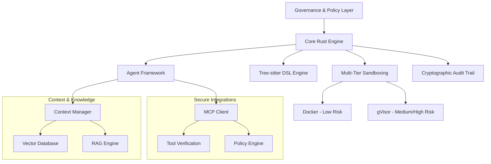

# Symbiont Documentation
{: .fs-9 }

AI-native, privacy-first programming language and agent framework for autonomous, policy-aware software development.
{: .fs-6 .fw-300 }

[Get started now](#getting-started){: .btn .btn-primary .fs-5 .mb-4 .mb-md-0 .mr-2 }
[View on GitHub](https://github.com/thirdkeyai/symbiont){: .btn .fs-5 .mb-4 .mb-md-0 }

---

## What is Symbiont?

Symbiont represents the next evolution in software development — where AI agents and human developers collaborate securely, transparently, and effectively. It enables developers to build autonomous, policy-aware agents that can safely collaborate with humans, other agents, and large language models while enforcing zero-trust security, data privacy, and verifiable behavior.

### Key Features

- **🛡️ Security-First Design**: Multi-tier sandboxing with Docker and gVisor
- **📋 Policy-Aware Programming**: Declarative security policies with runtime enforcement
- **🔐 Cryptographic Auditability**: Complete operation logging with Ed25519 signatures
- **🧠 Intelligent Context Management**: RAG-enhanced knowledge systems with vector search
- **🔗 Secure Tool Integration**: MCP protocol with cryptographic verification
- **⚡ High Performance**: Rust-native implementation for production workloads

---

## Getting Started

### Quick Installation

```bash
# Clone the repository
git clone https://github.com/thirdkeyai/symbiont.git
cd symbiont

# Build DSL container
cd dsl && docker build -t symbiont-dsl:latest .

# Build Runtime container
cd ../runtime && docker build -t symbiont-runtime:latest .

# Test the system
cd ../dsl && cargo test
cd ../runtime && cargo test
```

### Your First Agent

```symbiont
metadata {
    version = "1.0.0"
    author = "developer"
    description = "Simple analysis agent"
}

agent analyze_data(input: DataSet) -> Result {
    capabilities = ["data_analysis"]
    
    policy secure_analysis {
        allow: read(input) if input.anonymized == true
        deny: store(input) if input.contains_pii == true
        audit: all_operations with signature
    }
    
    with memory = "ephemeral", privacy = "high" {
        if (validate_input(input)) {
            result = process_data(input);
            audit_log("analysis_completed", result.metadata);
            return result;
        } else {
            return reject("Invalid input data");
        }
    }
}
```

---

## Architecture Overview



---

## Use Cases

### Development & Research
- Secure code generation and automated testing
- Multi-agent collaboration experiments
- Context-aware AI system development

### Privacy-Critical Applications
- Healthcare data processing with privacy controls
- Financial services automation with audit capabilities
- Government and defense systems with security features

---

## Project Status

### ✅ Completed Phases
- **Phase 1-3**: Core infrastructure, agent framework, and security implementation
- **Phase 4**: Context & knowledge systems with RAG capabilities
- **Phase 5**: Secure MCP integration with tool verification

### 🔮 Planned Features
- Multi-modal RAG support (images, audio, structured data)
- Cross-agent knowledge synthesis
- Advanced learning capabilities
- Performance optimization and intelligent caching

---

## Community

- **Documentation**: Comprehensive guides and API references
- **Issues**: [GitHub Issues](https://github.com/thirdkeyai/symbiont/issues)
- **Discussions**: [GitHub Discussions](https://github.com/thirdkeyai/symbiont/discussions)
- **License**: Open source software by ThirdKey

---

## Next Steps

<div class="grid grid-cols-1 md:grid-cols-3 gap-6 mt-8">
  <div class="card">
    <h3>🚀 Get Started</h3>
    <p>Follow our getting started guide to set up your first Symbiont environment.</p>
    <a href="/getting-started" class="btn btn-outline">Quick Start Guide</a>
  </div>
  
  <div class="card">
    <h3>📖 Learn the DSL</h3>
    <p>Master the Symbiont DSL for building policy-aware agents.</p>
    <a href="/dsl-guide" class="btn btn-outline">DSL Documentation</a>
  </div>
  
  <div class="card">
    <h3>🏗️ Architecture</h3>
    <p>Understand the runtime system and security model.</p>
    <a href="/runtime-architecture" class="btn btn-outline">Architecture Guide</a>
  </div>
</div>