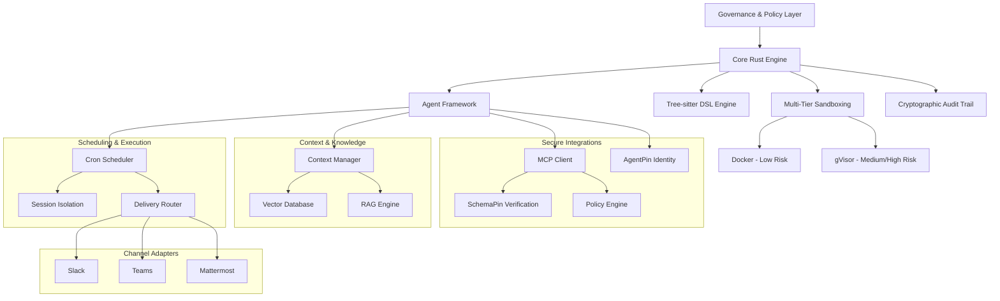

# Symbiont Documentation
{: .fs-9 }

AI-native agent framework for building autonomous, policy-aware agents with scheduling, channel adapters, and cryptographic identity — built in Rust.
{: .fs-6 .fw-300 }

[Get started now](#getting-started){: .btn .btn-primary .fs-5 .mb-4 .mb-md-0 .mr-2 }
[View on GitHub](https://github.com/thirdkeyai/symbiont){: .btn .fs-5 .mb-4 .mb-md-0 }

---

## 🌐 Other Languages
{: .no_toc}

**English** | [中文简体](index.zh-cn.md) | [Español](index.es.md) | [Português](index.pt.md) | [日本語](index.ja.md) | [Deutsch](index.de.md)

---

## What is Symbiont?

Symbiont is an AI-native agent framework for building autonomous, policy-aware agents that safely collaborate with humans, other agents, and large language models. It provides a complete production stack — from a declarative DSL and scheduling engine to multi-platform channel adapters and cryptographic identity verification — all built in Rust for performance and safety.

### Key Features

- **🛡️ Security-First Design**: Zero-trust architecture with multi-tier sandboxing, policy enforcement, and cryptographic audit trails
- **📋 Declarative DSL**: Purpose-built language for defining agents, policies, schedules, and channel integrations with tree-sitter parsing
- **📅 Production Scheduling**: Cron-based task execution with session isolation, delivery routing, dead-letter queues, and jitter support
- **💬 Channel Adapters**: Connect agents to Slack, Microsoft Teams, and Mattermost with webhook verification and identity mapping
- **🌐 HTTP Input Module**: Webhook server for external integrations with Bearer/JWT auth, rate limiting, and CORS
- **🔑 AgentPin Identity**: Cryptographic agent identity verification via ES256 JWTs anchored to well-known endpoints
- **🔐 Secrets Management**: HashiCorp Vault integration with encrypted file and OS keychain backends
- **🧠 Context & Knowledge**: RAG-enhanced knowledge systems with vector search (Qdrant) and optional local embeddings
- **🔗 MCP Integration**: Model Context Protocol client with SchemaPin cryptographic tool verification
- **⚡ Multi-Language SDKs**: JavaScript and Python SDKs for full API access including scheduling, channels, and enterprise features
- **🏗️ High Performance**: Rust-native runtime optimized for production workloads with async execution throughout

---

## Getting Started

### Quick Installation

```bash
# Clone the repository
git clone https://github.com/thirdkeyai/symbiont.git
cd symbiont

# Build unified symbi container
docker build -t symbi:latest .

# Or use pre-built container
docker pull ghcr.io/thirdkeyai/symbi:latest

# Test the system
cargo test

# Test the unified CLI
docker run --rm symbi:latest --version
docker run --rm -v $(pwd):/workspace symbi:latest dsl parse --help
docker run --rm symbi:latest mcp --help
```

### Your First Agent

```rust
metadata {
    version = "1.0.0"
    author = "developer"
    description = "Simple analysis agent"
}

agent analyze_data(input: DataSet) -> Result {
    capabilities = ["data_analysis"]
    
    policy secure_analysis {
        allow: read(input) if input.anonymized == true
        deny: store(input) if input.contains_pii == true
        audit: all_operations with signature
    }
    
    with memory = "ephemeral", privacy = "high" {
        if (validate_input(input)) {
            result = process_data(input);
            audit_log("analysis_completed", result.metadata);
            return result;
        } else {
            return reject("Invalid input data");
        }
    }
}
```

---

## Architecture Overview



---

## Use Cases

### Development & Research
- Secure code generation and automated testing
- Multi-agent collaboration experiments
- Context-aware AI system development

### Privacy-Critical Applications
- Healthcare data processing with privacy controls
- Financial services automation with audit capabilities
- Government and defense systems with security features

---

## Project Status

### v1.0.0 Stable

Symbiont v1.0.0 is the first stable release, delivering a complete AI agent framework with production-grade capabilities:

- **Scheduling Engine**: Cron-based task execution with session isolation, delivery routing, dead-letter queues, jitter, and concurrency limits
- **Channel Adapters**: Slack (community), Microsoft Teams and Mattermost (enterprise) with webhook verification and HMAC signing
- **Channel Management API**: REST endpoints for adapter lifecycle — register, start, stop, health checks, identity mapping, and audit logs
- **HTTP Input Module**: Webhook server for external integrations with Bearer/JWT auth, rate limiting, and CORS
- **DSL Extensions**: `schedule` and `channel` blocks for declarative scheduling and channel configuration
- **AgentPin Identity**: Cryptographic agent identity verification via ES256 JWTs with domain-anchored well-known endpoints
- **Secrets Management**: HashiCorp Vault, encrypted file, and OS keychain backends with runtime provider abstraction
- **Policy Enforcement**: Security and compliance gates with time-window and capability checks
- **JavaScript & Python SDKs**: Full API clients covering scheduling, channels, agents, and enterprise features
- **Observability**: Prometheus-compatible metrics, structured audit events, and health endpoints

### 🔮 Planned Features
- Multi-modal RAG support (images, audio, structured data)
- Cross-agent knowledge synthesis and collaboration
- Federated agent networks with cross-domain trust
- Additional channel adapters (Discord, Matrix)

---

## Community

- **Documentation**: Comprehensive guides and API references
  - [API Reference](api-reference.md)
  - [Scheduling Guide](scheduling.md)
  - [HTTP Input Module](http-input.md)
  - [DSL Guide](dsl-guide.md)
  - [Security Model](security-model.md)
  - [Runtime Architecture](runtime-architecture.md)
- **Packages**: [crates.io/crates/symbi](https://crates.io/crates/symbi) | [npm @symbiont/core](https://www.npmjs.com/package/@symbiont/core) | [PyPI symbiont](https://pypi.org/project/symbiont/)
- **Issues**: [GitHub Issues](https://github.com/thirdkeyai/symbiont/issues)
- **Discussions**: [GitHub Discussions](https://github.com/thirdkeyai/symbiont/discussions)
- **License**: Open source software by ThirdKey

---

## Next Steps

<div class="grid grid-cols-1 md:grid-cols-3 gap-6 mt-8">
  <div class="card">
    <h3>🚀 Get Started</h3>
    <p>Follow our getting started guide to set up your first Symbiont environment.</p>
    <a href="/getting-started" class="btn btn-outline">Quick Start Guide</a>
  </div>
  
  <div class="card">
    <h3>📖 Learn the DSL</h3>
    <p>Master the Symbiont DSL for building policy-aware agents.</p>
    <a href="/dsl-guide" class="btn btn-outline">DSL Documentation</a>
  </div>
  
  <div class="card">
    <h3>🏗️ Architecture</h3>
    <p>Understand the runtime system and security model.</p>
    <a href="/runtime-architecture" class="btn btn-outline">Architecture Guide</a>
  </div>
</div>