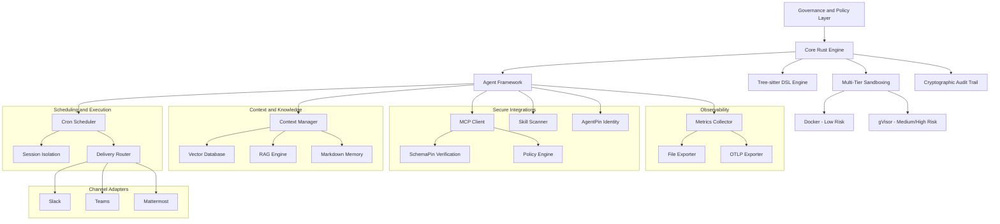

# Symbiont Documentation

AI-native agent framework for building autonomous, policy-aware agents with scheduling, channel adapters, and cryptographic identity — built in Rust.

## What is Symbiont?

Symbiont is an AI-native agent framework for building autonomous, policy-aware agents that safely collaborate with humans, other agents, and large language models. It provides a complete production stack — from a declarative DSL and scheduling engine to multi-platform channel adapters and cryptographic identity verification — all built in Rust for performance and safety.

### Key Features

- **🛡️ Security-First Design**: Zero-trust architecture with multi-tier sandboxing, policy enforcement, and cryptographic audit trails
- **📋 Declarative DSL**: Purpose-built language for defining agents, policies, schedules, and channel integrations with tree-sitter parsing
- **📅 Production Scheduling**: Cron-based task execution with session isolation, delivery routing, dead-letter queues, and jitter support
- **💬 Channel Adapters**: Connect agents to Slack, Microsoft Teams, and Mattermost with webhook verification and identity mapping
- **🌐 HTTP Input Module**: Webhook server for external integrations with Bearer/JWT auth, rate limiting, and CORS
- **🔑 AgentPin Identity**: Cryptographic agent identity verification via ES256 JWTs anchored to well-known endpoints
- **🔐 Secrets Management**: HashiCorp Vault integration with encrypted file and OS keychain backends
- **🧠 Context & Knowledge**: RAG-enhanced knowledge systems with vector search (LanceDB embedded default, Qdrant optional) and optional local embeddings
- **🔗 MCP Integration**: Model Context Protocol client with SchemaPin cryptographic tool verification
- **⚡ Multi-Language SDKs**: JavaScript and Python SDKs for full API access including scheduling, channels, and enterprise features
- **🔄 Agentic Reasoning Loop**: Typestate-enforced Observe-Reason-Gate-Act (ORGA) cycle with policy gates, circuit breakers, durable journal, and knowledge bridge
- **🧪 Advanced Reasoning** (`orga-adaptive`): Tool profile filtering, stuck-loop detection, deterministic context pre-fetch, and directory-scoped conventions
- **📜 Cedar Policy Engine**: Formal authorization language integration for fine-grained access control (requires `cedar` feature flag: `cargo build --features cedar`)
- **🏗️ High Performance**: Rust-native runtime optimized for production workloads with async execution throughout
- **🤖 AI Assistant Plugins**: First-party governance plugins for [Claude Code](https://github.com/thirdkeyai/symbi-claude-code) and [Gemini CLI](https://github.com/thirdkeyai/symbi-gemini-cli) with Cedar policy enforcement, SchemaPin verification, and audit trails

### Project Initialization (`symbi init`)

Interactive project scaffolding with profile-based templates. Choose from minimal, assistant, dev-agent, or multi-agent profiles. Configurable SchemaPin verification mode and sandbox tiers. Includes a built-in agent catalog for importing pre-built governed agents. Works non-interactively for CI/CD pipelines with `--no-interact`.

### Single Agent Execution (`symbi run`)

Run any agent directly from the CLI without starting the full runtime:

```bash
symbi run recon --input '{"target": "10.0.1.5"}'
```

Loads the agent DSL, sets up the ORGA reasoning loop with cloud inference, executes, prints results, and exits. Resolves agent names from `agents/` directory automatically.

### Inter-Agent Communication Governance

All inter-agent builtins (`ask`, `delegate`, `send_to`, `parallel`, `race`) are routed through the CommunicationBus with policy evaluation. The `CommunicationPolicyGate` enforces Cedar-style rules for inter-agent calls — controlling which agents can communicate, with priority-based rule evaluation and hard deny on policy violations. Messages are cryptographically signed, encrypted, and audited.

---

## Getting Started

### Quick Installation

**Homebrew (macOS):**
```bash
brew tap thirdkeyai/tap
brew install symbi
```

**Install script (macOS / Linux):**
```bash
curl -fsSL https://raw.githubusercontent.com/thirdkeyai/symbiont/main/scripts/install.sh | bash
```

You can also download pre-built binaries from [GitHub Releases](https://github.com/thirdkeyai/symbiont/releases). See the [Getting Started guide](/getting-started) for Docker and source install options.

**Docker:**
```bash
docker pull ghcr.io/thirdkeyai/symbi:latest
docker run --rm symbi:latest --version
```

**From source:**
```bash
git clone https://github.com/thirdkeyai/symbiont.git
cd symbiont
cargo build --release
```

### Your First Agent

```rust
metadata {
    version = "1.0.0"
    author = "developer"
    description = "Simple analysis agent"
}

agent analyze_data(input: DataSet) -> Result {
    capabilities = ["data_analysis"]
    
    policy secure_analysis {
        allow: read(input) if input.anonymized == true
        deny: store(input) if input.contains_pii == true
        audit: all_operations with signature
    }
    
    with memory = "ephemeral", privacy = "high" {
        if (validate_input(input)) {
            result = process_data(input);
            audit_log("analysis_completed", result.metadata);
            return result;
        } else {
            return reject("Invalid input data");
        }
    }
}
```

---

## Architecture Overview


```mermaid
graph TB
    A[Governance and Policy Layer] --> B[Core Rust Engine]
    B --> C[Agent Framework]
    B --> D[Tree-sitter DSL Engine]
    B --> E[Multi-Tier Sandboxing]
    E --> F[Docker - Low Risk]
    E --> G[gVisor - Medium/High Risk]
    B --> I[Cryptographic Audit Trail]

    subgraph "Scheduling and Execution"
        S[Cron Scheduler]
        H[Session Isolation]
        R[Delivery Router]
    end

    subgraph "Channel Adapters"
        SL[Slack]
        TM[Teams]
        MM[Mattermost]
    end

    subgraph "Context and Knowledge"
        J[Context Manager]
        K[Vector Database]
        L[RAG Engine]
        MD[Markdown Memory]
    end

    subgraph "Secure Integrations"
        M[MCP Client]
        N[SchemaPin Verification]
        O[Policy Engine]
        P[AgentPin Identity]
        SK[Skill Scanner]
    end

    subgraph "Observability"
        MET[Metrics Collector]
        FE[File Exporter]
        OT[OTLP Exporter]
    end

    C --> S
    S --> H
    S --> R
    R --> SL
    R --> TM
    R --> MM
    C --> J
    C --> M
    C --> SK
    J --> K
    J --> L
    J --> MD
    M --> N
    M --> O
    C --> P
    C --> MET
    MET --> FE
    MET --> OT
```

---

## Use Cases

### Development & Research
- Secure code generation and automated testing
- Multi-agent collaboration experiments
- Context-aware AI system development

### Privacy-Critical Applications
- Healthcare data processing with privacy controls
- Financial services automation with audit capabilities
- Government and defense systems with security features

---

## Project Status

### v1.9.0 Stable

Symbiont v1.9.0 is the latest stable release, delivering a complete AI agent framework with production-grade capabilities:

- **ToolClad Integration**: Declarative tool contracts with manifest loading, argument validation, HTTP/MCP proxy backends, secrets injection, and session/browser executors
- **`symbi tools` CLI**: Scope enforcement, Cedar policy generation, and hot-reload file watcher for ToolClad manifests
- **Production Hardening**: Bounded channels, health probes, secrets TTL, Cedar policy reload, audit export, and rate limiting
- **Security Fixes**: Critical DoS vector mitigation, JWT validation hardening, environment variable leakage prevention, and sandbox guard improvements
- **W3C Traceparent Propagation**: OpenTelemetry distributed trace context propagation across agent boundaries
- **Agentic Reasoning Loop**: Typestate-enforced ORGA cycle with multi-turn conversation, cloud and SLM inference, circuit breakers, durable journal, and knowledge bridge
- **Advanced Reasoning Primitives** (`orga-adaptive`): Tool profile filtering, per-step stuck-loop detection, deterministic context pre-fetch, and directory-scoped conventions
- **Cedar Policy Engine**: Formal authorization via Cedar policy language integration (`cedar` feature)
- **Cloud LLM Inference**: OpenRouter-compatible cloud inference provider (`cloud-llm` feature)
- **Standalone Agent Mode**: One-liner for cloud-native agents with LLM + Composio tools (`standalone-agent` feature)
- **LanceDB Embedded Vector Backend**: Zero-config vector search — LanceDB default, Qdrant optional via `vector-qdrant` feature flag
- **Context Compaction Pipeline**: Tiered compaction with LLM summarization and multi-model token counting (OpenAI, Claude, Gemini, Llama, Mistral, and more)
- **ClawHavoc Scanner**: 40 detection rules across 10 attack categories with 5-level severity model and executable whitelisting
- **Composio MCP Integration**: Feature-gated SSE-based connection to Composio MCP server for external tool access
- **Persistent Memory**: Markdown-backed agent memory with facts, procedures, learned patterns, and retention-based compaction
- **Webhook Verification**: HMAC-SHA256 and JWT verification with GitHub, Stripe, Slack, and custom presets
- **HTTP Security Hardening**: Loopback-only binding, CORS allow-lists, JWT EdDSA validation, health endpoint separation
- **Metrics & Telemetry**: File and OTLP exporters with composite fan-out, OpenTelemetry distributed tracing
- **Scheduling Engine**: Cron-based execution with session isolation, delivery routing, dead-letter queues, and jitter
- **Channel Adapters**: Slack (community), Microsoft Teams and Mattermost (enterprise) with HMAC signing
- **AgentPin Identity**: Cryptographic agent identity via ES256 JWTs anchored to well-known endpoints
- **Secrets Management**: HashiCorp Vault, encrypted file, and OS keychain backends
- **JavaScript & Python SDKs**: Full API clients covering scheduling, channels, webhooks, memory, skills, and metrics

---

## Community

- **Documentation**: Comprehensive guides and API references
  - [API Reference](api-reference.md)
  - [Reasoning Loop Guide](reasoning-loop.md)
  - [Advanced Reasoning (orga-adaptive)](orga-adaptive.md)
  - [Scheduling Guide](scheduling.md)
  - [HTTP Input Module](http-input.md)
  - [DSL Guide](dsl-guide.md)
  - [Security Model](security-model.md)
  - [Runtime Architecture](runtime-architecture.md)
- **Packages**: [crates.io/crates/symbi](https://crates.io/crates/symbi) | [npm symbiont-sdk-js](https://www.npmjs.com/package/symbiont-sdk-js) | [PyPI symbiont-sdk](https://pypi.org/project/symbiont-sdk/)
- **Plugins**: [Claude Code](https://github.com/thirdkeyai/symbi-claude-code) | [Gemini CLI](https://github.com/thirdkeyai/symbi-gemini-cli)
- **Issues**: [GitHub Issues](https://github.com/thirdkeyai/symbiont/issues)
- **License**: Open source software by ThirdKey

---

## Next Steps

<div class="grid grid-cols-1 md:grid-cols-3 gap-6 mt-8">
  <div class="card">
    <h3>🚀 Get Started</h3>
    <p>Follow our getting started guide to set up your first Symbiont environment.</p>
    <a href="/getting-started" class="btn btn-outline">Quick Start Guide</a>
  </div>
  
  <div class="card">
    <h3>📖 Learn the DSL</h3>
    <p>Master the Symbiont DSL for building policy-aware agents.</p>
    <a href="/dsl-guide" class="btn btn-outline">DSL Documentation</a>
  </div>
  
  <div class="card">
    <h3>🏗️ Architecture</h3>
    <p>Understand the runtime system and security model.</p>
    <a href="/runtime-architecture" class="btn btn-outline">Architecture Guide</a>
  </div>
</div>