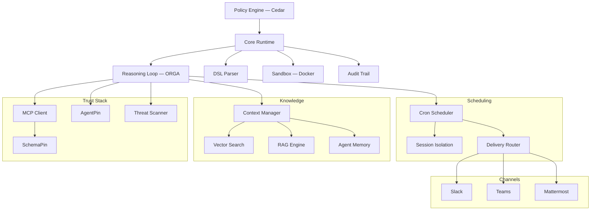

# Symbiont Documentation

Policy-governed agent runtime for production. Execute AI agents and tools under explicit policy, identity, and audit controls.

## What is Symbiont?

Symbiont is a Rust-native runtime for executing AI agents and tools under explicit policy, identity, and audit controls.

Most agent frameworks focus on orchestration. Symbiont focuses on what happens when agents need to run in real environments with real risk: untrusted tools, sensitive data, approval boundaries, audit requirements, and repeatable enforcement.

### How it works

Symbiont separates agent intent from execution authority:

1. **Agents propose** actions through the reasoning loop (Observe-Reason-Gate-Act)
2. **The runtime evaluates** each action against policy, identity, and trust checks
3. **Policy decides** — allowed actions execute; denied actions are blocked or routed for approval
4. **Everything is logged** — tamper-evident audit trail for every decision

Model output is never treated as execution authority. The runtime controls what actually happens.

### Core capabilities

| Capability | What it does |
|-----------|-------------|
| **Policy engine** | Fine-grained [Cedar](https://www.cedarpolicy.com/) authorization for agent actions, tool calls, and resource access |
| **Tool verification** | [SchemaPin](https://schemapin.org) cryptographic verification of MCP tool schemas before execution |
| **Agent identity** | [AgentPin](https://agentpin.org) domain-anchored ES256 identity for agents and scheduled tasks |
| **Reasoning loop** | Typestate-enforced Observe-Reason-Gate-Act cycle with policy gates and circuit breakers |
| **Sandboxing** | Docker-based isolation with resource limits for untrusted workloads |
| **Audit logging** | Tamper-evident logs with structured records for every policy decision |
| **Secrets management** | Vault/OpenBao integration, AES-256-GCM encrypted storage, scoped per agent |
| **MCP integration** | Native Model Context Protocol support with governed tool access |

Additional capabilities: threat scanning for tool/skill content, cron scheduling, persistent agent memory, hybrid RAG search (LanceDB/Qdrant), webhook verification, delivery routing, OTLP telemetry, HTTP security hardening, channel adapters (Slack/Teams/Mattermost), and governance plugins for [Claude Code](https://github.com/thirdkeyai/symbi-claude-code) and [Gemini CLI](https://github.com/thirdkeyai/symbi-gemini-cli).

---

## Quick start

### Scaffold and run a project (Docker, ~60 seconds)

```bash
# 1. Create the project. Generates symbiont.toml, agents/, policies/,
#    docker-compose.yml, and a .env with a freshly generated SYMBIONT_MASTER_KEY.
docker run --rm -v $(pwd):/workspace ghcr.io/thirdkeyai/symbi:latest \
  init --profile assistant --no-interact --dir /workspace

# 2. Start the runtime. Reads .env automatically.
docker compose up
```

Runtime API on `http://localhost:8080`, HTTP Input on `http://localhost:8081`.

### Installation (without Docker)

**Install script (macOS / Linux):**
```bash
curl -fsSL https://symbiont.dev/install.sh | bash
```

**Homebrew (macOS):**
```bash
brew tap thirdkeyai/tap
brew install symbi
```

**From source:**
```bash
git clone https://github.com/thirdkeyai/symbiont.git
cd symbiont
cargo build --release
```

Pre-built binaries are also available from [GitHub Releases](https://github.com/thirdkeyai/symbiont/releases). See the [Getting Started guide](/getting-started) for full details.

### Your first agent

```symbiont
agent secure_analyst(input: DataSet) -> Result {
    policy access_control {
        allow: read(input) if input.verified == true
        deny: send_email without approval
        audit: all_operations
    }

    with memory = "persistent", requires = "approval" {
        result = analyze(input);
        return result;
    }
}
```

See the [DSL guide](/dsl-guide) for the full grammar including `metadata`, `schedule`, `webhook`, and `channel` blocks.

### Project scaffolding

```bash
symbi init        # Interactive project setup — writes symbiont.toml, agents/,
                  # policies/, docker-compose.yml, and a .env with a generated
                  # SYMBIONT_MASTER_KEY. Pass --dir <PATH> to target a specific
                  # directory (required when running inside a container).
symbi run agent   # Run a single agent without starting the full runtime
symbi up          # Start the full runtime with auto-configuration
symbi shell       # Interactive agent orchestration shell (Beta) — see below
```

### Interactive shell (Beta)

`symbi shell` is a ratatui-based terminal UI for authoring agents, tools, and policies with LLM assistance, orchestrating multi-agent patterns (`/chain`, `/parallel`, `/race`, `/debate`), managing schedules and channels, and attaching to remote runtimes. Status is **beta** — the command surface and persistence formats may still shift between minor releases. See the [Symbi Shell guide](/symbi-shell).

### Deploying single agents (Beta)

The shell's `/deploy` command packages the active agent and ships it to Docker (`/deploy local`), Google Cloud Run (`/deploy cloudrun`), or AWS App Runner (`/deploy aws`). The OSS stack is single-agent; multi-agent topologies compose via cross-instance messaging. See [Symbi Shell — Deployment](/symbi-shell#deployment-beta).

---

## Architecture


```mermaid
graph TB
    A[Policy Engine — Cedar] --> B[Core Runtime]
    B --> C[Reasoning Loop — ORGA]
    B --> D[DSL Parser]
    B --> E[Sandbox — Docker]
    B --> I[Audit Trail]

    subgraph "Scheduling"
        S[Cron Scheduler]
        H[Session Isolation]
        R[Delivery Router]
    end

    subgraph "Channels"
        SL[Slack]
        TM[Teams]
        MM[Mattermost]
    end

    subgraph "Knowledge"
        J[Context Manager]
        K[Vector Search]
        L[RAG Engine]
        MD[Agent Memory]
    end

    subgraph "Trust Stack"
        M[MCP Client]
        N[SchemaPin]
        O[AgentPin]
        SK[Threat Scanner]
    end

    C --> S
    S --> H
    S --> R
    R --> SL
    R --> TM
    R --> MM
    C --> J
    C --> M
    J --> K
    J --> L
    J --> MD
    M --> N
    C --> O
    C --> SK
```

---

## Security model

Symbiont is designed around a simple principle: **model output should never be trusted as execution authority.**

Actions flow through runtime controls:

- **Zero trust** — all agent inputs are untrusted by default
- **Policy checks** — Cedar authorization before every tool call and resource access
- **Tool verification** — SchemaPin cryptographic verification of tool schemas
- **Sandbox boundaries** — Docker isolation for untrusted execution
- **Operator approval** — human review gates for sensitive actions
- **Secrets control** — Vault/OpenBao backends, encrypted local storage, agent namespaces
- **Audit logging** — cryptographically tamper-evident records of every decision

See the [Security Model](/security-model) guide for full details.

---

## Guides

- [Getting Started](/getting-started) — Installation, configuration, first agent
- [Symbi Shell](/symbi-shell) (Beta) — Interactive TUI for authoring, orchestration, and remote attach
- [Security Model](/security-model) — Zero-trust architecture, policy enforcement
- [Runtime Architecture](/runtime-architecture) — Runtime internals and execution model
- [Reasoning Loop](/reasoning-loop) — ORGA cycle, policy gates, circuit breakers
- [DSL Guide](/dsl-guide) — Agent definition language reference
- [ToolClad](/toolclad) — Declarative tool contracts, argument validation, scope enforcement
- [API Reference](/api-reference) — HTTP API endpoints and configuration
- [Scheduling](/scheduling) — Cron engine, delivery routing, dead-letter queues
- [HTTP Input](/http-input) — Webhook server, auth, rate limiting

---

## Community and resources

- **Packages**: [crates.io/crates/symbi](https://crates.io/crates/symbi) | [npm symbiont-sdk-js](https://www.npmjs.com/package/symbiont-sdk-js) | [PyPI symbiont-sdk](https://pypi.org/project/symbiont-sdk/)
- **SDKs**: [JavaScript/TypeScript](https://github.com/ThirdKeyAI/symbiont-sdk-js) | [Python](https://github.com/ThirdKeyAI/symbiont-sdk-python)
- **Plugins**: [Claude Code](https://github.com/thirdkeyai/symbi-claude-code) | [Gemini CLI](https://github.com/thirdkeyai/symbi-gemini-cli)
- **Issues**: [GitHub Issues](https://github.com/thirdkeyai/symbiont/issues)
- **License**: Apache 2.0 (Community Edition)

---

## Next steps

<div class="grid grid-cols-1 md:grid-cols-3 gap-6 mt-8">
  <div class="card">
    <h3>Get Started</h3>
    <p>Install Symbiont and run your first governed agent.</p>
    <a href="/getting-started" class="btn btn-outline">Quick Start Guide</a>
  </div>

  <div class="card">
    <h3>Security Model</h3>
    <p>Understand the trust boundaries and policy enforcement.</p>
    <a href="/security-model" class="btn btn-outline">Security Guide</a>
  </div>

  <div class="card">
    <h3>DSL Reference</h3>
    <p>Learn the agent definition language.</p>
    <a href="/dsl-guide" class="btn btn-outline">DSL Guide</a>
  </div>
</div>
