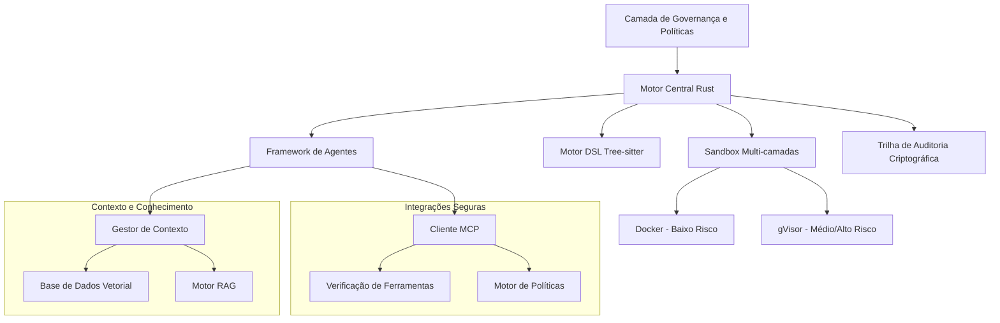

# Documentação do Symbiont
{: .fs-9 }

Linguagem de programação nativa de IA e framework de agentes com privacidade em primeiro lugar para desenvolvimento de software autônomo e consciente de políticas.
{: .fs-6 .fw-300 }

[Começar agora](#getting-started){: .btn .btn-primary .fs-5 .mb-4 .mb-md-0 .mr-2 }
[Ver no GitHub](https://github.com/thirdkeyai/symbiont){: .btn .fs-5 .mb-4 .mb-md-0 }

---

## 🌐 Outros idiomas
{: .no_toc}

[English](index.md) | [中文简体](index.zh-cn.md) | [Español](index.es.md) | **Português** | [日本語](index.ja.md) | [Deutsch](index.de.md)

---

## O que é o Symbiont?

O Symbiont representa a próxima evolução no desenvolvimento de software — onde agentes de IA e desenvolvedores humanos colaboram de forma segura, transparente e eficaz. Ele permite que desenvolvedores construam agentes autônomos e conscientes de políticas que podem colaborar com segurança com humanos, outros agentes e modelos de linguagem grandes, enquanto aplicam segurança de confiança zero, privacidade de dados e comportamento verificável.

### Principais Características

- **🛡️ Design Focado em Segurança**: Sandbox multi-camadas com Docker e gVisor
- **📋 Programação Consciente de Políticas**: Políticas de segurança declarativas com aplicação em tempo de execução
- **🔐 Gestão de Segredos Empresariais**: Integração com HashiCorp Vault e backends de arquivos criptografados
- **🔑 Auditabilidade Criptográfica**: Log completo de operações com assinaturas Ed25519
- **🧠 Gestão Inteligente de Contexto**: Sistemas de conhecimento aprimorados com RAG e busca vetorial
- **🔗 Integração Segura de Ferramentas**: Protocolo MCP com verificação criptográfica
- **⚡ Alto Desempenho**: Implementação nativa em Rust para cargas de trabalho de produção

---

## Primeiros Passos

### Instalação Rápida

```bash
# Clonar o repositório
git clone https://github.com/thirdkeyai/symbiont.git
cd symbiont

# Construir container symbi unificado
docker build -t symbi:latest .

# Ou usar container pré-construído
docker pull ghcr.io/thirdkeyai/symbi:latest

# Testar o sistema
cargo test

# Testar o CLI unificado
docker run --rm symbi:latest --version
docker run --rm -v $(pwd):/workspace symbi:latest dsl parse --help
docker run --rm symbi:latest mcp --help
```

### Seu Primeiro Agente

```rust
metadata {
    version = "1.0.0"
    author = "developer"
    description = "Simple analysis agent"
}

agent analyze_data(input: DataSet) -> Result {
    capabilities = ["data_analysis"]
    
    policy secure_analysis {
        allow: read(input) if input.anonymized == true
        deny: store(input) if input.contains_pii == true
        audit: all_operations with signature
    }
    
    with memory = "ephemeral", privacy = "high" {
        if (validate_input(input)) {
            result = process_data(input);
            audit_log("analysis_completed", result.metadata);
            return result;
        } else {
            return reject("Invalid input data");
        }
    }
}
```

---

## Visão Geral da Arquitetura



---

## Casos de Uso

### Desenvolvimento e Pesquisa
- Geração segura de código e testes automatizados
- Experimentos de colaboração multi-agente
- Desenvolvimento de sistemas de IA conscientes do contexto

### Aplicações Críticas de Privacidade
- Processamento de dados de saúde com controles de privacidade
- Automação de serviços financeiros com capacidades de auditoria
- Sistemas governamentais e de defesa com recursos de segurança

---

## Status do Projeto

### ✅ Fases Concluídas
- **Fase 1-3**: Infraestrutura central, framework de agentes e implementação de segurança
- **Fase 4**: Sistemas de contexto e conhecimento com capacidades RAG
- **Fase 5**: Integração MCP segura com verificação de ferramentas
- **Fase 6**: Gestão de segredos empresariais com integração HashiCorp Vault

### 🔮 Recursos Planejados
- Suporte RAG multi-modal (imagens, áudio, dados estruturados)
- Síntese de conhecimento e colaboração entre agentes
- Capacidades de aprendizagem avançadas com adaptação de políticas
- Otimização de desempenho e cache inteligente
- Trilhas de auditoria aprimoradas com integração blockchain

---

## Comunidade

- **Documentação**: Guias abrangentes e referências de API
- [Referência da API](api-reference.md)
- [Módulo de Entrada HTTP](http-input.md)
- **Problemas**: [GitHub Issues](https://github.com/thirdkeyai/symbiont/issues)
- **Discussões**: [GitHub Discussions](https://github.com/thirdkeyai/symbiont/discussions)
- **Licença**: Software de código aberto da ThirdKey

---

## Próximos Passos

<div class="grid grid-cols-1 md:grid-cols-3 gap-6 mt-8">
  <div class="card">
    <h3>🚀 Começar</h3>
    <p>Siga nosso guia de introdução para configurar seu primeiro ambiente Symbiont.</p>
    <a href="/getting-started" class="btn btn-outline">Guia de Início Rápido</a>
  </div>
  
  <div class="card">
    <h3>📖 Aprender o DSL</h3>
    <p>Domine o DSL do Symbiont para construir agentes conscientes de políticas.</p>
    <a href="/dsl-guide" class="btn btn-outline">Documentação DSL</a>
  </div>
  
  <div class="card">
    <h3>🏗️ Arquitetura</h3>
    <p>Compreenda o sistema de tempo de execução e o modelo de segurança.</p>
    <a href="/runtime-architecture" class="btn btn-outline">Guia de Arquitetura</a>
  </div>
</div>