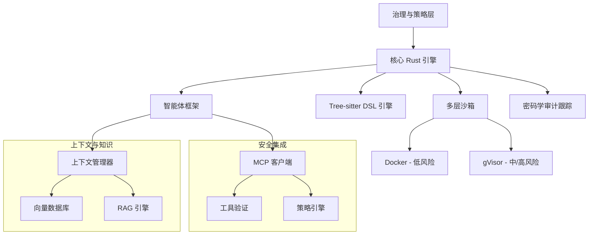

# Symbiont 文档
{: .fs-9 }

AI原生、隐私优先的编程语言和智能体框架，用于自主、策略感知的软件开发。
{: .fs-6 .fw-300 }

[立即开始](#getting-started){: .btn .btn-primary .fs-5 .mb-4 .mb-md-0 .mr-2 }
[在 GitHub 查看](https://github.com/thirdkeyai/symbiont){: .btn .fs-5 .mb-4 .mb-md-0 }

---

## 🌐 其他语言
{: .no_toc}

[English](index.md) | **中文简体** | [Español](index.es.md) | [Português](index.pt.md) | [日本語](index.ja.md) | [Deutsch](index.de.md)

---

## 什么是 Symbiont？

Symbiont 代表了软件开发的下一次进化——AI智能体和人类开发者安全、透明、有效地协作。它使开发者能够构建自主的、策略感知的智能体，这些智能体可以安全地与人类、其他智能体和大型语言模型协作，同时执行零信任安全、数据隐私和可验证行为。

### 主要特性

- **🛡️ 安全优先设计**：使用 Docker 和 gVisor 的多层沙箱
- **📋 策略感知编程**：声明式安全策略与运行时执行
- **🔐 企业密钥管理**：HashiCorp Vault 集成和加密文件后端
- **🔑 密码学可审计性**：使用 Ed25519 签名的完整操作日志记录
- **🧠 智能上下文管理**：带向量搜索的 RAG 增强知识系统
- **🔗 安全工具集成**：带密码学验证的 MCP 协议
- **⚡ 高性能**：面向生产工作负载的 Rust 原生实现

---

## 快速开始

### 快速安装

```bash
# 克隆仓库
git clone https://github.com/thirdkeyai/symbiont.git
cd symbiont

# 构建统一的 symbi 容器
docker build -t symbi:latest .

# 或使用预构建的容器
docker pull ghcr.io/thirdkeyai/symbi:latest

# 测试系统
cargo test

# 测试统一的 CLI
docker run --rm symbi:latest --version
docker run --rm -v $(pwd):/workspace symbi:latest dsl parse --help
docker run --rm symbi:latest mcp --help
```

### 您的第一个智能体

```rust
metadata {
    version = "1.0.0"
    author = "developer"
    description = "Simple analysis agent"
}

agent analyze_data(input: DataSet) -> Result {
    capabilities = ["data_analysis"]
    
    policy secure_analysis {
        allow: read(input) if input.anonymized == true
        deny: store(input) if input.contains_pii == true
        audit: all_operations with signature
    }
    
    with memory = "ephemeral", privacy = "high" {
        if (validate_input(input)) {
            result = process_data(input);
            audit_log("analysis_completed", result.metadata);
            return result;
        } else {
            return reject("Invalid input data");
        }
    }
}
```

---

## 架构概览



---

## 使用场景

### 开发与研究
- 安全代码生成和自动化测试
- 多智能体协作实验
- 上下文感知AI系统开发

### 隐私关键应用
- 带隐私控制的医疗数据处理
- 带审计能力的金融服务自动化
- 带安全功能的政府和国防系统

---

## 项目状态

### ✅ 已完成阶段
- **阶段 1-3**：核心基础设施、智能体框架和安全实现
- **阶段 4**：带 RAG 能力的上下文和知识系统
- **阶段 5**：带工具验证的安全 MCP 集成
- **阶段 6**：带 HashiCorp Vault 集成的企业密钥管理

### 🔮 计划功能
- 多模态 RAG 支持（图像、音频、结构化数据）
- 跨智能体知识综合与协作
- 带策略适应的高级学习能力
- 性能优化和智能缓存
- 带区块链集成的增强审计跟踪

---

## 社区

- **文档**：全面的指南和 API 参考
- [API 参考](api-reference.md)
- [HTTP 输入模块](http-input.md)
- **问题**：[GitHub Issues](https://github.com/thirdkeyai/symbiont/issues)
- **讨论**：[GitHub Discussions](https://github.com/thirdkeyai/symbiont/discussions)
- **许可证**：ThirdKey 开源软件

---

## 下一步

<div class="grid grid-cols-1 md:grid-cols-3 gap-6 mt-8">
  <div class="card">
    <h3>🚀 开始使用</h3>
    <p>按照我们的入门指南设置您的第一个 Symbiont 环境。</p>
    <a href="/getting-started" class="btn btn-outline">快速开始指南</a>
  </div>
  
  <div class="card">
    <h3>📖 学习 DSL</h3>
    <p>掌握 Symbiont DSL 以构建策略感知的智能体。</p>
    <a href="/dsl-guide" class="btn btn-outline">DSL 文档</a>
  </div>
  
  <div class="card">
    <h3>🏗️ 架构</h3>
    <p>了解运行时系统和安全模型。</p>
    <a href="/runtime-architecture" class="btn btn-outline">架构指南</a>
  </div>
</div>