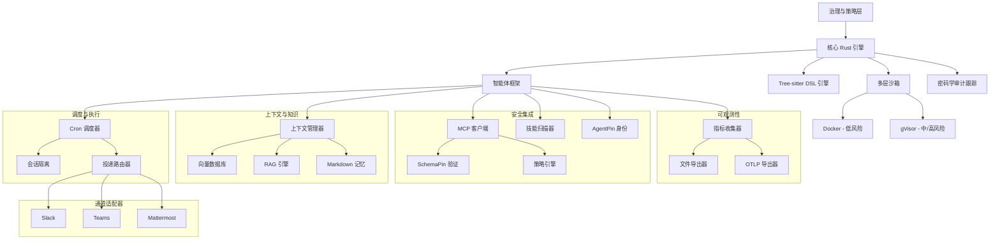

# Symbiont 文档
{: .fs-9 }

AI原生智能体框架，用于构建具有调度、通道适配器和密码学身份的自主、策略感知智能体——使用 Rust 构建。
{: .fs-6 .fw-300 }

[立即开始](#getting-started){: .btn .btn-primary .fs-5 .mb-4 .mb-md-0 .mr-2 }
[在 GitHub 查看](https://github.com/thirdkeyai/symbiont){: .btn .fs-5 .mb-4 .mb-md-0 }

---

## 🌐 其他语言
{: .no_toc}

[English](index.md) | **中文简体** | [Español](index.es.md) | [Português](index.pt.md) | [日本語](index.ja.md) | [Deutsch](index.de.md)

---

## 什么是 Symbiont？

Symbiont 是一个 AI 原生智能体框架，用于构建自主、策略感知的智能体，使其与人类、其他智能体和大型语言模型安全协作。它提供完整的生产级技术栈——从声明式 DSL 和调度引擎到多平台通道适配器和密码学身份验证——全部使用 Rust 构建，以确保性能和安全性。

### 主要特性

- **🛡️ 安全优先设计**：零信任架构，支持多层沙箱、策略执行和密码学审计轨迹
- **📋 声明式 DSL**：专用语言，支持定义智能体、策略、调度和通道集成，使用 tree-sitter 解析
- **📅 生产级调度**：基于 cron 的任务执行，支持会话隔离、投递路由、死信队列和抖动支持
- **💬 通道适配器**：将智能体连接到 Slack、Microsoft Teams 和 Mattermost，支持 webhook 验证和身份映射
- **🌐 HTTP 输入模块**：用于外部集成的 Webhook 服务器，支持 Bearer/JWT 身份验证、速率限制和 CORS
- **🔑 AgentPin 身份**：通过锚定到 well-known 端点的 ES256 JWT 进行密码学智能体身份验证
- **🔐 密钥管理**：HashiCorp Vault 集成，支持加密文件和操作系统钥匙串后端
- **🧠 上下文与知识**：RAG 增强知识系统，支持向量搜索（LanceDB 嵌入式默认后端，Qdrant 可选）和可选的本地嵌入
- **🔗 MCP 集成**：模型上下文协议客户端，支持 SchemaPin 密码学工具验证
- **⚡ 多语言 SDK**：JavaScript 和 Python SDK，提供完整 API 访问，包括调度、通道和企业功能
- **🔄 智能体推理循环**：类型状态强制的 Observe-Reason-Gate-Act（ORGA）循环，支持策略门控、断路器、持久日志和知识桥接
- **🧪 高级推理**（`orga-adaptive`）：工具配置文件过滤、卡住循环检测、确定性上下文预获取和目录范围约定
- **📜 Cedar 策略引擎**：正式授权语言集成，提供细粒度访问控制
- **🏗️ 高性能**：面向生产工作负载优化的 Rust 原生运行时，全程异步执行

---

## 快速开始

### 快速安装

```bash
# 克隆仓库
git clone https://github.com/thirdkeyai/symbiont.git
cd symbiont

# 构建统一的 symbi 容器
docker build -t symbi:latest .

# 或使用预构建的容器
docker pull ghcr.io/thirdkeyai/symbi:latest

# 测试系统
cargo test

# 测试统一的 CLI
docker run --rm symbi:latest --version
docker run --rm -v $(pwd):/workspace symbi:latest dsl parse --help
docker run --rm symbi:latest mcp --help
```

### 您的第一个智能体

```rust
metadata {
    version = "1.0.0"
    author = "developer"
    description = "Simple analysis agent"
}

agent analyze_data(input: DataSet) -> Result {
    capabilities = ["data_analysis"]

    policy secure_analysis {
        allow: read(input) if input.anonymized == true
        deny: store(input) if input.contains_pii == true
        audit: all_operations with signature
    }

    with memory = "ephemeral", privacy = "high" {
        if (validate_input(input)) {
            result = process_data(input);
            audit_log("analysis_completed", result.metadata);
            return result;
        } else {
            return reject("Invalid input data");
        }
    }
}
```

---

## 架构概览


```mermaid
graph TB
    A[治理与策略层] --> B[核心 Rust 引擎]
    B --> C[智能体框架]
    B --> D[Tree-sitter DSL 引擎]
    B --> E[多层沙箱]
    E --> F[Docker - 低风险]
    E --> G[gVisor - 中/高风险]
    B --> I[密码学审计跟踪]

    subgraph "调度与执行"
        S[Cron 调度器]
        H[会话隔离]
        R[投递路由器]
    end

    subgraph "通道适配器"
        SL[Slack]
        TM[Teams]
        MM[Mattermost]
    end

    subgraph "上下文与知识"
        J[上下文管理器]
        K[向量数据库]
        L[RAG 引擎]
        MD[Markdown 记忆]
    end

    subgraph "安全集成"
        M[MCP 客户端]
        N[SchemaPin 验证]
        O[策略引擎]
        P[AgentPin 身份]
        SK[技能扫描器]
    end

    subgraph "可观测性"
        MET[指标收集器]
        FE[文件导出器]
        OT[OTLP 导出器]
    end

    C --> S
    S --> H
    S --> R
    R --> SL
    R --> TM
    R --> MM
    C --> J
    C --> M
    C --> SK
    J --> K
    J --> L
    J --> MD
    M --> N
    M --> O
    C --> P
    C --> MET
    MET --> FE
    MET --> OT
```

---

## 使用场景

### 开发与研究
- 安全代码生成和自动化测试
- 多智能体协作实验
- 上下文感知 AI 系统开发

### 隐私关键应用
- 带隐私控制的医疗数据处理
- 带审计能力的金融服务自动化
- 带安全功能的政府和国防系统

---

## 项目状态

### v1.6.1 稳定版

Symbiont v1.6.1 是最新的稳定版本，提供具有生产级功能的完整 AI 智能体框架：

- **智能体推理循环**：类型状态强制的 ORGA 循环，支持多轮对话、云端和 SLM 推理、断路器、持久日志和知识桥接
- **高级推理原语**（`orga-adaptive`）：工具配置文件过滤、逐步卡住循环检测、确定性上下文预获取和目录范围约定
- **Cedar 策略引擎**：通过 Cedar 策略语言集成实现正式授权（`cedar` 特性）
- **云端 LLM 推理**：OpenRouter 兼容的云端推理提供商（`cloud-llm` 特性）
- **独立智能体模式**：一行命令启动云原生智能体，支持 LLM + Composio 工具（`standalone-agent` 特性）
- **LanceDB 嵌入式向量后端**：零配置向量搜索——LanceDB 为默认后端，Qdrant 可通过 `vector-qdrant` 特性标志选用
- **上下文压缩管线**：分层压缩，支持 LLM 摘要和多模型 token 计数（OpenAI、Claude、Gemini、Llama、Mistral 等）
- **ClawHavoc 扫描器**：40 条检测规则，覆盖 10 个攻击类别，采用 5 级严重性模型和可执行文件白名单
- **Composio MCP 集成**：基于特性门控的 SSE 连接到 Composio MCP 服务器，用于外部工具访问
- **持久记忆**：基于 Markdown 的智能体记忆，支持事实、流程、学习模式和基于保留期的压缩
- **Webhook 验证**：HMAC-SHA256 和 JWT 验证，支持 GitHub、Stripe、Slack 和自定义预设
- **HTTP 安全加固**：回环绑定、CORS 允许列表、JWT EdDSA 验证、健康端点分离
- **指标与遥测**：文件和 OTLP 导出器，支持复合扇出和 OpenTelemetry 分布式追踪
- **调度引擎**：基于 cron 的执行，支持会话隔离、投递路由、死信队列和抖动
- **通道适配器**：Slack（社区版）、Microsoft Teams 和 Mattermost（企业版），支持 HMAC 签名
- **AgentPin 身份**：通过锚定到 well-known 端点的 ES256 JWT 进行密码学智能体身份验证
- **密钥管理**：HashiCorp Vault、加密文件和操作系统钥匙串后端
- **JavaScript 和 Python SDK**：完整的 API 客户端，覆盖调度、通道、webhook、记忆、技能和指标

### 🔮 v1.7.0 路线图
- 外部智能体集成和 A2A 协议支持
- 多模态 RAG 支持（图像、音频、结构化数据）
- 更多通道适配器（Discord、Matrix）

---

## 社区

- **文档**：全面的指南和 API 参考
  - [API 参考](api-reference.md)
  - [推理循环指南](reasoning-loop.md)
  - [高级推理（orga-adaptive）](orga-adaptive.md)
  - [调度指南](scheduling.md)
  - [HTTP 输入模块](http-input.md)
  - [DSL 指南](dsl-guide.md)
  - [安全模型](security-model.md)
  - [运行时架构](runtime-architecture.md)
- **包**：[crates.io/crates/symbi](https://crates.io/crates/symbi) | [npm symbiont-sdk-js](https://www.npmjs.com/package/symbiont-sdk-js) | [PyPI symbiont-sdk](https://pypi.org/project/symbiont-sdk/)
- **问题**：[GitHub Issues](https://github.com/thirdkeyai/symbiont/issues)
- **讨论**：[GitHub Discussions](https://github.com/thirdkeyai/symbiont/discussions)
- **许可证**：ThirdKey 开源软件

---

## 下一步

<div class="grid grid-cols-1 md:grid-cols-3 gap-6 mt-8">
  <div class="card">
    <h3>🚀 开始使用</h3>
    <p>按照我们的入门指南设置您的第一个 Symbiont 环境。</p>
    <a href="/getting-started" class="btn btn-outline">快速开始指南</a>
  </div>

  <div class="card">
    <h3>📖 学习 DSL</h3>
    <p>掌握 Symbiont DSL 以构建策略感知的智能体。</p>
    <a href="/dsl-guide" class="btn btn-outline">DSL 文档</a>
  </div>

  <div class="card">
    <h3>🏗️ 架构</h3>
    <p>了解运行时系统和安全模型。</p>
    <a href="/runtime-architecture" class="btn btn-outline">架构指南</a>
  </div>
</div>
