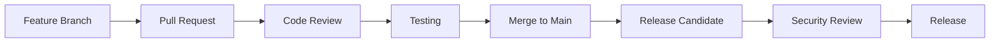

# コントリビューション

## 他の言語

[English](contributing.md) | [中文简体](contributing.zh-cn.md) | [Español](contributing.es.md) | [Português](contributing.pt.md) | Symbiontプロジェクトへの貢献方法について、イシュー報告からコード変更の提出まで説明します。

## 目次


---

## 概要

Symbiontはコミュニティからの貢献を歓迎します！バグ修正、機能追加、ドキュメント改善、フィードバック提供など、あなたの貢献がSymbiontをすべての人にとってより良いものにします。

### 貢献の方法

- **バグ報告**：問題の特定と解決を支援
- **機能リクエスト**：新しい機能や改善を提案
- **ドキュメント**：ガイド、例、APIドキュメントを改善
- **コード貢献**：バグ修正と新機能の実装
- **セキュリティ**：セキュリティ脆弱性を責任を持って報告
- **テスト**：テストケースの追加とテストカバレッジの向上

---

## はじめに

### 前提条件

貢献する前に、以下を確認してください：

- **Rust 1.88+** とcargo
- **Git** によるバージョン管理
- **Docker** テストと開発用
- Rust、セキュリティ原則、AIシステムの**基本的な知識**

### 開発環境のセットアップ

1. **リポジトリのフォークとクローン**
```bash
# GitHubでリポジトリをフォークし、フォークをクローン
git clone https://github.com/YOUR_USERNAME/symbiont.git
cd symbiont

# upstreamリモートを追加
git remote add upstream https://github.com/thirdkeyai/symbiont.git
```

2. **開発環境のセットアップ**
```bash
# Rust依存関係をインストール
rustup update
rustup component add rustfmt clippy

# pre-commitフックをインストール
cargo install pre-commit
pre-commit install

# プロジェクトをビルド
cargo build
```

3. **テストの実行**
```bash
# すべてのテストを実行
cargo test --workspace

# 特定のテストスイートを実行
cargo test --package symbiont-dsl
cargo test --package symbiont-runtime

# カバレッジ付きで実行
cargo tarpaulin --out html
```

4. **開発サービスの起動**
```bash
# Docker Composeで必要なサービスを起動
docker-compose up -d redis postgres

# サービスが実行中であることを確認
cargo run --example basic_agent
```

---

## 開発ガイドライン

### コード規約

**Rustコードスタイル：**
- 一貫したフォーマットのために `rustfmt` を使用
- Rustの命名規則に従う
- 慣用的なRustコードを書く
- 包括的なドキュメントを含める
- すべての新機能にユニットテストを追加

**セキュリティ要件：**
- セキュリティ関連のすべてのコードはレビュー必須
- 暗号操作には承認済みライブラリを使用
- すべてのパブリックAPIに入力バリデーションが必要
- セキュリティ機能にはセキュリティテストを添付

**パフォーマンスガイドライン：**
- パフォーマンスクリティカルなコードをベンチマーク
- ホットパスでの不要なアロケーションを回避
- I/O操作には `async`/`await` を使用
- リソース集約的な機能のメモリ使用量をプロファイリング

### コード構成

```
symbiont/
├── dsl/                    # DSLパーサーと文法
│   ├── src/
│   ├── tests/
│   └── tree-sitter-symbiont/
├── runtime/                # コアランタイムシステム
│   ├── src/
│   │   ├── api/           # HTTP API（オプション）
│   │   ├── context/       # コンテキスト管理
│   │   ├── integrations/  # 外部インテグレーション
│   │   ├── rag/           # RAGエンジン
│   │   ├── scheduler/     # タスクスケジューリング
│   │   └── types/         # コア型定義
│   ├── examples/          # 使用例
│   ├── tests/             # インテグレーションテスト
│   └── docs/              # 技術ドキュメント
├── enterprise/             # エンタープライズ機能
│   └── src/
└── docs/                  # コミュニティドキュメント
```

### コミットガイドライン

**コミットメッセージフォーマット：**
```
<type>(<scope>): <description>

[optional body]

[optional footer]
```

**タイプ：**
- `feat`：新機能
- `fix`：バグ修正
- `docs`：ドキュメントの変更
- `style`：コードスタイルの変更（フォーマットなど）
- `refactor`：コードリファクタリング
- `test`：テストの追加または更新
- `chore`：メンテナンスタスク

**例：**
```bash
feat(runtime): add multi-tier sandbox support

Implements Docker, gVisor, and Firecracker isolation tiers with
automatic risk assessment and tier selection.

Closes #123

fix(dsl): resolve parser error with nested policy blocks

The parser was incorrectly handling nested policy definitions,
causing syntax errors for complex security configurations.

docs(security): update cryptographic implementation details

Add detailed documentation for Ed25519 signature implementation
and key management procedures.
```

---

## 貢献の種類

### バグ報告

バグを報告する際は、以下を含めてください：

**必要な情報：**
- Symbiontのバージョンとプラットフォーム
- 最小限の再現手順
- 期待される動作と実際の動作
- エラーメッセージとログ
- 環境の詳細

**バグ報告テンプレート：**
```markdown
## バグの説明
問題の簡潔な説明

## 再現手順
1. 手順1
2. 手順2
3. 手順3

## 期待される動作
何が起こるべきか

## 実際の動作
実際に何が起こるか

## 環境
- OS: [例：Ubuntu 22.04]
- Rustバージョン: [例：1.88.0]
- Symbiontバージョン: [例：1.0.0]
- Dockerバージョン: [該当する場合]

## 追加情報
その他の関連情報
```

### 機能リクエスト

**機能リクエストプロセス：**
1. 類似のリクエストがないか既存のイシューを確認
2. 詳細な機能リクエストイシューを作成
3. ディスカッションと設計に参加
4. ガイドラインに従って機能を実装

**機能リクエストテンプレート：**
```markdown
## 機能の説明
提案する機能の明確な説明

## 動機
この機能が必要な理由は？どのような問題を解決しますか？

## 詳細設計
この機能はどのように動作すべきですか？可能であれば例を含めてください。

## 検討した代替案
他にどのようなソリューションを検討しましたか？

## 実装メモ
技術的な考慮事項や制約
```

### コード貢献

**プルリクエストプロセス：**

1. **機能ブランチを作成**
```bash
git checkout -b feature/descriptive-name
```

2. **変更を実装**
- スタイルガイドラインに従ってコードを記述
- 包括的なテストを追加
- 必要に応じてドキュメントを更新
- すべてのテストがパスすることを確認

3. **変更をコミット**
```bash
git add .
git commit -m "feat(component): descriptive commit message"
```

4. **プッシュしてPRを作成**
```bash
git push origin feature/descriptive-name
# GitHubでプルリクエストを作成
```

**プルリクエスト要件：**
- [ ] すべてのテストがパスする
- [ ] コードがスタイルガイドラインに従っている
- [ ] ドキュメントが更新されている
- [ ] セキュリティへの影響が考慮されている
- [ ] パフォーマンスへの影響が評価されている
- [ ] 破壊的変更がドキュメント化されている

### ドキュメント貢献

**ドキュメントの種類：**
- **ユーザーガイド**：機能の理解と使用を支援
- **APIドキュメント**：開発者向けの技術リファレンス
- **例**：動作するコード例とチュートリアル
- **アーキテクチャドキュメント**：システム設計と実装の詳細

**ドキュメント規約：**
- 明確で簡潔な文章を書く
- 動作するコード例を含める
- 一貫したフォーマットとスタイルを使用
- すべてのコード例をテスト
- 関連ドキュメントを更新

**ドキュメント構造：**
```markdown
---
layout: default
title: Page Title
nav_order: N
description: "Brief page description"
---

# Page Title

Brief introduction paragraph.


---

## Content sections...
```

---

## テストガイドライン

### テストの種類

**ユニットテスト：**
- 個々の関数とモジュールをテスト
- 外部依存関係をモック
- 高速実行（テストあたり1秒未満）

```rust
#[cfg(test)]
mod tests {
    use super::*;

    #[test]
    fn test_policy_evaluation() {
        let policy = Policy::new("test_policy", PolicyRules::default());
        let context = PolicyContext::new();
        let result = policy.evaluate(&context);
        assert_eq!(result, PolicyDecision::Allow);
    }
}
```

**インテグレーションテスト：**
- コンポーネント間の相互作用をテスト
- 可能な限り実際の依存関係を使用
- 中程度の実行時間（テストあたり10秒未満）

```rust
#[tokio::test]
async fn test_agent_lifecycle() {
    let runtime = test_runtime().await;
    let agent_config = AgentConfig::default();

    let agent_id = runtime.create_agent(agent_config).await.unwrap();
    let status = runtime.get_agent_status(agent_id).await.unwrap();

    assert_eq!(status, AgentStatus::Ready);
}
```

**セキュリティテスト：**
- セキュリティ制御とポリシーをテスト
- 暗号操作を検証
- 攻撃シナリオをテスト

```rust
#[tokio::test]
async fn test_sandbox_isolation() {
    let sandbox = create_test_sandbox(SecurityTier::Tier2).await;

    // 制限されたリソースへのアクセスを試行
    let result = sandbox.execute_malicious_code().await;

    // セキュリティ制御によってブロックされるべき
    assert!(result.is_err());
    assert_eq!(result.unwrap_err(), SandboxError::AccessDenied);
}
```

### テストデータ

**テストフィクスチャ：**
- テスト間で一貫したテストデータを使用
- 可能な限りハードコードされた値を避ける
- 実行後にテストデータをクリーンアップ

```rust
pub fn create_test_agent_config() -> AgentConfig {
    AgentConfig {
        id: AgentId::new(),
        name: "test_agent".to_string(),
        security_tier: SecurityTier::Tier1,
        memory_limit: 512 * 1024 * 1024, // 512MB
        capabilities: vec!["test".to_string()],
        policies: vec![],
        metadata: HashMap::new(),
    }
}
```

---

## セキュリティに関する考慮事項

### セキュリティレビュープロセス

**セキュリティに敏感な変更：**
セキュリティに影響するすべての変更は追加レビューが必要です：

- 暗号実装
- 認証と認可
- 入力バリデーションとサニタイゼーション
- サンドボックスとIsolationメカニズム
- 監査とロギングシステム

**セキュリティレビューチェックリスト：**
- [ ] 必要に応じて脅威モデルが更新されている
- [ ] セキュリティテストが追加されている
- [ ] 暗号ライブラリが承認済みである
- [ ] 入力バリデーションが包括的である
- [ ] エラーハンドリングが情報を漏洩しない
- [ ] 監査ログが完全である

### 脆弱性報告

**責任ある開示：**
セキュリティ脆弱性を発見した場合：

1. 公開イシューを作成**しないでください**
2. 詳細をsecurity@thirdkey.aiにメール
3. 可能であれば再現手順を提供
4. 調査と修正の時間を確保
5. 開示タイムラインを調整

**セキュリティレポートテンプレート：**
```
Subject: Security Vulnerability in Symbiont

Component: [影響を受けるコンポーネント]
Severity: [critical/high/medium/low]
Description: [詳細な説明]
Reproduction: [再現手順]
Impact: [潜在的な影響]
Suggested Fix: [該当する場合]
```

---

## レビュープロセス

### コードレビューガイドライン

**作成者向け：**
- 変更をフォーカスしてアトミックに保つ
- 明確なコミットメッセージを書く
- 新機能にテストを追加
- 必要に応じてドキュメントを更新
- レビューフィードバックに迅速に対応

**レビュアー向け：**
- コードの正確性とセキュリティに焦点
- ガイドラインへの準拠を確認
- テストカバレッジが十分であるか検証
- ドキュメントが更新されていることを確認
- 建設的で助けになるフィードバックを提供

**レビュー基準：**
- **正確性**：コードは意図通りに動作するか？
- **セキュリティ**：セキュリティへの影響はないか？
- **パフォーマンス**：パフォーマンスは許容範囲か？
- **保守性**：コードは読みやすく保守しやすいか？
- **テスト**：テストは包括的で信頼できるか？

### マージ要件

**すべてのPRで必須：**
- [ ] すべての自動テストがパスする
- [ ] 少なくとも1件の承認レビューがある
- [ ] 更新されたドキュメントが含まれている
- [ ] コーディング規約に従っている
- [ ] 適切なテストが含まれている

**セキュリティに敏感なPRで追加必須：**
- [ ] セキュリティチームのレビューがある
- [ ] セキュリティテストが含まれている
- [ ] 必要に応じて脅威モデルが更新されている
- [ ] 監査証跡のドキュメントがある

---

## コミュニティガイドライン

### 行動規範

すべてのコントリビューターにとって歓迎的でインクルーシブな環境を提供することに取り組んでいます。[行動規範](CODE_OF_CONDUCT.md)を読んで従ってください。

**主要原則：**
- **尊重**：すべてのコミュニティメンバーを尊重する
- **包含**：多様な視点とバックグラウンドを歓迎
- **協力**：建設的に協力する
- **学習**：学習と成長を支援
- **品質**：コードと行動の高い基準を維持

### コミュニケーション

**チャンネル：**
- **GitHub Issues**：バグ報告と機能リクエスト
- **GitHub Discussions**：一般的な質問とアイデア
- **Pull Requests**：コードレビューとコラボレーション
- **メール**：セキュリティ問題はsecurity@thirdkey.aiまで

**コミュニケーションガイドライン：**
- 明確で簡潔に
- トピックに留まる
- 忍耐強く助けになる
- インクルーシブな言葉を使用
- 異なる視点を尊重

---

## 認知

### コントリビューター

すべての形態の貢献を認識し感謝します：

- **コードコントリビューター**：CONTRIBUTORS.mdに記載
- **ドキュメントコントリビューター**：ドキュメント内でクレジット
- **バグ報告者**：リリースノートで言及
- **セキュリティ研究者**：セキュリティアドバイザリーでクレジット

### コントリビューターレベル

**コミュニティコントリビューター：**
- プルリクエストを提出
- バグとイシューを報告
- ディスカッションに参加

**レギュラーコントリビューター：**
- 一貫した品質の貢献
- プルリクエストのレビューを支援
- 新しいコントリビューターのメンタリング

**メンテナー：**
- コアチームメンバー
- マージ権限
- リリース管理
- プロジェクトの方向性

---

## ヘルプの取得

### リソース

- **ドキュメント**：完全なガイドとリファレンス
- **例**：`/examples` 内の動作するコード例
- **テスト**：期待される動作を示すテストケース
- **イシュー**：ソリューションのために既存のイシューを検索

### サポートチャンネル

**コミュニティサポート：**
- バグと機能リクエストはGitHub Issues
- 質問とアイデアはGitHub Discussions
- `symbiont` タグでStack Overflow

**ダイレクトサポート：**
- メール：support@thirdkey.ai
- セキュリティ：security@thirdkey.ai

### FAQ

**Q: 貢献を始めるにはどうすればいいですか？**
A: 開発環境をセットアップし、ドキュメントを読み、「good first issue」ラベルのイシューを探してください。

**Q: 貢献するにはどのようなスキルが必要ですか？**
A: Rustプログラミング、基本的なセキュリティ知識、AI/MLの概念に対する理解が役立ちますが、すべての貢献に必須ではありません。

**Q: コードレビューにはどのくらいかかりますか？**
A: 小さな変更の場合は通常1〜3営業日、複雑なまたはセキュリティに敏感な変更にはそれ以上かかります。

**Q: コードを書かずに貢献できますか？**
A: はい！ドキュメント、テスト、バグ報告、機能リクエストは価値ある貢献です。

---

## リリースプロセス

### 開発ワークフロー



### バージョニング

Symbiontは[セマンティックバージョニング](https://semver.org/)に従います：

- **メジャー**（X.0.0）：破壊的変更
- **マイナー**（0.X.0）：新機能、後方互換
- **パッチ**（0.0.X）：バグ修正、後方互換

### リリーススケジュール

- **パッチリリース**：重要な修正のために必要に応じて
- **マイナーリリース**：新機能のために毎月
- **メジャーリリース**：大きな変更のために四半期ごと

---

## 次のステップ

貢献する準備はできましたか？始め方：

1. **[開発環境をセットアップ](#開発環境のセットアップ)**
2. **[最初のイシューを見つける](https://github.com/thirdkeyai/symbiont/labels/good%20first%20issue)**
3. **[ディスカッションに参加](https://github.com/thirdkeyai/symbiont/discussions)**
4. **[技術ドキュメントを読む](/runtime-architecture)**

Symbiontへの貢献に関心をお寄せいただきありがとうございます！あなたの貢献が、安全でAIネイティブなソフトウェア開発の未来を築くのに役立ちます。
