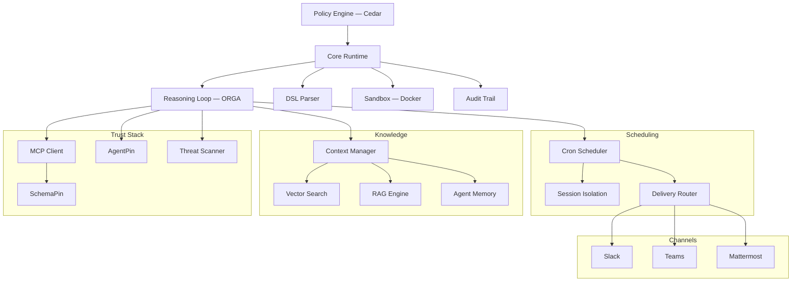

# Symbiont ドキュメント

本番環境向けのポリシー制御エージェントランタイム。明示的なポリシー、アイデンティティ、監査制御の下で AI エージェントとツールを実行します。

## Symbiont とは？

Symbiont は、明示的なポリシー、アイデンティティ、監査制御の下で AI エージェントとツールを実行するための Rust ネイティブランタイムです。

ほとんどのエージェントフレームワークはオーケストレーションに焦点を当てています。Symbiont は、エージェントが実際のリスクを伴う実環境で実行される場合に何が起こるかに焦点を当てています：信頼されないツール、機密データ、承認境界、監査要件、再現可能な実施。

### 仕組み

Symbiont はエージェントの意図と実行権限を分離します：

1. **エージェントが提案** — 推論ループ（Observe-Reason-Gate-Act）を通じてアクションを提案
2. **ランタイムが評価** — 各アクションをポリシー、アイデンティティ、信頼チェックに照らして評価
3. **ポリシーが決定** — 許可されたアクションは実行、拒否されたアクションはブロックまたは承認に回送
4. **すべてが記録される** — すべての決定に対する改ざん防止監査証跡

モデル出力は実行権限として扱われることはありません。ランタイムが実際に何が起こるかを制御します。

### コア機能

| 機能 | 説明 |
|-----------|-------------|
| **ポリシーエンジン** | エージェントのアクション、ツール呼び出し、リソースアクセスに対する [Cedar](https://www.cedarpolicy.com/) によるきめ細かな認可 |
| **ツール検証** | 実行前に [SchemaPin](https://schemapin.org) による MCP ツールスキーマの暗号学的検証 |
| **エージェントアイデンティティ** | [AgentPin](https://agentpin.org) によるエージェントとスケジュールタスクのドメイン固定 ES256 アイデンティティ |
| **推論ループ** | ポリシーゲートとサーキットブレーカーを備えた型状態強制の Observe-Reason-Gate-Act サイクル |
| **サンドボックス** | 信頼されないワークロード向けのリソース制限付き Docker ベースの分離 |
| **監査ログ** | すべてのポリシー決定に対する構造化レコード付き改ざん防止ログ |
| **シークレット管理** | Vault/OpenBao 統合、AES-256-GCM 暗号化ストレージ、エージェントごとのスコープ |
| **MCP 統合** | 制御されたツールアクセスを備えたネイティブ Model Context Protocol サポート |

追加機能：ツール/スキルコンテンツの脅威スキャン、cron スケジューリング、永続エージェントメモリ、ハイブリッド RAG 検索（LanceDB/Qdrant）、webhook 検証、配信ルーティング、OTLP テレメトリ、HTTP セキュリティ強化、チャネルアダプター（Slack/Teams/Mattermost）、および [Claude Code](https://github.com/thirdkeyai/symbi-claude-code) と [Gemini CLI](https://github.com/thirdkeyai/symbi-gemini-cli) のガバナンスプラグイン。

---

## クイックスタート

### プロジェクトをスキャフォールドして実行（Docker、約60秒）

```bash
# 1. プロジェクトを作成。symbiont.toml、agents/、policies/、
#    docker-compose.yml、および新しく生成された SYMBIONT_MASTER_KEY を含む .env を生成します。
docker run --rm -v $(pwd):/workspace ghcr.io/thirdkeyai/symbi:latest \
  init --profile assistant --no-interact --dir /workspace

# 2. ランタイムを起動します。.env を自動的に読み込みます。
docker compose up
```

ランタイム API は `http://localhost:8080`、HTTP 入力は `http://localhost:8081` で公開されます。

### インストール（Docker なし）

**インストールスクリプト（macOS / Linux）：**
```bash
curl -fsSL https://symbiont.dev/install.sh | bash
```

**Homebrew（macOS）：**
```bash
brew tap thirdkeyai/tap
brew install symbi
```

**ソースから：**
```bash
git clone https://github.com/thirdkeyai/symbiont.git
cd symbiont
cargo build --release
```

ビルド済みバイナリは [GitHub Releases](https://github.com/thirdkeyai/symbiont/releases) からも入手できます。詳細については[入門ガイド](/getting-started)をご覧ください。

### 最初のエージェント

```symbiont
agent secure_analyst(input: DataSet) -> Result {
    policy access_control {
        allow: read(input) if input.verified == true
        deny: send_email without approval
        audit: all_operations
    }

    with memory = "persistent", requires = "approval" {
        result = analyze(input);
        return result;
    }
}
```

`metadata`、`schedule`、`webhook`、`channel` ブロックを含む完全な文法については [DSL ガイド](/dsl-guide)をご覧ください。

### プロジェクトスキャフォールディング

```bash
symbi init        # インタラクティブなプロジェクトセットアップ — symbiont.toml、agents/、
                  # policies/、docker-compose.yml、および生成された SYMBIONT_MASTER_KEY を含む
                  # .env を書き込みます。特定のディレクトリを対象にするには --dir <PATH> を
                  # 渡します（コンテナ内で実行する場合は必須）。
symbi run agent   # フルランタイムを起動せずに単一エージェントを実行
symbi up          # 自動設定でフルランタイムを起動
symbi shell       # インタラクティブなエージェントオーケストレーションシェル（Beta） — 以下を参照
```

### インタラクティブシェル (Beta)

`symbi shell` は、LLM 支援によるエージェント、ツール、ポリシーのオーサリング、マルチエージェントパターン（`/chain`、`/parallel`、`/race`、`/debate`）のオーケストレーション、スケジュールとチャネルの管理、リモートランタイムへのアタッチを行うための ratatui ベースのターミナル UI です。ステータスは **beta** であり、コマンドサーフェスと永続化フォーマットはマイナーリリース間で変更される可能性があります。[Symbi Shell ガイド](/symbi-shell) を参照してください。

### シングルエージェントのデプロイ (Beta)

シェルの `/deploy` コマンドは、アクティブなエージェントをパッケージ化し、Docker（`/deploy local`）、Google Cloud Run（`/deploy cloudrun`）、または AWS App Runner（`/deploy aws`）にデプロイします。OSS スタックはシングルエージェント構成です。マルチエージェントトポロジーはクロスインスタンスメッセージングで構成します。[Symbi Shell — デプロイ](/symbi-shell#deployment-beta) を参照してください。

---

## アーキテクチャ



---

## セキュリティモデル

Symbiont はシンプルな原則に基づいて設計されています：**モデル出力を実行権限として信頼すべきではありません。**

アクションはランタイム制御を通じて流れます：

- **ゼロトラスト** — すべてのエージェント入力はデフォルトで信頼されない
- **ポリシーチェック** — すべてのツール呼び出しとリソースアクセスの前に Cedar 認可
- **ツール検証** — ツールスキーマの SchemaPin 暗号学的検証
- **サンドボックス境界** — 信頼されない実行のための Docker 分離
- **オペレーター承認** — 機密アクションのための人間レビューゲート
- **シークレット制御** — Vault/OpenBao バックエンド、暗号化ローカルストレージ、エージェント名前空間
- **監査ログ** — すべての決定の暗号学的改ざん防止レコード

詳細については[セキュリティモデル](/security-model)ガイドをご覧ください。

---

## ガイド

- [入門ガイド](/getting-started) — インストール、設定、最初のエージェント
- [Symbi Shell](/symbi-shell) (Beta) — オーサリング、オーケストレーション、リモートアタッチのためのインタラクティブ TUI
- [セキュリティモデル](/security-model) — ゼロトラストアーキテクチャ、ポリシー実施
- [ランタイムアーキテクチャ](/runtime-architecture) — ランタイム内部と実行モデル
- [推論ループ](/reasoning-loop) — ORGA サイクル、ポリシーゲート、サーキットブレーカー
- [DSL ガイド](/dsl-guide) — エージェント定義言語リファレンス
- [API リファレンス](/api-reference) — HTTP API エンドポイントと設定
- [スケジューリング](/scheduling) — Cron エンジン、配信ルーティング、デッドレターキュー
- [HTTP 入力](/http-input) — Webhook サーバー、認証、レート制限

---

## コミュニティとリソース

- **パッケージ**: [crates.io/crates/symbi](https://crates.io/crates/symbi) | [npm symbiont-sdk-js](https://www.npmjs.com/package/symbiont-sdk-js) | [PyPI symbiont-sdk](https://pypi.org/project/symbiont-sdk/)
- **SDK**: [JavaScript/TypeScript](https://github.com/ThirdKeyAI/symbiont-sdk-js) | [Python](https://github.com/ThirdKeyAI/symbiont-sdk-python)
- **プラグイン**: [Claude Code](https://github.com/thirdkeyai/symbi-claude-code) | [Gemini CLI](https://github.com/thirdkeyai/symbi-gemini-cli)
- **課題**: [GitHub Issues](https://github.com/thirdkeyai/symbiont/issues)
- **ライセンス**: Apache 2.0 (Community Edition)

---

## 次のステップ

<div class="grid grid-cols-1 md:grid-cols-3 gap-6 mt-8">
  <div class="card">
    <h3>はじめる</h3>
    <p>Symbiont をインストールして、最初のガバナンスエージェントを実行しましょう。</p>
    <a href="/getting-started" class="btn btn-outline">クイックスタートガイド</a>
  </div>

  <div class="card">
    <h3>セキュリティモデル</h3>
    <p>信頼境界とポリシー実施を理解しましょう。</p>
    <a href="/security-model" class="btn btn-outline">セキュリティガイド</a>
  </div>

  <div class="card">
    <h3>DSL リファレンス</h3>
    <p>エージェント定義言語を学びましょう。</p>
    <a href="/dsl-guide" class="btn btn-outline">DSL ガイド</a>
  </div>
</div>
