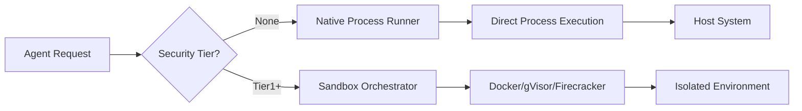

# ネイティブ実行モード（Docker/Isolationなし）

## 他の言語


Symbiontは、最高のパフォーマンスと最小限の依存関係が求められる開発環境や信頼されたデプロイメントのために、DockerやコンテナIsolationなしでエージェントを実行することをサポートしています。

## セキュリティ警告

**重要**：ネイティブ実行モードは、すべてのコンテナベースのセキュリティ制御をバイパスします：

- プロセスIsolationなし
- ファイルシステムIsolationなし
- ネットワークIsolationなし
- リソース制限の強制なし
- ホストシステムへの直接アクセス

**以下の場合にのみ使用してください**：
- 信頼されたコードによるローカル開発
- 信頼されたエージェントを使用する管理された環境
- テストとデバッグ
- Dockerが利用できない環境

**以下の場合には使用しないでください**：
- 信頼されないコードを含む本番環境
- マルチテナントデプロイメント
- 公開サービス
- 信頼されないユーザー入力の処理

## アーキテクチャ

### サンドボックスティア階層

```
┌─────────────────────────────────────────┐
│ SecurityTier::None (Native Execution)   │ ← Isolationなし
├─────────────────────────────────────────┤
│ SecurityTier::Tier1 (Docker)            │ ← コンテナIsolation
├─────────────────────────────────────────┤
│ SecurityTier::Tier2 (gVisor)            │ ← 強化されたIsolation
├─────────────────────────────────────────┤
│ SecurityTier::Tier3 (Firecracker)       │ ← 最大限のIsolation
└─────────────────────────────────────────┘
```

### ネイティブ実行フロー



## 設定

### オプション1：TOML設定

```toml
# config.toml

[security]
# ネイティブ実行を許可（デフォルト：false）
allow_native_execution = true
# デフォルトのサンドボックスティア
default_sandbox_tier = "None"  # または "Tier1"、"Tier2"、"Tier3"

[security.native_execution]
# ネイティブモードでもリソース制限を適用
enforce_resource_limits = true
# 最大メモリ（MB）
max_memory_mb = 2048
# 最大CPUコア数
max_cpu_cores = 4.0
# 最大実行時間（秒）
max_execution_time_seconds = 300
# ネイティブ実行の作業ディレクトリ
working_directory = "/tmp/symbiont-native"
# 許可されたコマンド/実行ファイル
allowed_executables = ["python3", "node", "bash"]
```

### 完全な設定例

ネイティブ実行と他のシステム設定を含む完全な `config.toml`：

```toml
# config.toml
[api]
port = 8080
host = "127.0.0.1"
timeout_seconds = 30
max_body_size = 10485760

[database]
# デフォルト：LanceDB 組み込み（ゼロ設定、外部サービス不要）
vector_backend = "lancedb"
vector_data_path = "./data/vector_db"
vector_dimension = 384

# オプション：Qdrant（LanceDBの代わりにQdrantを使用する場合はコメント解除）
# vector_backend = "qdrant"
# qdrant_url = "http://localhost:6333"
# qdrant_collection = "symbiont"

[logging]
level = "info"
format = "Pretty"
structured = true

[security]
key_provider = { Environment = { var_name = "SYMBIONT_KEY" } }
enable_compression = true
enable_backups = true
enable_safety_checks = true

[storage]
context_path = "./data/context"
git_clone_path = "./data/git"
backup_path = "./data/backups"
max_context_size_mb = 1024

[native_execution]
enabled = true
default_executable = "python3"
working_directory = "/tmp/symbiont-native"
enforce_resource_limits = true
max_memory_mb = 2048
max_cpu_seconds = 300
max_execution_time_seconds = 300
allowed_executables = ["python3", "python", "node", "bash", "sh"]
```

### NativeExecutionConfigフィールド

| フィールド | 型 | デフォルト | 説明 |
|-----------|-----|----------|------|
| `enabled` | bool | `false` | ネイティブ実行モードを有効化 |
| `default_executable` | string | `"bash"` | デフォルトのインタープリター/シェル |
| `working_directory` | path | `/tmp/symbiont-native` | 実行ディレクトリ |
| `enforce_resource_limits` | bool | `true` | OSレベルの制限を適用 |
| `max_memory_mb` | Option<u64> | `Some(2048)` | メモリ制限（MB） |
| `max_cpu_seconds` | Option<u64> | `Some(300)` | CPU時間制限 |
| `max_execution_time_seconds` | u64 | `300` | ウォールクロックタイムアウト |
| `allowed_executables` | Vec<String> | `[bash, python3, etc.]` | 実行ファイルホワイトリスト |

### オプション2：環境変数

```bash
export SYMBIONT_ALLOW_NATIVE_EXECUTION=true
export SYMBIONT_DEFAULT_SANDBOX_TIER=None
export SYMBIONT_NATIVE_MAX_MEMORY_MB=2048
export SYMBIONT_NATIVE_MAX_CPU_CORES=4.0
export SYMBIONT_NATIVE_WORKING_DIR=/tmp/symbiont-native
```

### オプション3：エージェントレベルの設定

```symbi
agent NativeWorker {
  metadata {
    name: "Local Development Agent"
    version: "1.0.0"
  }

  security {
    tier: None
    sandbox: Permissive
    capabilities: ["local_filesystem", "network"]
  }

  on trigger "local_processing" {
    // ホスト上で直接実行
    execute_native("python3 process.py")
  }
}
```

## 使用例

### 例1：開発モード

```rust
use symbi_runtime::{Config, SecurityTier, SandboxOrchestrator};

#[tokio::main]
async fn main() -> Result<(), Box<dyn std::error::Error>> {
    // 開発用にネイティブ実行を有効化
    let mut config = Config::default();
    config.security.allow_native_execution = true;
    config.security.default_sandbox_tier = SecurityTier::None;

    let orchestrator = SandboxOrchestrator::new(config)?;

    // コードをネイティブに実行
    let result = orchestrator.execute_code(
        SecurityTier::None,
        "print('Hello from native execution!')",
        HashMap::new()
    ).await?;

    println!("Output: {}", result.stdout);
    Ok(())
}
```

### 例2：CLIフラグ

```bash
# ネイティブ実行で起動
symbiont run agent.dsl --native

# または明示的なティアを指定
symbiont run agent.dsl --sandbox-tier=none

# リソース制限付き
symbiont run agent.dsl --native \
  --max-memory=1024 \
  --max-cpu=2.0 \
  --timeout=300
```

### 例3：混合実行

```rust
// 信頼されたローカル操作にはネイティブ実行を使用
let local_result = orchestrator.execute_code(
    SecurityTier::None,
    local_code,
    env_vars
).await?;

// 外部/信頼されない操作にはDockerを使用
let isolated_result = orchestrator.execute_code(
    SecurityTier::Tier1,
    untrusted_code,
    env_vars
).await?;
```

## 実装の詳細

### ネイティブプロセスランナー

ネイティブランナーはオプションのリソース制限付きで `std::process::Command` を使用します：

```rust
pub struct NativeRunner {
    config: NativeConfig,
}

impl NativeRunner {
    pub async fn execute(&self, code: &str, env: HashMap<String, String>)
        -> Result<ExecutionResult> {
        // プロセスの直接実行
        let mut command = Command::new(&self.config.executable);
        command.current_dir(&self.config.working_dir);
        command.envs(env);

        // オプション：rlimit経由でリソース制限を適用（Unix）
        #[cfg(unix)]
        if self.config.enforce_limits {
            self.apply_resource_limits(&mut command)?;
        }

        let output = command.output().await?;

        Ok(ExecutionResult {
            stdout: String::from_utf8_lossy(&output.stdout).to_string(),
            stderr: String::from_utf8_lossy(&output.stderr).to_string(),
            exit_code: output.status.code().unwrap_or(-1),
            success: output.status.success(),
        })
    }
}
```

### リソース制限（Unix）

Unixシステムでは、ネイティブ実行でもいくつかの制限を強制できます：

- **メモリ**：`setrlimit(RLIMIT_AS)` を使用
- **CPU時間**：`setrlimit(RLIMIT_CPU)` を使用
- **プロセス数**：`setrlimit(RLIMIT_NPROC)` を使用
- **ファイルサイズ**：`setrlimit(RLIMIT_FSIZE)` を使用

### プラットフォームサポート

| プラットフォーム | ネイティブ実行 | リソース制限 |
|----------------|--------------|------------|
| Linux    | フルサポート | rlimit |
| macOS    | フルサポート | 部分的 |
| Windows  | フルサポート | 制限あり |

## Dockerからの移行

### ステップ1：設定の更新

```diff
# config.toml
[security]
- default_sandbox_tier = "Tier1"
+ default_sandbox_tier = "None"
+ allow_native_execution = true
```

### ステップ2：Docker依存関係の削除

```bash
# もう不要
# docker build -t symbi:latest .
# docker run ...

# 直接実行
cargo build --release
./target/release/symbiont run agent.dsl
```

### ハイブリッドアプローチ

両方の実行モードを戦略的に使用 -- 信頼されたローカル操作にはネイティブ、信頼されないコードにはDockerを使用：

```rust
// 信頼されたローカル操作
let local_result = orchestrator.execute_code(
    SecurityTier::None,  // ネイティブ
    trusted_code,
    env
).await?;

// 外部/信頼されない操作
let isolated_result = orchestrator.execute_code(
    SecurityTier::Tier1,  // Docker
    external_code,
    env
).await?;
```

### ステップ3：環境変数の処理

Dockerは環境変数を自動的にIsolationしていました。ネイティブ実行では、明示的に設定する必要があります：

```bash
export AGENT_API_KEY="xxx"
export AGENT_DB_URL="postgresql://..."
symbiont run agent.dsl --native
```

## パフォーマンス比較

| モード | 起動時間 | スループット | メモリ | Isolation |
|-------|---------|------------|--------|-----------|
| Native | 約10ms | 100% | 最小 | なし |
| Docker | 約500ms | 約95% | +128MB | 良好 |
| gVisor | 約800ms | 約70% | +256MB | より良好 |
| Firecracker | 約125ms | 約90% | +64MB | 最良 |

## トラブルシューティング

### 問題：権限拒否

```bash
# 解決策：作業ディレクトリが書き込み可能であることを確認
mkdir -p /tmp/symbiont-native
chmod 755 /tmp/symbiont-native
```

### 問題：コマンドが見つからない

```bash
# 解決策：実行ファイルがPATHにあるか、絶対パスを使用
export PATH=$PATH:/usr/local/bin
# または絶対パスを設定
allowed_executables = ["/usr/bin/python3", "/usr/bin/node"]
```

### 問題：リソース制限が適用されない

Windowsでのネイティブ実行はリソース制限のサポートが限定的です。以下を検討してください：
- Job Objects（Windows固有）の使用
- 暴走プロセスの監視と終了
- コンテナベースの実行へのアップグレード

## ベストプラクティス

1. **開発専用**：ネイティブ実行は主に開発用に使用
2. **段階的移行**：コンテナから始めて、安定したらネイティブに移行
3. **モニタリング**：Isolationがなくてもリソース使用量を監視
4. **許可リスト**：許可する実行ファイルとパスを制限
5. **ロギング**：包括的な監査ログを有効化
6. **テスト**：ネイティブをデプロイする前にコンテナでテスト

## セキュリティチェックリスト

任意の環境でネイティブ実行を有効にする前に：

- [ ] すべてのエージェントコードが信頼されたソースからのものである
- [ ] 環境が本番環境から隔離されている
- [ ] 外部ユーザー入力を処理しない
- [ ] モニタリングとロギングが有効化されている
- [ ] リソース制限が設定されている
- [ ] 実行ファイルの許可リストが制限的である
- [ ] ファイルシステムアクセスが制限されている
- [ ] チームがセキュリティへの影響を理解している

## 関連ドキュメント

- [セキュリティモデル](security-model.md) - 完全なセキュリティアーキテクチャ
- [サンドボックスアーキテクチャ](runtime-architecture.md#sandbox-architecture) - コンテナティア
- [設定ガイド](getting-started.md#configuration) - セットアップオプション
- [DSLセキュリティディレクティブ](dsl-guide.md#security) - エージェントレベルのセキュリティ

---

**注意**：ネイティブ実行はセキュリティと引き換えに利便性を提供します。デプロイメント環境に応じたリスクを常に理解し、適切な制御を適用してください。
